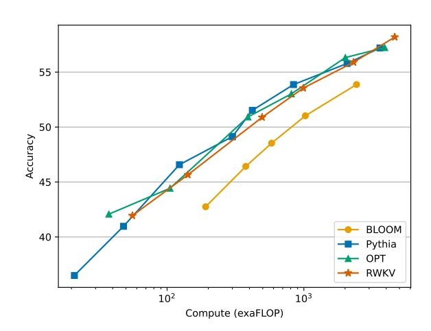

# **RWKV: Reinventing RNNs for the Transformer Era**

Bo Peng1,2\* Eric Alcaide2,3,4\* Quentin Anthony2,5\*
Alon Albalak2,6 Samuel Arcadinho2,7 Stella Biderman2,8 Huanqi Cao9 Xin Cheng10
Michael Chung11 Xingjian Du1 Matteo Grella12 Kranthi Kiran GV2,13 Xuzheng He2
Haowen Hou14 Jiaju Lin1 Przemysław Kazienko15 Jan Kocoń15 Jiaming Kong16
Bartłomiej Koptyra15 Hayden Lau2 Krishna Sri Ipsit Mantri17 Ferdinand Mom18,19
Atsushi Saito2,20 Guangyu Song21 Xiangru Tang22 Bolun Wang23 Johan S. Wind24
Stanisław Woźniak15 Ruichong Zhang9 Zhenyuan Zhang2 Qihang Zhao25,26
Peng Zhou23 Qinghua Zhou5 Jian Zhu27 Rui-Jie Zhu28,29

1Generative AI Commons 2EleutherAI 3U. of Barcelona 4Charm Therapeutics 5Ohio State U. 6U. of C., Santa Barbara 7Zendesk 8Booz Allen Hamilton 9Tsinghua University 10Peking University 11Storyteller.io 12Crisis24 13New York U.
 14National U. of Singapore 15Wroclaw U. of Science and Technology 16Databaker Technology 17Purdue U. 18Criteo AI Lab 19Epita 20Nextremer 21Moves 22Yale U. 23RuoxinTech 24U. of Oslo 25U. of Science and Technology of China
 26Kuaishou Technology 27U. of British Columbia 28U. of C., Santa Cruz 29U. of Electronic Science and Technology of China

#### **Abstract**

Transformers have revolutionized almost all natural language processing (NLP) tasks but suffer from memory and computational complexity that scales quadratically with sequence length. In contrast, recurrent neural networks (RNNs) exhibit linear scaling in memory and computational requirements but struggle to match the same performance as Transformers due to limitations in parallelization and scalability. We propose a novel model architecture, Receptance Weighted Key Value (RWKV), that combines the efficient parallelizable training of transformers with the efficient inference of RNNs.

Our approach leverages a linear attention mechanism and allows us to formulate the model as either a Transformer or an RNN, thus parallelizing computations during training and maintains constant computational and memory complexity during inference. We scale our models as large as 14 billion parameters, by far the largest dense RNN ever trained, and find RWKV performs on par with similarly sized Transformers, suggesting future work can leverage this architecture to create more efficient models. This work presents a significant step towards reconciling trade-offs between computational efficiency and model performance in sequence processing tasks. 1

#### 1 Introduction

Deep learning has greatly advanced artificial intelligence, impacting a range of scientific and industrial uses. These often involve complex sequential data

processing tasks such as natural language understanding, conversational AI, time-series analysis, and indirectly sequential formats like images and graphs (Brown et al., 2020; Ismail Fawaz et al., 2019; Wu et al., 2020; Albalak et al., 2022). Predominant among these techniques include RNNs and Transformers (Vaswani et al., 2017), each with specific benefits and drawbacks. RNNs require less memory, particularly for handling long sequences. However, they suffer from the vanishing gradient problem and non-parallelizability in the time dimension during training, limiting their scalability (Hochreiter, 1998; Le and Zuidema, 2016).

Figure 1: Average performance of RWKV models compared to transformers across twelve NLP tasks. For further details, see section 5.

Transformers emerged as a powerful alternative, adept at managing local and long-range dependencies and supporting parallelized training (Tay et al., 2022). Models such as GPT-3 (Brown et al., 2020), ChatGPT (OpenAI, 2022; Kocoń et al., 2023),

\* Equal first authorship. Others listed alphabetically. 
1Code at: https://github.com/BlinkDL/RWKV-LM

| Model               | Time           | Space                                 |
|---------------------|----------------|---------------------------------------|
| Transformer         | 2 O(T d) | 2 + O(T T d)                    |
| Reformer            | O(T log T d)   | O(T log T + T d)                      |
| Performer           | O(T d2         | 2 log d) O(T d log d + d log d) |
| Linear Transformers | O(T d2 )    | 2 O(T d + d )                   |
| AFT-full            | 2 O(T d) | O(T d)                                |
| AFT-local           | O(T sd)        | O(T d)                                |
| MEGA                | O(cT d)        | O(cd)                                 |
| RWKV (ours)         | O(Td)          | O(d)                                  |

Table 1: Inference complexity comparison with different Transformers. Here T denotes the sequence length, d the feature dimension, c is MEGA's chunk size of quadratic attention, and s is the size of a local window for AFT.

LLaMA [\(Touvron et al.,](#page-12-3) [2023\)](#page-12-3), and Chinchilla [\(Hoffmann et al.,](#page-10-4) [2022\)](#page-10-4) showcase the potential of Transformers in NLP. However, the self-attention mechanism's quadratic complexity makes it computationally and memory intensive for tasks involving long sequences and constrained resources. This has stimulated research to enhance Transformers' scalability, sometimes sacrificing some of their effectiveness [\(Wang et al.,](#page-12-4) [2020;](#page-12-4) [Zaheer et al.,](#page-12-5) [2020;](#page-12-5) [Dao et al.,](#page-9-1) [2022a\)](#page-9-1).

To tackle these challenges, we introduce the Receptance Weighted Key Value (RWKV) model, combining the strengths of RNNs and Transformers while circumventing key drawbacks. RWKV alleviates memory bottleneck and quadratic scaling associated with Transformers [\(Katharopoulos et al.,](#page-10-5) [2020\)](#page-10-5) with efficient linear scaling, while maintaining the expressive properties of the Transformer, such as parallelized training and robust scalability. RWKV reformulates the attention mechanism with a variant of linear attention, replacing traditional dot-product token interaction with more effective channel-directed attention. This implementation, *without approximation*, offers the lowest computational and memory complexity; see Table [1.](#page-1-0)

The motivation behind RWKV is to balance computational efficiency with expressive capacity in neural networks. It offers a solution for handling large-scale models with billions of parameters, exhibiting competitive performance at a reduced computational cost. Experiments suggest RWKV addresses scaling and deployment challenges in AI, especially for sequential data processing, pointing towards more sustainable and efficient AI models.

Our contributions in this paper are as follows:

• The introduction of RWKV, a novel architec-

- ture combining RNNs and Transformer advantages while mitigating their limitations.
- Detailed experiments demonstrating RWKV's performance and efficiency on benchmark datasets for large-scale models.
- The release of pretrained models, from 169 million to 14 billion parameters, trained on the Pile [\(Gao et al.,](#page-9-2) [2020;](#page-9-2) [Biderman et al.,](#page-8-1) [2022\)](#page-8-1).[2](#page-1-1)

