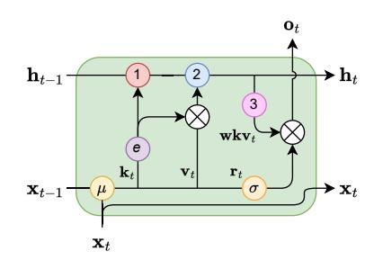
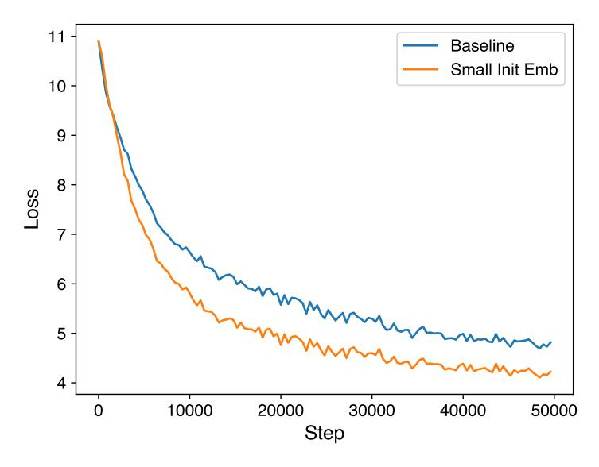
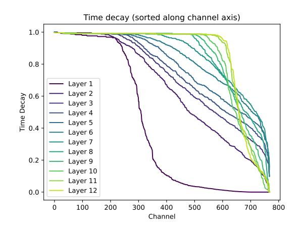
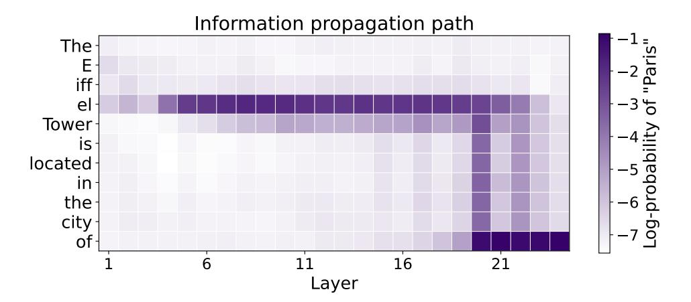
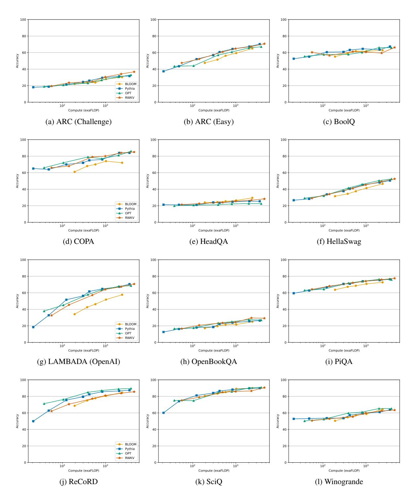
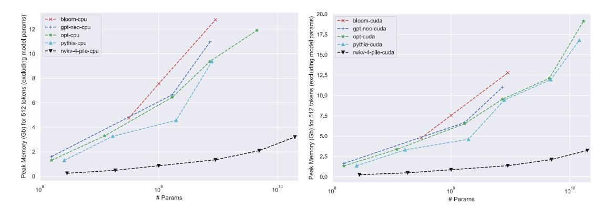
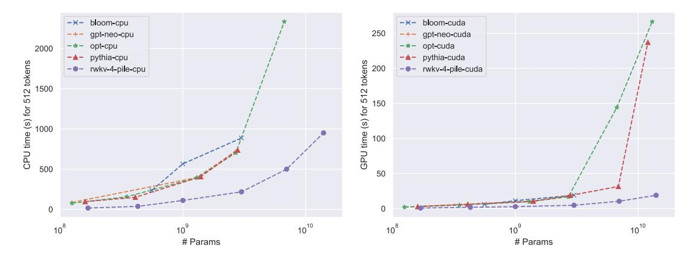

# C Additional Related Work

Recently, a number of techniques have been proposed to address the limitations of transformers.

Optimizing Attention Mechanism Many transformer variants ("x-formers") have been introduced to reduce the complexity of transformers [\(Tay et al.,](#page-12-2) [2022\)](#page-12-2), including sparse attention [\(Beltagy et al.,](#page-8-7) [2020;](#page-8-7) [Kitaev et al.,](#page-10-15) [2020;](#page-10-15) [Guo et al.,](#page-10-16) [2022\)](#page-10-16), approximating the full attention matrix [\(Wang et al.,](#page-12-4) [2020;](#page-12-4) [Ma et al.,](#page-11-12) [2021;](#page-11-12) [Choromanski et al.,](#page-9-12) [2020\)](#page-9-12), combining chunked attention with gating [\(Ma et al.,](#page-11-13) [2023\)](#page-11-13) and other efficient methods [\(Katharopoulos et al.,](#page-10-5) [2020;](#page-10-5) [Jaegle et al.,](#page-10-17) [2021\)](#page-10-17).

Some recent works like FlashAttention [\(Dao et al.,](#page-9-1) [2022a\)](#page-9-1) and others [\(Rabe and Staats,](#page-11-14) [2022;](#page-11-14) [Jang et al.,](#page-10-18) [2019\)](#page-10-18) share similarities with RWKV's chunked computation scheme. Despite being memory-efficient, their time complexity remains quadratic or contains chunk size as a hidden factor. In contrast, RWKV achieves better space and time complexity during inference by formulating a linear attention as an RNN.

Attention Free Models Another line of research replaces the attention mechanism with other modules to scale to long sequences. MLP-Mixer and others [\(Tolstikhin et al.,](#page-12-16) [2021;](#page-12-16) [Liu et al.,](#page-11-15) [2021\)](#page-11-15) propose replacing attention by Multi-Layer Perceptrons (MLPs) in computer vision tasks. The Attention Free Transformer (AFT) [\(Zhai et al.,](#page-12-6) [2021\)](#page-12-6) and HrrFormer [\(Alam et al.,](#page-8-8) [2023\)](#page-8-8) replaces dot-product self-attention with a computationally efficient alternative. None of these models have been successfully scaled to the point where drawing comparisons with transformer-based large language models makes sense.

There has also been substantial research into state space models (SSM) [\(Gu et al.,](#page-9-13) [2021\)](#page-9-13) and its variants [\(Dao et al.,](#page-9-14) [2022b;](#page-9-14) [Gupta et al.,](#page-10-19) [2022;](#page-10-19) [Poli et al.,](#page-11-16) [2023\)](#page-11-16). In contrast to the preceding models, SSM and its successors have shown substantial progress towards efficient scaling. Simultaneously with this work, [Poli et al.](#page-11-16) [\(2023\)](#page-11-16) train SSM-based models with 125 million and 355 million parameters and show that the performance is on-par with a transformer that uses a mix of local and global attention [\(Black et al.,](#page-9-15) [2021\)](#page-9-15).

Advances in RNNs Inspired by the success of transformers, RNN-style [\(Hochreiter and Schmidhuber,](#page-10-6) [1997;](#page-10-6) [Chung et al.,](#page-9-3) [2014\)](#page-9-3) recursive components have also been modified to increase context length, such as the Recurrent Memory Transformer [\(Bulatov et al.,](#page-9-16) [2022,](#page-9-16) [2023\)](#page-9-17) and Linear Recurrent Units [\(Orvieto](#page-11-17) [et al.,](#page-11-17) [2023\)](#page-11-17). Most similar to our work, the Quasi-Recurrent neural network (QRNN) [\(Bradbury et al.,](#page-9-4) [2017\)](#page-9-4) uses both convolutional layers and recurrent pooling functions across timesteps and channels. While QRNN utilizes convolutional filters with fixed sizes, RWKV employs a time-mixing module as an attention mechanism with time-decaying factors. Different from the element-wise pooling in QRNN, RWKV includes a parametrized channel-mixing module that is parallelizable.

### D Time-Mixing Block as an RNN Cell

As stated in 3.3, the RWKV time-mixing block can be formulated as an RNN, as the WKV computation can be written in such a recursive form:

$$a_0, b_0 = 0,$$
 (19)

$$wkv_t = \frac{a_{t-1} + e^{u+k_t} \odot v_t}{b_{t-1} + e^{u+k_t}},$$
(20)

$$a_t = e^{-w} \odot a_{t-1} + e^{k_t} \odot v_t, \tag{21}$$

$$b_t = e^{-w} \odot b_{t-1} + e^{k_t}. (22)$$

The dataflow of the RNN-like time-mixing is shown in Fig. 8, where the hidden states h is the numerator-denominator tuple (a,b). To avoid overflow in calculating  $e^{k_t}$ , a numerical trick is used in the official implementation. Noticing that  $a_1 = e^{k_1} \odot v_1$  and  $b_1 = e^{k_1}$ , we set  $a'_1 = v_1, b'_1 = 1, p_1 = k_1$ , where  $p_t$  stores the shared exponents of  $a_t$  and  $b_t$ . Now the above recursion can be converted into a numerical safe version, for each time step t > 1:

$$q := \max(p_{t-1}, u + k_t), \tag{23}$$

$$wkv_{t} = \frac{e^{p_{t-1}-q} \odot a'_{t-1} + e^{u+k_{t}-q} \odot v_{t}}{e^{p_{t-1}-q} \odot b'_{t-1} + e^{u+k_{t}-q}}.$$
 (24)

The update to  $a'_t, b'_t$ , and their shared exponent is also carried out in a similar fashion:

Figure 8: RWKV time-mixing block formulated as an RNN cell. Color codes: yellow ( $\mu$ ) denotes the token shift, red (1) denotes the denominator, blue (2) denotes the numerator, and pink (3) denotes the fraction computations in 16. h denotes the numerator-denominator tuple.

$$q' := \max(p_{t-1} - w, k_t), \tag{25}$$

$$a'_{t} = e^{p_{t-1} - w - q'} \odot a'_{t-1} + e^{k_{t} - q'} \odot v_{t}, \tag{26}$$

$$b'_{t} = e^{p_{t-1} - w - q'} \odot b'_{t-1} + e^{k_{t} - q'}, \tag{27}$$

$$p_t = q'. (28)$$

The RWKV model has an internal state that stores some previous information. In each layer, the internal state consists five parts, each of which is a vector with D numbers, where D is the model dimension. The five parts are:

- The current input of the Time-mix block  $x_t$ ;
- The current input of the Channel-mix block  $y_t$ ;
- The numerator of the WKV value  $a'_t$ , as defined in equation (26);
- The denominator of the WKV value  $b'_t$ , as defined in equation (27);
- An auxiliary state  $p_t$  in (28), which is used for WKV computation to maintain numerical precision.

Which yields a total size of 5DL parameters. It is worth noting that in an algebraic context with infinite precision, the helper state  $p_t$  can be ignored, and the WKV numerator and denominator can be computed directly using equations (21) and (22), reducing the size of the internal state to 4DL.

### E Parameter initializations

We describe the specific parameter initializations below and motivate the design choices. Parameters belonging to residual blocks are often adjusted by layer depth and total number of layers. Let # denote the vocabulary size, s denote the embedding dimension, d denote the hidden size (we use d=4s), L the number of layers, l the layer index (from 0 to L-1), we use the following initializations:

- Embeddings are initialized to  $\mathcal{U}$  ( $\pm 1 \times 10^{-4}$ ) as explained in 3.4
- For the time-mixing blocks (11, 12, 13), initializations are  $\mu_{k_i} = (\frac{i}{s})^{1-\frac{l}{L}}$ ,  $\mu_{v_i} = (\frac{i}{s})^{1-\frac{l}{L}} + \frac{0.3l}{L-1}$  and  $\mu_{r_i} = \frac{1}{2} \cdot (\frac{i}{s})^{1-\frac{l}{L}}$
- For the channel-mixing blocks (14, 15),  $\mu_{k_i}$  and  $\mu_{r_i}$  are initialized to  $(\frac{i}{s})^{1-\frac{l}{L}}$
- $w_i$  (16), also known as "time decay", is initialized to  $-5 + 8 \cdot (\frac{i}{d-1})^{0.7 + \frac{1.3l}{L-1}}$ . Intuitively, it is the discount factor applied to previous tokens over time.
- $u_i$  (16), also known as "bonus", is set to  $0.5 \cdot (((i+1) \mod 3) 1) + \log 0.3$ . It is the special weighting applied to the current token in equation 16. The alternating zigzag pattern initially creates subtle variations in the tensor elements, which are intended to help the model treat different dimensions of the embedding distinctively.
- $W_o$  (17) (time-mixing) and  $W_v$  (channel-mixing) are initialized to  $\mathcal{N}(0,\sqrt{\frac{d}{s}}=2)$ • All other  $W_r,W_k,W_v$  weights are initialized to 0 so the model can start learning from the beginning
- All other  $W_r$ ,  $W_k$ ,  $W_v$  weights are initialized to 0 so the model can start learning from the beginning without noisy signals.
- All LayerNorm weights start from 1 and biases from 0.

## F Small Init Embedding

This section presents the experimental validation of small initialization embedding. The experimental setup is as follows. In the baseline configuration, the parameters are initialized using a normal distribution with a mean of 0.0 and a standard deviation of 0.02, which is a commonly used initialization method in models like BERT and GPT. On the other hand, in the small initialization of the embedding (small init emb) experiment, the parameters are initialized using a uniform distribution with a range of 1e-4, which is slightly different from RWKV where a normal distribution with a standard deviation of 1e-4 is used. However, this difference is negligible and does not affect our conclusions. The experiments were conducted with a batch size of 400. As depicted in Figure 9, the loss curve for the small init emb exhibits a faster rate of decrease and convergence compared to the traditional initialization using a normal distribution.

Figure 9: Effect of small initialization embedding.

### **G** Hyperparameters

To train the models mentioned, we use  $\epsilon = (0.9, 0.99)$  without weight decay for the Adam optimizer, and switch batch size dynamically between 128 or 256 sequences, each of 1024 tokens. We further organize

| Model                     | 169M           | 430M           | 1.5B           | 3B             | 7B             | 14B             |
|---------------------------|----------------|----------------|----------------|----------------|----------------|-----------------|
| Init LR                   | 0.0006         | 0.0004         | 0.0003         | 0.00015        | 0.00015        | 0.0001          |
| Warmup Mini-Epochs End LR | 361 0.00001 | 411 0.00001 | 443 0.00001 | 451 0.00001 | 465 0.00001 | 544 0.000007 |

Table 3: Hyperparameters for our learning rate (LR) schedule of the pretrained models.

the training into multiple mini-epochs, each of 40320 samples, to guide our learning rate schedule. The training process takes 8043 mini-epochs to make one pass over the Pile. The initial warming up mini-epochs have a constant learning rate of "Init LR". After the warming up mini-epochs, the learning rate exponentially decays until in the last mini-epoch, in which the model finishes training on the entire Pile, the learning rate arrives at the "End LR". The related hyperparameters are shown in Table 3.

### **H** Gradient Stability in RWKV

In this section, we present a mathematical description of the gradient stability property in RWKV, focusing specifically on the time-mixing block. By gradient stability we mean that if the inputs  $x_t$  are bounded and the model parameters are fixed, then the gradients with respect to  $W_k$  and  $W_v$  are uniformly bounded for all T (thus not exploding). Consequently, we can control the amount each  $x_t$  contributes to the gradient at T in a naturally decaying fashion by the weight decay mechanism w (thus not vanishing unless desired).

First, we make the simplification that there are no token shifts, this will not affect the final conclusion. In this scenario,  $wkv_T$  can be written as

$$wkv_T = \frac{\sum_{t=1}^T K_t^e \odot v_t}{\sum_{t=1}^T K_t^e} = E(v_t) = \frac{S(v_t)}{S(1)},$$
(29)

where

$$v_t = W_v x_t, \quad \frac{\partial (v_t)_i}{\partial (W_v)_{i,j}} = (x_t)_j,$$

$$K_t^e = e^{W_k x_t + w_{T,t}}, \quad \frac{\partial (K_t^e)_i}{\partial (W_k)_{i,j}} = (x_t)_j (K_t^e)_i,$$

and  $S(\cdot)$  and  $E(\cdot)$  are shorthand for denoting sums and averages over weights  $K_t^e$ .

The loss function at position T can be written as

$$L_T = l(f(wkv_T), y_T). (30)$$

Because  $wkv_T$  relates to  $(W_k)_{i,j}$  and  $(W_v)_{i,j}$  only through the *i*-th channel  $(wkv_T)_i$ , we have

$$\frac{\partial L_T}{\partial (W_v)_{i,j}} = \frac{\partial L_T}{\partial (wkv_T)_i} \frac{\partial (wkv_T)_i}{\partial (W_v)_{i,j}}.$$
(31)

The first part of the above equation contains trivial operations like output layers, and other layers of time-mixing, which can be proven inductively. The second part of the above equation can be bounded as

$$\left| \frac{\partial (wkv_T)_i}{\partial (W_v)_{i,j}} \right| = \left| \frac{\partial \mathcal{E}_i[(v_t)_i]}{\partial (W_v)_{i,j}} \right|$$

$$= |\mathcal{E}_i[(x_t)_j]| \le \max_t |(x_t)_j|, \tag{32}$$

which is irrelevant to T. Similarly,

$$\frac{\partial(wkv_T)_i}{\partial(W_k)_{i,j}} = \frac{\partial \frac{S_i[(v_t)_i]}{S_i(1)}}{S_i(1)} / \partial(W_k)_{i,j}$$

$$= \frac{S_i[(x_t)_j(v_t)_i]}{S_i(1)} - \frac{S_i[(x_t)_j]S_i[(v_t)_i]}{S_i(1)^2}$$

$$= E_i[(x_t)_j(v_t)_i] - E_i[(x_t)_j]E_i[(v_t)_i]$$

$$= cov_i((x_t)_j, (v_t)_i) \tag{33}$$

can also be bounded. Note that wkv's softmax operation contains at least two non-zero terms (u and w), so the above "covariance" will not degenerate into 0.

#### I Model Behavior Visualization

The right plot illustrates the time decays  $(e^{-w})$  in each layer of the RWKV-169M model, sorted along the channel axis. Notably, several decays in the last layers are very close or equal to one, implying that certain information is preserved and propagated throughout the model's temporal context. Meanwhile, many decays in the initial layer are close to zero, which corresponds to local operations in wkv (16), likely to be associated with tasks such as text parsing or lexical analysis. (Note that the local operations in wkv are due to the extra parameter u, when  $e^{-w}$  is degenerated into 0.) These patterns of time decays are partly learned, but also come from parameter initialization as it speeds up training.

Figure 10: Model behavior visualizations of RWKV.

The plot below shows the information retrieval and propagation path in the RWKV-430M model. The experiment follows the *causal trace* method introduced by Meng et al. (2022), where we

- 1. Run the model once, and record all states and activation of each layer during the computation;
- 2. Corrupt the input embeddings of the subject using noise ("The Eiffel Tower" in this example);
- 3. Restore the states and activation of a certain layer at a certain token during the computation, and record the log-probability of the model outputting the correct answer ("Paris").

Unlike transformers, RWKV relies on the recursive propagation of information in the time dimension. In this case, the fact that the Eiffel Tower is located in Paris is retrieved in layer 4 just after the model sees "The Eiffel". It is then passed down to the subsequent layers. In layer 20, mostly, the information is propagated through time until reaching where it is needed. Finally, at the token "of", it is passed down to the last layer for outputting the answer.

### J Additional Evaluations

### J.1 Further details on NLP tasks

We evaluate on the following tasks:

**ARC** (Clark et al., 2018) A dataset designed for multiple-choice question answering, encompassing science exam questions ranging from third grade to ninth grade. It has Easy and Challenge subsets that we report results on separately.

**BoolQ** (Clark et al., 2019) A binary yes/no question answering benchmark.

Figure 11: Model behavior visualizations of the RWKV model.

**COPA** (Roemmele et al., 2018) A dataset to evaluate achievement in open-domain commonsense causal reasoning.

**HeadQA** (Vilares and Gómez-Rodríguez, 2019) A benchmark consisting of graduate-level questions encompassing various fields such as medicine, nursing, biology, chemistry, psychology, and pharmacology.

**HellaSwag** (Zellers et al., 2019) A novel benchmark for commonsense Natural Language Inference (NLI) which is build by adversarial filtering against transformer models.

**LAMBADA** (Paperno et al., 2016) A benchmark dataset that evaluates the model's contextual reasoning and language comprehension abilities by presenting context-target pairs, where the objective is to predict the most probable target token. We follow standard practice and use the untokenized version created by OpenAI (Brown et al., 2020).

**OpenBookQA** (Mihaylov et al., 2018) A QA dataset to evaluate human comprehension of a subject by incorporating open book facts, scientific knowledge, and perceptual common sense, drawing inspiration from open book exams.

**PIQA** (**Bisk et al., 2020**) A benchmark for the task of physical common sense reasoning, which consists of a binary choice task that can be better understood as a set of two pairs, namely (Goal, Solution).

**ReCoRD** (Zhang et al., 2018) A benchmark for evaluating commonsense reasoning in reading comprehension by generating queries from CNN/Daily Mail news articles and requiring text span answers from corresponding summarizing passages.

SciQ (Johannes Welbl Nelson F. Liu, 2017) A multiple-choice QA dataset which was created using an innovative approach to gather well-crafted multiple-choice questions that are focused on a specific domain.

Winogrande (Zellers et al., 2020) A dataset designed to evaluate the acquisition of common sense reasoning by neural language models, aiming to determine whether we are accurately assessing the true capabilities of machine common sense.

Figure 12: Zero-Shot Performance of RWKV on common language modeling evaluation benchmarks.

#### J.2 Evaluation on Long Range Arena

The Long-Range Arena (LRA) benchmark (Tay et al., 2021) is designed to assess the performance of models in handling lengthy context situations. It includes a collection of tasks with sequences ranging from 1,000 to 16,000 tokens, covering various types of data like text, natural language, synthetic images, and mathematical expressions. We apply RWKV on the LRA benchmark and the report results are in Table 4. Other models' performances are directly cited from Gu et al. (2022); Alam et al. (2023).

Table 4: Evaluation on Long Range Arena. Other models reported in the literature (Gu et al., 2022; Alam et al., 2023). **Bolded** values are the best.

| MODEL         | LISTOPS | TEXT  | RETRIEVAL | IMAGE | PATHFINDER | Ратн-Х | AVG   |
|---------------|---------|-------|-----------|-------|------------|--------|-------|
| Transformer   | 36.37   | 64.27 | 57.46     | 42.44 | 71.40      | Х      | 53.66 |
| Reformer      | 37.27   | 56.10 | 53.40     | 38.07 | 68.50      | X      | 50.56 |
| BigBird       | 36.05   | 64.02 | 59.29     | 40.83 | 74.87      | X      | 54.17 |
| Linear Trans. | 16.13   | 65.90 | 53.09     | 42.34 | 75.30      | X      | 50.46 |
| Performer     | 18.01   | 65.40 | 53.82     | 42.77 | 77.05      | X      | 51.18 |
| FNet          | 35.33   | 65.11 | 59.61     | 38.67 | 77.80      | Х      | 54.42 |
| Nyströmformer | 37.15   | 65.52 | 79.56     | 41.58 | 70.94      | X      | 57.46 |
| Luna-256      | 37.25   | 64.57 | 79.29     | 47.38 | 77.72      | X      | 59.37 |
| Hrrformer     | 39.98   | 65.38 | 76.15     | 50.45 | 72.17      | X      | 60.83 |
| S4            | 59.60   | 86.82 | 90.90     | 88.65 | 94.20      | 96.35  | 86.09 |
| RWKV          | 55.88   | 86.04 | 88.34     | 70.53 | 58.42      | X      | 72.07 |

The results show that RWKV performs second only to the S4 model in five datasets. While RWKV substantially underpreforms S4 on Image, Pathfinder, and Path-X, on the problems related to natural language and computer code processing RWKV performs on par with S4 or nearly so.

### J.3 Enwik8 Perplexity

We also evaluate our model in terms of perplexity on the Enwik8 dataset. Baseline comparisons are made with Reformer (Kitaev et al., 2020), Synthesizer (Tay et al., 2020) (the best performing dense version), Linear Transformer (Katharopoulos et al., 2020), Performer (Choromanski et al., 2020). L, d, and T denote the number of blocks (network depth), dimension of features, and sequence length, respectively. Both Linear Transformer and Performer are implemented with customized CUDA kernels (github.com/idiap/fast-transformers), and all other models are implemented in native Pytorch. 1 No weight decay nor dropout was used. 2 Trained with AdamW and weight decay set to 0.1, dropout of 0.1, batch size of 16, and initial learning rate of 6e-4.

| Method                                                                   | L                          | d                                      | T                                    | Train bpc                                 | Test bpc                                  | Time Complexity                                             | Space Complexity                                                                   |
|--------------------------------------------------------------------------|----------------------------|----------------------------------------|--------------------------------------|-------------------------------------------|-------------------------------------------|-------------------------------------------------------------|------------------------------------------------------------------------------------|
| Transformer Transformer                                               | 12 24                   | 512 256                             | 1024 1024                         | 0.977 1.039                            | 1.137 1.130                            | $O(T^2d) \\ O(T^2d)$                                        | $O(T^2 + Td)$ $O(T^2 + Td)$                                                        |
| Reformer Synthesizer Linear Transformer Performer AFT-simple | 12 12 12 12 12 | 512 512 512 512 512 512 | 1024 1024 1024 1024 1024 | 1.040 0.994 0.981 1.002 1.046 | 1.195 1.298 1.207 1.199 1.209 | $O(T \log Td)$ $O(T^2d)$ $O(Td^2)$ $O(Td^2 \log d)$ $O(Td)$ | $O(T \log T + Td)$ $O(T^2 + Td)$ $O(Td + d^2)$ $O(Td \log d + d^2 \log d)$ $O(Td)$ |
| RWKV-RNN 1 RWKV-RNN 2                           | 6 12                    | 512 512                             | 1024 1024                         | 0.720 1.010                            | - 1.178                                | $O(\mathbf{Td})$ $O(\mathbf{Td})$                        | $O(\mathbf{d})$ $O(\mathbf{d})$                                                    |

Table 5: Enwik8 results, measured in bits per character (bpc).

#### K Inference results

Figures 13 and 14 illustrate, respectively, the results on time (s) and memory (RAM, VRAM) requirements for LLM inference in *float32* precision. We benchmark the following model families and sizes:

- RWKV: 169m, 430m, 1.4b, 3b, 7b, 14b
- Bloom [\(Scao et al.,](#page-11-7) [2022\)](#page-11-7): 560m, 1b, 3b
- OPT [\(Zhang et al.,](#page-12-8) [2022\)](#page-12-8): 125m, 350m, 1.3b, 2.7b, 6.7b, 13b
- GPT-Neo [\(Black et al.,](#page-9-15) [2021\)](#page-9-15): 125m, 1.3b, 2.7b
- Pythia [\(Biderman et al.,](#page-8-4) [2023b\)](#page-8-4): 160m, 410m, 1.4b, 2.8b, 6.7b, 12b

Figure 13: Text generation inference memory (CPU RAM, GPU VRAM) for LLMs. Model parameters are not accounted.

Figure 14: Text generation inference time for LLMs.

| Task Name  | Measure  | ChatGPT | GPT-4 | RWKV-GPT | RWKV-adapted | SOTA |
|------------|----------|---------|-------|----------|--------------|------|
| RTE        | F1 Macro | 88.1    | 91.3  | 44.2     | 74.8         | 92.1 |
| WNLI       | Accuracy | 81.7    | 91.6  | 47.9     | 49.3         | 97.9 |
| GoEmotions | F1 Macro | 25.6    | 23.1  | 7.9      | 7.9          | 52.8 |
| PolEmo2    | F1 Macro | 44.1    | 41.0  | 38.2     | 40.9         | 76.4 |

Table 6: ChatGPT, GPT-4 and RWKV-4-Raven-14B reasoning performance comparison in RTE [\(Wang et al.,](#page-12-17) [2019\)](#page-12-17), WNLI [\(Wang et al.,](#page-12-18) [2018\)](#page-12-18), GoEmotions [\(Demszky et al.,](#page-9-18) [2020\)](#page-9-18), and PolEmo2 [\(Kocon et al.](#page-10-21) ´ , [2019\)](#page-10-21) benchmarks. RWKV GPT prompts were primarily used for ChatGPT in [\(Kocon et al.](#page-10-3) ´ , [2023\)](#page-10-3). SOTA is provided as a supplementary reference.

| Task Name  | Measure  | ChatGPT | RWKV-adapted | SOTA  |
|------------|----------|---------|--------------|-------|
| Aggression | F1 Macro | 69.10   | 56.66        | 74.45 |
| MathQA     | Accuracy | 71.40   | 5.43         | 83.20 |
| Sarcasm    | F1 Macro | 49.88   | 50.96        | 53.57 |
| TweetSent  | F1 Macro | 63.32   | 52.50        | 72.07 |
| Unhealthy  | F1 Macro | 45.21   | 43.30        | 50.96 |

Table 7: ChatGPT and RWKV-4-Raven-14B performance comparison in Aggresion [\(Wulczyn et al.,](#page-12-19) [2017\)](#page-12-19), Sarcasm [\(Siddiqui,](#page-11-20) [2019\)](#page-11-20), Unhealthy [\(Price et al.,](#page-11-21) [2020\)](#page-11-21), MathQA [\(Cobbe et al.,](#page-9-19) [2021\)](#page-9-19), and TweetSent [\(Barbieri et al.,](#page-8-9) [2020\)](#page-8-9) benchmarks. SOTA is provided as a supplementary reference.

