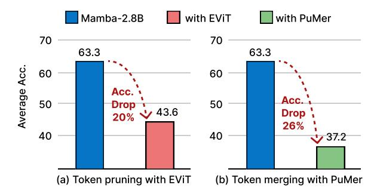

# 1 Introduction

There are growing research interests and efforts in SSMs in recent years. Building on the foundation laid by the Kalman filter model [\(Kalman,](#page-8-0) [1960\)](#page-8-0), SSMs have evolved to address long-range dependencies and are optimized for parallel training. Several works [\(Gu et al.,](#page-8-1) [2021a](#page-8-1)[,b,](#page-8-2) [2022;](#page-8-3) [Gupta et al.,](#page-8-4) [2022;](#page-8-4) [Dao and Gu,](#page-8-5) [2024\)](#page-8-5) have proposed SSMbased models capable of processing sequence data across a variety of tasks and modalities.

A notable recent contribution, Mamba [\(Gu and](#page-8-6) [Dao,](#page-8-6) [2023a\)](#page-8-6), integrates time-varying parameters into SSMs, allowing the model to selectively propagate or forget information. Additionally, Mamba introduces a hardware-aware parallel algorithm that accelerates both training and inference. Unlike quadratic attention mechanisms, which become prohibitively expensive with longer sequence lengths, Mamba's subquadratic-time architecture is more efficient and better suited for handling long sequences. The exceptional scaling performance of Mamba underscores its potential as an effective alternative to the Transformer model [\(Vaswani et al.,](#page-9-0) [2017\)](#page-9-0) for generative language modeling tasks.

In line with existing research efforts aimed at enhancing the efficiency of Transformer models [\(Shen et al.,](#page-9-1) [2024b,](#page-9-1)[c;](#page-9-2) [Zhan et al.,](#page-10-0) [2021\)](#page-10-0), exploring the efficiency of SSMs is crucial for facilitating real-time applications. While weight pruning and quantization are prevalent techniques for optimizing Transformer models [\(Vaswani et al.,](#page-9-0) [2017;](#page-9-0) [Yang et al.,](#page-9-3) [2023;](#page-9-3) [Zhang et al.,](#page-10-1) [2022\)](#page-10-1), token reduction [\(Rao et al.,](#page-9-4) [2021;](#page-9-4) [Pan et al.,](#page-9-5) [2021;](#page-9-5) [Yuan](#page-9-6) [et al.,](#page-9-6) [2021;](#page-9-6) [Renggli et al.,](#page-9-7) [2022\)](#page-9-7) has proven effective in improving Transformer efficiency due to the token length dimension or number of token is independent of the model architecture.

Given that SSM blocks also process input tokens similarly to Transformer models, applying existing state-of-the-art (SOTA) token reduction techniques [\(Liang et al.,](#page-9-8) [2022;](#page-9-8) [Cao et al.,](#page-8-7) [2023;](#page-8-7) [Bolya et al.,](#page-8-8) [2023\)](#page-8-8) to SSMs appears to be a straightforward post-training approach to enhance their efficiency, especially when scaling to billions of model parameters. This can achieve faster serving and lower peak memory usage, facilitating the wider deployment of large-scale SSMs like Mamba. However, as illustrated in Figure [1,](#page-2-0) this application of token reduction to SSMs, while offering some benefits of faster inference with fewer tokens, results in significant performance drops.

In this paper, after applying existing Transformer token reduction techniques to SSMs and observing

\*Equal contribution.

1Code available at [https://github.com/wuyushuwys/](https://github.com/wuyushuwys/ToR_SSM) [ToR\\_SSM](https://github.com/wuyushuwys/ToR_SSM)

their failures, we conduct an insightful analysis to understand the patterns and reasons for their failures on SSMs. Based on our analysis, we propose a unified post-training token reduction method for SSMs to preserve performance and improve efficiency. We first employ a decoupling strategy that computes the importance of each token and classifies them into two sets: less important tokens and more important tokens. Following this, we devise a fine-grained intra-layer token reduction strategy for the hidden states and residual connections of Mamba. Our approach uses a hybrid token reduction strategy (combining and taking advantages of pruning and merging) on hidden state tokens, meticulously designed to balance preserving essential information and eliminating redundancy. Our unified strategy can be generalized to other model architectures like Transformers. In summary, the main contributions of our work are as follows:

- We observe the failure of directly applying token reduction techniques from Transformers to SSMs, and we conduct an insightful analysis to investigate the patterns of token reduction strategies and the possible reasons for their failures.
- We are the first to propose a unified post-training token reduction method designed for SSMs. This strategy leverages insights from both token pruning and token merging, and incorporates the token importance and similarity evaluation.
- Zero-shot evaluations on various SSMs demonstrate the effectiveness of our method, improving average accuracy by 5.7% to 13.1% on six benchmarks with Mamba-2, and by 6.5% to 15.1% with Mamba compared to baseline methods. Meanwhile, our method significantly reduces computational demands and memory requirements.

#### 2 Related Work

State Space Models. SSMs (Gu and Dao, 2023b; Mehta et al., 2022; Wang et al., 2023) are emerging architecture designs for sequence-to-sequence transformation. The design has the strength to model complex systems by focusing on how the input, output, and state variables evolve over time. Mamba-2 (Dao and Gu, 2024) propose state space duality to design a new architecture whose core layer is a refinement of selective SSM. S4ND (Nguyen et al., 2022) is the first work that applies the state space mechanism to visual tasks and shows the potential to achieve competitive

performance with ViTs (Dosovitskiy et al., 2020). ViM (Zhu et al., 2024) proposes a novel vision backbone with bidirectional selective SSM. The accomplishments demonstrate the potential of SSMs as an emerging foundation model family.

**Token Reduction.** Token reduction is an effective strategy to enhance computational efficiency by reducing the number of processed tokens or patches (Modarressi et al., 2022; Huang et al., 2022; Nawrot et al., 2022; Wang and Yu, 2023; Kong et al., 2023; Zhan et al., 2024). It enables significant acceleration without requiring additional weights or specialized hardware, aiming to selectively retain the most informative tokens. Several innovative approaches have been developed for Transformers. For example, EViT (Liang et al., 2022) uses the attentiveness of the [CLS] token with respect to other tokens to identify the most important tokens. DynamicViT (Rao et al., 2021) and SPViT (Kong et al., 2022) add layers that employ the Gumbel-Softmax trick to selectively prune less informative tokens. Agile-Quant (Shen et al., 2024a) leverage the activation-aware token pruning technique to reduce the outliers for LLMs. ToMe (Bolya et al., 2023) measures dot product similarity between token keys to determine redundancy and merge accordingly. PuMer (Cao et al., 2023) proposed a token reduction framework for large-scale VLMs with text-informed pruning and modalityaware merging strategies to progressively reduce the tokens of input image and text.

However, the dynamics of information flow between tokens and the learning mechanisms in models like Mamba (Gu and Dao, 2023b) remain largely unexplored. The absence of attention layers in Mamba makes current token reduction methods ineffective. Furthermore, the inclusion of the SSM module prevents the effective use of existing token reduction methods.

## 3 Preliminary and Motivation

## 3.1 State Space Models

SSMs are sequential models that map an input sequence  $x(t) \in \mathbb{R}^L$  to an output sequence  $y(t) \in \mathbb{R}^L$  through a hidden state  $h(t) \in \mathbb{R}^N$  as follows,

$$h'(t) = \mathbf{A}h(t) + \mathbf{B}x(t), \quad y(t) = \mathbf{C}h(t), \quad (1)$$

where L denotes the length of the sequence, N denotes the number of representation dimensions,  $\mathbf{A} \in \mathbb{R}^{N \times N}$  is the evolution matrix, and  $\mathbf{B} \in \mathbb{R}^{N \times L}$ ,  $\mathbf{C} \in \mathbb{R}^{L \times N}$  are the projection matrices.

Figure 1: Performance of applying token pruning (EViT) and merging (PuMer) methods on Mamba-2.8B, showcasing significant drop in accuracy.

Mamba [\(Gu and Dao,](#page-8-9) [2023b\)](#page-8-9) represents a discrete version of the continuous system for SSMs and incorporates a timescale parameter ∆ to facilitate the transformation of continuous parameters with the zero-order hold (ZOH) as A = exp(∆A), and B = (∆A) −1 (exp(∆A) − I) · ∆B. After obtaining the discretized A and B, the discretization of Equation [\(1\)](#page-1-0) can be rewritten as,

$$\mathbf{h}_t = \overline{\mathbf{A}}\mathbf{h}_{t-1} + \overline{\mathbf{B}}\mathbf{x}_t, \quad \mathbf{y}_t = \mathbf{C}\mathbf{h}_t.$$
 (2)

Finally, the Mamba model computes the output through a global convolution as follows,

$$\overline{\mathbf{K}} = (\mathbf{C}\overline{\mathbf{B}}, \mathbf{C}\overline{\mathbf{A}}\overline{\mathbf{B}}, \dots, \mathbf{C}\overline{\mathbf{A}}^{\mathbf{L}-1}\overline{\mathbf{B}}),$$

$$\mathbf{y} = \mathbf{x} * \overline{\mathbf{K}},$$
(3)

where y denotes the output sequence, L denotes the length of the input sequence x, and K ∈ R L denotes a structured convolutional kernel.

