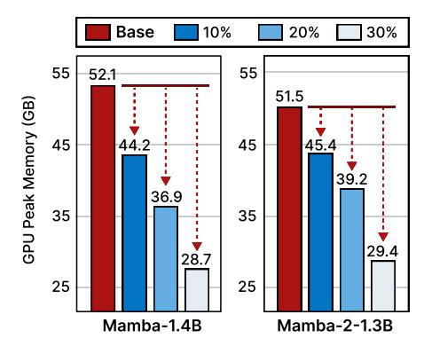
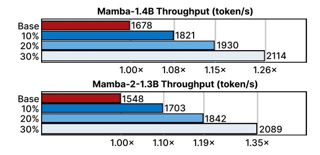

# A.2 More Efficiency Results

The GPU peak memory usage of Mamba-1.4B and Mamba-2-1.3B are shown in Figure [5](#page-10-5) following the same configuration as Section [5.4.](#page-7-3) We follow the PyTorch instruction[2](#page-10-6) to capture the GPU peak memory snapshot.

Figure 5: Comparison of GPU peak memory reduction between different FLOPS reduction ratios for Mamba-1.4B and Mamba-2-1.3B.

When reducing 10%, 20%, and 30% FLOPS compared to the baseline, Mamba-1.4B can obtain up to 15.2%, 29.1%, and 44.7% peak memory reduction, while the peak memory reduction for Mamba-2-1.3B can reach up-to 11.9%, 23.9%, and 42.9%.

Figure 6: Comparison of the generation throughput between different FLOPS reduction ratios for Mamba-1.4B and Mamba-2-1.3B.

[https://pytorch.org/docs/stable/torch\\_cuda\\_](https://pytorch.org/docs/stable/torch_cuda_memory.html) [memory.html](https://pytorch.org/docs/stable/torch_cuda_memory.html)

| Method       | FLOPS Reduction | PPL ↓   | LAMBADA Acc↑(%) | HellaSwag Acc↑(%) | PIQA Acc↑(%) | Arc-E Acc↑(%) | Arc-C Acc↑(%) | WinoGrade Acc↑(%) | Avg. Acc↑(%) |
|--------------|--------------------|---------|--------------------|----------------------|-----------------|------------------|------------------|----------------------|-----------------|
| Mamba-2-2.7B | 0%                 | 4.10    | 69.7               | 66.6                 | 76.4            | 69.6             | 36.4             | 64.0                 | 63.8            |
| + LTMP       | 10%                | 55.00   | 52.0               | 34.1                 | 72.4            | 69.2             | 35.7             | 62.2                 | 57.2            |
| + Ours       |                    | 8.55    | 59.0               | 66.1                 | 73.2            | 69.4             | 36.5             | 64.0                 | 61.4            |
| + LTMP       | 20%                | 466.40  | 38.4               | 27.7                 | 63.5            | 64.7             | 33.1             | 63.8                 | 48.5            |
| + Ours       |                    | 17.96   | 49.1               | 64.7                 | 68.2            | 69.4             | 37.5             | 63.1                 | 58.7            |
| + LTMP       | 30%                | 4670.71 | 22.3               | 24.9                 | 58.9            | 54.0             | 28.3             | 59.2                 | 41.3            |
| + Ours       |                    | 42.61   | 38.3               | 59.4                 | 61.2            | 68.4             | 37.3             | 63.9                 | 54.7            |

Table 6: Additional results of post-training performance on Mamba-2-2.7B. We compare with LTMP and evaluate them on six benchmarks under 10%, 20%, and 30% FLOPS reduction.

The throughput of token generation for Mamba-1.4B and Mamba-2-1.3B using the proposed method are also collected under the same configuration in Section [5.4,](#page-7-3) as illustrated in Figure [6.](#page-10-7) With our optimization, the throughput can be improved by 1.08×, 1.15×, and 1.26× for Mamba-1.4B, and 1.10×, 1.19×, and 1.35× for Mamba-2- 1.3B, when reducing 10%, 20%, and 30% FLOPS, respectively.

## A.3 More Results

We compared our method with LTMP [\(Bonnaerens](#page-8-18) [and Dambre,](#page-8-18) [2023\)](#page-8-18), a simple token pruning and merging method designed for Vision Transformer. Our method outperforms LTMP in six benchmarks under same FLOPS reduction by a large margin, as shown in Table [6.](#page-11-0) The results emphasizing that the simple combination of token pruning and merging from Transformer is inadequate for SSMs.