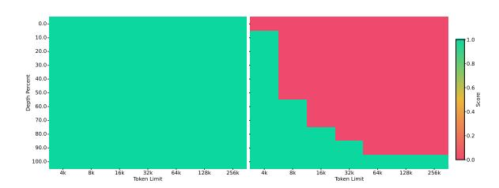
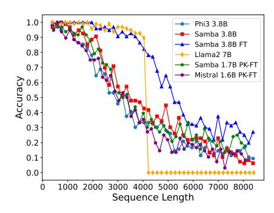
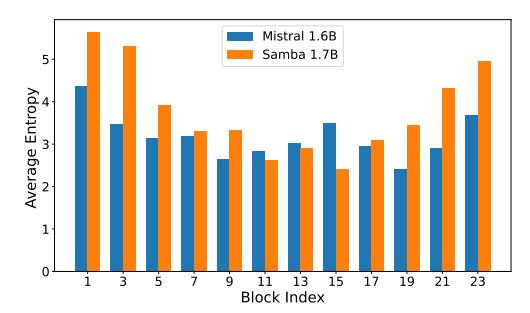
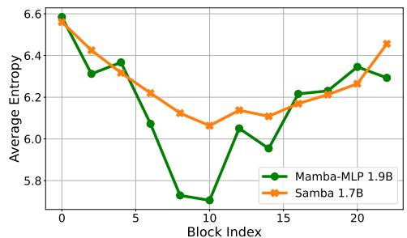

# 2.1 ARCHITECTURE

As illustrated in Figure [1,](#page-2-0) we explore three kinds of layerwise hybridization strategies on the 1.7B scale: Samba, Mamba-SWA-MLP, and Mamba-MLP. We also explore other hybridization approaches with full self-attention on smaller scales in Section [4.](#page-8-0) The number of layers N is set to 48 for Samba, Mamba-MLP, and Mamba, while Mamba-SWA-MLP has 54 layers, so each model has approximately 1.7B parameters. We only modify the layer-level arrangement for each of the models and keep every other configuration the same to have apple-to-apple comparisons. More details on the configuration of each layer are explained in the following subsections.

#### 2.1.1 MAMBA LAYER

Mamba [\(Gu & Dao,](#page-13-2) [2023\)](#page-13-2) is a recently proposed SSM-based model with selective state spaces. It enables input-dependent gating to both the recurrent states and the input representation for a soft

Figure 1: From left to right: Samba, Mamba-SWA-MLP, Mamba-MLP, and Mamba. The illustrations depict the layer-wise integration of Mamba with various configurations of Multi-Layer Perceptrons (MLPs) and Sliding Window Attention (SWA). We assume the total number of intermediate layers to be N, and omit the embedding layers and output projections for simplicity. Pre-Norm (Xiong et al., 2020; Zhang & Sennrich, 2019) and skip connections (He et al., 2016) are applied for each of the intermediate layers.

selection of the input sequence elements. Given an input sequence representation  $\mathbf{X} \in \mathbb{R}^{n \times d_m}$ , where n is the length of the sequence and  $d_m$  is the hidden size, Mamba first expands the inputs to a higher dimension  $d_e$ , i.e.,

$$\mathbf{H} = \mathbf{X}\mathbf{W}_{\mathrm{in}} \in \mathbb{R}^{n \times d_e}$$

where  $\mathbf{W}_{in} \in \mathbb{R}^{d_m \times d_e}$  is a learnable projection matrix. Then a Short Convolution (SC) (Poli et al., 2023) operator is applied to smooth the input signal,

$$\mathbf{U} = \mathrm{SC}(\mathbf{H}) = \mathrm{SiLU}(\mathrm{DepthwiseConv}(\mathbf{H}, \mathbf{W}_{\mathrm{conv}})) \in \mathbb{R}^{n \times d_e}$$
 (1)

where  $\mathbf{W}_{\mathrm{conv}} \in \mathbb{R}^{k \times d_e}$  and the kernel size k is set to 4 for hardware-aware efficiency. The Depthwise Convolution (He et al., 2019) is applied over the sequence dimension followed by a SiLU (Elfwing et al., 2017) activation function. The selective gate is then calculated through a low-rank projection followed by Softplus (Zheng et al., 2015),

$$\Delta = \text{Softplus}(\mathbf{U}\mathbf{W}_{r}\mathbf{W}_{q} + \mathbf{b}) \in \mathbb{R}^{n \times d_{e}}$$
 (2)

where  $\mathbf{W}_r \in \mathbb{R}^{d_e \times d_r}$ ,  $\mathbf{W}_q \in \mathbb{R}^{d_r \times d_e}$  and  $d_r$  is the low-rank dimension.  $\mathbf{b} \in \mathbb{R}^{d_e}$  is carefully initialized so that  $\Delta \in [\Delta_{\min}, \Delta_{\max}]$  after the initialization stage. We set  $[\Delta_{\min}, \Delta_{\max}] = [0.001, 0.1]$ , and find that these values are not sensitive to language modeling performance under the perplexity metric. The input dependence is also introduced for the parameters  $\mathbf{B}$  and  $\mathbf{C}$  of SSM,

$$\mathbf{B} = \mathbf{U}\mathbf{W}_{b} \in \mathbb{R}^{n \times d_{s}}$$

$$\mathbf{C} = \mathbf{U}\mathbf{W}_{c} \in \mathbb{R}^{n \times d_{s}}$$

where  $d_s$  is the state dimension. For each time step  $1 \le t \le n$ , the recurrent inference of the Selective SSM (S6) is performed in an expanded state space  $\mathbf{Z}_t \in \mathbb{R}^{d_e \times d_s}$ , i.e.,

$$\mathbf{Z}_{t} = \exp(-\Delta_{t} \odot \exp(\mathbf{A})) \odot \mathbf{Z}_{t-1} + \Delta_{t} \odot (\mathbf{B}_{t} \otimes \mathbf{U}_{t}) \in \mathbb{R}^{d_{e} \times d_{s}}$$
$$\mathbf{Y}_{t} = \mathbf{Z}_{t} \mathbf{C}_{t} + \mathbf{D} \odot \mathbf{U}_{t} \in \mathbb{R}^{d_{e}}$$

where  $\mathbf{Z}_0 = \mathbf{0}$ ,  $\odot$  means the point-wise product,  $\otimes$  means the outer product and  $\exp$  means the point-wise natural exponential function.  $\mathbf{D} \in \mathbb{R}^{d_e}$  is a learnable vector initialized as  $D_i = 1$  and  $\mathbf{A} \in \mathbb{R}^{d_e \times d_s}$  is a learnable matrix initialized as  $A_{ij} = \log(j), 1 \le j \le d_s$ , following the S4D-Real (Gu et al., 2022) initialization. In practice, Mamba implements a hardware-aware parallel scan algorithm for efficient parallelizable training. The final output is obtained through a gating mechanism similar to Gated Linear Unit (Shazeer, 2020; Dauphin et al., 2016),

$$\mathbf{O} = \mathbf{Y} \odot \mathrm{SiLU}(\mathbf{X}\mathbf{W}_{\mathrm{g}}) \mathbf{W}_{\mathrm{out}} \in \mathbb{R}^{n \times d_m}$$

where  $\mathbf{W}_g \in \mathbb{R}^{d_m \times d_e}$  and  $\mathbf{W}_{\mathrm{out}} \in \mathbb{R}^{d_e \times d_m}$  are learnable parameters. In this work, we set  $d_e = 2d_m$ ,  $d_r = d_m/16$ , and  $d_s = 16$ . The Mamba layer in SAMBA is expected to capture the time-dependent semantics of the input sequence through its recurrent structure. The input selection mechanism in the Mamba layer enables the model to focus on relevant inputs, thereby allowing the model to memorize important information in the long term.

#### 2.1.2 SLIDING WINDOW ATTENTION (SWA) LAYER

We include Sliding Window Attention [\(Beltagy et al.,](#page-10-3) [2020\)](#page-10-3) layers to address the limitations of Mamba layers in capturing non-recurrent dependencies in sequences. Our SWA layer operates on a window size w = 2048 that slides over the input sequence, ensuring that the computational complexity remains linear with respect to the sequence length. RoPE [\(Su et al.,](#page-16-4) [2021\)](#page-16-4) is applied within the sliding window, with a base frequency of 10,000. By directly accessing the contents in the context window through attention, the SWA layer can retrieve high-definition signals from the middle to short-term history that cannot be clearly captured by the recurrent states of Mamba. We use FlashAttention 2 [\(Dao,](#page-11-5) [2023\)](#page-11-5) for the efficient implementation of self-attention throughout this work. We also choose the 2048 sliding window size for efficiency consideration; FlashAttention 2 has the same training speed as Mamba's selective parallel scan at the sequence length of 2048 based on the measurements in [\(Gu & Dao,](#page-13-2) [2023\)](#page-13-2).

## 2.1.3 MULTI-LAYER PERCEPTRON (MLP) LAYER

The MLP layers in SAMBA serve as the architecture's primary mechanism for nonlinear transformation and recall of factual knowledge [\(Dai et al.,](#page-11-6) [2022\)](#page-11-6). We use SwiGLU [\(Shazeer,](#page-16-2) [2020\)](#page-16-2) for all the models trained in this paper and denote its intermediate hidden size as dp. As shown in Figure [1,](#page-2-0) Samba applies separate MLPs for different types of information captured by Mamba and the SWA layers.

## 3 EXPERIMENTS AND RESULTS

We pre-train four SAMBA models with different parameter sizes, 421M, 1.3B, 1.7B and 3.8B, to investigate its performance across different scales. The details of the hyperparameters for the training and architecture designs are shown in Table [12](#page-23-0) of Appendix [G.](#page-23-1) We also train other hybrid architectures as mentioned in Section [2.1,](#page-1-0) including the baseline Mamba [\(Gu & Dao,](#page-13-2) [2023\)](#page-13-2), Llama-3 [\(MetaAI,](#page-14-4) [2024;](#page-14-4) [Dubey et al.,](#page-12-1) [2024\)](#page-12-1), and Mistral [\(Jiang et al.,](#page-14-5) [2023\)](#page-14-5) architecture on a scale of around 1.7B, with detailed hyperparameters in Table [11](#page-23-2) of Appendix [G.](#page-23-1) We do comprehensive downstream evaluations on a wide range of benchmarks, focusing on four main capabilities of the models: commonsense reasoning (ARC [\(Clark et al.,](#page-11-7) [2018\)](#page-11-7), PIQA [\(Bisk et al.,](#page-10-4) [2020\)](#page-10-4), WinoGrande [\(Sakaguchi et al.,](#page-15-5) [2021\)](#page-15-5), SIQA [\(Sap et al.,](#page-15-6) [2019\)](#page-15-6)), language understanding (HellaSwag [\(Zellers et al.,](#page-17-8) [2019\)](#page-17-8), BoolQ [\(Clark et al.,](#page-11-8) [2019\)](#page-11-8), OpenbookQA [\(Mihaylov et al.,](#page-14-6) [2018\)](#page-14-6), SQuAD [\(Rajpurkar et al.,](#page-15-7) [2016\)](#page-15-7), MMLU [\(Hendrycks et al.,](#page-13-5) [2021\)](#page-13-5), MMLU-Pro [\(Wang et al.,](#page-17-9) [2024\)](#page-17-9), GPQA[\(Rein et al.,](#page-15-8) [2023\)](#page-15-8)), truthfulness (TruthfulQA [\(Lin et al.,](#page-14-7) [2022\)](#page-14-7)) and math and coding (GSM8K [\(Cobbe et al.,](#page-11-4) [2021\)](#page-11-4), MBPP [\(Austin](#page-10-5) [et al.,](#page-10-5) [2021\)](#page-10-5), HumanEval [\(Chen et al.,](#page-11-3) [2021\)](#page-11-3)).

Table 1: Downstream performance comparison between Samba-3.8B-IT and Phi-3-mini-4K on both long-context and short-context tasks. We report 5-shot accuracy (averaged by category) for MMLU, 8-shot CoT [\(Wei et al.,](#page-17-10) [2022\)](#page-17-10) for GSM8K, 0-shot pass@1 for HumanEval, ROUGE-L for both GovReport and SQuALITY. † Results from the Phi-3 technical report [\(Abdin et al.,](#page-10-6) [2024\)](#page-10-6).

| Model                    | MMLU | GSM8K | HumanEval | GovReport | SQuALITY |
|--------------------------|------|-------|-----------|-----------|----------|
| Phi-3-mini-4K-instruct † | 68.8 | 82.5  | 58.5      | 14.4      | 21.6     |
| Samba-3.8B-IT            | 71.9 | 87.6  | 62.8      | 18.9      | 21.2     |

## 3.1 LANGUAGE MODELING ON TEXTBOOK QUALITY DATA

We first present results from our largest 3.8B SAMBA model, trained on the same data set used by Phi3 [\(Abdin et al.,](#page-10-6) [2024\)](#page-10-6) with 3.2T tokens. We follow the same multiphase pretraining strategy as Phi3-mini, and apply both the original Phi-3-mini post-training recipe and the Phi3-mini-June-2024 recipe to produce our instruction-tuned SAMBA 3.8B models, *i.e.*, Samba-3.8B-IT and Samba-3.8B (June) respectively. We report comprehensive benchmark results of the Samba 3.8B base model and Samba-3.8B (June) in Appendix [B.](#page-19-0) As shown in Table [1,](#page-3-0) we evaluate the downstream performance of Samba-3.8B-IT on both long-context summarization tasks (GovReport [\(Huang et al.,](#page-14-8) [2021\)](#page-14-8), SQuALITY [\(Wang et al.,](#page-17-11) [2022\)](#page-17-11)) and major short-context benchmarks (MMLU, GSM8K, HumanEval). We can see that Samba has substantially better performance than Phi-3-mini-4k-instruct on both the short-context (MMLU, GSM8K, HumanEval) and long-context (GovReport) tasks, while

still having the 2048 window size of its SWA layer and maintaining the linear complexity for efficient processing of long documents. Details of data statistics and evaluation setup for long context tasks are included in Appendix [F.](#page-22-0)

Table 2: Downstream evaluation of the architectures trained on 230B tokens of the Phi2 dataset. We report the unnormalized accuracy for multiple choice tasks. GSM8K is evaluated with 5-shot examples while other tasks are in zero-shot. Best results are in bold, second best underlined.

| Benchmark        | Llama-3 1.6B | Mistral 1.6B | Mamba 1.8B | Mamba-SWA-MLP 1.6B | Mamba-MLP 1.9B | SAMBA 1.7B |
|------------------|-----------------|-----------------|---------------|-----------------------|-------------------|---------------|
| ARC-Easy         | 76.85           | 77.02           | 77.99         | 76.68                 | 78.91             | 79.25         |
| ARC-Challenge    | 43.26           | 44.20           | 45.22         | 46.16                 | 47.35             | 48.21         |
| PIQA             | 76.66           | 75.79           | 77.31         | 76.50                 | 78.84             | 77.10         |
| WinoGrande       | 70.01           | 70.72           | 73.40         | 73.72                 | 72.38             | 72.93         |
| SIQA             | 51.23           | 52.00           | 53.12         | 55.12                 | 54.30             | 53.68         |
| HellaSwag        | 46.98           | 47.19           | 49.80         | 49.71                 | 50.14             | 49.74         |
| BoolQ            | 68.20           | 70.70           | 74.83         | 74.74                 | 73.70             | 75.57         |
| OpenbookQA       | 34.00           | 32.80           | 36.60         | 33.80                 | 35.40             | 37.20         |
| SQuAD            | 74.88           | 72.82           | 67.66         | 76.73                 | 63.86             | 77.64         |
| MMLU             | 43.84           | 43.54           | 45.28         | 47.39                 | 43.68             | 48.01         |
| TruthfulQA (MC1) | 25.70           | 25.09           | 26.81         | 26.20                 | 26.44             | 27.78         |
| TruthfulQA (MC2) | 40.35           | 38.80           | 40.66         | 40.80                 | 40.04             | 41.62         |
| GSM8K            | 32.68           | 32.45           | 32.07         | 44.05                 | 27.52             | 38.97         |
| MBPP             | 46.30           | 47.08           | 47.86         | 47.08                 | 47.08             | 48.25         |
| HumanEval        | 36.59           | 36.59           | 35.98         | 37.80                 | 31.10             | 39.02         |
| Average          | 51.17           | 51.12           | 52.31         | 53.77                 | 51.38             | 54.33         |

To examine the different hybridization strategies mentioned in Section [2.1,](#page-1-0) we train 6 models with around 1.7B parameters on the Phi2 [\(Li et al.,](#page-14-9) [2023\)](#page-14-9) dataset with 230B tokens and evaluate them in the full suite of 15 downstream benchmarks to have a holistic assessment of hybrid and purebred architectures. As shown in Table [2,](#page-4-1) SAMBA demonstrates superior performance on a diverse set of tasks, including commonsense reasoning (ARC-Challenge), language understanding (MMLU, SQuAD), TruthfulQA and code generation (HumanEval, MBPP). It outperforms both the pure attention-based and SSM-based models in most tasks and achieves the best average performance. By comparing the performance of Mamba-MLP and Mamba in Table [2,](#page-4-1) we can observe that replacing Mamba blocks with MLPs does not harm common sense reasoning ability, but its performance in language understanding and complex reasoning ability, such as coding and mathematical reasoning, degenerates significantly. We can also see that pure Mamba models fall short on retrieval intensive tasks such as SQuAD due to their lack of precise memory retrieval ability. The best results are achieved through the combination of the attention and Mamba modules, as shown with our Samba architecture. We can also notice that Mamba-SWA-MLP has significantly better performance on GSM8K, potentially resulting from a closer collaboration between the Mamba and the SWA layers. The distinct downstream performances of different hybridization strategies pose interesting future work for developing task-adaptive dynamic architectures.

## 3.2 EXPLORATION ON HYBRIDIZING ATTENTION AND LINEAR RECURRENCE

Since SSMs belong to a broader realm of linear recurrent models [\(Orvieto et al.,](#page-15-9) [2023;](#page-15-9) [Qin et al.,](#page-15-10) [2023;](#page-15-10) [Yang et al.,](#page-17-4) [2023;](#page-17-4) [Katsch,](#page-14-10) [2023;](#page-14-10) [Qin et al.,](#page-15-11) [2024;](#page-15-11) [Yang et al.,](#page-17-12) [2024\)](#page-17-12), there exist multiple alternatives other than Mamba when combing attention-based layers with recurrent neural networks. We also add architecture ablation studies to justify the design choices of Samba. Specifically, in addition to Llama-2, Mamba, Samba and Mamba-SWA-MLP, we investigate the comparative analysis of the following architectures:

• Llama-2-SWA is a pure attention-based architecture that replaces all full attention layers in Llama-2 with sliding window attention.

Table 3: Perplexity on the validation set of SlimPajama for different attention and linear recurrent model architectures trained at 4,096 context length. We use window size 2,048 for Sliding Window Attention (SWA). The perplexity results have a fluctuation around  $\pm 0.3\%$ .

| A1.24                  | G.      | T         | Training Speed                   | Valida | tion Cont | ext Length |
|------------------------|---------|-----------|----------------------------------|--------|-----------|------------|
| Architecture           | Size    | Layers    | $(\times 10^5 \text{ tokens/s})$ | 4096   | 8192      | 16384      |
| 20B training tokens of | n 8×A10 | 00 GPUs   |                                  |        |           |            |
| Llama-2                | 438M    | 24        | 4.85                             | 11.14  | 47.23     | 249.03     |
| Llama-2-SWA            | 438M    | 24        | 4.96                             | 11.12  | 10.66     | 10.57      |
| Mamba                  | 432M    | 60        | 2.46                             | 10.70  | 10.30     | 10.24      |
| Sliding GLA            | 438M    | 24        | 4.94                             | 10.43  | 10.00     | 9.92       |
| Sliding RetNet         | 446M    | 24        | 4.32                             | 10.38  | 9.96      | 9.87       |
| Mega-S6                | 422M    | 24        | 3.26                             | 12.63  | 12.25     | 12.25      |
| Mamba-SWA-MLP          | 400M    | 24        | 4.21                             | 10.07  | 9.67      | 9.59       |
| MLP2-SWA-MLP           | 417M    | 24        | 5.08                             | 10.95  | 10.50     | 10.41      |
| SAMBA-NoPE             | 421M    | 24        | 4.48                             | 10.11  | 28.97     | 314.78     |
| SAMBA                  | 421M    | 24        | 4.46                             | 10.06  | 9.65      | 9.57       |
| 100B training tokens   | on 64×E | 1100 GPUs |                                  |        |           |            |
| Llama-2                | 1.3B    | 40        | 25.9                             | 7.60   | 44.32     | 249.64     |
| Llama-2-SWA            | 1.3B    | 40        | 26.2                             | 7.60   | 7.37      | 7.21       |
| Mamba                  | 1.3B    | 48        | 17.8                             | 7.47   | 7.26      | 7.15       |
| Sliding GLA            | 1.2B    | 36        | 25.9                             | 7.58   | 7.35      | 7.19       |
| Sliding RetNet         | 1.4B    | 36        | 23.0                             | 7.56   | 7.35      | 7.56       |
| Mega-S6                | 1.3B    | 36        | 17.9                             | 9.01   | 8.81      | 8.68       |
| Mamba-SWA-MLP          | 1.3B    | 36        | 23.5                             | 7.37   | 7.16      | 7.00       |
| MLP2-SWA-MLP           | 1.3B    | 36        | 26.6                             | 7.81   | 7.58      | 7.42       |
| SAMBA-NoPE             | 1.3B    | 36        | 25.2                             | 7.33   | 20.40     | 326.17     |
| SAMBA                  | 1.3B    | 36        | 25.2                             | 7.32   | 7.11      | 6.96       |

- Sliding RetNet replaces Mamba layers in the Samba architecture with Multi-Scale Retention (Sun et al., 2023) layers. RetNet is a linear attention model with fixed and input-independent decay applying to the recurrent hidden states.
- Sliding GLA replaces Mamba layers in the Samba architecture with Gated Linear Attention (GLA) (Yang et al., 2023). GLA is a more expressive variant of linear attention with input-dependent gating.
- Mega-S6 replaces all MD-EMA modules in the Mega (Ma et al., 2023) architecture with the ShortConv+S6 combinations from Mamba to adapt Mega to the modern Mamba architecture. Rotary position embedding, RMSNorm and Softmax attention are also adopted. We set the intermediate dimension of the Mega-S6 layer to be  $d_m$  so that it has a roughly  $5d_m^2$  number of parameters. This represents a classical baseline that conducts sequential intra-layer SSM-Attention hybridization.
- MLP2-SWA-MLP replaces all Mamba layers in the Samba architecture to SwiGLU layers with  $6d_m^2$  number of parameters.
- Samba-NoPE removes the rotary relative position embedding in Samba and does not have any position embedding in the architecture.

We pre-train all models on the same SlimPajama (Soboleva et al., 2023) dataset under both around 438M and 1.3B settings, and evaluate these models by calculating perplexity on the validation set with context length at 4096, 8192, and 16384 tokens to investigate their zero-shot length extrapolation ability. Peak training throughput is also measured as an efficiency metric. The details of the hyperparameter settings are included in Appendix G. As shown in Table 3, SAMBA consistently outperforms all other models in different context lengths and model sizes. The training speed of SAMBA is competitive compared to pure Transformer-based models on the 1.3B scale. Mamba has significantly worse training throughput because Mamba layers have slower training speed than MLP layers, and the purebred Mamba models need to have more layers than other models at the same number of parameters. Comparing Mamba-SWA-MLP with Samba, we can see that Samba has slightly better perplexity scores and higher training throughput. Mamba-SWA-MLP trades off the MLP layers with more I/O intensive Mamba and Attention layers, leading to slower training speed.

This also indicates that Mamba-SWA-MLP will have slower decoding speed than Samba due to larger total cache size resulting from more SSMs and Attention layers. We can further observe that replacing Mamba with MLP speeds up the training but harms perplexity significantly, indicating the importance of Mamba layers in the Samba architecture. Interestingly, even though we use SWA in Samba architecture, Samba-NoPE still has exploded perplexities beyond its training length without RoPE. We can also find that while RetNet can extrapolate well under the 438M scale, it has an increasing perplexity on 16K length at the 1.4B scale, which may indicate that its input-independent decay may need specific tuning at different scales to work well.

Table 4: Downstream evaluation of models pre-trained with 100B tokens from SlimPajama. We measure the character-normalized accuracy for HellaSwag following Gu & Dao (2023). All tasks are evaluated in zero-shot.

| Architecture   | Size | ARC-Easy acc ↑ | HellaSwag acc_norm ↑ | Wino. acc ↑ | PIQA acc ↑ | LAMBADA acc ↑ | Avg.  |
|----------------|------|-------------------|-------------------------|----------------|---------------|------------------|-------|
| LLaMA-2        | 1.3B | 55.09             | 52.32                   | 53.35          | 71.11         | 48.52            | 56.08 |
| LLaMA-2-SWA    | 1.3B | 56.65             | 52.59                   | 54.93          | 71.60         | 47.56            | 56.67 |
| Sliding GLA    | 1.2B | 56.94             | 52.52                   | 56.75          | 71.38         | 48.17            | 57.15 |
| Sliding RetNet | 1.4B | 57.66             | 52.64                   | 56.75          | 71.33         | 48.34            | 57.34 |
| Mega-S6        | 1.3B | 50.63             | 41.91                   | 52.96          | 68.17         | 37.88            | 50.31 |
| Mamba          | 1.3B | 58.08             | 54.93                   | 53.99          | 71.98         | 45.97            | 56.99 |
| Mamba-SWA-MLP  | 1.3B | 59.64             | 54.50                   | 55.25          | 72.42         | 49.12            | 58.19 |
| MLP2-SWA-MLP   | 1.3B | 55.18             | 50.32                   | 52.80          | 70.67         | 48.11            | 55.42 |
| SAMBA-NoPE     | 1.3B | <u>58.38</u>      | 54.62                   | 56.51          | 72.03         | 51.08            | 58.52 |
| SAMBA          | 1.3B | 58.21             | <u>54.73</u>            | 55.72          | <u>72.36</u>  | 51.68            | 58.54 |

In Table 4, we evaluate all our 1.3B scale models on five typical commonsense reasoning tasks (ARC-Easy, HellaSwag, WinoGrande, PIQA and the OpenAI variant of LAMBADA (Paperno et al., 2016) to understand the effect of architecture designs on downstream performances. We can see that Samba has the best average accuracy, outperforming the LLaMA 2 architectures by a large margin. Similar to our perplexity evaluation, Samba and Samba-NoPE have similar average accuracies, whereas Mamba-SWA-MLP falls slightly behind. We observe that different architectures excel at different tasks. Mamba-SWA-MLP performs best on ARC-Easy, while Samba and Samba-NoPE achieve superior results on LAMBADA. Hybrid models based on Mamba generally outperform hybrid linear attention models and pure softmax-attention models on HellaSwag.

#### 3.3 EFFICIENT LENGTH EXTRAPOLATION

(a) Perplexity on the test set of Proof-Pile

(b) Decoding throughput with batch size 16

Figure 2: SAMBA shows improved prediction up to 1M tokens in the Proof-Pile test set while achieving a 3.64× faster decoding throughput than the Llama-3 architecture on 64K generation length. We also include an SE-Llama-3 1.6B baseline which applies the SelfExtend (Jin et al., 2024) approach for zero-shot length extrapolation. All models are trained with 4K sequence length.

We use the test split of the Proof-Pile (Zhangir Azerbayev & Piotrowski, 2022) dataset to evaluate the length extrapolation ability of our models at a scale of around 1.7B parameters. We follow Position

https://huggingface.co/datasets/EleutherAI/lambada\_openai

Interpolation (Chen et al., 2023a) for data pre-processing. The sliding window approach (Press et al., 2021) is used for the perplexity evaluation with a window size of 4096. Besides having the decoding throughput in Figure 2 for the generation efficiency metric, we also measure the prompt processing speed in Figure 6 of Appendix B for the models SAMBA 1.7B, Mistral 1.6B, Mamba 1.8B, Llama-3 1.6B and its Self-Extended (Jin et al., 2024) version SE-Llama-3 1.6B with the prompt length sweeping from 1K to 128K. We set the group size to 4 and the neighborhood window to 1024 for Self-Extension. We fix the total processing tokens per measurement to be 128K and varying the batch size accordingly. The throughput is measured on a single A100 GPU with the precision of bfloat 16. We repeat the measurements 10 times and report the averaged results. We can see that Samba achieves 3.73× higher throughput in prompt processing compared to Llama-3 1.6B at the 128K prompt length, and the processing time remains linear with respect to the sequence length. We can also observe that the existing zero-shot length extrapolation technique introduces significant inference latency overhead on the full-attention counterpart, while it still cannot extrapolate infinitely with perplexity performance comparable to that of Samba. In Figure 2, we can also see that Mamba has a slowly and stably increasing perplexity up to 1M sequence length, which indicates that linear recurrent models can still not extrapolate infinitely if the context length is extremely large.

#### 3.4 Long-Context Understanding

Figure 3: Passkey Retrieval performance up to 256K context length for SAMBA 1.7B (Left) vs. Mistral 1.6B (right) instruction tuned on 4K sequence length with 500 steps.

Figure 4: Phonebook evaluation accuracy of different base models.

Beyond its efficiency in processing long context, Samba can also extrapolate its memory recall ability to 256K context length through supervised fine-tuning, and still keeps its linear computation complexity. We fine-tune Samba 1.7B on Passkey Retrieval with a 4K training sequence length for only 500 steps. As presented in Figure 3, SAMBA 1.7B demonstrates a remarkable ability to recall information from significantly longer contexts compared to Mistral 1.6B, a model based solely on Sliding Window Attention (SWA). This capability is particularly evident in the heatmap, where SAMBA maintains the perfect retrieval performance across a wider range of pass-key positions in a long document of up to 256K length. We also draw the training loss curve and the overall passkey retrieval accuracy across the fine-tuning procedure in Figure 7 and Figure 8 of Appendix C. We find that despite the fact that both architectures can reach near-zero training loss in less than 250 steps, Samba can achieve near-perfect retrieval early at 150 training steps, while the Mistral architecture struggles at around 30% accuracy throughout the training process. This shows that Samba can have better long-range retrieval ability than SWA due to the input selection mechanism introduced by the Mamba layers. In Figure 8, we can also notice that the pre-trained base Samba model has a retrieval accuracy (at step 0) similar to that of Mistral, highlighting the need for future work to improve Samba's zero-shot retrieval capabilities.

The encouraging results on Passkey Retrieval drives us to further explore the limits of our finetuning approach. We perform instruction tuning to the Samba-3.8B base model on Phonebook (Jelassi et al., 2024) with only 100 steps on 4K sequence length and evaluate the resulting Samba-3.8B-FT model for a sequence length up to 8K. The evaluation setting requires the models to retrieve a random phone number from a phone book containing 20 (length 400) to 480 (length 8400) name-number pairs, resulting in a pressure test of memorization to Samba which has a constant memory state size. Surprisingly, as shown in Figure 4, we can see that the Samba-3.8B-FT model can close most of its gap with a full-attention model (Llama2 7B) that has twice the parameter size within the 4K training length, and achieves much better extrapolation accuracy compared to all other models including

the Phi3 base model which also uses 2K sliding window attention. Since both Passkey Retrieval and Phonebook require models to remember numbers in a long context document, it is interesting to investigate if a model instruction-tuned on one task can transfer its ability to the other task in zero-shot. We directly evaluate the Passkey Retrieval finetuned Samba 1.7B and Mistral 1.6B models (named Samba 1.7B PK-FT and Mistral 1.6B PK-FT respectively) on the Phonebook task. As shown in Figure 4, Samba 1.7B has slightly better retrieval accuracy than Mistral 1.6B, but both models cannot generalize their number recall ability beyond its sliding window size. We leave it for future work to further explore the transferability of long-context capabilities in linear complexity models.

#### 4 ANALYSIS

In this section, we analyze the experimental results of SAMBA by answering the following research questions. The perplexity results on SlimPajama have a fluctuation around  $\pm 0.3\%$ . Training speed is measured on  $8\times H100$  GPUs by default. All the models in this section are trained on SlimPajama with 20B tokens and 4K sequence length, unless otherwise specified. We also have additional analyses on the training of SWA-based models and the effectiveness of short convolution in Appendix D.

Why not hybridize with full attention? Some previous works (Fu et al., 2023; Lieber et al., 2024) suggest a hybrid architecture of Mamba with full attention. However, as shown in Table 5, the extrapolation perplexity is exploding at a context length of 16K even if a single full attention layer is placed at the beginning of the model. Although hybridization with full attention in the second and middle sixth blocks (the fourth row in the table), following Dao et al. (2022b), can bridge the perplexity gap between full-attention hybrids and Samba, they still cannot extrapolate beyond the training sequence lengths. Samba also has much better training throughput compared to Mamba-MLP alternatives because self-attention with the FlashAttention 2 implementation is more training efficient than Mamba when the sequence length is 4096.

Table 5: Perplexity on SlimPajama of Mamba-MLP architectures with full attention layers replacing Mamba layers at different block indices. We define a block as two consecutive layers with a Mamba/Attention layer followed by an MLP. All the models have 12 blocks in total.

| Architecture | Size | Block Index        | Training Speed                   | Validation Context Length |       |       |
|--------------|------|--------------------|----------------------------------|---------------------------|-------|-------|
| Arciniceture | Size | of Full Attention  | $(\times 10^5 \text{ tokens/s})$ | 4096                      | 8192  | 16384 |
|              | 449M | 11                 | 7.78                             | 10.29                     | 10.53 | 13.66 |
| Mamba-MLP    | 449M | 5                  | 7.78                             | 10.10                     | 10.05 | 12.83 |
| Mailiba-MLF  | 449M | 0                  | 7.78                             | 10.89                     | 10.55 | 10.63 |
|              | 443M | 1, 5               | 7.93                             | 10.06                     | 10.34 | 13.57 |
| SAMBA        | 421M | SWA at odd indices | 8.59                             | 10.06                     | 9.65  | 9.57  |

How many parameters should be allocated to Attention? Given that Mamba can already capture low-rank information in the sequences through recurrent compression, the attention layers in Samba theoretically will only need to focus on information retrieval where a small number of attention heads should suffice. In Table 6, we explore the techniques of query head grouping (Ainslie et al., 2023; Shazeer, 2019), for both the Llama and Samba models. Surprisingly, both the Llama-2-SWA architecture and the Samba architecture show improved validation perplexity when there is only one key-value head. We conjecture that this is because small language models can be more easily optimized with fewer KV heads to pay attention to the contexts. We can also see that Samba has a  $2\times$  smaller optimal number of query heads than the SWA model, which confirms our hypothesis that Samba can support a smaller number of attention heads.

**Potential explanations on why hybrid is better?** We examine the entropy of the attention distributions for both the Samba 1.7B and the Mistral 1.6B models. As shown in Figure 5a, the Samba model has a larger variance of the attention entropy distributed over the layer indices, with an interesting pattern that the upper and lower layers have entropy higher than the middle layers. This may indicate that the attention layers are more specialized in the Samba architecture, with the middle layers focusing on precise retrieval with low-entropy attention, and the top and bottom layers focusing on integrating the global information through high-entropy attention. We can also see in Figure 5b that,

Table 6: Perplexity on SlimPajama of Llama-2-SWA and Samba models at the 430M scales trained with different number of Query and Key-Value heads. "KV Size" means the size of Key-Value vectors per token and attention layer. Since grouped query attention will reduce the parameters for attention from  $4d_m^2$  to roughly  $2d_m^2$ , we increase the intermediate size of MLP from  $8/3d_m$  to  $3d_m=4608$  to have roughly the same number of total parameters as the original models.

| Query   | Key-Value                | Head | KV   | Model | Training Speed                   | Validat | tion Cont | ext Length |
|---------|--------------------------|------|------|-------|----------------------------------|---------|-----------|------------|
| Head    | Head                     | Dim. | Size | Size  | $(\times 10^5 \text{ tokens/s})$ | 4096    | 8192      | 16384      |
| Llama-2 | Llama-2-SWA Architecture |      |      |       |                                  |         |           |            |
| 12      | 2                        | 128  | 512  | 419M  | 10.01                            | 11.11   | 10.64     | 10.56      |
| 6       | 1                        | 256  | 512  | 419M  | 9.98                             | 11.09   | 10.62     | 10.54      |
| 12      | 1                        | 128  | 256  | 414M  | 10.25                            | 10.89   | 10.44     | 10.35      |
| 12      | 4                        | 128  | 1024 | 428M  | 9.85                             | 11.11   | 10.64     | 10.56      |
| Samba A | rchitecture              |      |      |       |                                  |         |           |            |
| 12      | 2                        | 128  | 512  | 426M  | 8.55                             | 10.09   | 9.68      | 9.60       |
| 6       | 1                        | 256  | 512  | 426M  | 8.46                             | 9.99    | 9.59      | 9.51       |
| 12      | 1                        | 128  | 256  | 424M  | 8.62                             | 10.07   | 9.66      | 9.58       |
| 12      | 4                        | 128  | 1024 | 431M  | 8.57                             | 10.02   | 9.62      | 9.55       |

compared to the Mamba-MLP model, Samba has a higher entropy of input selection probabilities in the middle layers. This indicates that, given the memory recalling ability of the attention layers, the Mamba layers can focus more on modeling the recurrent structure rather than performing retrieval with precise input selections. This kind of specialization can be beneficial for the downstream model performance, which may explain the impressive results from the Samba architecture. Details on how entropy is calculated are included in Appendix E.

- (a) Average attention entropy per decoding step
- (b) Average S6 selection entropy on full sequences

Figure 5: The average entropy of the attention mechanism and the Mamba's S6 input selection mechanism at each block of layers on 100 random samples from the GSM8K dataset.

## 5 CONCLUSION

In this paper, we introduce SAMBA, a simple yet powerful hybrid neural architecture designed for efficient language modeling with unlimited context length. We show that SAMBA substantially outperforms state-of-the-art pure attention-based and SSM-based models across a wide range of benchmarks including common-sense reasoning, language understanding, mathematics and coding. Furthermore, SAMBA exhibits remarkable efficiency in processing long contexts, achieving substantial speedups in prompt processing and decoding throughput compared to the state-of-the-art Transformer architecture. The architecture's ability to extrapolate memory recall to very long contexts (up to 256K) through minimal fine-tuning underscores its practical applicability for real-world tasks requiring extensive context understanding. This efficient long-term memorization ability is further demonstrated to be useful by our evaluations in downstream long-context summarization tasks. Our analyses also provide insight into the optimal training configurations for hybrid models and underscore the benefits of combining attention mechanisms with SSMs. We find that allocating fewer parameters to the attention mechanism while leveraging Mamba's strengths for capturing recurrent structures leads to more efficient and effective language modeling. Our results suggest that SAMBA is a strong neural architecture for language modeling with unlimited context length.

## ACKNOWLEDGEMENT

We want to thank Shuohang Wang and Liyuan Liu for helping with the training infrastructure, Mojan Javaheripi and the team for the pre-training data, Ziyi Yang, Jianwen Zhang, Junheng Hao and the team for helping with post-training. The first author also wants to thank Songlin Yang for her Triton implementation of Mamba.

