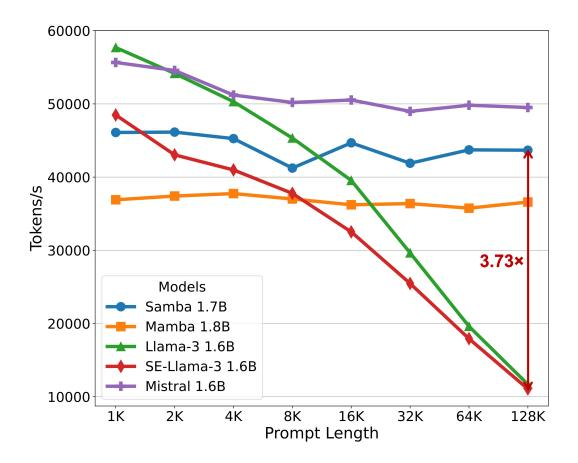
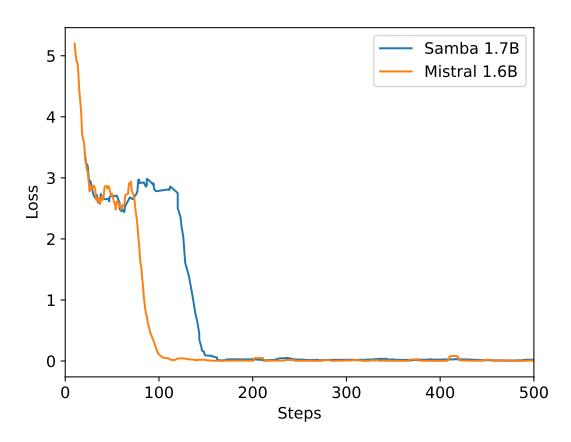
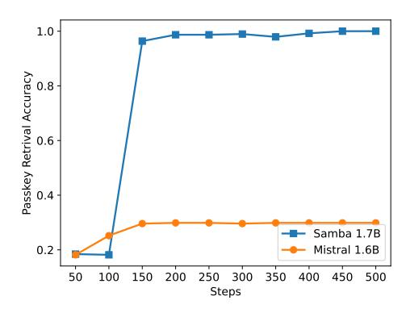

# A RELATED WORKS

Hybrid Recurrent Models Many recent works [\(Park et al.,](#page-15-14) [2024;](#page-15-14) [Jelassi et al.,](#page-14-3) [2024;](#page-14-3) [Akyürek](#page-10-8) [et al.,](#page-10-8) [2024\)](#page-10-8) point out the lack of retrieval ability of linear SSMs, and propose hybridization of SSMs with the Attention mechanism. However, the history of SSM/RNN-Attention hybridization can be directly dated back to the birth of the Attention mechanism [\(Bahdanau et al.,](#page-10-0) [2014\)](#page-10-0) which is proposed as a soft feature alignment technique for recurrent models to cope better with long sequences. The revitalization of the fact that linear recurrent models are sequentially parallelizable [\(Martin & Cundy,](#page-14-12) [2018;](#page-14-12) [Gu et al.,](#page-13-0) [2021\)](#page-13-0) has catalyzed a contemporary renaissance in hybrid recurrent architectures. SPADE [\(Zuo et al.,](#page-17-1) [2022\)](#page-17-1), GSS [\(Mehta et al.,](#page-14-13) [2023\)](#page-14-13), MEGA [\(Ma et al.,](#page-14-1) [2023\)](#page-14-1), Block State transformers [\(Fathi et al.,](#page-13-9) [2023\)](#page-13-9) and Megalodon [\(Ma et al.,](#page-14-14) [2024\)](#page-14-14) combine SSMs with chunked attention, while H3 [\(Dao et al.,](#page-11-10) [2022b\)](#page-11-10), Mambaformer [\(Park et al.,](#page-15-14) [2024\)](#page-15-14) and Jamba [\(Lieber et al.,](#page-14-11) [2024;](#page-14-11) [Team et al.,](#page-16-7) [2024\)](#page-16-7) propose to hybridize with quadratic self-attention. Our works focus particularly on the wall-time efficiency and the length extrapolatability of the hybrid SSM-Attention models, and propose to interleave SSMs with Sliding Window Attention (SWA), which has both linear computation complexity and the translation-invariant property over the sequence length. Infini-Attention [\(Munkhdalai et al.,](#page-15-15) [2024\)](#page-15-15) is a recently proposed method that implements an intra-layer hybridization [\(Wu et al.,](#page-17-13) [2022\)](#page-17-13) between SWA and Linear Attention with the delta rule [\(Schlag et al.,](#page-15-16) [2021\)](#page-15-16). While the preliminary results look promising, its performance in the setting of large-scale pre-training from scratch remains questionable. The most similar work to ours is Griffin [\(De et al.,](#page-12-2) [2024\)](#page-12-2), which interleaves the Real-Gated Linear Recurrent Unit (RG-LRU) with Sliding Window Attention (SWA). However, Samba hybridizes SWA with Mamba instead of RG-LRU and shows that this simple hybrid architecture can provide substantially better performance over state-of-the-art Transformer architectures across scales, while Griffin and its follow-up work RecurrentGemma [\(Botev et al.,](#page-10-9) [2024\)](#page-10-9) only show comparable or worse results than Transformers. The original Mamba paper [\(Gu & Dao,](#page-13-2) [2023\)](#page-13-2) also explores hybridizing pure Mamba models with full attention or MLP layers, but it does not consider the wall-time efficiency of these hybridization and only achieves marginally better performance than the pure Mamba model. In contrast, we are the first to show that interleaving Mamba with both SWA and MLP can substantially outperform modern Transformers (and Mamba) at a scale up to 3.8B parameters, while achieving comparable training speed and better length extrapolation ability under the perplexity metrics.

Efficient Sparse Attention Previous works have proposed sparsifying self-attention [\(Vaswani et al.,](#page-16-0) [2017\)](#page-16-0) with a static attention pattern [\(Child et al.,](#page-11-11) [2019;](#page-11-11) [Zaheer et al.,](#page-17-14) [2020;](#page-17-14) [Beltagy et al.,](#page-10-3) [2020\)](#page-10-3) or a dynamic learnable pattern [\(Roy et al.,](#page-15-17) [2020;](#page-15-17) [Kitaev et al.,](#page-14-15) [2020;](#page-14-15) [Ren et al.,](#page-15-2) [2023\)](#page-15-2) to model long sequences with subquadratic complexity over the sequence length. However, due to the lack of hardware-aware efficient implementation, its actual wall-time training efficiency is often worse than the dense attention optimized with FlashAttention [\(Dao et al.,](#page-11-2) [2022a;](#page-11-2) [Dao,](#page-11-5) [2023;](#page-11-5) [Shah et al.,](#page-16-8) [2024\)](#page-16-8). In this work, we choose Sliding Window Attention, a simple static sparse attention pattern, because it can easily leverage the highly optimized FlashAttention kernels to enjoy an actual training speed-up over its dense self-attention counterpart.

Length Extrapolation Many previous works have focused on extending the context length of pretrained Transformers to improve their performance on long-context tasks. Methods such as LM-Infinite [\(Han et al.,](#page-13-4) [2023\)](#page-13-4), StreamingLLM [\(Xiao et al.,](#page-17-15) [2024\)](#page-17-15), and LongLoRA [\(Chen et al.,](#page-11-12) [2023b\)](#page-11-12) achieve linear complexity for length extrapolation, but they can only stabilize perplexity beyond the training sequence length rather than significantly improve it. In contrast, we demonstrate that pretraining Transformers with Sliding Window Attention from scratch enables natural improvements in perplexity beyond the training sequence length. Other approaches, including LLaMA-2-Long [\(Xiong](#page-17-16) [et al.,](#page-17-16) [2023\)](#page-17-16), LongLLaMA [\(Tworkowski et al.,](#page-16-9) [2023\)](#page-16-9), PI [\(Chen et al.,](#page-11-9) [2023a\)](#page-11-9), LongRoPE [\(Ding](#page-12-3) [et al.,](#page-12-3) [2024\)](#page-12-3) and Self-Extend [\(Jin et al.,](#page-14-2) [2024\)](#page-14-2), attempt to extend the full attention through modifying position embedding or continual training strategies, but they typically retain quadratic complexity in the attention mechanism with additional computation or memory I/O overhead, therefore they do not scale well to very long sequences. Although these methods achieve an improved perplexity on a sequence length that is multiple times longer than the training sequence length, their perplexity still explodes if the sequence is extremely long. Our method achieves both linear complexity and superior extrapolation performance compared to zero-shot length extrapolation methods, such as Self-Extend, under the perplexity metric. However, we acknowledge that, in terms of zero-shot

retrieval performance, our method still lags behind these approaches. This underscores a trade-off between perplexity and retrieval performance in length extrapolation, which we plan to explore and address in future work.

## B ADDITIONAL EVALUATION RESULTS

In Table [7,](#page-19-1) we conduct comprehensive evaluations on a diverse subset of benchmarks to assess SAMBA 3.8B base model's performance across all the domains mentioned in Section [3](#page-3-1) to ensure a thorough examination of the model's capabilities. We also report the performance of the Transformer++ (TFM++) model, which uses the same architecture, pre-training recipe as Phi3-mini, for a fair comparison. The details of the generation configurations are included in Appendix [G.](#page-23-1) We compare with several strong baselines, including Llama 2 [\(Touvron et al.,](#page-16-10) [2023\)](#page-16-10), Mistral [\(Jiang et al.,](#page-14-5) [2023\)](#page-14-5), Mamba [\(Gu & Dao,](#page-13-2) [2023\)](#page-13-2), Gemma [\(Team,](#page-16-11) [2024\)](#page-16-11), Recurrent-Gemma (R-Gemma) [\(Botev](#page-10-9) [et al.,](#page-10-9) [2024\)](#page-10-9), Llama 3 [\(MetaAI,](#page-14-4) [2024\)](#page-14-4) and TFM++. As shown in Table [7,](#page-19-1) SAMBA achieves the highest average score on all benchmarks, demonstrating its superior performance in handling various language comprehension tasks. Notably, SAMBA excels in the GSM8K benchmark, achieving an absolute 18.1% higher accuracy than TFM++ trained on the same dataset. This shows the surprising complementary effect of combining SSM with the attention mechanism. We conjecture that when combined with attention, Mamba, as an input-dependent SSM, can focus more on performing the arithmetic operation through its recurrent states than on doing the retrieval operation which can be easily learned by the sliding window attention.

Table 7: Downstream performance comparison of the SAMBA 3.8B base model with other pretrained base language models without instruction tuning. ARC-C and HellaSwag are measured with characternormalized accuracy. MMLU and GSM8K are measured in 5-shot, while others are in zero-shot. We report the MC2 score for TruthfulQA, maj@1 for GSM8K, and pass@1 for HumanEval. ∗ Measured by ours. The fair comparison should only be considered between TFM++ and Samba.

| Model   | Size | Tokens | MMLU | Hella- Swag | ARC- C | Wino- Gran. | Truth. QA | GSM 8K | Hum. Eval | Avg. |
|---------|------|--------|------|----------------|-----------|----------------|--------------|-----------|--------------|------|
| Llama 2 | 6.7B | 2T     | 45.3 | 77.2           | 45.9      | 69.2           | 38.8         | 14.6      | 12.8         | 43.4 |
|         | 13B  | 2T     | 54.8 | 80.7           | 49.4      | 72.8           | 37.4         | 28.7      | 18.3         | 48.9 |
| Mistral | 7.2B | -      | 60.1 | 81.3           | 55.5      | 75.3           | 42.2         | 35.4      | 30.5         | 53.6 |
| Mamba   | 2.8B | 600B   | 26.2 | 71.0           | 41.7      | 65.9           | 34.4∗        | 3.6∗      | 7.3∗         | 35.7 |
| Gemma   | 2.5B | 3T     | 42.3 | 71.4           | 42.1      | 65.4           | 33.1         | 17.7      | 22.0         | 42.0 |
|         | 8.5B | 6T     | 64.3 | 81.2           | 53.2      | 72.3           | 44.8         | 46.4      | 32.3         | 56.4 |
| R-Gemma | 2.7B | 2T     | 38.4 | 71.0           | 42.3      | 67.8           | 35.1         | 13.4      | 21.3         | 41.3 |
| Llama 3 | 8.0B | 15T+   | 66.6 | 79.2∗          | 53.2∗     | 72.6∗          | 43.9         | 45.8      | 28.7∗        | 55.8 |
| TFM++   | 3.8B | 3.2T   | 67.2 | 76.6           | 53.8      | 72.6           | 47.3         | 51.5      | 51.8         | 60.1 |
| SAMBA   | 3.8B | 3.2T   | 71.2 | 77.4           | 55.7      | 77.1           | 43.4         | 69.6      | 54.9         | 64.2 |

As shown in Table [8,](#page-20-2) we can see that post-trained hybrid models can achieve superior performance compared to industry-standard Transformer-based LLMs such as Llama-3.1-Instruct 8B and Llama-3.2-Instruct 3B, and SSM-based LLMs such as FalconMamba[2](#page-21-3) . Recent progress on hybrid LLMs, including Jamba 1.5 [\(Team et al.,](#page-16-7) [2024\)](#page-16-7) and our own work on SAMBA, shows significant improvement over earlier approaches like R-Gemma [\(Botev et al.,](#page-10-9) [2024\)](#page-10-9), which hybridizes attention with linear recurrent models but is trained on smaller data scales. SAMBA delivers comparable performance to Jamba-1.5-Mini while using around 3× fewer active parameters and 13× fewer total parameters, due to an advanced text-book data synthesis technique [\(Abdin et al.,](#page-10-6) [2024\)](#page-10-6). Additionally, SAMBA outperforms the Phi3 architecture, which is trained on the same data and optimization setting, further highlighting the superiority of our hybrid architecture over modern Transformer models.

Table 8: Post-trained models quality on representative benchmarks under the chat mode. The fair comparison should only be considered between SAMBA and Phi3 as we control the training recipes and datasets to be the same. Best results are in bold, second best underlined.

| Category  | Benchmark                 | SAMBA (June) 3.8B | Phi3 (June) 3.8B | R-Gemma 9B | FalconMamba 7B | Jamba-1.5-Mini 12B/52B | Llama-3.2-In 3B | Llama-3.1-In 8B |
|-----------|---------------------------|----------------------|---------------------|---------------|-------------------|---------------------------|--------------------|--------------------|
| MMLU      | MMLU (5-shot)          | 69.0                 | 67.2                | 60.5          | 62.1              | 69.7                      | 61.8               | 68.1               |
|           | MMLU-Pro (0-shot, CoT) | 47.9                 | 46.5                | 17.8          | 14.5              | 42.5                      | 39.2               | 44                 |
| Reasoning | ARC-C (10-shot)        | 87.8                 | 86.8                | 52.0          | 62.0              | 85.7                      | 76.1               | 83.1               |
|           | GPQA (0-shot, CoT)     | 29.5                 | 29.0                | 4.7           | 8.1               | 32.3                      | 26.6               | 26.3               |
| Math      | GSM8K (8-shot, CoT)    | 86.4                 | 84.8                | 42.6          | 52.5              | 75.8                      | 75.6               | 77.4               |
| Code      | HumanEval (0-shot)     | 70.1                 | 66.5                | 31.1          | -                 | 62.8                      | 62.8               | 66.5               |
|           | MBPP (3-shot)          | 71.7                 | 70.0                | 42.0          | -                 | 75.8                      | 67.2               | 69.4               |
|           | Average                   | 66.1                 | 64.4                | 35.8          | -                 | 63.5                      | 58.5               | 62.1               |

Figure 6: Prompt processing throughput of different models with around 1.7B parameters.

Figure 7: Training loss curves of Samba 1.7B and Mistral 1.6B models during 500 steps of instruction tuning on Passkey Retrieval with 4K sequence length. We plot the loss curves for both models using the simple moving average of window size 10.

Figure 8: Overall passkey retrieval accuracy on the 256K document length of Samba 1.7B and Mistral 1.6B models during 500 steps of instruction tuning.

#### C ADDITIONAL EXPERIMENT DETAILS

We perform instruction tuning for both Mistral 1.6B and Samba 1.7B on Passkey Retrieval using document length 4096, where we generated the data on the fly through randomly sampling a 5-digit integer passkey value and a location/depth between zero and the document length to insert the passkey. The model is then asked to generate the passkey given the full document. We train both models using batch size 2048, 250 warm-up steps with a peak learning rate of  $1e^{-4}$ , and 0.1 weight decay with AdamW (Loshchilov & Hutter, 2018) optimizer. In both cases, the loss converges quickly in 100-200 steps. During the evaluation, we measure the overall average accuracies of the passkey retrieval at the document length of [4k, 8k, 16k, 32k, 64k, 128k, 256k], for each length we evaluate at 11 different depths of the document (from 0, 0.1, 0.2, ... to 1.0). In addition, for each location of the passkey (depth) in the document, we evaluate the model with five different passkeys to measure accuracy. As seen in Figure 8, the average passkey retrieval accuracy for Samba 1.7B almost reaches 100% in around 150 steps, while the accuracy for Mistral 1.6B remains low, demonstrating the extrapolation ability of the Samba architecture.

#### D ADDITIONAL ANALYSES

How to train models with Sliding Window Attention (SWA)? Since SWA has linear complexity with respect to the sequence length, it seems alluring to trade off the batch size to have a longer training sequence length without substantially decreasing the training throughput. However, as shown in Table 9, when the sequence length is increased, the validation perplexity also increases in all context lengths due to smaller batch sizes (Varis & Bojar, 2021), and the optimal ratio of sequence length/window size observed is 2, resulting in a training length of 4096.

Table 9: Perplexity on SlimPajama of Llama-2-SWA 438M models trained on different context sizes and batch sizes. We fix the sliding window size as 2048 and the training tokens per step as 2M.

| Batch Size | Sequence Length       | Training Speed                   | Val   | Validation Context Length |        |        |  |  |
|------------|-----------------------|----------------------------------|-------|---------------------------|--------|--------|--|--|
| Datch Size |                       | $(\times 10^5 \text{ tokens/s})$ | 2048  | 4096                      | 8192   | 16384  |  |  |
| 1024       | 2048 (Full Attention) | 10.4                             | 11.59 | 38.12                     | 156.18 | 357.32 |  |  |
| 512        | 4096                  | 9.88                             | 11.87 | 11.16                     | 10.69  | 10.61  |  |  |
| 256        | 8192                  | 9.66                             | 11.98 | 11.26                     | 10.79  | 10.69  |  |  |
| 128        | 16384                 | 9.48                             | 12.37 | 11.63                     | 11.12  | 11.02  |  |  |
| 64         | 32768                 | 9.29                             | 12.94 | 12.46                     | 11.96  | 11.86  |  |  |

&lt;sup>2https://huggingface.co/tiiuae/falcon-mamba-7b-instruct

Table 10: Perplexity on the SlimPajama validation set of different linear recurrent and sliding window attention models with Short Convolution (SC) modules added separately to query, key and value representations. For hybrid models, SC is applied only to linear attention layers. The training speed is measured on  $8 \times A100$  GPUs.

| Architecture        | Size | Training Speed $(\times 10^5 \text{ tokens/s})$ | Valida 4096 | tion Cont 8192 | ext Length 16384 |
|---------------------|------|-------------------------------------------------|----------------|-------------------|---------------------|
| Llama-2-SWA         | 438M | 4.96                                            | 11.12          | 10.66             | 10.57               |
| + SC                | 438M | 4.69                                            | 10.83          | 10.39             | 10.31               |
| Sliding GLA         | 438M | 4.94                                            | 10.43          | 10.00             | 9.92                |
| + SC                | 438M | 4.44                                            | 10.39          | 9.96              | 9.87                |
| Sliding RetNet + SC | 446M | 4.32                                            | 10.38          | 9.96              | 9.87                |
|                     | 446M | 3.80                                            | 10.25          | 9.82              | 9.74                |

Fair comparison between Mamba and other linear recurrent models? We can notice that the Short Convolution (SC) operator in Equation (1) is independent to the design of other parts of Mamba and can be applied to other linear recurrent models. As shown in Table 10, we explore the effect of SC on model performance through enhancing Llama-2-SWA, Sliding GLA, and Sliding RetNet with SC. Surprisingly, besides boosting the performance of RetNet, adding SC can also significantly improve the SWA's performance, while the effect on GLA is less prominent. We think this is because GLA already has the fine-grained decays at the channel level, so the depthwise convolution doesn't add much of the useful inductive bias for better modeling power. Notably, even with the SC enhancer, Sliding GLA and Sliding RetNet still fall short than the original Samba 421M's performance shown in Table 3. This further justifies our choice of using Mamba for hybridization. We also find that adding SC to both the SWA and the linear attention layers in hybrid models produces negative results, and we leave it as a future work to understand the surprising effectiveness of SC in language modeling.

#### E DETAILS OF ENTROPY MEASUREMENT

Given a causal attention probability matrix  $A \in \mathbb{R}^{h \times n \times n}$ ,  $A_{ijk} = 0 \ \forall j < k$ , with h number of heads and a sequence length of n, and the generation length 0 < l < n, we calculate the average attention entropy per decoding step as follows,

$$\mathcal{H}_{a} = -\frac{1}{l \cdot h} \sum_{i=1}^{h} \sum_{j=n-l+1}^{n} \sum_{k=1}^{n} A_{ijk} \log(A_{ijk}).$$

For the selective gate  $\Delta \in \mathbb{R}^{n \times d_e}$  used by S6 in Equation (2) of the Mamba layers, we first normalize it to be in the simplex  $[0,1]^{n \times d_e}$ , *i.e.*,

$$\Delta' = \frac{\Delta}{\sum_{i=1}^{n} \Delta_i} \in [0, 1]^{n \times d_e}.$$

The average selection entropy of S6 throughout the entire sequence is then calculated as

$$\mathcal{H}_s = -\frac{1}{d_e} \sum_{j=1}^{d_e} \sum_{i=1}^n \Delta'_{ij} \log(\Delta'_{ij}).$$

#### F DETAILS OF DOWNSTREAM LONG-CONTEXT EVALUATION

We use the GovReport (Huang et al., 2021) and the SQuALITY (Wang et al., 2022) datasets from the ZeroSCROLLS (Shaham et al., 2023) benchmark to evaluate models' long-context summarization capability in the real world. After tokenizing with the *Phi3-mini-4k* tokenizer, the average document length for the GovReport dataset is 11,533 tokens, with a median of 10,332, a minimum of 1,493, and a maximum of 40,592 tokens. For the SQuALITY dataset, the average sequence length is 7,974 tokens, with a median of 8,145, a minimum of 5,457, and a maximum of 10,757 tokens. For evaluation, we use greedy decoding for both tasks. A maximum generation length of 450 tokens is applied for GovReport and 600 for SQuALITY.

#### G IMPLEMENTATION DETAILS

Table 11: Detailed hyper-parameters of the baselines models trained on the Phi2 dataset with 230B tokens.

| Architecture                 | Llama-3 | Mistral | Mamba  | Mamba-SWA-MLP | Mamba-MLP |
|------------------------------|---------|---------|--------|---------------|-----------|
| Parameters                   | 1.6B    | 1.6B    | 1.8B   | 1.6B          | 1.9B      |
| Batch size                   | 2048    | 2048    | 2048   | 2048          | 2048      |
| Learning rate                | 0.0006  | 0.0006  | 0.0006 | 0.0006        | 0.0006    |
| Weight decay                 | 0.1     | 0.1     | 0.1    | 0.1           | 0.1       |
| Gradient clipping            | 1.0     | 1.0     | 1.0    | 1.0           | 1.0       |
| Sequence length              | 4096    | 4096    | 4096   | 4096          | 4096      |
| Sliding window size, w       | -       | 2048    | -      | 2048          | -         |
| Number of layers, $N$        | 48      | 48      | 64     | 54            | 48        |
| Model width, $d_m$           | 2048    | 2048    | 2048   | 2048          | 2048      |
| MLP intermediate size, $d_p$ | 8196    | 8196    | -      | 8196          | 8196      |
| Number of query heads        | 32      | 32      | -      | 32            | 32        |
| Number of KV heads           | 4       | 4       | -      | 4             | 4         |
| Number of Attention Layers   | 24      | 24      | 0      | 18            | 0         |
| Number of Mamba Layers       | 0       | 0       | 64     | 18            | 24        |
| Vocabulary size              | 50304   | 50304   | 50304  | 50304         | 50304     |

For the GLA layer in the Sliding GLA architecture, we use the number of heads  $d_m/384$ , a key expansion ratio of 0.5, and a value expansion ratio of 1. For the RetNet layer we use a number of head that is half of the number of attention query heads, key expansion ratio of 1 and value expansion ratio of 2. The GLA and RetNet implementations are from the Flash Linear Attention (Yang & Zhang, 2024) repository3. We use the FlashAttention-based implementation for Self-Extend extrapolation4. The Mamba 432M model has a model width of 1024 and the Mamba 1.3B model has a model width of 2048. All models trained on SlimPajama have the same training configurations and the MLP intermediate size as Samba, unless otherwise specified. The training infrastructure on SlimPajama is based on a modified version of the TinyLlama codebase5.

Table 12: Detailed hyper-parameters of the SAMBA models trained at different scales. We only show the optimization settings for the first training phase of the 3.8B model.

| Total Parameters             | 421M       | 1.3B       | 1.7B   | 3.8B   |
|------------------------------|------------|------------|--------|--------|
| Dataset                      | SlimPajama | SlimPajama | Phi-2  | Phi-3  |
| Batch size                   | 512        | 512        | 2048   | 2048   |
| Learning rate                | 0.0004     | 0.0004     | 0.0006 | 0.0006 |
| Total training tokens        | 20B        | 100B       | 230B   | 3.2T   |
| Weight decay                 | 0.1        | 0.1        | 0.1    | 0.1    |
| Gradient clipping            | 1.0        | 1.0        | 1.0    | 1.0    |
| Sequence length              | 4096       | 4096       | 4096   | 4096   |
| Sliding window size, w       | 2048       | 2048       | 2048   | 2048   |
| Number of layers, $N$        | 24         | 36         | 48     | 64     |
| Model width, $d_m$           | 1536       | 2304       | 2048   | 2816   |
| MLP intermediate size, $d_p$ | 4096       | 6144       | 8196   | 9984   |
| Number of query heads        | 12         | 18         | 32     | 11     |
| Number of key-value heads    | 12         | 18         | 4      | 1      |
| Vocabulary size              | 32000      | 32000      | 50304  | 32064  |

In the generation configurations for the downstream tasks, we use greedy decoding for GSM8K, and Nucleus Sampling (Holtzman et al., 2019) with a temperature of  $\tau=0.2$  and top-p=0.95 for HumanEval. For MBPP and SQuAD, we set  $\tau=0.01$  and top-p=0.95.

3https://github.com/sustcsonglin/flash-linear-attention

&lt;sup>4https://github.com/datamllab/LongLM/blob/master/self\_extend\_patch/Llama.py

5https://github.com/jzhang38/TinyLlama

