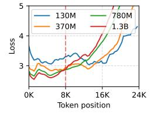
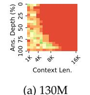
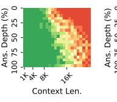
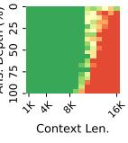
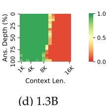
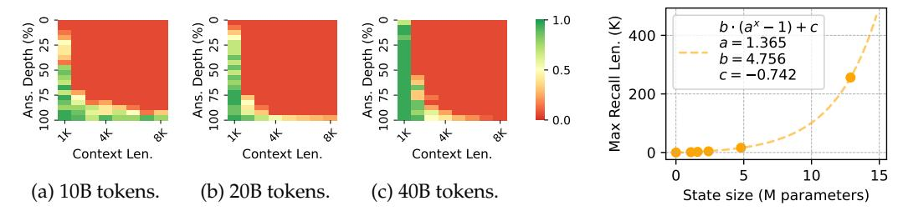
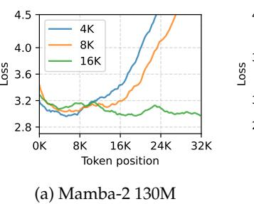
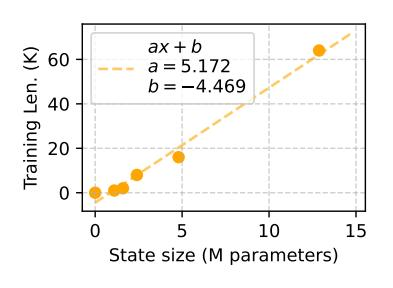

# **Abstract**

Recent advancements in recurrent architectures, such as Mamba and RWKV, have showcased strong language capabilities. Unlike transformer-based models, these architectures encode all contextual information into a fixedsize state, leading to great inference efficiency. However, this approach can cause information interference, where different token data conflicts, resulting in performance degradation and incoherent outputs beyond a certain context length. To prevent this, most RNNs incorporate mechanisms designed to "forget" earlier tokens. In this paper, we reveal that Mambabased models struggle to effectively forget earlier tokens even with built-in forgetting mechanisms. We demonstrate that this issue stems from training on contexts that are too short for the state size, enabling the model to perform well without needing to learn how to forget. Then, we show that the minimum training length required for the model to learn forgetting scales linearly with the state size, and the maximum context length for accurate retrieval of a 5-digit passkey scales exponentially with the state size, indicating that the model retains some information beyond the point where forgetting begins. These findings highlight a critical limitation in current RNN architectures and provide valuable insights for improving long-context modeling. Our work suggests that future RNN designs must account for the interplay between state size, training length, and forgetting mechanisms to achieve robust performance in long-context tasks.

### **1 Introduction**

Transformer-based large language models (LLMs) [\(Achiam et al.,](#page-9-0) [2023;](#page-9-0) [Dubey et al.,](#page-9-1) [2024\)](#page-9-1) have shown impressive capabilities in processing very long sequences [\(Gemini Team et al.,](#page-10-0) [2024;](#page-10-0) [MiniMax et al.,](#page-10-1) [2025\)](#page-10-1). However, these models incorporate self-attention [\(Vaswani et al.,](#page-11-0) [2017\)](#page-11-0) whose complexity scales quadratically with sequence length, making long-context processing costly. In contrast, recurrent neural networks (RNNs) [\(Bengio et al.,](#page-9-2) [1994\)](#page-9-2) have a fixed-size contextual memory. Thus, their per-token time and space complexities are constant and they are much more efficient for long sequences. Despite this advantage, their effectiveness in modeling long contexts remains underexplored. Most recent state-of-the-art (SOTA) RNNs, such as Mamba-1 and Mamba-2 [\(Gu & Dao,](#page-10-2) [2023;](#page-10-2) [Dao & Gu,](#page-9-3) [2024\)](#page-9-3), GLA [\(Yang et al.,](#page-11-1) [2024a\)](#page-11-1), and RWKV [\(Peng et al.,](#page-10-3) [2024a\)](#page-10-3) are trained on context lengths below 10K, and existing works have shown that their performance degrades sharply when the context length exceeds the model's training length[1](#page-0-0) [\(Ben-Kish et al.,](#page-9-4) [2024;](#page-9-4) [Zhang et al.,](#page-11-2) [2024a;](#page-11-2) [Waleffe et al.,](#page-11-3) [2024\)](#page-11-3).

In this paper, we analyze the factors that cause the inability of Mamba-based models to handle contexts longer than the training length. By inspecting memory retention strength and modifying the forgetting mechanism, we discover that the performance drop is caused

∗Corresponding Authors.

1Throughout this paper, "training length" refers to the context length used during training.

(b) 370M

(c) 780M

Figure 1: The LM loss of Mamba-2 as a function of token position. The training length is 8K.

Figure 2: The accuracy of Mamba-2 on the passkey retrieval task. "Ans. Depth" refers to the passkey position divided by the context length.

by the *inability to forget earlier tokens*, although Mamba has a built-in forgetting mechanism. Insufficient forgetting leads to interference between multiple token representations, causing faulty memory recall and, ultimately, performance degradation in longer contexts. We provide two lines of evidence for this discovery: (1) The first token's retention strength is very high throughout its training context window. (2) Artificially inducing forgetting via interventions of the state's update rule can mitigate this performance degradation.

We hypothesize that the inability to learn an effective forgetting mechanism is due to **state overparameterization**—where the model's state is excessively large, allowing it to minimize language modeling loss without much forgetting. Two key pieces of evidence support this hypothesis. (1) Initially, the model demonstrates robust forgetting, retaining only the last k tokens and forgetting earlier ones. However, as training progresses, the model's ability to forget diminishes while its recall of contextual information improves, resembling overfitting. This suggests that the model increasingly attempts to retain all available information within the context. (2) We observe that forgetting occurs only when the training context length exceeds the state's capacity to retain all information, forcing the model to forget less relevant details. Notably, larger states require longer training context lengths to effectively learn and implement forgetting.

We next investigate the **minimum training length** required for Mamba-2 to effectively learn forgetting and the **maximum context length** in which the model can recall information. First, by varying model sizes and training lengths, we observe that the training length threshold scales linearly with the state size, confirming that forgetting only occurs when the training length exceeds the model's state capacity. Second, while this threshold represents the point at which the contextual information exceeds the state's capacity, we demonstrate that the model can still recall tokens beyond this context window. Evaluation on passkey retrieval (Mohtashami & Jaggi, 2023)—a simple retrieval task—shows that the maximum context length with perfect retrieval accuracy scales exponentially with state size. Notably, with continued pre-training, Mamba-2 with 370M parameters achieves near-perfect retrieval on a 256K context length, outperforming similarly sized transformer models. These findings suggest that current training lengths for RNN models may be suboptimal and underscore the potential of RNN-based architectures for modeling long-context sequences.

This paper is structured as follows. Section 2 describes the Mamba-2 architecture and provides evaluation results showing its inability to generalize beyond its training length. Section 3 provides arguments for the importance of forgetting and provides evidence showing that the model has failed to learn a robust forgetting mechanism. Section 4 presents a high-level explanation for why Mamba-2 has failed to learn how to forget. Finally, in Section 5, experiments are conducted to verify the claims and provide important conclusions for training long-context recurrent models.

The main findings of this paper can be summarized as follows:

The inability to forget. We discover that Mamba-2, and RWKV-6 (some SOTA RNNs) do not know how to robustly forget earlier information to avoid memory overload. This causes performance degradation for contexts longer than the training length.

**State overparameterization.** We provide overparameterization as a plausible explanation for the inability to forget and provide empirical evidence for this hypothesis.

Minimum training length of forgetting. In alignment with the state overparameterization hypothesis, we empirically discover that for any state size, there exists a training length threshold where the Mamba-2 learns forgetting if and only if the training length is above that threshold. We also find that this relationship is linear.

#### 2 Preliminaries

In this section, we first describe the Mamba-2 architecture and corresponding notations. Then, we evaluate Mamba-2 on language modeling and passkey retrieval with context lengths exceeding their training length to illustrate the consequence of the inability to forget.

Most experiments in this study focus on Mamba-2 (Dao & Gu, 2024) because it has shown strong capabilities on several tasks and has publicly available checkpoints of multiple sizes, allowing us to explore the relationship between state sizes and length limits. Moreover, it is more widely studied than other RNNs, making it easier to use existing works as a reference.

#### 2.1 Mamba-2

The Mamba-2 architecture consists of L layers, each consisting of H heads computed in parallel. The layer's output is the sum of the heads' outputs. Let  $u_t \in \mathbb{R}^d$ ,  $y_t \in \mathbb{R}^P$  denote the input and output vectors of the layer at t time step. The computation at t time step for each head can be formulated as follows:

$$y_t = C_t h_t \in \mathbb{R}^{1 \times P}$$
 (Query rule)

$$h_t = h_{t-1} \underbrace{\alpha_t}_{\text{Decay Insertion}} + \overline{B}_t x_t \in \mathbb{R}^{N \times P}$$
 (Update rule) (2)

where  $C_t \in \mathbb{R}^{P \times N}$ ,  $\overline{B}_t \in \mathbb{R}^{N \times 1}$ ,  $x_t \in \mathbb{R}^{1 \times P}$ ,  $\alpha_t \in \mathbb{R}$  are functions of  $u_t$ , d, N, P are hyperparameters, denoting the hidden dimensionality, state dimension, and head dimension, respectively, and  $h_t$  is the t-th recurrent state. Eq 1 and 2 are called the "query rule" and "update rule" because they determine how memory is queried from the recurrent state, and how the state is updated.

The other variables are parameterized as follows:

$$\overline{B}_t = B_t \Delta_t \in \mathbb{R}^{N \times 1} \tag{3}$$

$$\alpha_t = \exp(-\Delta_t \exp(A)) \in \mathbb{R}$$
 (4)

$$\Delta_t = \text{Softplus}(u_t W_{\Lambda} + b_{\Lambda}) \in \mathbb{R}$$
 (5)

where  $B_t \in \mathbb{R}^{N \times 1}$  is a function of  $u_t$  and  $A, b_\Delta \in \mathbb{R}, W_\Delta \in \mathbb{R}^{d \times 1}$  are trainable model parameters. Appendix A presents more details on the model. Notably, Mamba-2's update rule is similar to many existing RNNs (Peng et al., 2024a; Sun et al., 2023; Yang et al., 2024a). Thus, some conclusions/insights may apply to other architectures. We leave such exhaustive ablation studies for future work.

Importantly,  $h_t$  is the contextual memory representation that stores information from all tokens up to t.  $\alpha_t \in (0,1)$  is the *memory decay* multiplier that controls the strength of forgetting. Past information is completely forgotten when  $\alpha_t \to 0$  and completely retained with  $\alpha_t \to 1$ . In this paper, we refer to  $\alpha_t$  as the **memory retention strength**.

### 2.2 Length Generalization Failure of Mamba-2

**Language Modeling** Figure 1 shows the language modeling loss of Mamba-2 as a function of token position. The result shows that Mamba-2 models suffer great performance degradation when the context length is much longer than their training lengths. Furthermore, we find that larger models have worse length generalization abilities.

**Passkey Retrieval Evaluation** Language modeling may not reflect downstream capabilities, thus, we also evaluate Mamba-2 recall ability on the passkey retrieval task (Mohtashami & Jaggi, 2023; Zhang et al., 2024a). It is a widely-used simple synthetic task where a model is prompted to recall a 5-digit *passkey* from a lengthy context.

The passkey retrieval result is reported in Figure 2. We find that Mamba-2 (except for the smaller 130M checkpoint) has near-perfect retrieval accuracy within 8K tokens, but poor or even zero accuracy on sequences longer than 16K, regardless of model sizes. This behavior is unexpected because the update rule (Eq. 2) has a stable exponential memory decay (it converges to a constant value if the variables are fixed). Therefore, we expect RNNs of such form to have a good retrieval accuracy on the last k tokens, and tokens earlier than that are forgotten. However, when the context is too long, Mamba-2 fails to even recall very recent tokens. This implies that the limitation is not the inability to retain memory about the answer, but the inability to forget irrelevant past tokens.

More experimental details and the results of some other recurrent architectures can be found in Appendix B and D.

### 3 The Inability to Forget

In this section, we argue that Mamba-2's length generalization failure can be attributed to its inability to forget contextual information. We first provide arguments for the importance of forgetting. Then, we present empirical evidence to verify that the model has not learned a robust forgetting mechanism. Furthermore, we show how the inability to forget is manifested in the statistics of the recurrent state.

#### 3.1 The Importance of Forgetting

The fact that the model fails to retrieve tokens at any position when the context length exceeds a certain threshold has one critical implication: the existence of earlier tokens damages the model's ability to recall both earlier and more recent tokens. This is because the model's state  $h_t$  at time step t can be formulated as a weighted sum of past information:

$$h_t = \sum_{i=1}^t \alpha_{i:t} \overline{B}_i x_i, \quad \alpha_{i:t} = \left(\prod_{j=1}^t \alpha_j\right) \in (0,1)$$
 (6)

When we try to retrieve the memory inserted at time step s, we would query the state with  $C_t = \overline{B}_s$ , which returns:

$$y_{t} = C_{t} \sum_{i=1}^{t} \alpha_{i:t} \overline{B}_{i} x_{i} = \alpha_{s:t} (C_{t} \overline{B}_{s}) x_{s} + \underbrace{\sum_{i \neq t} \alpha_{i:t} C_{t} \overline{B}_{i} x_{i}}_{\text{Retrieval error}},$$

$$(7)$$

When all  $\overline{B}_i$  are mutually orthogonal, querying the memory with  $C_t = \overline{B}_s$  returns a scaled version of  $x_s$ . However, as the context length increases,  $B_s$  cannot be mutually orthogonal, in which case multiple memory entries interfere and cause retrieval errors. A small error may not affect the final output because subsequent calculations may tolerate these errors. However, if there are many preceding tokens, then this retrieval error can be too large. To optimize retrieval accuracy, the model needs to produce a small enough decay  $\alpha_t$  to diminish the inference from earlier tokens, which can be viewed as forgetting them.

### 3.2 Evidence for the Inability to Forget

Here, we provide empirical evidence that confirms that Mamba-2 has failed to learn how to forget past information.

#### 3.2.1 Evidence 1: High Retention of the First Token

Based on Eq. 6, we can view  $\alpha_{i:t}$  as the memory strength of the *i*-th token at *t* time step. The retention strengths of earlier tokens are always smaller than those of more recent tokens.

Figure 3: The retention strength of the first token  $(\alpha_{1:t})$  over time. Each curve represents a head.

Figure 4: LM loss of Mamba-2 370M at different positions when inducing forgetting (see Section 3.2.2).

Figure 5: The mean and variance of the first 8 heads in layer 38 of Mamba-2 370M. It exhibits a clear explosion when *t* is greater than the training length.

We find that some heads have a very strong inclination toward retaining all information within the training length. As an example, Figure 3 shows the cumulative decay of the first token in the first eight heads of the 38th layer, and three of the heads have a memory retention strength over  $0.997^2$  at t=8K. Similar observations can be found in other heads and in other layers as well. This implies that the model has not learned to forget information (by producing a smaller  $\alpha_j$ ), but it still has decent language modeling capabilities because the information of 8K tokens is typically not enough to overload the memory.

### 3.2.2 Evidence 2: Inducing Forgetting Can Improve Length Generalization

Here, we demonstrate that artificially inducing more forgetting *without training* can improve performance by reducing past memory interference.

**Reduced Memory Retention and Insertion (RRI)** This method assumes that  $\alpha_t$  and  $B_t$  control the memory retention and insertion strength, respectively. We scale them with a multiplier smaller than 1. The actual multipliers used are 0.9999 for  $\alpha_t$  and 0.75 for  $B_t$ , which is chosen by validation using average loss on pre-training data with 32K context length.

**Sliding Window** We can utilize the fact that the state  $h_t$  can be written as a weighted sum (Eq. 6) to simulate a sliding window mechanism without re-processing from the start of the window at every step. Let  $w \in \mathbb{N}$  denote the window size and  $h_t^{(r)} \in \mathbb{R}^{N \times P}$  denote the hidden state when applying the model on the last w tokens at time step t. We can then compute  $h_t^{(r)}$  exactly as the difference between two states:

$$h_t^{(r)} = \sum_{i=t-r+1}^t \alpha_{i:t} \overline{B}_i x_i = \sum_{i=1}^t \alpha_{i:t} \overline{B}_i x_i - \alpha_{t-r+1:t} \sum_{i=1}^{t-r} \alpha_{i:t-r} \overline{B}_i x_i = h_t - \alpha_{t-r+1:t} h_{t-r}$$
(8)

During streaming generation, we only have to maintain  $(h_{t-1}, h_{t-r}, \alpha_{t-r+1:t})^3$ , and advance each of them in parallel. However, directly computing  $\alpha_{t:t-r}$  may suffer from instability due to floating-point imprecision. Therefore, we maintain  $\Delta_{t-r:t} = \sum_{i=t-r}^t \Delta_t$  instead, and recompute  $\alpha_{t-r:t} = \exp\left(-\Delta_{t-r:t} \exp(A)\right)$  at every step, which incurs minimal computational cost. This method can be applied to all RNNs that can be written as a weighted sum.

**Result** From Figure 4, one can see that the original model has the worst length generalization abilities. LongMamba (a length extrapolation method) (Zhang, 2023) and our methods for inducing forgetting can alleviate this generalization failure, although LongMamba and RRI compromise short-context performance due to weaker memory insertion. This further confirms the fact that memory over-retention is the culprit of this degradation.

&lt;sup>2This is a cumulative product, so the decay at each time step is even closer to 1.

&lt;sup>3We also have to cache the last r token IDs, but their size is negligible compared to  $h_{t-1}$  and  $h_{t-r}$ 

Figure 6: The distribution of the channels in an exploding state (head 2 in layer 38) at two different time steps.

sents a head.

(a)  $\Delta_t$  over time. (b)  $B_t$  over time. (c)  $x_t$  over time. Each curve repre-Each curve repre- Each curve repre- sents a head. sents a channel.

Figure 7: The value of various components in the update rule ( $\Delta_t$ ,  $B_t$ , and  $x_t$ ) on some heads with large retention values in the 38th layer in Mamba-2 370M. The red dotted line indicates the training length.

#### The Manifestation of Over-Retention

We also examine how the inability to forget is manifested in the state's values. Since the recurrent state's dimensionality does not change over time, the sharp change of behavior during length generalization must be a result of a change in the state's distribution. For reproducibility and better visualization, we use the "newlines" prompt (string with only "\n") and inspect the statistics of the recurrent states of every head in Mamba-2 370M4 and find that the mean and variance of some heads change sharply when the context length exceeds the training length. One example is shown in Figure 5. Appendix G reports the statistics of every layer. The state at t = 20K of one head with exploding variance is shown in Figure 6. From it, we discover that this variance explosion can be largely attributed to a few outlier channels while most channels are relatively stable.

## **State Overparameterization**

Here, we present a high-level explanation for why Mamba-2 over-retains memories: state overparameterization. The state is excessively large for the training length, allowing the model to achieve strong language modeling performance without learning how to forget when the state is overloaded with memories.

To support this hypothesis, we present two pieces of evidence: (1) Mamba-2 starts with the ability to forget, but slowly loses this ability as the amount of training data increases, which coincides with behaviors of overfitting, and (2) for any state size, there is a training context length threshold  $T_{\text{forget}}$  such that Mamba-2 learns to forget if and only if  $T_{\text{train}} > T_{\text{forget}}$ , where  $T_{\text{train}}$  denotes the training context length.

#### 4.1 Evidence 1: More Training ⇒ Less Forgetting

We pre-train Mamba-2 370M from scratch with  $T_{\text{train}} = 512$  using the RedPajama (Computer, 2023) corpus and evaluate the intermediate checkpoints on passkey retrieval, as reported in Figure 8. It shows that the model's retrieval accuracy for contexts longer than the training length slowly decreases as we increase the amount of training data. Meanwhile, the model's accuracy for contexts shorter than the training length increases. This indicates that the model converges toward more retention and less forgetting. Since language modeling loss is only computed for tokens within the training length, this behavior is induced by minimizing loss. This reduced forgetting leads to conflicts between token representations, impairing memory recall accuracy when an excessive number of tokens are inserted.

&lt;sup>4Similar observation can be found with any model size.

Figure 8: Passkey retrieval results of intermediate checkpoints during the pre-training of Mamba-2 370M on 512 sequence length. Generalization failure only occurs in the model beyond a certain amount of training data.

Figure 9: The maximum context length of accurate passkey retrieval (i.e., *T*recall in Section 4.3) as a function of state size.

This behavior can be viewed as a kind of overfitting because the state's distribution with short contexts is not varied enough for the model to generalize to the distribution in longer contexts. In other words, the state has too many parameters for the given training length.

#### 4.2 Evidence 2: Forgetting is Learned ⇔ Sufficient Training Length

We empirically confirm that larger recurrent states require longer training contexts for the model to learn to forget. This is because the model will only learn to forget when the amount of contextual information exceeds the state capacity. This hypothesis implies the following law:

Let  $N_S$  and  $T_{\text{train}}$  denote the recurrent state size and training length, respectively, there exists a threshold  $T_{\text{forget}}(N_S)$  such that the model learns to forget if and only if  $T_{\text{train}} > T_{\text{forget}}$ .

We empirically validate this by sweeping different training lengths for different state sizes, and checking whether the model has successfully learned how to forget. Concretely, we train multiple Mamba-2 with different state sizes and training lengths to find the relationship between  $T_{\rm forget}$  and  $N_S$ . To determine whether the model has learned robust forgetting, we feed prompts with 1M tokens to the model and check if the model's loss exceeds  $2\times$  the maximum loss within  $T_{\rm train}$  tokens at any point. The loss is averaged over 128 prompts. The result is reported in Section 5.1.

#### 4.3 Maximum Recall Context Length

The fact that the amount of information in  $T_{\rm forget}$  tokens exceeds the state's capacity, does not necessarily imply that the model fails to recall information beyond the last  $T_{\rm forget}$  tokens, especially when there is a clear distinction between the target information and other contextual information. Therefore, we also search for the maximum context length from which the model can accurately perform passkey retrieval. We refer to this context length as the model's *maximum recall context length*, denoted with  $T_{\rm recall}$ . Similar to the previous section, we train with different lengths for different state sizes and identify the maximum context length where the model has an accuracy over 95% as  $T_{\rm recall}$ . In this task, the noisy context is repetitive, thus, the amount of contextual information is largely independent of the context length. Therefore, ideally, the recall threshold should grow roughly exponentially with the state size.5

&lt;sup>5If we train Mamba-2 on passkey retrieval data, the model can theoretically handle infinitely long contexts. Here, the model is only trained with the next token prediction objective, which means the model will *not* ignore the irrelevant context, and the ability to retain information for extended time emerges from language modeling.

Figure 10: LM loss at each token position for different training lengths. Evaluated on RedPajama.

Figure 11: Minimum training length at which the model learns robust forgetting (i.e., *T*forget in Section [4.2\)](#page-6-3).

