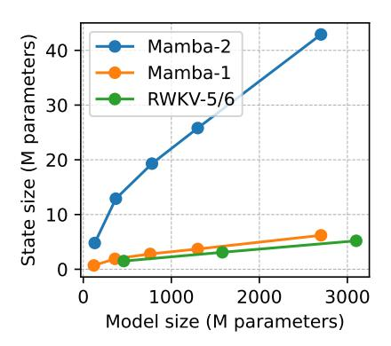
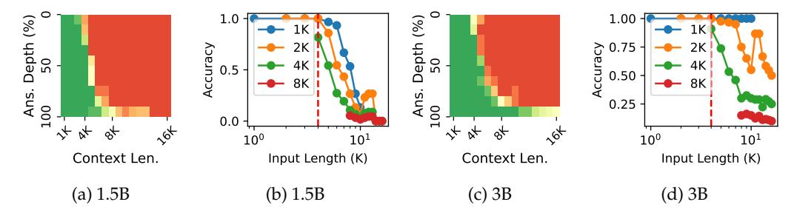

# **References**

- <span id="page-9-0"></span>Josh Achiam, Steven Adler, Sandhini Agarwal, Lama Ahmad, Ilge Akkaya, Florencia Leoni Aleman, Diogo Almeida, Janko Altenschmidt, Sam Altman, Shyamal Anadkat, et al. GPT-4 technical report. *arXiv preprint arXiv:2303.08774*, 2023.
- <span id="page-9-11"></span>Simran Arora, Sabri Eyuboglu, Aman Timalsina, Isys Johnson, Michael Poli, James Zou, Atri Rudra, and Christopher Re. Zoology: Measuring and improving recall in efficient ´ language models. In *The Twelfth International Conference on Learning Representations*, 2024a.
- <span id="page-9-7"></span>Simran Arora, Sabri Eyuboglu, Michael Zhang, Aman Timalsina, Silas Alberti, Dylan Zinsley, James Zou, Atri Rudra, and Christopher Re. Simple linear attention language models balance the recall-throughput tradeoff. In *Workshop on Efficient Systems for Foundation Models II @ ICML2024*, 2024b.
- <span id="page-9-8"></span>Maximilian Beck, Korbinian Poppel, Markus Spanring, Andreas Auer, Oleksandra Prud- ¨ nikova, Michael Kopp, Gunter Klambauer, Johannes Brandstetter, and Sepp Hochreiter. ¨ xLSTM: Extended long short-term memory. In Amir Globersons, Lester Mackey, Danielle Belgrave, Angela Fan, Ulrich Paquet, Jakub M. Tomczak, and Cheng Zhang (eds.), *The Thirty-eighth Annual Conference on Neural Information Processing Systems*, 2024.
- <span id="page-9-9"></span>Ali Behrouz, Peilin Zhong, and Vahab Mirrokni. Titans: Learning to memorize at test time, 2024.
- <span id="page-9-4"></span>Assaf Ben-Kish, Itamar Zimerman, Shady Abu-Hussein, Nadav Cohen, Amir Globerson, Lior Wolf, and Raja Giryes. DeciMamba: Exploring the Length Extrapolation Potential of Mamba, 2024.
- <span id="page-9-2"></span>Yoshua Bengio, Patrice Simard, and Palo Frasconi. Learning long-term dependencies with gradient descent is difficult. *IEEE transactions on neural networks*, 5(2):157–166, 1994.
- <span id="page-9-13"></span>Jacob Buckman and Carles Gelada. Compute-optimal Context Size, 2024.
- <span id="page-9-5"></span>Together Computer. RedPajama: an open dataset for training large language models, 2023. URL <https://github.com/togethercomputer/RedPajama-Data>.
- <span id="page-9-3"></span>Tri Dao and Albert Gu. Transformers are SSMs: Generalized models and efficient algorithms through structured state space duality. *arXiv preprint arXiv:2405.21060*, 2024.
- <span id="page-9-6"></span>Soham De, Samuel L. Smith, Anushan Fernando, Aleksandar Botev, George-Cristian Muraru, Albert Gu, Ruba Haroun, Leonard Berrada, Yutian Chen, Srivatsan Srinivasan, Guillaume Desjardins, Arnaud Doucet, David Budden, Yee Whye Teh, Razvan Pascanu, Nando de Freitas, and Caglar Gulcehre. Griffin: Mixing gated linear recurrences with local attention for efficient language models. *arXiv*, abs/2402.19427, 2024.
- <span id="page-9-10"></span>Yiran Ding, Li Lyna Zhang, Chengruidong Zhang, Yuanyuan Xu, Ning Shang, Jiahang Xu, Fan Yang, and Mao Yang. LongroPE: Extending LLM context window beyond 2 million tokens. In *Forty-first International Conference on Machine Learning*, 2024.
- <span id="page-9-1"></span>Abhimanyu Dubey, Abhinav Jauhri, Abhinav Pandey, Abhishek Kadian, Ahmad Al-Dahle, Aiesha Letman, Akhil Mathur, Alan Schelten, Amy Yang, Angela Fan, et al. The llama 3 herd of models. *arXiv preprint arXiv:2407.21783*, 2024.
- <span id="page-9-12"></span>Stefan Elfwing, Eiji Uchibe, and Kenji Doya. Sigmoid-weighted linear units for neural network function approximation in reinforcement learning. *Neural Networks*, 107:3–11, 2018. doi: 10.1016/J.NEUNET.2017.12.012.

- <span id="page-10-0"></span>Gemini Team, Petko Georgiev, Ving Ian Lei, Ryan Burnell, Libin Bai, Anmol Gulati, Garrett Tanzer, Damien Vincent, Zhufeng Pan, Shibo Wang, et al. Gemini 1.5: Unlocking multimodal understanding across millions of tokens of context. *arXiv preprint arXiv:2403.05530*, 2024.
- <span id="page-10-2"></span>Albert Gu and Tri Dao. Mamba: Linear-time sequence modeling with selective state spaces. *ArXiv*, abs/2312.00752, 2023.
- <span id="page-10-13"></span>Shengding Hu, Yuge Tu, Xu Han, Chaoqun He, Ganqu Cui, Xiang Long, Zhi Zheng, Yewei Fang, Yuxiang Huang, Weilin Zhao, et al. MiniCPM: Unveiling the potential of small language models with scalable training strategies. *arXiv preprint arXiv:2404.06395*, 2024.
- <span id="page-10-12"></span>Samy Jelassi, David Brandfonbrener, Sham M. Kakade, and Eran Malach. Repeat After me: Transformers are better than state space models at copying. In *Forty-first International Conference on Machine Learning*, 2024.
- <span id="page-10-10"></span>Hongye Jin, Xiaotian Han, Jingfeng Yang, Zhimeng Jiang, Zirui Liu, Chia-Yuan Chang, Huiyuan Chen, and Xia Hu. LLM maybe longLM: Selfextend LLM context window without tuning. In *Forty-first International Conference on Machine Learning*, 2024.
- <span id="page-10-1"></span>MiniMax, Aonian Li, Bangwei Gong, Bo Yang, Boji Shan, Chang Liu, Cheng Zhu, Chunhao Zhang, et al. MiniMax-01: Scaling Foundation Models with Lightning Attention, 2025.
- <span id="page-10-4"></span>Amirkeivan Mohtashami and Martin Jaggi. Landmark attention: Random-access infinite context length for transformers. In *Workshop on Efficient Systems for Foundation Models@ ICML2023*, 2023.
- <span id="page-10-7"></span>Antonio Orvieto, Samuel L Smith, Albert Gu, Anushan Fernando, Caglar Gulcehre, Razvan Pascanu, and Soham De. Resurrecting recurrent neural networks for long sequences, 2023.
- <span id="page-10-11"></span>Jongho Park, Jaeseung Park, Zheyang Xiong, Nayoung Lee, Jaewoong Cho, Samet Oymak, Kangwook Lee, and Dimitris Papailiopoulos. Can mamba learn how to learn? A comparative study on in-context learning tasks. In *Forty-first International Conference on Machine Learning, ICML 2024, Vienna, Austria, July 21-27, 2024*. OpenReview.net, 2024.
- <span id="page-10-6"></span>Bo Peng, Eric Alcaide, Quentin G. Anthony, Alon Albalak, Samuel Arcadinho, Stella Biderman, Huanqi Cao, Xin Cheng, Michael Chung, Matteo Grella, G Kranthikiran, Xuming He, et al. RWKV: Reinventing RNNs for the Transformer Era. In *Conference on Empirical Methods in Natural Language Processing*, 2023.
- <span id="page-10-3"></span>Bo Peng, Daniel Goldstein, Quentin Anthony, Alon Albalak, Eric Alcaide, Stella Biderman, Eugene Cheah, Xingjian Du, Teddy Ferdinan, Haowen Hou, Przemysław Kazienko, Kranthi Kiran GV, Jan Kocon, et al. Eagle and Finch: Rwkv with Matrix-Valued States ´ and Dynamic Recurrence. *arXiv*, abs/2404.05892, 2024a.
- <span id="page-10-8"></span>Bo Peng, Ruichong Zhang, Daniel Goldstein, Eric Alcaide, Haowen Hou, Janna Lu, William Merrill, Guangyu Song, Kaifeng Tan, Saiteja Utpala, Nathan Wilce, Johan S. Wind, Tianyi Wu, Daniel Wuttke, and Christian Zhou-Zheng. Rwkv-7 "goose" with expressive dynamic state evolution, 2025.
- <span id="page-10-9"></span>Bowen Peng, Jeffrey Quesnelle, Honglu Fan, and Enrico Shippole. YaRN: Efficient context window extension of large language models. In *The Twelfth International Conference on Learning Representations*, 2024b.
- <span id="page-10-14"></span>Zhen Qin, Songlin Yang, Weixuan Sun, Xuyang Shen, Dong Li, Weigao Sun, and Yiran Zhong. HGRN2: Gated Linear RNNs with State Expansion. In *First Conference on Language Modeling*, volume abs/2404.07904, 2024.
- <span id="page-10-5"></span>Yutao Sun, Li Dong, Shaohan Huang, Shuming Ma, Yuqing Xia, Jilong Xue, Jianyong Wang, and Furu Wei. Retentive Network: A Successor to Transformer for Large Language Models. *arXiv*, abs/2307.08621, 2023.

- <span id="page-11-0"></span>Ashish Vaswani, Noam Shazeer, Niki Parmar, Jakob Uszkoreit, Llion Jones, Aidan N Gomez, Łukasz Kaiser, and Illia Polosukhin. Attention is all you need. *Advances in neural information processing systems*, 30, 2017.
- <span id="page-11-3"></span>Roger Waleffe, Wonmin Byeon, Duncan Riach, Brandon Norick, Vijay Korthikanti, Tri Dao, Albert Gu, Ali Hatamizadeh, Sudhakar Singh, Deepak Narayanan, Garvit Kulshreshtha, Vartika Singh, Jared Casper, Jan Kautz, Mohammad Shoeybi, and Bryan Catanzaro. An Empirical Study of Mamba-based Language Models, 2024.
- <span id="page-11-12"></span>Peihao Wang, Ruisi Cai, Yuehao Wang, Jiajun Zhu, Pragya Srivastava, Zhangyang Wang, and Pan Li. Understanding and Mitigating Bottlenecks of State Space Models through the Lens of Recency and Over-smoothing. In *The Thirteenth International Conference on Learning Representations*, 2025.
- <span id="page-11-11"></span>Kaiyue Wen, Xingyu Dang, and Kaifeng Lyu. RNNs are not transformers (yet): The key bottleneck on in-context retrieval. In *The Thirteenth International Conference on Learning Representations*, 2025.
- <span id="page-11-1"></span>Songlin Yang, Bailin Wang, Yikang Shen, Rameswar Panda, and Yoon Kim. Gated linear attention transformers with hardware-efficient training. In *Forty-first International Conference on Machine Learning, ICML 2024*, 2024a.
- <span id="page-11-6"></span>Songlin Yang, Bailin Wang, Yu Zhang, Yikang Shen, and Yoon Kim. Parallelizing linear transformers with the delta rule over sequence length. In *The Thirty-eighth Annual Conference on Neural Information Processing Systems*, 2024b.
- <span id="page-11-7"></span>Songlin Yang, Jan Kautz, and Ali Hatamizadeh. Gated delta networks: Improving mamba2 with delta rule. In *The Thirteenth International Conference on Learning Representations*, 2025.
- <span id="page-11-13"></span>Biao Zhang and Rico Sennrich. Root mean square layer normalization. In *The Thirty-second Annual Conference on Neural Information Processing Systems*, 2019.
- <span id="page-11-4"></span>Peiyuan Zhang. Longmamba, 2023. URL <https://github.com/jzhang38/LongMamba>.
- <span id="page-11-2"></span>Xinrong Zhang, Yingfa Chen, Shengding Hu, Zihang Xu, Junhao Chen, Moo Hao, Xu Han, Zhen Thai, Shuo Wang, Zhiyuan Liu, and Maosong Sun. ∞Bench: Extending long context evaluation beyond 100K tokens. In *Proceedings of the 62nd Annual Meeting of the Association for Computational Linguistics*, 2024a.
- <span id="page-11-10"></span>Xinrong Zhang, Shengding Hu, Weilin Zhao, Huadong Wang, Xu Han, Chaoqun He, Guoyang Zeng, Zhiyuan Liu, and Maosong Sun. Optimal RoPE extension via Bayesian Optimization for training-free length generalization. *AI Open*, 2025.
- <span id="page-11-5"></span>Yu Zhang, Songlin Yang, Rui-Jie Zhu, Yue Zhang, Leyang Cui, Yiqiao Wang, Bolun Wang, Freda Shi, Bailin Wang, Wei Bi, Peng Zhou, and Guohong Fu. Gated slot attention for efficient linear-time sequence modeling. In *NeurIPS*, 2024b.
- <span id="page-11-8"></span>Liang Zhao, Xiachong Feng, Xiaocheng Feng, Weihong Zhong, Dongliang Xu, Qing Yang, Hongtao Liu, Bing Qin, and Ting Liu. Length extrapolation of transformers: A survey from the perspective of positional encoding. In *Findings of the Association for Computational Linguistics: EMNLP*, 2024.
- <span id="page-11-9"></span>Dawei Zhu, Nan Yang, Liang Wang, Yifan Song, Wenhao Wu, Furu Wei, and Sujian Li. PoSE: Efficient context window extension of LLMs via positional skip-wise training. In *The Twelfth International Conference on Learning Representations*, 2024.

### <span id="page-12-0"></span>A Mamba-2 Architecture

For completeness, we give a more detailed formulation of the Mamba-2 architecture here, although we recommend the readers refer to the original paper (Dao & Gu, 2024) or a detailed blog post by the authors<sup>6</sup>. The model accepts a sequence of T token IDs as input  $\mathbf{I} = [i_1, \cdots, i_T] \in \mathbb{N}^t$ , where  $i_t \in \{1, 2, \cdots, V\}$ , V denotes the vocabulary size. It performs next token prediction by predicting the probability distribution over the vocabulary at each time step, denoted as  $P \in \mathbb{R}^{T \times V}$ . The model can be formulated as follows.

$$\begin{split} \mathbf{U}^{(0)} &= \mathrm{Embed_{in}}(\mathbf{I}) \in \mathbb{R}^{d \times T} \\ \mathbf{U}^{(l)} &= \mathrm{Mamba}^{(l)} \left( \mathrm{Norm} \left[ \mathbf{U}^{(l-1)} \right] \right) \in R^{d \times T} \\ \mathbf{P} &= \mathrm{Embed_{out}} \left( \mathrm{Norm} \left[ \mathbf{U}^{(L)} \right] \right) \in \mathbb{R}^{V \times T} \end{split}$$

where L denotes the number of layers,  $l \in \{1, \cdots, L\}$  denotes the layer index,  $\mathbf{U}^{(l)} \in \mathbb{R}^{T \times d}$  represents the input of the l-th layer,  $\mathbf{U}^{(0)}$  represents the input of the first layer. Mamba $^{(l)}(\cdot)$  denotes the l-th Mamba layer,  $\mathrm{Embed_{in}}(\cdot)$  and  $\mathrm{Embed_{out}}(\cdot)$  denote the input and output embedding layers, and  $\mathrm{Norm}(\cdot)$  denotes RMS normalization (Zhang & Sennrich, 2019). d denotes the number of dimensions of each token embedding. Similar to many other models, Mamba-2 ties the weight of the input and output embedding layers.

Each Mamba layer consists of H "heads" that are computed in parallel. The result of which is summed together. Notably, the notations here are slightly different from Section 2 because we simplified the notations in the main content to save space. The t-th token ( $t \in \{1, \cdots, T\}$ ) in a head is computed as follows:

$$y_t = W_o \text{Norm} \left( o_t^\top \odot W_{\text{gate}} u_t \right) \in \mathbb{R}^{d \times 1}$$
 (9)

$$o_t = C_t h_t + D \odot x_t \in \mathbb{R}^{1 \times P} \tag{10}$$

$$h_t = h_{t-1} \exp(-\Delta_t \exp(A)) + \Delta_t B_t x_t \in \mathbb{R}^{N \times P}$$
(11)

$$C_t = \sigma(\operatorname{Conv}(W_C u_t))^{\top} \in \mathbb{R}^{1 \times N}$$
(12)

$$B_t = \sigma(\text{Conv}(W_B u_t)) \in \mathbb{R}^{N \times 1}$$
(13)

$$x_t = \sigma(\operatorname{Conv}(W_x u_t))^{\top} \in \mathbb{R}^{1 \times P}$$
(14)

$$\Delta_t = \text{Softplus}(W_{\Lambda}u_t + b_{\Lambda}) \in \mathbb{R}$$
(15)

 $u_t \in \mathbb{R}^{d \times 1}$  denotes the t-th input representation. In other words, for the l-th layer, we have  $\mathbf{U}^{(l)} = \left[u_1^{(l)}, \cdots, u_T^{(l)}\right]$ ,  $\mathbf{U}^{(l+1)} = \left[y_1^{(l)}, \cdots, y_T^{(l)}\right]$ , and  $u_t^{(l+1)} = y_t^{(l)}$ . Conv $(\cdot)$  denotes a channel-wise one-dimensional convolutional layer with a kernel size of 4, and  $\sigma(\cdot)$  denotes the SiLU activation function (Elfwing et al., 2018). The result of a matrix multiplied by a scalar is the matrix with each element multiplied by that scalar.

 $W_{\text{gate}}, W_x \in \mathbb{R}^{d \times P}, W_o \in \mathbb{R}^{P \times d}, W_C, W_B \in \mathbb{R}^{d \times N}, W_\Delta \in \mathbb{R}^{d \times 1}, b_\Delta, A \in \mathbb{R}$  are trainable parameters of the layer, and P, N are hyperparameters. The authors call P the *head dimension* and N the *state size*. In practice, the weights of  $W_B, W_C$  are shared among different heads.

#### A.1 State Size

The authors of Mamba-2 always set P = 64, N = 128, and H = 2d/P. Thus, the state size of each Mamba-2 layer is HPN = 2dN = 256d. In transformer-based models, when using multi-headed attention, usually, the product of the number of heads H and head dimension P equals the hidden dimension P. Therefore, the KV cache of a transformer-based model is P0. Which means that when using the same hidden dimension, the state of a Mamba-2 layer is equal in size to a KV cache of 128 tokens. Additionally, the number of Mamba-2

<span id="page-12-1"></span><sup>&</sup>lt;sup>6</sup>https://tridao.me/blog/2024/mamba2-part1-model/

<span id="page-13-1"></span>

Figure 12: The relationship between state size and model size of various RNN models in this paper.

layers in a Mamba-2 model is usually twice the number of attention layers in a similar-sized Transformer model. Thus, the state size of a Mamba-2 model is equal in size to a KV cache of a vanilla Transformer model.

Compared to many other recurrent models (e.g., the RWKV series (Peng et al., 2023; 2024a), GLA (Yang et al., 2024a), and RetNet (Sun et al., 2023)), Mamba-2 does not have a state-less feed-forward network and has considerably more heads in each layer, making the state size much larger than other recurrent models. Compared to Mamba-1 (Gu & Dao, 2023), Mamba-1 uses N=16, which means that the state size in Mamba-2 is 8 times larger than the state in a Mamba-1 model of roughly the model parameter count. Figure 12 shows the relationship between state size and model size of the RNN models in this study.

#### A.2 Short Convolution

The  $Conv(\cdot)$  function in Mamba-2 is a one-dimensional convolutional layer applied to each channel separately. For *i*-th channel, it can be formulated as follows.

$$y_{t,i} = \sum_{j=1}^{k} w_{j,i} x_{t-j,i} \in \mathbb{R}, \quad i = 1, \dots, n_c$$

k denotes the kernel size (set to 4 by default). i denotes the channel index,  $n_c$  denotes the number of channels.  $y_{t,i} \in \mathbb{R}$  denotes the i-th channel of the output vector at t-th time step.  $x_{t,i}$  represents the i-th channel of the input vector at t-th time step.  $w_{j,i} \in \mathbb{R}$  denotes the j-th value in the convolutional kernel for channel i.

This model component accepts the last 4 token embeddings at the input. Therefore, it also has a state that contains information about the context, which we refer to as the *convolutional state*. To be concrete, due to information propagation through the layers, the short convolutional layer is a function of the last 4L tokens. For the 370M model size, this length is  $4 \times 48 = 192$ . Therefore, we can reasonably assume that this component contains much less contextual information relative to the recurrent state  $h_t$ . Thus, we have largely ignored this state in various discussions in this paper. However, we have also reported the distribution of the input to this short convolutional layer over time in Figure 17, for reference. As we can see, the convolutional state is relatively stable over time (compared to the recurrent state).

#### <span id="page-13-0"></span>**B** Passkey Retrieval Inference Parameters

Throughout the whole paper, we use greedy decoding, not just for reproducibility, but also because our preliminary results show that other decoding parameters give noticeably worse performance on passkey retrieval.

We use 32-bit floating point precision for both model parameters and activations during inference, to ensure that precision errors do not introduce noise to the result. We have conducted some preliminary evaluations with BF16 and FP16 and found that there are no noticeable differences with using FP16, but computing some activations, especially the  $\Delta_t$  and  $\alpha_t$  with BF16 introduces an error around 1e-3. However, the explosion of channels in the states is consistently observed despite this precision error.

#### **B.1** Passkey Retrieval Prompt

The prompt that we use for the passkey retrieval task is as follows, using 34847 as the passkey for example, which is adapted from existing works (Zhang et al., 2024a). We also evaluate with slight variations to the template in preliminary experiments but do not observe considerable differences in the results.

```
There is important info hidden inside a lot of irrelevant text. Find it and memorize it.

The grass is green. The sky is blue. The sun is yellow. Here we go. There and back again.

The grass is green. The sky is blue. The sun is yellow. Here we go. There and back again.

The passkey is 34847. Remember it. 34847 is the passkey.

The grass is green. The sky is blue. The sun is yellow. Here we go. There and back again.

The grass is green. The sky is blue. The sun is yellow. Here we go. There and back again.

What is the passkey? The passkey is
```

We sweep different context lengths  $T \in \{1K, 2K, ..., 256K\}$ , and for each length T, we generate n prompts with evenly distributed needle positions, i.e., the i-th needle ( $i \in \{0, \dots, n-1\}$ ) of a sample is inserted at position  $T \times i/n - 1$ , from the beginning.

## C Mamba-2 with Modified $\Delta_t$ on passkey retrieval

Ben-Kish et al. (2024) and GitHub user jzhang28<sup>7</sup> propose to improve Mamba's length generalization by reducing the value of  $\Delta_t$ . Ben-Kish et al. (2024) propose a heuristic method for identifying which head to modify and how to modify  $\Delta_t$ . However, their method requires task-dependent tweaking, so we do not consider comparing against it. jzhang28 propose to simply multiply  $\Delta_t$  by a constant (they used 0.5). We apply this method and sweep different  $\Delta_t$  for the best passkey retrieval performance, but got near-zero accuracy across all passkey positions and context lengths.

### <span id="page-14-0"></span>D Passkey Retrieval Evaluation with Other Architectures

Here, we also evaluate RWKV-5, RWKV-6, and Mamba-1 (some popular and strong RNNs) on the passkey retrieval task. The result is reported in Figure 13, 14, and 15. We can see that length generalization failure is observed in Mamba-1, but it is less severe for RWKV-5 and RWKV-6. We hypothesize that this difference is a result of architectural differences and that the state size is smaller in RWKV-5 and RWKV-6 (see Figure 12.

<span id="page-14-1"></span><sup>&</sup>lt;sup>7</sup>https://www.github.com/jzhang38/LongMamba

<span id="page-15-1"></span>

<span id="page-15-2"></span>Figure 13: The performance of RWKV-5 official checkpoints on the passkey retrieval task. Each curve in (b) and (d) represents the accuracy of retrieving the needle when it is within the last r tokens, with  $r \in \{1K, 2K, 4K, 8K\}$ .


Figure 14: RWKV-6 1.6B result on the passkey retrieval task. The left plot shows the retrieval accuracy of the needle when it appears in the last  $r = \{1K, 2K, 4K, 8K\}$  tokens.

<span id="page-15-3"></span>

Figure 15: The performance of Mamba-1 official checkpoints on the Passkey task. We can see a clear exhibition of the inability to forget, similar to Mamba-2.

### **E** Pre-Trained Checkpoints

The pre-trained checkpoints used in our experiments are given in Table 1.

### <span id="page-15-0"></span>F More Experimental Details

**Data Processing** To ensure that the data contains as much long-term structure as possible, we filter out sequences with less than 4K tokens. Buckman & Gelada (2024) have shown that this is critical for training effective long-context models. Although we train on sequences longer than 4K tokens, we do not use a higher length threshold because the above threshold already removes about 97.6% of the data in the original corpus. To train on longer sequences, we simply concatenate sequences and delimit them with a special EOS (End-of-Sequence) token. During evaluation, we sample documents longer than 16K tokens and concatenate them if they are not long enough.

<span id="page-16-0"></span>

| Model   | Checkpoint URLs                                                                                                                                                                                                                                             |  |  |  |
|---------|-------------------------------------------------------------------------------------------------------------------------------------------------------------------------------------------------------------------------------------------------------------|--|--|--|
| RWKV-5  | https://huggingface.co/RWKV/<br>rwkv-5-world-all-pth                                                                                                                                                                                                        |  |  |  |
| RWKV-6  | https://huggingface.co/RWKV/v6-Finch-1B6-HF<br>https://huggingface.co/RWKV/v6-Finch-3B-HF                                                                                                                                                                   |  |  |  |
| Mamba-1 | https://huggingface.co/state-spaces/mamba-130m<br>https://huggingface.co/state-spaces/mamba-370m<br>https://huggingface.co/state-spaces/mamba-790m<br>https://huggingface.co/state-spaces/mamba-1.4b<br>https://huggingface.co/state-spaces/mamba-2.8b      |  |  |  |
| Mamba-2 | https://huggingface.co/state-spaces/mamba2-130m<br>https://huggingface.co/state-spaces/mamba2-370m<br>https://huggingface.co/state-spaces/mamba2-780m<br>https://huggingface.co/state-spaces/mamba2-1.3b<br>https://huggingface.co/state-spaces/mamba2-2.7b |  |  |  |

Table 1: The pre-trained checkpoints used in our experiments.

**Truncated Backpropagation Through Time** In the vanilla Mamba-2, the states are initialized to zeros for each data sample. Instead, we initialize the states as the final state of the previous sequence. This is equivalent to concatenating multiple sequences, but stopping the backpropagation of gradients at certain intervals. This technique has been shown to help extend the context length of RNNs [\(Yang et al.,](#page-11-1) [2024a\)](#page-11-1) and alleviate the memory cost of caching activations for computing gradients. We employ this technique to make the distribution of the state's initial value (e.g., the state before processing the first token *h*0) more varied. Based on [Yang et al.](#page-11-1) [\(2024a\)](#page-11-1) and our preliminary tests, we use concatenate 12 sequences with this technique by default.

#### **F.1 More Hyperparameters**

We use the WSD LR scheduler [\(Hu et al.,](#page-10-13) [2024\)](#page-10-13) with 10% decay steps. This scheduler is chosen because it is competitive with the commonly used cosine scheduler while allowing simple resumption from intermediate checkpoints, saving large amounts of computational resources. We report the result of the best checkpoint selection by validation on passkey retrieval.

We perform a hyperparameter search on learning rates, sweeping {1e − 5, 2e − 5, 5e − 5, 1e − 4, 2e − 4, 5e − 4, 1e − 3}, selecting the best performing one by validation on passkey retrieval[8](#page-16-1) . Regarding the WSD scheduler, it warms up linearly for 1000 steps and decays linearly with 50K steps. This setup is inspired by the authors of WSD [\(Hu et al.,](#page-10-13) [2024\)](#page-10-13).

Other hyperparameters are kept as similar to the original papers for Mamba-2 as possible. That means we use 0.5M tokens per batch because we found this to give more stable results for continual pre-training instead of the 1M batch size from the original paper. Training is done mainly in BF16, with some activations in FP32 (in the same manner as the official implementation). The optimizer is AdamW, with a 0.1 weight decay. Moreover, we use 1.0 gradient clipping.

All experiments are run on A800 80G, some are run with multiple nodes, and others with multiple GPUs on a single node.

### **F.2 Model Configurations**

For the models smaller than the 130M official checkpoint, we pre-train from scratch using the configurations reported in Table [2.](#page-17-1) We try to follow the same depth-to-width ratio found

<span id="page-16-1"></span><sup>8</sup>While the loss of many checkpoints was highly similar, their performance in passkey retrieval can differ a lot.

<span id="page-17-1"></span>

| Model size                           | State size | # Layers | Hidden dim. | # heads |  |  |
|--------------------------------------|------------|----------|-------------|---------|--|--|
| Official checkpoints                 |            |          |             |         |  |  |
| 780M                                 | 19.3M      | 48       | 1536        | 48      |  |  |
| 370M                                 | 12.9M      | 48       | 1024        | 32      |  |  |
| 130M                                 | 4.8M       | 24       | 768         | 24      |  |  |
| Our checkpoints trained from scratch |            |          |             |         |  |  |
| 84.6M                                | 2.4M       | 12       | 768         | 24      |  |  |
| 47.0M                                | 1.6M       | 12       | 512         | 16      |  |  |
| 36.4M                                | 0.8M       | 6        | 512         | 16      |  |  |

Table 2: The configurations of the models used in finding the passkey retrieval memory capacity as a function of the state size.

in the official checkpoints, although the ratio is not entirely consistent in those checkpoints. Hyperparameters not mentioned are kept the same as the 130M checkpoint.

