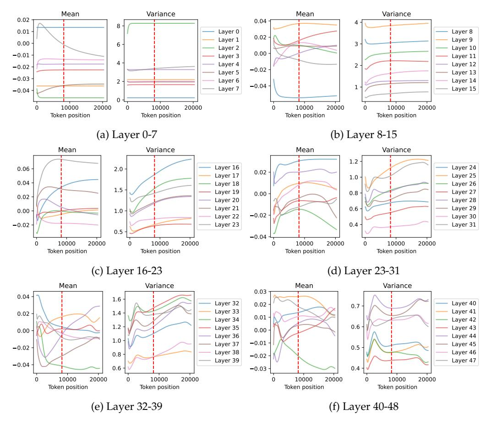
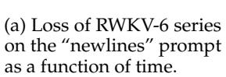
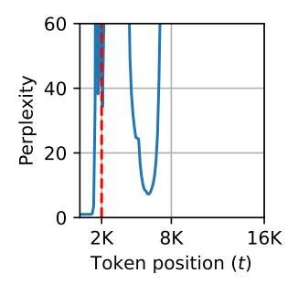

# **G State Statistics over Context Length**

Here, we provide a more detailed result on the inspection of state distribution over time.

Figure [16](#page-18-0) shows the distribution of hidden state *ht* of the recurrent mechanism described in Eq. [2.](#page-2-2) Additionally, *Bt* , *Ct* , and *xt* in Mamba-2 are generated with a short channel-wise convolutional layer with a kernel size of 4:

$$B_t = \sigma(\text{Conv}[u_t W_B])$$

$$C_t = \sigma(\text{Conv}[u_t W_C])$$

$$x_t = \sigma(\text{Conv}[u_t W_X])$$

where *σ* is the SiLU activation function. This function is also stateful because it operates on the last 4 tokens, therefore, we also collect the statistics of this convolutional state and report them in Figure [17.](#page-19-0) As we can see, the convolutional states are much more stable compared to the recurrent states. This is because only the last 4 tokens contribute to this state which avoids the explosion as a result of cumulative sum.

### **H Length Generalization of Other Architectures**

We additionally evaluate HGRN-2 [\(Qin et al.,](#page-10-14) [2024\)](#page-10-14) and RWKV-6 [\(Peng et al.,](#page-10-3) [2024a\)](#page-10-3) on the "newlines" prompt (string with only "\n") and find that they also exhibit severe performance degradation on the "newlines" prompt. The phenomenon is less severe in RWKV-6, which concurs with our argument that with longer training length, the model will learn to more robust forgetting mechanism, thus avoiding memory overload. Perhaps surprisingly, the increase in perplexity happens considerably before the context length reaches the training length for both models. We hypothesize that this is a result of the training distribution, and that by continual training on data with more long-distance dependencies can alleviate this degradation.

### **I The "newlines" Prompt**

In this paper, we collect the statistics of the state computed on a "newlines" prompt, a prompt where every token is the newline token ("\n"), as shown below.

\n\n\n\n\n\n\n\n\n\n\n\n\n\n\n\n\n\n...

However, we again emphasize that similar state distribution and model behavior are observed on prompts extracted from the pre-training corpus, the passkey retrieval task, or

Figure 16: The mean and variance of the hidden state of each layer of Mamba-2 370M, computed on the "newlines" prompt (string with only "\n").

other randomly generated sequences. We have chosen the "newlines" prompt because the samples from the pre-training corpus are too short, and this prompt produces the most consistent and smooth layer statistics.

Figure 17: The mean and variance of the convolutional states (the representation of the last four tokens) of each layer in Mamba-2 370M, computed on the "newlines" prompt. We can see that the mean and variance are visibly more stable than the recurrent state.

(b) The perplexity of HGRN-2 1.3B on the "newlines" prompt as a function of time.