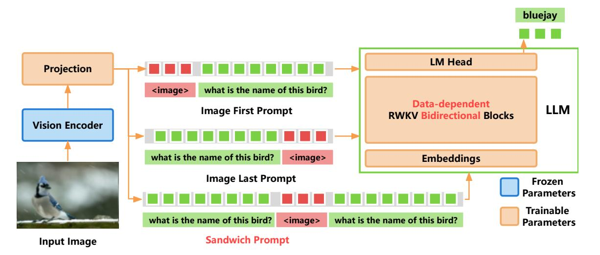
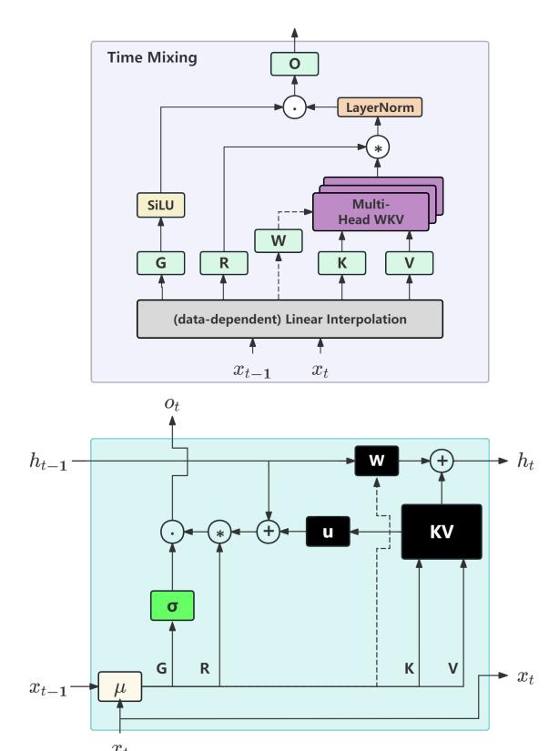

# 1 Introduction

Large Language Models (LLMs) have demonstrated exceptional performance in natural language processing tasks [\(Touvron et al.,](#page-11-0) [2023b;](#page-11-0) [Brown et al.,](#page-8-0) [2020\)](#page-8-0). Extending LLMs to support visual inputs has garnered significant attention in the research community [\(OpenAI,](#page-10-0) [2023\)](#page-10-0). Visual Language Models (VLMs) inherit powerful capabilities from LLMs, such as strong instruction following, zero-shot generalization, and in-context learning [\(Liu et al.,](#page-10-1) [2023b;](#page-10-1) [Zhu et al.,](#page-11-1) [2024a\)](#page-11-1). By integrating

visual and textual information, VLMs not only enhance the understanding of visual content but also provide richer context for language understanding and generation. VLMs hold tremendous potential for solving visual problems and advancing various vision-language tasks.

However, despite the excellent performance of existing LLMs and VLMs, their inherent computational and memory complexity due to the selfattention mechanism in the Transformer architecture results in quadratic growth in computation and memory requirements with the increase in sequence length [\(Katharopoulos et al.,](#page-9-0) [2020\)](#page-9-0). This leads to high inference costs and limits the deployment and application of Transformer-based VLMs on edge devices.

The Receptance Weighted Key Value (RWKV) model, a novel Recurrent Neural Network (RNN) architecture, presents a promising solution to the bottleneck of long-sequence modeling [\(Peng et al.,](#page-10-2) [2023a\)](#page-10-2). It surpasses Transformers in large-scale data performance and exhibits linear scalability with sequence length, positioning itself as a promising successor to Transformers in language modeling [\(Peng et al.,](#page-10-3) [2023b\)](#page-10-3).

Currently, there is a notable gap in research exploring how this efficient architecture can be leveraged for multimodal tasks. In this study, we introduce the VisualRWKV model, marking the first application of a linear RNN model to multimodal learning tasks. Specifically, we utilize the pre-trained RWKV language model as the foundational language model and explore several novel mechanisms applied to VisualRWKV.

VisualRWKV introduces: (1) an innovative datadependent recurrence to enhance the capabilities and capacity of the RWKV model. (2) a novel sandwich prompt designed to provide richer conditions when processing visual sequences. (3) a new 2D image scanning mechanism to enhance the 2D modeling capabilities of visual sequences.

\*This work is supported in part by Shenzhen Science and Technology Program under Grant ZDSYS20220527171400002, the National Natural Science Foundation of China (NSFC) under Grants 62406197, 62271324, 62231020 and 62371309. Corresponding author: F. Richard Yu.

Figure 1: **VisualRWKV** outperforms the SoTA LLaVA-1.5 (Liu et al., 2023a) on 4 tasks (a), with high computational efficiency (b) and low, stable memory usage (c).

(c) GPU Memory Comparison

Extensive experiments on various multimodal learning benchmarks validate the effectiveness of VisualRWKV, as shown in Figure 1. Compared to other Transformer-based models of similar size, such as LLaVA-1.5 (Liu et al., 2023a), Visual-RWKV demonstrates competitive performance, achieving outstanding results on multiple popular benchmarks.

In summary, this study presents the VisualR-WKV model, explores the impact of various novel designs on VisualRWKV, introduces the innovative sandwich prompt to enhance representation capabilities, and conducts extensive experiments across diverse multimodal learning benchmarks.

#### 2 Related Works

#### 2.1 Visual Language Models

Following the success of LLMs, recent research has pivoted towards VLMs (Achiam et al., 2023; Team et al., 2023) for enhancing visual understanding and reasoning capabilities. Expanding on various pre-trained LLM architectures, researchers have proposed diverse methodologies for incorporating visual information. Flamingo (Alayrac et al., 2022) and BLIP-2 (Li et al., 2023c) introduce distinct techniques for modality fusion, integrating visual tokens with frozen large language models through gated attention or query transformers. Building on the effectiveness of instruction tuning, LLaVA (Liu et al., 2023b,a) and MiniGPT-4 (Zhu et al., 2024a; Chen et al., 2023a) utilize visual instruction tuning to align visual input with LLMs, showcasing notable achievements. Recent advancements, such as Kosmos-2 (Peng et al., 2023c) and Shikra (Chen et al., 2023b), further enhance VLMs with grounded visual understanding capabilities. Despite their promising potential for general-purpose visual reasoning and planning tasks, these models are generally expensive and challenging to train and deploy.

#### 2.2 Linear RNN Large Language Model

Recent advancements in LLMs, such as GPT (Radford et al., 2019; Brown et al., 2020; Achiam et al., 2023), LLaMA (Touvron et al., 2023a,b), and PaLM (Anil et al., 2023; Chowdhery et al., 2023), have showcased remarkable prowess across various natural language processing tasks. However, traditional Transformer-based LLMs suffer from quadratic complexity  $O(L^2)$  issues in both computation and memory, prompting the emergence of linear RNNs as potential successors.

RNNs model sequential data with temporal dependencies by generating a hidden state  $h_t$  at each time step, which is then utilized as input for the subsequent step. Classical RNN variants like LSTM (Hochreiter and Schmidhuber, 1997) and GRU (Cho et al., 2014) excel in inexpensive inference, operating typically at O(1) time complexity per step relative to sequence length. Nonetheless, their older designs often pose challenges in parallelization across time dimensions during training.

Linear RNNs present themselves as promising successors to the Transformer, offering a more efficient token mixing method. They enable a space complexity of O(L) and an inference complexity

of O(1). Leveraging Parallel Prefix Sum Scan (Harris et al., 2007) for acceleration can further enhance their efficiency. The RWKV (Peng et al., 2023b; Hou and Yu, 2024), a linear RNN-based LLM, has showcased competitive performance compared to GPT models of similar scale. RWKV introduces temporal decay to gradually reduce the influence of past information, implicitly incorporating positional information. Additionally, it integrates a token-shift mechanism facilitating linear interpolation between current and previous inputs. This allows the model to naturally aggregate and regulate information within input channels. Furthermore, RWKV boasts a time complexity of O(L) and an inference complexity of O(1), ensuring consistent inference time per token. As a result, the overall inference duration scales linearly with sequence length. The memory footprint of RWKV remains constant, regardless of sequence length, contributing to its efficiency and scalability.

#### 3 Methods

In this section, we initially introduce the fundamental concepts of the RWKV language model. (Section 3.1). Following that, we elaborate on the transformation of the RWKV language model into our proposed VisualRWKV visual language model (Section 3.2), which mainly includes data-dependent recurrence, sandwich prompting, and image scanning.

#### 3.1 Preliminaries

The RWKV(Peng et al., 2024) backbone is structured using stacked residual blocks, with each block containing a time-mixing and a channel-mixing sub-block. These components embody recurrent structures designed to leverage past information.

**Data-independent Token Shift** As shown in Figure 3, trainable variable  $\mu_g$ ,  $\mu_r$ ,  $\mu_k$ ,  $\mu_v$  are used in a linear combination of  $x_t$  and  $x_{t-1}$ , to achieve a simple mixing, which interpolate between the inputs of the current and previous time-steps. The combination of shifted previous step and current step was linear projected through projection matrix within the block:

$$\alpha_t = (\mu_\alpha \odot x_t + (1 - \mu_\alpha) \odot x_{t-1}) W_\alpha \tag{1}$$

where  $\alpha$  serves as a notation for the variables r, g, k, and v, given that they are subject to an identical linear combination formula. Please note that the linear combination used here is data independent,

meaning the value of  $\mu_{\alpha}$  is not dependent on  $x_t$  or  $x_{t-1}$ .

**Data-independent Time Mixing** In vanilla RWKV, the time mixing is articulated through the update of the WKV vectors and the WKV operator is input-data independent. The formula of single head WKV operator is given by:

$$wkv_t = \operatorname{diag}(u) \cdot k_t^{\mathrm{T}} \cdot v_t + \sum_{i=1}^{t-1} \operatorname{diag}(w)^{t-1-i} \cdot k_i^{\mathrm{T}} \cdot v_i \tag{2}$$

where w and u are two trainable parameters. The parameter u serves as a term weight for the current token when the model encounters it for the first time. It enables the model to efficiently process the token by focusing more on important tokens and quickly filtering out unimportant ones. Another important parameter is w, which is a channel-wise time decay vector per head. Furthermore, we transform parameter w by  $w = \exp(-\exp(w))$ . This transformation ensures that all values of w are within the range (0,1), ensuring that  $\operatorname{diag}(w)$  represents a contraction matrix.

The output from the single-head WKV operator undergoes processing by the layer normalization and the SiLU activation. Then, all outputs are concatenated to form the output vector  $o_t$ :

$$o_t = concat(SiLU(g_t) \odot LayerNorm(r_t \cdot wkv_t))W_o$$
 (3)

where LayerNorm operates on each head separately. For further details and formulas of the models, one can refer to Peng et al. (2024) and Hou and Yu (2024).

### 3.2 VisualRWKV

| Method                 | Size | VQA   | SQA   | TQA   | GQA   |
|------------------------|------|-------|-------|-------|-------|
| VisualRWKV-Base        | 1.6B | 51.08 | 41.94 | 35.19 | 48.09 |
| +Data-dep Recurrence   | 1.6B | 65.82 | 46.55 | 40.26 | 49.06 |
| +Bidirection +Sandwich | 1.6B | 64.96 | 56.72 | 41.94 | 48.04 |
| +Better Learning Rate  | 1.6B | 69.42 | 59.05 | 43.57 | 55.23 |
| +Scale up to 3B        | 3B   | 71.52 | 65.34 | 48.68 | 59.56 |
| +Scale up to 7B        | 7B   | 75.82 | 68.22 | 51.01 | 64.27 |
|                        |      |       |       |       |       |

Table 1: **Scaling results** on model. We choose to conduct experiments on VQA-v2(VQA), ScienceQA(SQA), TextVQA(TQA) and GQA to examine model's capabilities.

#### 3.2.1 VisualRWKV Baseline

VisualRWKV is a follow-up work to RWKV. RWKV paper (Peng et al., 2024) proposed a simplified version of VisualRWKV that employed data-independent recurrence (Fig. 3), unidirection image scanning (Fig. 4), and image first prompting

Figure 2: VisualRWKV architecture overview and three prompting method. Image First Prompt: place image tokens before instruction tokens; Image Last Prompt: place image tokens after instruction tokens; Sandwich Prompt: place image tokens in the middle of instruction tokens. Red words indicate the key contributions.

(Fig. [2\)](#page-3-0). We used that version of VisualRWKV as the baseline and starting point for our research, as shown in Table [1.](#page-2-2) We denote this initial model without any modifications as VisualRWKV-Base.

### 3.2.2 Data-dependent Recurrence

The Data-dependent Recurrence mechanism introduces two key enhancements: the Data-dependent Token Shift and the Data-dependent Time Mixing.

Data-dependent Token Shift First, we define low-rank adaptation (lora) and data-dependent linear interpolation (ddlerp) as follow:

$$lora_{\alpha}(x) = \lambda_{\alpha} + \tanh(xA_{\alpha})B_{\alpha} \tag{4}$$

$$ddlerp_{\alpha}(a,b) = a + (b-a) \odot lora_{\alpha}(a + (b-a) \odot \mu_x)$$
 (5)

Then, the Data-dependent Token Shift is defined as:

$$\alpha_t = \mathrm{ddlerp}_{\alpha}(x_t, x_{t-1})W_{\alpha} \tag{6}$$

where α serves as a notation for the variables r, g, k, and v. Aα, Bα, λα and Wα are trainable parameters. The data-dependent token shift seeks to broaden the model's capacity. It dynamically allocates the ratio of new to existing data per channel, depends on the input at both current and previous time steps.

Data-dependent Time Mixing The key improvement over data-independent time mixing (Eq. [2\)](#page-2-3) lies in the evolution of the time decay vector from a fixed parameter w to a dynamic one wt that reacts to the input data xt at time step t. The dynamic nature of wt allows the model to adjust more nimbly

to diverse input data, unbound by rigid, predefined structures. Equations are as follow:

$$d_t = \operatorname{lora}_d(\operatorname{ddlerp}_d(x_t, x_{t-1})) \tag{7}$$

$$w_t = \exp(-\exp(d_t)) \tag{8}$$

$$wkv_t = \operatorname{diag}(u) \cdot k_t^{\mathrm{T}} \cdot v_t + \sum_{i=1}^{t-1} \operatorname{diag}\left(\bigcap_{j=1}^{i-1} w_j\right) \cdot k_i^{\mathrm{T}} \cdot v_i \tag{9}$$

The LoRA mechanism utilizes vectors learned from data-independent time mixing and enhances them at a low cost with additional offsets modulated by the incoming input. It should be noted that the computation of the new time-varying decay wt employs a token-shifted value ddlerpd (xt , xt−1) as its input, not just the current token xt . As shown in Table [1,](#page-2-2) the VisualRWKV equipped with data-dependent recurrence exhibits a significant improvement in performance.

### 3.2.3 Sandwich Prompt

The motivation for designing the sandwich prompt is as follows: Unlike the attention mechanism in Transformers, RNN models such as RWKV, due to their sequential nature, cannot revisit historical information repeatedly. Instead, they must decide immediately whether to store a token or image token in memory upon encountering it. Therefore, carefully designing tailored prompts is essential for enhancing VisualRWKV's ability to effectively acquire and utilize information. For this purpose, we have specifically designed three types of prompting methods, as shown in Figure [2:](#page-3-0)

• Image First Prompt: Place image tokens prior to the instruction tokens.

Figure 3: Data-dependent recurrence. Top: Semantic diagram of the time-mixing block; Bottom: Time-mixing block as an RNN cell. Dashed arrows represent connections in data-dependent recurrence, not present in data-independent recurrence.

- Image Last Prompt: Place image tokens following the instruction tokens.
- Sandwich Prompt: Insert image tokens between the instruction tokens.

The sandwich prompt is designed to provide optimal conditions that assist the model in making these decisions more effectively. Specifically, the first prompt helps the model efficiently extract relevant information from the image, while the second prompt focuses on improving the model's ability to answer questions.

For instance, the Image Last Prompt can cause the model to occasionally forget the question embedded in the prompt, while the Image First Prompt may result in the model processing the image without considering the question, hindering its ability to analyze the image contextually. In contrast, the sandwich prompt resolves these issues and achieves a synergistic effect, enabling the model to perform better than the sum of the individual prompts. The experimental results show that the Sandwich

Prompt achieves the best performance, as presented in Table [3.](#page-7-0)

### 3.2.4 Image Scanning

The motivation for designing the image scanning techniques is as follows: Language is inherently unidirectional, while images are multidirectional by nature. As a result, unidirectional language models face inherent limitations when processing visual information. By implementing bidirectional or multidirectional image scanning strategies, these challenges can be effectively mitigated.

Vanilla RWKV is designed for 1D sequential data with causal relationships, such as language sequences. However, the visual sequences generated by vision encoders are non-causal. To bridge this gap, we propose a 2D scanning mechanism to improve VisualRWKV's performance on visual tasks. This work integrates the 2D scanning mechanism into RWKV blocks, exploring three variants of multimodal RWKV blocks, which are illustrated in Figure [4:](#page-5-0)

- Unidirectional Blocks: Only containing the Forward Scanning Block, which is the basic scanning pattern of RWKV and other linear RNN models. This serves as the Base.
- Bidirectional Blocks: Comprising both Forward Scanning and Backward Scanning Blocks, arranged in an alternating fashion.
- Multidirectional Blocks: Including blocks for Forward Scanning, Backward Scanning, Upward Scanning, and Downward Scanning, with the sequence of Forward, Backward, Upward, and Downward arranged in an alternating order.

Our design alternates different scanning directions within layers, which does not introduce additional computational overhead and preserves the efficiency of the architecture. The experimental results (Table [4\)](#page-7-1) have also verified the effectiveness and necessity of such scanning techniques in enhancing the model's ability to handle and understand visual sequences, thereby improving the overall performance of VisualRWKV in visual language processing tasks.

