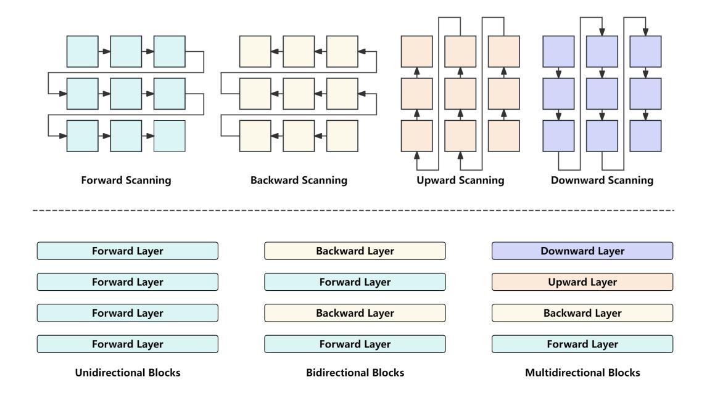

# 4 Experiments

The following section is dedicated to showcasing the key experiments and outcomes related to Visu-

Figure 4: Illustration of 3 different multimodal RWKV Blocks: Unidirectional Blocks (left), Bidirectional Blocks (middle), and Multidirectional Blocks (right). The four scanning modes are also depicted at the top.

alRWKV. All results presented in this section are derived from a single run.

### 4.1 Experiment Setup

Following [Liu et al.](#page-9-1) [\(2023a,](#page-9-1)[b\)](#page-10-1), the training process of VisualRWKV consists of two stages: vision-andlanguage alignment pretraining and visual instruction tuning. In the pretraining stage, the vision encoder and RWKV LLM are frozen, with only the projector being updated. During the visual instruction tuning stage, we finetune both the projector and the RWKV LLM, as shown in Figure [2.](#page-3-0) Details of training data and hyper-parameters can be found in Appendix [A.](#page-12-0)

