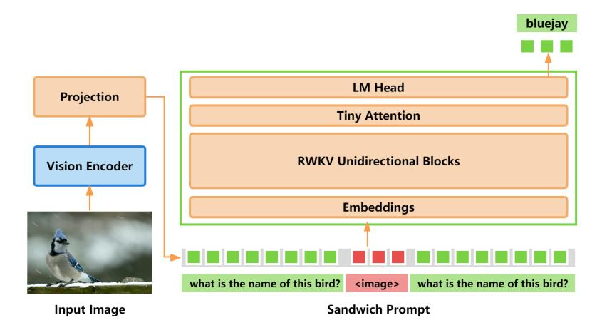

# I VisualRWKV Hybrid

We have preliminarily explored the feasibility of the VisualRWKV hybrid model. The hybrid model refers to the combined use of RWKV and Attention. As shown in the Figure [6,](#page-17-1) we have simply added a layer of Tiny Attention on the top of the RWKV blocks. The parameter count of Tiny Attention is smaller than that of the standard Attention, and it does not include an FFN layer.

Figure 6: VisualRWKV Hybrid: Add a Tiny Attention Layer on the top of RWKV Blocks.

The results of the VisualRWKV hybrid are presented in Table [14.](#page-18-0) It can be observed that there is an improvement over the baseline model without tiny attention. Considering the minimal increase in the number of parameters, this improvement is quite significant. Additionally, we found that the hybrid model equipped with tiny attention is more robust to the number of image tokens. These results suggest the incorporation of more Attention modules in future work may lead to further enhancements and enable the construction of superior Hybrid models.

