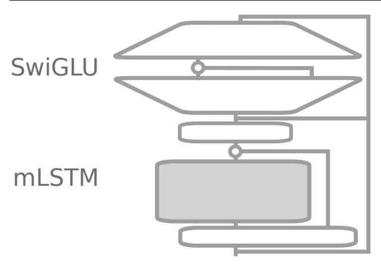
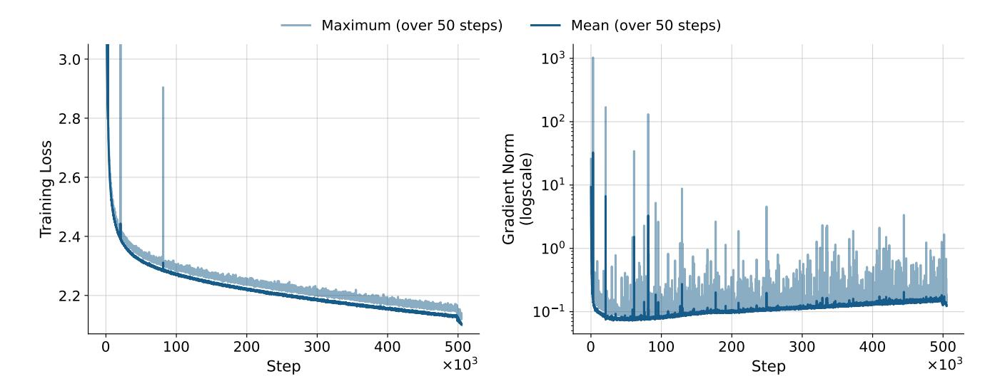

# 1. Introduction

Recent breakthroughs in test-time compute scaling have unlocked significant improvements in solving complex reasoning and math problems. By sampling multiple promising solutions, the best answers can be provided to the user or used as training targets [\(Yao et al.,](#page-12-0) [2023;](#page-12-0) [Hao et al.,](#page-10-0) [2023;](#page-10-0) [Guan et al.,](#page-10-1) [2025\)](#page-10-1). However, as state-of-the-art models such as OpenAI o1[1](#page-0-0) and DeepSeek-R1 [\(DeepSeek-AI et al.,](#page-9-0) [2025\)](#page-9-0) leverage these methods to push the capabilities of language models to new heights, the significantly increased computational overhead of test-time compute methods requires more efficient architectures that provide greater inference speeds. A promising path involves linear recurrent neural networks with gating mechanisms, including GLA [\(Yang et al.,](#page-12-1) [2024b\)](#page-12-1), Mamba [\(Gu & Dao,](#page-10-2) [2024;](#page-10-2) [Dao & Gu,](#page-9-1) [2024\)](#page-9-1), RWKV [\(Peng et al.,](#page-11-0) [2023;](#page-11-0) [2024\)](#page-11-1), RetNet [\(Sun et al.,](#page-11-2) [2023\)](#page-11-2), and xLSTM [\(Beck et al.,](#page-9-2) [2024\)](#page-9-2). Compared to Transformers, these models offer a parallel mode for efficient training (e.g. [Yang et al.,](#page-12-1) [2024b\)](#page-12-1) and a recurrent generation mode that both scale linearly with context length. The increased compute efficiency combined with constant memory usage during inference allows spending more compute at test-time, but also enables running models locally on edge devices acting as an interface to the user with fast response times.

xLSTM has shown competitive performance compared to alternative recurrent models and even Transformers in a controlled experimental setting using the same data and similar parameter counts [\(Beck et al.,](#page-9-2) [2024\)](#page-9-2). Moreover, this architecture also excelled in other domains, such as computer vision [\(Alkin et al.,](#page-9-3) [2025\)](#page-9-3), robotics [\(Schmied et al.,](#page-11-3) [2024\)](#page-11-3), molecular biology [\(Schmidinger et al.,](#page-11-4) [2025\)](#page-11-4), and time series [\(Kraus et al.,](#page-10-3) [2024\)](#page-10-3). However, so far, xLSTM has not been scaled to datasets beyond 300B tokens and 1.3B parameters. It therefore remains uncertain whether this architecture can match the Transformer's ability to scale effectively with larger model sizes and extract meaningful patterns from ever-larger datasets.

In this work, we scale the xLSTM to 7B parameters and present our xLSTM 7B, a large language model trained on 2.3T tokens from the DCLM dataset [\(Li et al.,](#page-11-5) [2024\)](#page-11-5) with

\*Equal contribution 1NXAI GmbH, Linz, Austria JKU, Johannes Kepler University, Linz, Austria 3Now at Google Deepmind. Correspondence to: Maximilian Beck <[maximilian.beck@nx-ai.com](mailto:maximilian.beck@nx-ai.com)>, Korbinian Poppel ¨ <[korbinian.poeppel@nx-ai.com](mailto:korbinian.poeppel@nx-ai.com)>, Sebastian Bock ¨ <[sebastian.boeck@nx-ai.com](mailto:sebastian.boeck@nx-ai.com)>.

<https://openai.com/index/introducing-openai-o1-preview/>

context length 8192 using 128 H100 GPUs. To achieve this, we improve and optimize the initial xLSTM architecture from Beck et al. (2024) for optimal training efficiency and stability, without sacrificing performance in downstream tasks. Our new architecture fully relies on mLSTM cells with parallel training mode to achieve maximum speed at high language modeling performance. We further optimize the throughput by modifying the surrounding block architecture. By operating the mLSTM in a lower dimensional space and adding position-wise feedforward MLP layers similar to the default Transformer blocks, we increase the amount of compute spent for highly optimized linear layers. Additionally, we discard components such as channel-wise convolutions or learnable skip connections to increase the GPU utilization during training. We find that this optimized block architecture has a  $2\times$  to  $4\times$  higher token throughput compared to the previous xLSTM architecture of Beck et al. (2024), while achieving similar performance on language modeling. In addition to the efficiency optimizations, we optimize the new xLSTM architecture for improved training stability, focusing specifically on the gating mechanism of the mLSTM cell. By introducing soft-capping for input and forget gates and improved initializations for the input gate we effectively mitigate high gradient norm spikes and variance, and improve the performance of our xLSTM 7B.

In our evaluations on language downstream and long-context tasks, xLSTM 7B shows comparable performance to Transformers and Mamba models of the same size, but with our optimized block architecture it achieves the highest prefill and generation throughput with the lowest GPU memory footprint on our inference efficiency benchmarks.

To summarize, in this work we present targeted modifications to the xLSTM architecture in order to (i) improve training and inference efficiency, and (ii) ensure training stability at large scales. (iii) We introduce a new language model with 7B parameters based on the xLSTM architecture trained on 2.3 T tokens with 8k context length demonstrating the highest inference speed and efficiency in our benchmarks.

We release the pre-trained model xLSTM 7B on Huggingface2 and provide the model implementation and training code 3 including optimized triton kernels 4 for fast training and inference.

## 2. Background: xLSTM with Matrix Memory

In this section, we reassess the mLSTM (Beck et al., 2024), on which we build our xLSTM 7B. The mLSTM cell is fully parallelizable, and, therefore, enables highly efficient

large-scale model training while maintaining fast recurrent inference with constant memory.

Generation Mode. During inference, when generating tokens, the mLSTM cell processes the series of input vectors  $\boldsymbol{x}_t \in \mathbb{R}^d$  for time steps  $t \in \{1, \dots, T\}$  in a recurrent manner, mapping a state  $(\boldsymbol{h}_{t-1}, \boldsymbol{C}_{t-1}, \boldsymbol{n}_{t-1}, m_{t-1})$  to a successor state  $(\boldsymbol{h}_t, \boldsymbol{C}_t, \boldsymbol{n}_t, m_t)$  given an input  $\boldsymbol{x}_t$ . Here,  $\boldsymbol{h}_t \in \mathbb{R}^{d_{hv}}$  denotes the hidden state,  $\boldsymbol{C}_t \in \mathbb{R}^{d_{qk} \times d_{hv}}$  denotes the cell state responsible for long-term memory,  $\boldsymbol{n}_t \in \mathbb{R}^{d_{qk}}$  denotes the normalizer state, and  $m_t \in \mathbb{R}$  denotes the max state controlling the magnitude of the exponential input gate.

In the recurrent mode (generation), the mLSTM cell

$$h_t = \text{mLSTMCell}(x_t, h_{t-1}, C_{t-1}, n_{t-1}, m_{t-1}),$$
 (1)

is defined by the following state update equations:

$$m_t = \max\left\{\log\sigma(\tilde{\mathbf{f}}_t) + m_{t-1}, \ \tilde{\mathbf{i}}_t\right\},\tag{2}$$

$$C_t = f_t C_{t-1} + i_t k_t v_t^{\top}, \qquad (3)$$

$$\boldsymbol{n}_t = f_t \, \boldsymbol{n}_{t-1} + i_t \, \boldsymbol{k}_t, \tag{4}$$

$$\widetilde{\boldsymbol{h}}_{t} = \frac{\boldsymbol{C}_{t}^{\top} \left( \boldsymbol{q}_{t} / \sqrt{d_{qk}} \right)}{\max \left\{ \left| \boldsymbol{n}_{t}^{\top} \left( \boldsymbol{q}_{t} / \sqrt{d_{qk}} \right) \right|, \exp(-m_{t}) \right\}}, \quad (5)$$

$$\mathbf{h}_t = \mathbf{o}_t \odot \operatorname{Norm}(\widetilde{\mathbf{h}}_t).$$
 (6)

The gate activations are computed as:

$$f_t = \exp\left(\log \sigma(\tilde{f}_t) + m_{t-1} - m_t\right),\tag{7}$$

$$i_t = \exp(\tilde{i}_t - m_t), \tag{8}$$

$$\mathbf{o}_t = \sigma\left(\tilde{\mathbf{o}}_t\right). \tag{9}$$

The query, key, and value vectors  $q_t, k_t \in \mathbb{R}^{d_{qk}}, v_t \in \mathbb{R}^{d_{hv}}$  are computed as  $\{q_t, k_t, v_t\} = W_{\{q,k,v\}} x_t + b_{\{q,k,v\}}$ . The scalar input and forget gates  $\mathbf{i}_t, \mathbf{f}_t \in \mathbb{R}$  are computed from the pre-activations  $\{\tilde{\mathbf{i}}_t, \tilde{\mathbf{f}}_t\} = w_{\{\mathbf{i},f\}}^{\top} x_t + b_{\{\mathbf{i},f\}}$  and the vector output gate  $\mathbf{o}_t \in \mathbb{R}^{d_{hv}}$  is computed from the pre-activation  $\tilde{\mathbf{o}}_t = W_{\mathbf{o}} x_t + b_{\mathbf{o}}$  with the sigmoid function  $\sigma$ . The normalization layer Norm in (6) can be either RMSNorm (Zhang & Sennrich, 2019) or LayerNorm (Ba et al., 2016).

**Training Mode.** In training, the mLSTM cell processes a full sequence of input vectors  $\boldsymbol{X} \in \mathbb{R}^{T \times d}$  and computes the hidden states  $\boldsymbol{H} \in \mathbb{R}^{T \times d_{hv}}$  for all time steps T in parallel. We denote the mLSTM cell in parallel mode (training) as

$$H = \text{mLSTMCell}(X).$$
 (10)

Due to the linear nature of the recurrence in equations (2)-(9), the hidden states H can be computed in chunks without materializing the intermediate memory states  $(C_t, n_t, m_t)$ .

2https://huggingface.co/NX-AI/xLSTM-7b

3https://github.com/NX-AI/xlstm-jax

4https://github.com/NX-AI/mlstm\_kernels

Figure 1. Sketch of the updated xLSTM Block. The lower part is an output-gated sequence-mix layer with the mLSTM at its core, whereas the upper part is a gated MLP (SwiGLU) as a feature/channel-mix layer. See Fig. 8 for details.

This *chunkwise-parallel* form enables highly efficient training kernels, analogous to FlashLinearAttention (Yang et al., 2024b; Yang & Zhang, 2024), surpassing the training speeds of FlashAttention (Dao, 2024; Shah et al., 2024). For details on the chunkwise-parallel training kernels for the mLSTM cell, we refer to Anonymous (2025).

**Multi-Head mLSTM.** Similar to multi-head attention in Transformers (Vaswani et al., 2017), the xLSTM has  $N_{\text{head}} = d/d_{hv}$  different mLSTM cells mLSTMCell(i). The hidden states  $\boldsymbol{H}^{(i)}$  of every head are then concatenated and once again projected, resulting in the mLSTM layer

$$\mathrm{mLSTM}(\boldsymbol{X}) = \mathrm{Concat}(\boldsymbol{H}^{(1)}, \dots, \boldsymbol{H}^{(N_{\mathsf{head}})}) \; \boldsymbol{W}_{\mathsf{proj}}^{\top}, \; (11)$$

where  $H^{(i)} = \text{mLSTMCell}^{(i)}(X)$ . We discuss key considerations for choosing the number of parallel heads or in other words the head dimension  $d_{hv}$  in Sec. 3.1.

## 3. Optimized xLSTM 7B Architecture

The emerging paradigm of increasing test-time computation necessitates i) the development of novel architectures optimized for *efficient inference*. Additionally, new architectures must ii) be viable in large-scale pre-training setups, thus be *highly efficient during training*, and iii) exhibit *stable convergence*. Our xLSTM 7B is designed to meet these three challenges by offering an architecture that can be trained efficiently and with stable convergence and is also highly efficient at inference. In Sec. 3.1, we detail our optimization of the xLSTM architecture for *efficiency* during both inference and training. We then describe in Sec. 3.2 our actions to improve and ensure *stable convergence* for training large xLSTM models, focusing specifically on the gating mechanism of the mLSTM cell.

### 3.1. Optimizing for Efficiency

The core of the xLSTM 7B architecture, the mLSTM cell, with its recurrent and parallel mode enable efficient inference and training. To leverage its full potential, we revisit the design of the surrounding block structures.

Previous mLSTM Block. Similarly to other linear RNNs like Mamba (Gu & Dao, 2024; Hua et al., 2022), the previous xLSTM architecture places the mLSTM cell combined with channel-wise convolutions in between a linear up-projection and down-projection, which is referred to as pre up-projection block (Beck et al., 2024). These blocks combine sequence mixing and channel mixing in one block and are therefore stacked homogeneously without interleaving position-wise feed-forward MLP layers. Although the pre up-projection block architecture has proven competitive language modeling performance for the xLSTM up to 1.4B parameters, it comes with a substantial trade-off in computational efficiency for the following reasons:

- 1. Within the pre up-projection block, the mLSTM operates in a significantly higher dimension than the embedding dimension of the model. This leads to a substantially higher computational cost and GPU memory usage for the mLSTM operation.
- 2. Omitting position-wise feed-forward MLP layers results in a *decreased proportion of highly efficient linear layer FLOPs* in the model.
- 3. The previous xLSTM architecture uses several additional components such as learnable skip connections, channel-wise convolutions, and small (block-diagonal) projection layers to compute queries, keys and values. Without custom kernel fusion, these small operations result in multiple short kernel calls on the GPU, which cannot effectively utilize tensor cores5 and, consequently, significantly *reduce GPU utilization*.
- 4. Previously, the input and forget gate pre-activations were computed from concatenated query, key and value projections. In a large-scale tensor-parallel training setup this requires an additional all-reduce operation per mLSTM block, which increases the overall communication cost.

These limitations prevent efficient scaling of the xLSTM architecture as introduced by Beck et al. (2024) beyond 1.4B parameters. To scale the xLSTM to even larger model sizes, we optimize the mLSTM block for maximal efficiency by addressing these four limitations.

**Optimizing the mLSTM Block.** To begin, we operate the mLSTM cell in the models' embedding dimension, in-

&lt;sup>5Tensor cores are specialized compute units that accelerate matrix multiplications on GPUs.

stead of a higher dimensional space and place position-wise feed-forward MLP layers after each mLSTM layer. This modification increases the proportion of highly optimized linear layer (i.e. matrix multiplication) FLOPs and reduces the computation cost of the mLSTM operation (see App. [D](#page-18-0) for details on the FLOP computation). The significantly reduced GPU memory usage enables larger batch sizes during training, which also increases training efficiency. The result is the default dense Transformer block configuration referred to as *post up-projection block* by [Beck et al.](#page-9-2) [\(2024\)](#page-9-2):

$$z = x + \text{mLSTM}(\text{Norm}(x)),$$
 (12a)

$$y = z + MLP(Norm(z)),$$
 (12b)

where x is the input to the block, z is the intermediate output of the mLSTM layer defined in [\(11\)](#page-2-2), and y is the block output. The MLP is a SwiGLU [\(Shazeer,](#page-11-7) [2020\)](#page-11-7) (see Fig. [1\)](#page-2-3).

Moreover, we discard operations like the channel-wise convolution and the learnable skip-connection, and replace the block-wise query, key and value projections by dense linear layers. This again increases linear layer FLOPs and ensures effective usage of tensor cores within the mLSTM layer.

Finally, we ensure that the gate pre-activations for every head are computed independently as outlined in [\(11\)](#page-2-2). This allows us to apply the model parallelization strategies optimized for Transformers with self-attention [\(Shoeybi et al.,](#page-11-8) [2020\)](#page-11-8) to our xLSTM 7B architecture and therefore minimize additional communication cost.

These optimizations result in our optimized mLSTM block described in Fig. [1](#page-2-3) and Fig. [8](#page-13-0) in the appendix, of which we stack 32 in our xLSTM 7B architecture. We observe that our optimizations achieve a 3.5× speedup in training for 1.4B models, with a slight trade-off in validation perplexity that can be mitigated by a few more training steps (see Tab. [2\)](#page-8-0). Although the modified block structure reduces the size of the mLSTM cell memory states C, we find that it does not compromise the language modeling quality of our model.

Optimizing the Memory Capacity. The overall memory capacity of the xLSTM, i.e. the amount of information that can be stored from an input sequence, is related to the physical size of its memory cell states C of shape dqk × dhv in GPU memory. By choosing either the number of heads or the head dimension dhv, the other is given by the relation to the embedding dimension d = #heads × dhv. For the xLSTM 7B we set dqk = dhv/2 similar to [Sun et al.](#page-11-2) [\(2023\)](#page-11-2). We can then compute the total memory state size by #blocks × #heads × dqk × dhv × 4 bytes, assuming that the state is stored in float32 format. In Tab. [3](#page-8-1) we show the memory state size for different number of heads as well as their trade-offs with language modeling performance and training efficiency. We use a larger memory state size and

a slightly longer train step time to make sure the model is not constrained by a lack of memory. We elaborate further on this in Sec. [5.](#page-5-0) We choose 8 heads with head dimension dhv = 512 for xLSTM 7B.

Fused Generation Kernels for the mLSTM Cell. During autoregressive generation, the hidden state outputs of the mLSTM cell are computed, with its recurrent formulation given by [\(1\)](#page-1-6) – [\(9\)](#page-1-5). The recurrent formulation consists of a combination of an outer-product, dot-products and several pointwise operations, which translates to individual consecutive GPU kernels. Since each kernel loads its inputs from and stores its outputs to GPU memory, this increases the amount of slow memory operations. To ensure that intermediate results of equations [\(2\)](#page-1-4)–[\(5\)](#page-1-7) are not unnecessarily transferred to GPU memory, but instead remain on the GPU's compute chips, we write fused GPU kernels for the mLSTM generation mode. This results in significantly faster generation as shown in speed benchmarks in Sec. [5.2.](#page-6-0)

## 3.2. Optimizing for Stability

We find that the previous xLSTM architecture at the 7B parameter scale often becomes unstable in early stages of training. In particular, we noticed that training at higher learning rates leads to large spikes in the gradient magnitude and loss value, similar to reports from previous works on Mamba-based models [\(Lieber et al.,](#page-11-9) [2024;](#page-11-9) [Dao & Gu,](#page-9-1) [2024;](#page-9-1) [Zuo et al.,](#page-12-5) [2024\)](#page-12-5). We further observed and attribute these spikes to very large outlier features, i.e. individual feature values that are significantly larger than the average feature value [\(He et al.\)](#page-10-5). We address these stability issues by (i) the use of RMSNorm instead of LayerNorm, (ii) soft-capping of the input and forget gates, and (iii) a negative initialization of the input gate bias.

Pre-Norm with RMSNorm. Many works report that replacing the LayerNorm by RMSNorm at the input of each layer (e.g. in the pre-norm setting [\(Xiong et al.,](#page-12-6) [2020\)](#page-12-6)) improves training stability for Transformers [\(OLMo et al.,](#page-11-10) [2025;](#page-11-10) [Touvron et al.,](#page-12-7) [2023;](#page-12-7) [Gemma Team,](#page-10-6) [2024a;](#page-10-6) [Yang](#page-12-8) [et al.,](#page-12-8) [2024a\)](#page-12-8) and Mamba models [\(Zuo et al.,](#page-12-5) [2024\)](#page-12-5). Our experiments in App. [C.2,](#page-15-0) Fig. [9](#page-15-1) confirm that this also applies to the *pre-norm* normalization layers in [\(12\)](#page-3-1) in our xLSTM architecture. Therefore, we replace the LayerNorm by RMSNorm in our xLSTM architecture.

Gate Soft-Capping. To reduce potential large outlier features and related loss spikes, we apply soft-capping to the input and forget gate pre-activations˜it and ˜ft, such that their values stay between −a and a for a specific cap value a. We cap the gates using a = 15 with the function

$$\operatorname{softcap}_a(\boldsymbol{x}) = a \cdot \tanh(\boldsymbol{x}/a).$$
 (13)

In Sec. [5.3](#page-7-0) and App. Sec. [C.2,](#page-15-0) we confirm that this significantly improves the stability and performance of our

Figure 2. Loss and Gradient Norm during Pretraining of xLSTM 7B. We show the mean and maximum value over 50 steps. Our enhanced architecture and initialization enable stable pretraining of xLSTM 7B, exhibiting only two brief loss spikes early in training, both of which were rapidly recovered.

Table 1. Model Performance on Huggingface Leaderboard v2. ↑ indicates larger values are better.

| Model                        | ВВН↑  | MMLU-Pro↑ | Матн ↑ | MuSR↑ | GPQA↑ | IFEval↑ | Average ↑ |
|------------------------------|-------|-----------|--------|-------|-------|---------|-----------|
| TRANSFORMERS                 |       |           |        |       |       |         |           |
| Llama-3.1-8B                 | 0.465 | 0.325     | 0.042  | 0.379 | 0.312 | 0.125   | 0.275     |
| Llama-2-7B-hf                | 0.349 | 0.186     | 0.013  | 0.363 | 0.269 | 0.264   | 0.241     |
| OLMo-7B-hf                   | 0.330 | 0.118     | 0.010  | 0.357 | 0.257 | 0.280   | 0.225     |
| Gemma-7B                     | 0.426 | 0.293     | 0.061  | 0.408 | 0.295 | 0.272   | 0.292     |
| Ministral-8B-Instruct-2410   | 0.496 | 0.350     | 0.151  | 0.430 | 0.319 | 0.322   | 0.345     |
| Bloom-7B1                    | 0.311 | 0.111     | 0.000  | 0.354 | 0.264 | 0.138   | 0.196     |
| Gpt-j-6B                     | 0.321 | 0.125     | 0.009  | 0.363 | 0.261 | 0.250   | 0.222     |
| Pythia-6.9B                  | 0.326 | 0.116     | 0.006  | 0.355 | 0.270 | 0.232   | 0.217     |
| Qwen2.5-7B                   | 0.541 | 0.435     | 0.165  | 0.446 | 0.329 | 0.359   | 0.379     |
| Gemma-2-9B                   | 0.543 | 0.414     | 0.117  | 0.453 | 0.334 | 0.217   | 0.346     |
| DCLM-7B                      | 0.426 | 0.312     | 0.030  | 0.392 | 0.303 | 0.228   | 0.282     |
| TRANSFORMER-RECURRENT HYBRID | S     |           |        |       |       |         |           |
| Zamba2-7B                    | 0.489 | 0.319     | 0.114  | 0.402 | 0.318 | 0.375   | 0.336     |
| RECURRENT MODELS             |       |           |        |       |       |         |           |
| Falcon-Mamba-7B (pre-decay)  | 0.373 | 0.177     | 0.024  | 0.387 | 0.275 | 0.252   | 0.248     |
| Falcon-Mamba-7B              | 0.429 | 0.229     | 0.039  | 0.412 | 0.299 | 0.335   | 0.290     |
| MambaCodestral-7B (v0.1)     | 0.405 | 0.191     | 0.023  | 0.359 | 0.266 | 0.322   | 0.261     |
| RKWV-v5-Eagle-7B             | 0.325 | 0.121     | 0.007  | 0.322 | 0.243 | 0.266   | 0.214     |
| RWKV-v6-Finch-7B             | 0.342 | 0.154     | 0.014  | 0.338 | 0.265 | 0.264   | 0.230     |
| xLSTM 7B                     | 0.381 | 0.242     | 0.036  | 0.379 | 0.280 | 0.244   | 0.260     |
| xLSTM 7B LCTX                | 0.390 | 0.252     | 0.040  | 0.374 | 0.253 | 0.234   | 0.257     |

xLSTM architecture. Additionally, we apply soft-capping with a = 30 to the final layer logits, similar to [Gemma](#page-10-7) [Team](#page-10-7) [\(2024b\)](#page-10-7).

Negative Input Gate Bias Initialization. We observe that early on in training our xLSTM models experience large gradient norm spikes, which affect the final performance of our model (see Fig. [11](#page-16-0) in App. [C.2\)](#page-15-0). Initializing the input gate at large negative values (e.g. -10) effectively mitigates these gradient norm spikes and improves performance. We analyze the impact of the input gate further in Sec. [5.3.](#page-7-0)

In summary, our optimizations enable remarkably stable pretraining of xLSTM 7B, as we show in Figure [2.](#page-4-0)

We outline the detailed block architecture of our xLSTM 7B in Appendix [A](#page-13-1) and our training recipe in Appendix [B.](#page-14-0)

