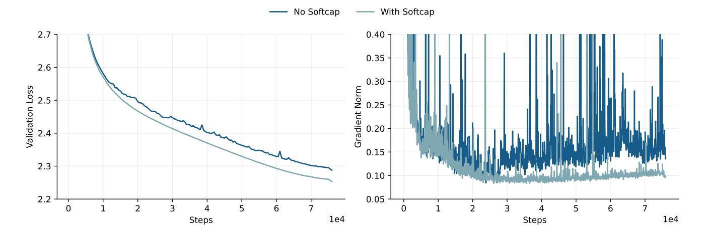
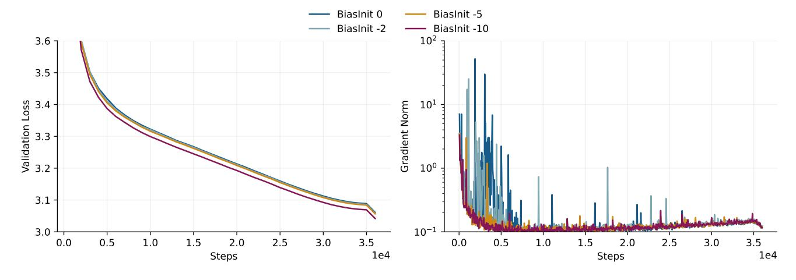
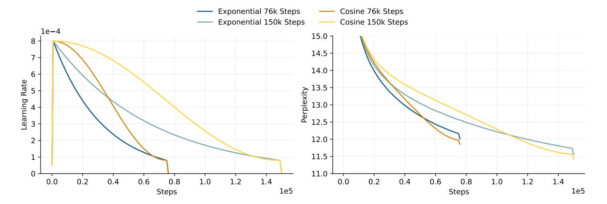
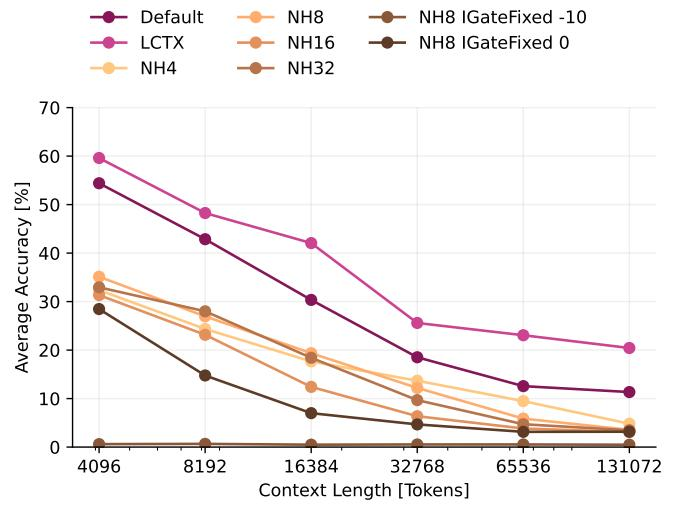

# B. Training Recipe

Optimization. Pre-training was conducted on a high-performance computing cluster comprising 128 NVIDIA H100 GPUs. We use Fully Sharded Data Parallel (FSDP) and activation checkpointing to reduce the parameter and activation memory footprint. We pre-train xLSTM 7B for a total of 550K (thousand) training steps with batch size 512 and context length 8192, encompassing a total of 2.3T (trillion) training tokens. We apply batch size ramp-up with batch size 128 for the first 2000 steps, 256 for the next 2000 steps, and the full batch size (512) afterward. We use the AdamW optimizer [\(Loshchilov & Hutter,](#page-11-14) [2019\)](#page-11-14) with (peak) α = 5 × 10−4 , β1 = 0.99, β2 = 0.95, ϵ = 10−8 , weight decay 0.1 and gradient clipping norm 0.5. The learning rate schedule comprises a linear warm-up over 3000 training steps, an exponential decay phase that spans 540,000 steps, and a linear cool-down lasting 7000 steps. The exponential decay factor is chosen so that 0.1 × α is reached after 500,000 steps.

Sequence packing. Language datasets come with documents of highly varying lengths. To efficiently train a model by processing fixed sequence length sequences (e.g. 8192 tokens), multiple shorter documents are typically packed into a sequence, and the different documents are separated by an end-of-document (EOD) token. In order to avoid leaking information between independent documents that are packed into the same sequence, we reset the memory states of each mLSTM cell at the document borders signified by the EOD token. This can be easily achieved by explicitly setting the forget gate value to zero, resetting the memory state to the zero matrix.

Dataset selection. We only use publicly available high-quality datasets for pre-training. The dataset selection is divided into two training stages: In the first stage lasting 500K (thousand) training steps, we train exclusively on the DCLM dataset [\(Li et al.,](#page-11-5) [2024\)](#page-11-5). In the second stage (50K steps) towards the end of the training, we use a combination of datasets that prioritizes math, coding, and question-and-answer (Q&A) data. The dataset proportions for the second stage are listed in the second column of Tab. [5.](#page-14-1)

Similarly to [Zuo et al.](#page-12-5) [\(2024\)](#page-12-5), the second training stage includes a collection of small supervised fine-tuning (SFT) Q&A datasets to improve the model's understanding of texts involving questions and answers. These SFT datasets are all publicly available and consist of NuminaMath CoT [\(LI et al.,](#page-10-15) [2024\)](#page-10-15), MetaMathQA [\(Yu et al.,](#page-12-10) [2023\)](#page-12-10), Tulu v3.1 [\(Lambert et al.,](#page-10-16) [2024\)](#page-10-16), OpenHermes 2.5 [\(Teknium,](#page-12-11) [2023\)](#page-12-11), GSM8K [\(Cobbe et al.,](#page-9-11) [2021\)](#page-9-11), and Smoltalk (subsets magpie-ultra, longalign, and self-oss-instruct) [\(Allal et al.,](#page-9-12) [2024\)](#page-9-12).

For longer context training we replace the high-quality data cool-down by a longer context version keeping the number of tokens per step and the number of steps fixed. The batch size is reduced from 512 to 128, while increasing the context length to 32768. We replace a large share of the DCLM dataset part with long context text collections, namely LongDataCollections [\(TogetherCompute,](#page-12-12) [2023\)](#page-12-12), LongAlign10k [\(Bai et al.,](#page-9-13) [2024\)](#page-9-13), AntiHayStack [\(Pan,](#page-11-15) [2024\)](#page-11-15) and LongAlpaca12k [\(Chen](#page-9-14) [et al.,](#page-9-14) [2024\)](#page-9-14), see third column of Tab. [5.](#page-14-1)

| DATASET NAME                                | PROPORTION STANDARD | PROPORTION LONGCTX |
|---------------------------------------------|---------------------|--------------------|
| DCLM (Li et al., 2024)                      | 40%                 | 20 %               |
| FineWeb-Edu (Lozhkov et al., 2024)          | 15%                 | 15%                |
| Cosmopedia (Ben Allal et al., 2024)         | 10%                 | 10%                |
| ProofPile-2 (Azerbayev et al., 2023)        | 15%                 | 15%                |
| TheStack (Kocetkov et al., 2023)            | 15%                 | 15%                |
| SFT datasets (see Sec. B)                   | 5%                  | 5%                 |
| LongDataCollections (TogetherCompute, 2023) | -                   | 15%                |
| LongAlign10k (Bai et al., 2024)             | -                   | 1%                 |
| AntiHayStack (Pan, 2024)                    | -                   | 1%                 |

Table 5. Dataset Proportions for second training stage in standard and longer context mode.

Ablation Training For hyperparameter tuning and ablation trainings ("-abl") at the 7B scale, we use a shorter training cycle with 76,000 training steps at context length 8192 and batch size 256, resulting in 160B tokens. We use a linear warmup of 3000 steps, cosine decay to 10% of the peak learning rate at 75,000 steps and a linear cooldown of 1,000 steps to learning rate 0 at the end. Here, we only train on a subset of the DCLM dataset, without high-quality data in the late phase of pre-training. Peak learning rate and other training hyperparameters are the same as for the main training.

LongAlpaca12k [\(Chen et al.,](#page-9-14) [2024\)](#page-9-14) - 2%

## C. Experiments

#### C.1. Extended Evaluation

To enable comparability to older models, we evaluate our models on the task selection from the first version of the HuggingFace leaderboard using HuggingFace's lighteval (Beeching et al., 2023; Fourrier et al., 2023). The results in Tab. 6 show that there is a trend upwards in metrics from older (e.g. Llama 2) to newer models (e.g. Llama 3.1), but that the differences and ordering between models vary across the tasks.

| MODEL                       | ARC-C↑ | MMLU↑ | HELLASWAG↑ | Winogrande ↑ | TruthfulQA↑ | OPENBOOKQA↑ | PiQA ↑ | AVERAGE ↑ |
|-----------------------------|--------|-------|------------|--------------|-------------|-------------|--------|-----------|
| Transformers                |        |       |            |              |             |             |        |           |
| Llama-3.1-8B                | 0.562  | 0.663 | 0.720      | 0.745        | 0.362       | 0.447       | 0.818  | 0.617     |
| Llama-2-7B-hf               | 0.511  | 0.468 | 0.687      | 0.706        | 0.318       | 0.412       | 0.786  | 0.555     |
| OLMo-7B-hf                  | 0.443  | 0.286 | 0.673      | 0.661        | 0.301       | 0.383       | 0.801  | 0.507     |
| Qwen2.5-7B                  | 0.617  | 0.753 | 0.700      | 0.717        | 0.478       | 0.458       | 0.804  | 0.647     |
| Gemma-7B                    | 0.593  | 0.640 | 0.721      | 0.740        | 0.381       | 0.436       | 0.813  | 0.618     |
| HYBRID MODELS               |        |       |            |              |             |             |        |           |
| Zamba2-7B                   | 0.672  | 0.683 | 0.740      | 0.801        | 0.479       | 0.468       | 0.802  | 0.664     |
| RECURRENT MODELS            |        |       |            |              |             |             |        |           |
| Falcon-Mamba-7B             | 0.599  | 0.622 | 0.709      | 0.743        | 0.459       | 0.460       | 0.822  | 0.631     |
| Falcon-Mamba-7B (pre-decay) | 0.520  | 0.573 | 0.699      | 0.719        | 0.312       | 0.430       | 0.801  | 0.579     |
| Mamba-Codestral-7B (v0.1)   | 0.486  | 0.501 | 0.626      | 0.618        | 0.358       | 0.380       | 0.771  | 0.534     |
| RWKV-v5-Eagle-7B            | 0.449  | 0.313 | 0.622      | 0.663        | 0.330       | 0.393       | 0.772  | 0.506     |
| RWKV-v6-Finch-7B            | 0.471  | 0.442 | 0.656      | 0.696        | 0.347       | 0.399       | 0.792  | 0.543     |
| xLSTM 7B                    | 0.574  | 0.578 | 0.714      | 0.738        | 0.419       | 0.448       | 0.819  | 0.613     |
| xLSTM 7B LCTX               | 0.516  | 0.588 | 0.715      | 0.740        | 0.374       | 0.429       | 0.819  | 0.597     |

### C.2. Ablation Experiments

Effect of the Pre-norm Layer Choice (Fig. 9). Here we asses the effect of different normalization layer choices for the pre-norm in (12) and the state-norm in (6), both for the xLSTM with a pre-up projection block of Beck et al. (2024) and our new post-up projection architecture used for xLSTM 7B. We use soft-capping and the negative input bias initialization (see Sec. 3.2 and 5.3) for both architectures. For this experiment, we train models with 1.4B parameters for 31,000 steps using context length 8192 and batch size 256. Fig. 9 shows the validation loss and gradient norm for the different architectures and normalization layer choices over the course of training (only the 15,000 steps are shown). As can be seen, using LayerNorm as the pre-norm layer leads to very large gradient norms and diverging validation loss after a few training steps, whereas models with RMSNorm train stably. For the state-norm layer, the norm type has no impact on the training dynamics.

Figure 9. Comparison of pre-up projection and post-up projection blocks with different combinations of RMSNorm and LayerNorm. At each step, the plot shows the maximum gradient norm observed within the previous 50 steps.

**Effect of Soft-Capping (Fig. 10).** The two runs in Fig. 10 show the effect of soft-capping for two 7B sized xLSTM models trained for 76,000 steps at batch size 256 and context length 8192, for an effective 160B tokens.

Figure 10. Effect of softcapping. Two 7B sized xLSTM models are trained with and without soft-capping for 160B tokens. The lower gradient norm noise on the right is a clear indicator for better model performance on the left of the model trained with softcapping. At each step, the plot shows the maximum gradient norm observed within the previous 50 steps.

Effect of Negative Input Gate Bias Init (Fig. 11). In this experiment we train 160M parameter models with batch size 128 and context length 4096 and vary the input gate bias initialization [0, -2, -5, -10]. The weights of the input gates are initialized to 0.

In Figure 11 we observe that initializing the input gate biases at -10 effectively mitigates gradient norm spikes and reduces gradient norm variance during training. In our experiments up to 7B parameters we observed this behavior transfers across model scales.

We therefore initialize the input gate biases to -10. For an extensive discussion of this behavior we refer to concurrent work by Anonymous (2025).

Figure 11. Effect of the Bias Initialization. We conduct experiments with four different input gate biases at the 160M parameter scale, with validation loss on depicted to left and gradient norm on the right, along the training steps. The higher input gate bias initializations show large gradient norm spikes, which results in worse training results. Only the lowest initialization can maintain smooth and low gradient norms with at the best validation perplexities. The reason for this behavior is studied in more detail in (Anonymous, 2025). At each step, the plot shows the maximum gradient norm observed within the previous 50 steps.

**Effect of the Learning Rate Scheduler (Fig. 12).** In our largest experiments, we choose a linear warmup followed by an exponential decay as a learning rate schedule in order to enable a continued pre-training with more tokens and without an additional warmup. However, smaller-scale experiments in Fig. 12 show the benefit of a cosine schedule over an exponential one.

Figure 12. Effect of Learning Rate Scheduler. The tested learning rate schedules are shown on the left, with the corresponding training perplexities on the right. While the exponential learning rate schedule can be continued trivially, the cosine schedule actually works slightly better given a fixed number of iterations. The learning rate cooldown to zero at the end gives a similar and significant benefit in both cases.

Effect of Memory State Size and Input Gate on Long Context Evaluations (Fig. 13, Tab. 7 and 8). In order to test the influence of the head numbers (cell dimensions) and input gate on long context abilities, we test the ablation models trained in Sec. 5.3 for their performance in the RULER benchmark (Hsieh et al., 2024). The results in Fig. 13 show that, while the effect of the head number and equivalently the recurrent memory is inconclusive, the models strongly benefit from the learnable, exponential input gate for the long context performance.

Figure 13. RULER average accuracies for different number of heads/cell dimensions, and fixed input gate. The ablations are trained on 160B tokens at 8k context.

Additionally, we evaluate our ablation versions trained for 160B tokens and evaluated on the current and old HuggingFace LLM Leaderboard as in Tab. 1 and 6, respectively. Results in Tab. 7, 8 show only slight influence of the head dimensions or fixing input gate. Only fixing the input gate to the very small value of its standard bias initialization has a stronger impact on the Leaderboard v1.

Table 7. Model Performance for different number of heads and non-trainable input gate on the Huggingface Leaderboard v2 tasks. ↑ indicates larger values are better.

| Model                           | ВВН↑  | MMLU-Pro↑ | Матн ↑ | MuSR↑ | GPQA↑ | IFEval ↑ | AVERAGE ↑ |
|---------------------------------|-------|-----------|--------|-------|-------|----------|-----------|
| xLSTM 7B abl NH4                | 0.306 | 0.114     | 0.004  | 0.363 | 0.253 | 0.160    | 0.200     |
| xLSTM 7B abl NH8                | 0.304 | 0.115     | 0.002  | 0.363 | 0.248 | 0.173    | 0.201     |
| xLSTM 7B abl NH16               | 0.317 | 0.119     | 0.002  | 0.390 | 0.258 | 0.161    | 0.208     |
| xLSTM 7B abl NH32               | 0.327 | 0.120     | 0.001  | 0.379 | 0.256 | 0.171    | 0.209     |
| xLSTM 7B abl NH8 IGateFixed 0   | 0.303 | 0.117     | 0.004  | 0.381 | 0.229 | 0.149    | 0.197     |
| xLSTM 7B abl NH8 IGateFixed -10 | 0.308 | 0.109     | 0.000  | 0.357 | 0.253 | 0.165    | 0.199     |
| xLSTM 7B                        | 0.381 | 0.242     | 0.036  | 0.379 | 0.280 | 0.244    | 0.260     |
| xLSTM 7B LCTX                   | 0.390 | 0.252     | 0.040  | 0.374 | 0.253 | 0.234    | 0.257     |

Table 8. Model Performance for different number of heads and non-trainable input gate on the Huggingface Leaderboard v1 tasks. ↑ indicates larger values are better.

| MODEL                           | ARC-C↑ | $MMLU \uparrow$ | $HellaSwag\uparrow$ | $Winogrande \uparrow$ | TruthfulQA $\uparrow$ | OpenBookQA $\uparrow$ | PiQA ↑ | Average ↑ |
|---------------------------------|--------|-----------------|---------------------|-----------------------|-----------------------|-----------------------|--------|-----------|
| xLSTM 7B abl NH4                | 0.492  | 0.296           | 0.665               | 0.672                 | 0.282                 | 0.405                 | 0.798  | 0.516     |
| xLSTM 7B abl NH8                | 0.487  | 0.292           | 0.669               | 0.680                 | 0.302                 | 0.426                 | 0.791  | 0.521     |
| xLSTM 7B abl NH16               | 0.505  | 0.351           | 0.668               | 0.701                 | 0.294                 | 0.409                 | 0.796  | 0.532     |
| xLSTM 7B abl NH32               | 0.500  | 0.378           | 0.666               | 0.676                 | 0.325                 | 0.411                 | 0.799  | 0.536     |
| xLSTM 7B abl NH8 IGateFixed 0   | 0.464  | 0.292           | 0.658               | 0.672                 | 0.280                 | 0.415                 | 0.788  | 0.510     |
| xLSTM 7B abl NH8 IGateFixed -10 | 0.241  | 0.250           | 0.340               | 0.519                 | 0.286                 | 0.226                 | 0.681  | 0.363     |
| xLSTM 7B                        | 0.574  | 0.578           | 0.714               | 0.738                 | 0.419                 | 0.448                 | 0.819  | 0.613     |
| xLSTM 7B LCTX                   | 0.516  | 0.588           | 0.715               | 0.740                 | 0.374                 | 0.429                 | 0.819  | 0.597     |

