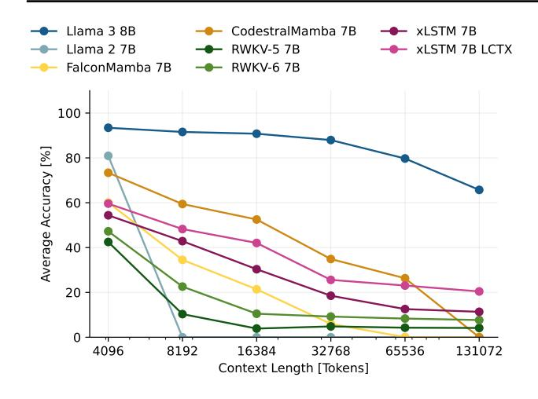
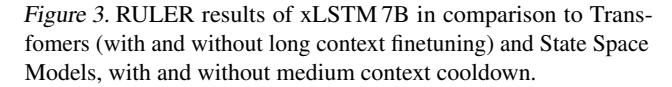
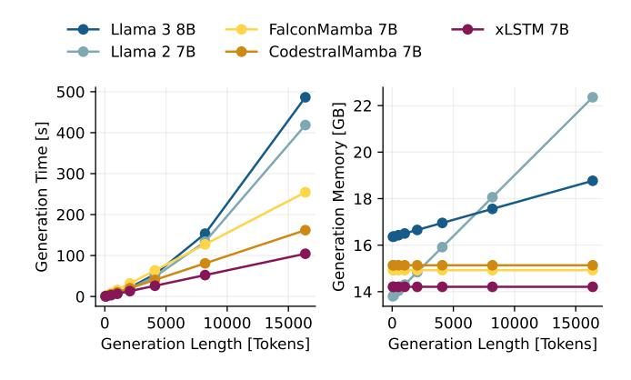
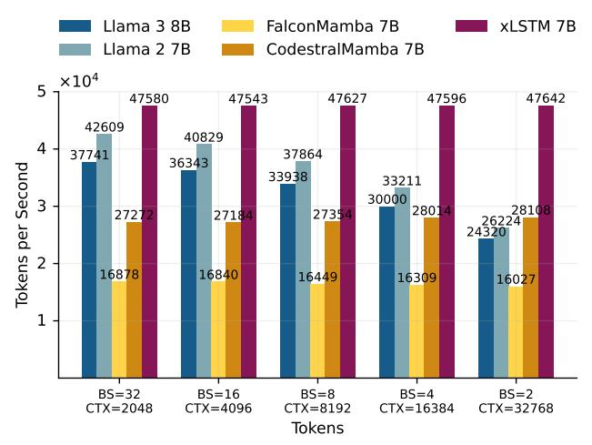

# 5. Experiments

### 5.1. Language Modeling Performance

Huggingface Leaderboard. We start by benchmarking xLSTM 7B against state-of-the-art Transformer and recurrent LLMs on the 7B parameter scale. To this end, we evaluate the performance on the Open LLM Leaderboard v2 using the LM Evaluation Harness [\(Gao et al.,](#page-10-11) [2024;](#page-10-11) [Fourrier](#page-10-12) [et al.,](#page-10-12) [2024\)](#page-10-12). The results are summarized in Tab. [1,](#page-4-1) showing that xLSTM 7B ranks in the mid-range among 7B-scale models, several of which benefited from substantially larger training datasets. We believe that with a larger and better curated training dataset, including a greater emphasis on math and code data in earlier training phases, xLSTM 7B could match the performance of the strongest 7B models.

Long-Context Evaluation and Fine-Tuning. To evaluate long-context capabilities, we use the RULER benchmark [\(Hsieh et al.,](#page-10-13) [2024\)](#page-10-13), which consists of a set of synthetic needle-in-a-haystack, question-answering and variable tracking tasks, with varying context length from 4K to 131K tokens. For this benchmark, we consider both our standard xLSTM 7B and a long-context version (xLSTM 7B LCTX), where we replace the standard cool-down phase described in App. [B](#page-14-0) with a long-context variant. For the long-context cool-down phase, we add long-context data (see App. Tab. [5\)](#page-14-1) to the training corpus and train the model with a context length of 32K, while adjusting the batch size to maintain the number of tokens per batch. We compare to Llama 2 7B (not long-context fine-tuned) and Llama 3.1 8B (long-context fine-tuned up to 131K tokens) as Transformer baselines, CodestralMamba and FalconMamba as State Space Model baselines, and RWKV-5/6 as additional RNN baselines.

The results on RULER are shown in Fig. [3.](#page-6-1) As expected, Llama 3 provides the strongest baseline, since it is heavily fine-tuned on very long contexts and with a more advanced and optimized approach [\(Grattafiori et al.,](#page-10-14) [2024\)](#page-10-14). On the other hand, Llama 2 fails entirely for context lengths beyond 4k, for which it has not been trained. For xLSTM 7B, the long-context cool-down stage in pre-training largely improves long-context capabilities, resulting in competitive performance compared to state-space models and outperforming RWKV-5/6. Notably, the long-context xLSTM 7B achieves 20% average accuracy at a context length 131k, although it was trained only with a context length up to 32k during the cool-down phase. This is particularly remarkable given that, unlike Transformers with a growing KV cache, xLSTM 7B must store information from the entire sequence in a fixed-size memory with limited capacity (see Tab. [3\)](#page-8-1). We assume that xLSTM 7B's performance could be pushed further by explicitly training on even longer sequences and with a more advanced fine-tuning protocol as it was used in the training of Llama 3 [\(Grattafiori et al.,](#page-10-14) [2024\)](#page-10-14).

In Sec. 5.3, we further investigate the effect of the memory state size and the input gate on the long context capabilities of xLSTM 7B.

### 5.2. Speed Benchmarks

The constant memory size and linear compute scaling with context length of our xLSTM architecture enable highly efficient generative inference in large scale-inference serving environments as well as local inference running on edge devices.

We focus on the local single user inference setting, which is common when models are deployed on edge devices. Therefore, we benchmark generative inference with our xLSTM 7B model on a single NVIDIA H100 GPU with batch size 1, unless specified otherwise. We compare our xLSTM 7B to Llama 2 and Llama 3 models as Transformer baselines and Falcon Mamba (Mamba 1 architecture) and Codestral Mamba (Mamba 2 architecture) as Mamba baselines. We use model implementations from Huggingface transformers library and optimize each with torch.compile 6 and PyTorch CUDA Graphs (Nguyen et al., 2021).

Generation Throughput. The generation throughput measures the generation speed in tokens per second at varying prefill lengths, i.e., varying length of documents the model gets to read before it starts to generate text. In Fig. 4, we observe that due to the quadratic scaling with input context length of the attention mechanism, the speed at which the Transformer models can generate text significantly drops for longer prefill lengths. In contrast, recurrent architectures

*Figure 4.* Throughput for generating 100 tokens with batch size 1 at varying prefill lengths.

with constant cost per generated token have a constant generation speed independent of the input context length.

We find that xLSTM 7B is about 50% faster in text generation than Mamba, which we attribute mostly to our optimized block design (see Sec. 3), and even faster than Llamabased Transformer models with a similar block design at prefill length 0.

Generation Time and Memory Consumption. We measure the token generation time and GPU memory usage (without pre-fill) for different generation lengths. Fig. 5 (left) demonstrates the linear scaling of recurrent models vs. the quadratic scaling of Transformers in compute (runtime), while Fig. 5 (right) shows the constant memory size of recurrent models compared to the linear growth of the Transformer KV-cache. Since Llama 3 uses grouped query attention (Ainslie et al., 2023) the memory usage grows slower compared to Llama 2, which uses default multi-head attention.

With our optimized block design, we operate the mLSTM in a lower dimensional space. This results in a significantly lower memory footprint (Fig. 5 (right)) and lower generation times (Fig. 5 (left)) of our xLSTM 7B model compared to the Mamba models.

**Time To First Token.** In applications, where the language model operates as interface to the user (potentially on edge devices), it is important to have short response times. In Fig. 6, we measure this response time or latency as the time the model takes to generate 1 or 100 token after consuming varying prefill lengths. Our xLSTM 7B achieves the fastest response times for all prefill lengths.

6https://github.com/huggingface/transformers

Figure 5. Time and GPU memory used for generation of a single sequence of varying lengths for generation without prefill.

Figure 6. Time to first (1) token and time to first 100 tokens at varying prefill lengths for batch size 1.

**Prefill Throughput.** Finally, we measure the prefill throughput in tokens per second for 65,536 tokens at varying batch size and context length. Due to the quadratic scaling with context length, the throughput of the Llama models decreases with longer contexts. In contrast, our xLSTM 7B achieves the highest throughput (about 70% higher than Codestral Mamba) independent of the context length.

#### 5.3. Ablation Studies

Finally, we validate our design choices to optimize the training stability and efficiency of our xLSTM 7B architecture.

**Pre-Up vs. Post-Up Projection Block.** We compare the pre-up projection block architecture against our optimized mLSTM block in terms of validation perplexity and training step time for three model sizes. For both block architectures, we apply gate soft-capping and the input gate bias initialization described in Sec. 3. The results in Tab. 2 show only a slight performance difference in terms of validation perplexity at the largest model size. However, the  $3.5\times$  speedup in training step time confirms our choice for the

Figure 7. Prefill throughput varying batch size and context length.

post-up projection block in xLSTM 7B, deviating from the pre-up projection of Mamba (Gu & Dao, 2024; Dao & Gu, 2024) and the previous xLSTM architecture (Beck et al., 2024).

**Memory State Size.** The memory state size as well as the training step time is directly influenced by the number of heads (see Sec. 3.1 and Tab. 3). In this experiment we investigate how the memory state size affects the performance of the xLSTM in validation perplexity, on downstream tasks as well as on long context tasks. To do so, we train xLSTM models with 7B parameters and different number of heads on 160B tokens of our pre-training dataset. In our evaluations in perplexity (Tab. 3) and on downstream tasks (Tab. 7 and 8), we find that the performance remains stable across different the number of heads, i.e., memory state sizes, with a slight improvement for more heads (e.g. 16). In contrast, our long context evaluation in Fig. 13 suggests that at very long contexts 4 and 8 heads (i.e., larger memory states) seem to perform better. While this is in line with our intuition that larger memory state size corresponds to better long-context capabilities, we believe that an even larger study (e.g., training on more tokens) than our ablation at 7B parameters and 160B tokens would be necessary to fully explore this connection.

Norm Layer Types. Our update on the xLSTM block architecture has two normalization layers, a pre-norm at the block entry and a head-wise norm layer after the mLSTM cell. In this ablation, we test the effect of the types of these normalization layers on training stability and performance, with LayerNorm (Ba et al., 2016) and RMSNorm (Zhang & Sennrich, 2019) as the options. In Fig. 9 in App. C.2 we confirm that, for the pre-norm the RMSNorm type has a strong stabilizing effect, whereas for the mLSTM cell state norm there is no impact on stability and performance.

Table 2. Comparison between the previous xLSTM architecture (Beck et al., 2024) and our xLSTM 7B architecture in terms of step time and perplexity for different number of parameters. Models of size 160M and 400M use batch size 128 distributed over 16 GPUs, and 1.4B parameter models use batch size 256 (32 GPUs). For the 7B parameter model, our new architecture uses batch size 512 (128 GPUs), whereas the previous architecture uses only batch size 256 (128 GPUs) because of the architecture's increased GPU memory requirements. Due to the expensive computational costs, we only compute the token throughput and did not fully train the 7B parameter models for this ablation.

↑/↓ indicates larger / smaller values are better.

| MODEL |                  | THROUGHPUT ↑ 1K TOKENS/SEC | Speedup ↑ | PPL ↓          | $\Delta$ PPL |
|-------|------------------|----------------------------|-----------|----------------|--------------|
| 160M  | Previous Ours | 76.20 225.99            | ×2.97     | 20.43 21.34 | +0.91        |
| 400M  | PREVIOUS OURS | 28.13 102.40            | ×3.64     | 15.26 15.74 | +0.48        |
| 1.4B  | PREVIOUS OURS | 10.57 37.03             | ×3.50     | 12.46 12.68 | +0.22        |
| 7B    | PREVIOUS OURS | 3.46 9.15               | × 2.64    | -              |              |

Table 3. Head dimension ablation for a 7B parameter xLSTM model with 32 blocks, embedding dimension 4096 and training context length 8192. KV Cache in Tokens shows how many tokens in a similar sized Transformer correspond to our state size. FLOPs forward are the mLSTM cell forward FLOPs for a full sequence. ↓ indicates smaller values are better.

| #Heads | $d_{hv}$ | Total Memory State in MB | KV Cache in Tokens | $_{\text{forward}}^{\text{FLOPs}}\downarrow$ | $_{\mathrm{PPL}}^{\mathrm{Val}}\downarrow$ | $\begin{array}{c} \text{Train Step} \\ \text{Time in s} \end{array} \downarrow$ |
|--------|----------|-----------------------------|-----------------------|----------------------------------------------|--------------------------------------------|---------------------------------------------------------------------------------|
| 4      | 1024     | 268.4                       | 256                   | 7.6e11                                       | 9.58                                       | 3.97                                                                            |
| 8      | 512      | 134.2                       | 128                   | 4.1e10                                       | 9.52                                       | 3.63                                                                            |
| 16     | 256      | 67.1                        | 64                    | 2.4e10                                       | 9.52                                       | 3.51                                                                            |
| 32     | 128      | 33.6                        | 32                    | 1.5e10                                       | 9.55                                       | 3.41                                                                            |

**Soft-capping.** Soft-capping (Eq. (13)) of the output logits and the input and forget gate pre-activations, is important for training stability. In Fig. 10 of the appendix, we visualize the validation loss and gradient norms during training on 160B tokens with and without soft-capping. The run without soft-capping shows a higher variance in the gradient norms and an overall worse validation loss.

**Input Gate.** We initialize the input gate with larger negative values (e.g. -10) to mitigate large gradient norm spikes and variance (see Sec. 3.2). This suggests that the input gate is important for the performance of the xLSTM architecture. Therefore, in App. C.2 we test the effect of having the input gate non-trainable. We compare a version with fixed input gate at one (i.e. setting weights and biases to zero) with a version, where the input gate bias is fixed at our low default initialization value of -10. We find that, while the learnable input gate only slightly improves performance of our xLSTM over the fixed input gate versions on our standard downstream tasks (App. C.2, Tab. 7 and 8), it significantly improves performance on long-context evaluations (App. C.2, Fig. 13).

#### 6. Conclusion

In this work, we demonstrate how our targeted modifications enable the xLSTM architecture to scale to models with 7B parameters, trained on 2.3 T tokens. By switching to a post-up-projection structure, gate soft-capping and proper initialization, we largely improve training stability and token throughput, making the xLSTM the fastest RNN-based architecture at the 7B scale, while competitive in performance with Transformers and other recurrent models. We believe that xLSTM's very high decoding speeds in combination with its good performance highlight its potential as foundational architecture for methods investing substantial compute at inference time.

## **Impact Statement**

This paper presents a novel architecture for fast and efficient language modeling, reducing computational costs and energy consumption without sacrificing performance. By making high-quality language models more accessible, our approach helps bridge the digital divide, enabling equitable AI deployment in low-resource settings. Additionally, the efficiency gains contribute to environmental sustainability by lowering the carbon footprint of large-scale NLP systems. However, there might be both positive and negative societal impacts. We are aware of the risks, but believe that our and the overall advancements in the field of machine learning technology provide a net benefit to society and the world.

