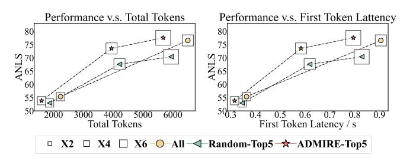
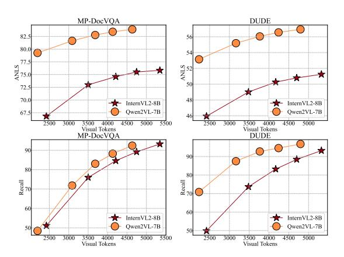
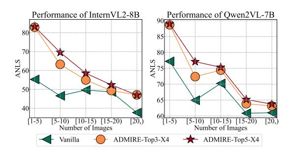
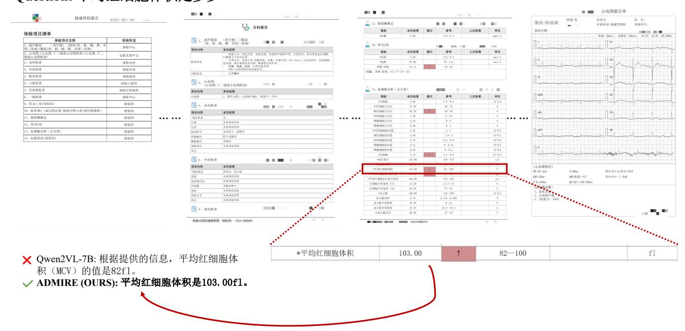

# 6 Experiment

### 6.1 Experiment Setup

**Datasets.** MP-DocVQA [4] and DUDE [22] are two datasets designed for multi-image understanding in document contexts. Slide-VQA [21] focuses on slide content understanding. NewsVideoQA [12] is a question-answer dataset for news videos, featuring text-rich frames from a variety of English-language news channels world-wide. Additionally, the Physical Report Question and Answer (PRQA) dataset is used as an independent external validation set to evaluate ADMIRE's performance in real-world industrial scenarios.

Implementation Details We select InternVL2-8B [5] and Qwen2VL-7B [24] as our base models to evaluate the performance of our method across different resolution enhancement techniques, with an initial resolution set to 448x448. Most of the experiments in this paper are conducted without training to assess the effectiveness and generalization of our approach. In the ablation study, we present results from supervised fine-tuning experiments. AdamW is used as the optimizer with a learning rate of 1e-6, and the fine-tuning process is carried out for one epoch on an ensemble of the MP-DocVQA, DUDE, NewsVideoVQA, and SlideVQA training datasets.

**Evaluation** For validation, we adhere to the evaluation metrics specified in document understanding tasks [7] and utilize Average Normalized Levenshtein Similarity (ANLS) to assess the effectiveness of models. Furthermore, we evaluate different methods by measuring the average number of tokens (Total Tokens) and the average latency of the first token latency per second (FTL/s) as additional metrics.

### 6.2 Comparison Study

6.2.1 Comparison with State-of-the-Arts OCR-free Models. In this section, we evaluate how ADMIRE enhances the performance of LVLMs across four text-rich multi-image understanding benchmarks: MP-DocVQA, DUDE, NewsVideoVQA and SlideVQA. For a fair comparison, we do not fine-tune InternVL2-8B or Qwen2VL-7B on any training datasets. In Table 2, we compare our approach

Table 3: Ablation study of KIE and DVD in MP-DocVQA and DUDE. "Tokens" and "FTL/s" respectively denote the average of visual tokens and first token latency. "Avg." denotes the average performance of two datasets. We compare our methods with different selecting methods, including all images and 3 random images. "/w.o. DVD" denotes do not use "DVD" to lower the computing overhead.

| •            |        | Vanilla |       |        | All    |       |        | Random |       | ADMI   | RE / w.o. | DVD   |        | ADMIRE |       |
|--------------|--------|---------|-------|--------|--------|-------|--------|--------|-------|--------|-----------|-------|--------|--------|-------|
|              | Tokens | FTL/s   | ANLS  | Tokens | FTL/s  | ANLS  | Tokens | FTL/s  | ANLS  | Tokens | FTL/s     | ANLS  | Tokens | FTL/s  | ANLS  |
| InternVL2-8B |        |         |       |        |        |       |        |        |       |        |           |       |        |        |       |
| MP-DocVQA    | 1509   | 0.3356  | 51.53 | 2235   | 0.3839 | 55.37 | 1868   | 0.3488 | 52.23 | 1868   | 0.3487    | 54.98 | 1494   | 0.3118 | 53.37 |
| DUDE         | 1527   | 0.3621  | 37.37 | 2552   | 0.4190 | 41.13 | 2032   | 0.3910 | 38.04 | 2032   | 0.3912    | 40.53 | 1612   | 0.3512 | 39.47 |
| Avg.         | 1518   | 0.3489  | 44.45 | 2394   | 0.4015 | 48.25 | 1950   | 0.3699 | 45.14 | 1950   | 0.3700    | 47.76 | 1553   | 0.3315 | 46.42 |
| Qwen2vl-7B   |        |         |       |        |        |       |        |        |       |        |           |       |        |        |       |
| MP-DocVQA    | 1448   | 0.4588  | 72.55 | 2788   | 0.6044 | 81.59 | 1975   | 0.5550 | 62.23 | 1975   | 0.5552    | 79.36 | 1766   | 0.4933 | 77.33 |
| DUDE         | 1481   | 0.4599  | 48.63 | 2817   | 0.6453 | 54.55 | 2007   | 0.5565 | 49.07 | 2007   | 0.5560    | 52.87 | 1780   | 0.4911 | 51.91 |
| Avg.         | 1464.5 | 0.4594  | 60.59 | 2803   | 0.6249 | 68.07 | 1991   | 0.5558 | 55.65 | 1991   | 0.5556    | 66.12 | 1773   | 0.4922 | 64.62 |

with state-of-the-art OCR-free models and LVLMs. "/w. KIE-Topk-XN" refers to using KIE to select the top k images and upscale maximum pixel count for very important images by a factor of N. The factor of k for our method is variable. A larger k results in better performance. The vanilla InternVL2-8B achieves ANLS scores of 51.53 in MP-DocVQA and 37.37 in DUDE, both lower than those of current state-of-the-art OCR-free models. However, with the "KIE-Top5-X4" enhancement, InternVL2-8B improves by 23.06 ANLS in MP-DocVQA and 12.75 ANLS in DUDE. Notably, Qwen2VL-7B, with our proposed method, achieves state-of-theart results with scores of 82.78 on MP-DocVQA, 56.05 on DUDE, 69.29 on NewsVideoVQA and 60.54 on SlideVQA. Additionally, our method achieves a ANLS improvement of 13.36 points on MP-DocVQA benchmark compared to DocOwl2-8B [7] and 2.15 points on DUDE benchmark compared to GPT4(v) without requiring extra training. This highlights the generalization and effectiveness of our approach.

Figure 4: Comparison study of performance and overhead. "All" and "Random-Top5" denotes enhancing resolution of all images and 5 random images respectively. We use the squares with different sizes to demonstrate the enhancing ratios. "ANLS" is considered as the measures of performance. ADMIRE-Top5-X6 achieves an 77.58 ANLS with 5674 total tokens and 0.7947 FTL/s, compared to All-X4, which achieves 76.58 ANLS with 6500 total tokens and 0.9058 FTL/s.

6.2.2 Performance v.s. Efficiency. To evaluate how our method balances performance and efficiency, we conducted experiments using InternVL2-8B on the MP-DocVQA benchmark with Top5 important

images. As shown in Figure 4, we use squares of varying sizes to illustrate the enhancement ratios. "ANLS" is used as the performance measure. The terms "All" and "Random-Top5" denote enhancing resolution of all images and only 5 randomly selected images, respectively. We evaluate computing and memory overhead through the average number of tokens (Total Tokens) and the average number of the first token latency per second (FTL/s) of MP-DocVQA benchmark. Increasing the resolution of all images significantly boosts the ANLS performance of LVLMs, but also raises the total visual tokens and first token latency. There is a trade-off between the model's ANLS performance and computing and memory overhead. In light of this, we compare "ADMIRE-Top5", "All" and "Random-Top5" methods at different maximum pixel count upscaling factors of 2, 4, and 6. Given the maximum total token limit, enhancing all images multiple times is impractical. ADMIRE-Top5-X6 achieves an 77.58 ANLS with 5674 total tokens and 79.47 FTL/s, compared to All-X4, which achieves 76.58 ANLS with 6500 total tokens and 0.9058 FTL/s. ADMIRE delivers superior performance with lower overhead compared to "All" and "Random-Top5" methods.

#### 6.3 Ablation Study

6.3.1 Ablation of TIE. We quantitatively evaluate the performance of the text-guided scorer (TIE) by comparing it to a baseline method, which randomly selects k images to enhance their resolution. The Recall of evidence candidates, defined as the number of images identifying the most relevant image to the answer (which may span 1 to 3 pages), serves as the metric. TIE outperforms the random selection method, achieving a higher recall rate by leveraging knowledge embedded in the pretrained LVLM, as shown in Table 4. Notable improvements are observed with both InternVL2-8B and Qwen2VL-7B when utilizing Topk, where  $k \in \{3, 5\}$ . We observe a significant improvement in Recall on the MP-DocVQA and DUDE datasets when TIE is incorporated. For instance, with InternVL2-8B, the average Recall on MP-DocVQA and DUDE datasets is 84.58 and 83.21, compared to 63.27 and 54.33 for the random Top5 baseline.

6.3.2 Ablation of KIE and DVD. We examine the performance and efficiency of our proposed KIE and DVD modules across MP-DocVQA and DUDE, comparing them to "All" and "Random" methods, as shown in Table 3. For a fair comparison, "All", "Random",

Table 4: Comparison between Text-guided Scorer (TIE) and Random methods. "Recall" is considered as the measures of performance.

| Topk | Method               | MP-DocVQA | DUDE  |
|------|----------------------|-----------|-------|
|      | Baseline             | 43.32     | 39.44 |
| 3    | InternVL2-8B /w. TIE | 75.96     | 73.69 |
|      | Qwen2VL-7B /w. TIE   | 71.81     | 87.50 |
|      | Baseline             | 63.27     | 54.33 |
| 5    | InternVL2-8B /w. TIE | 84.58     | 83.21 |
|      | Qwen2VL-7B /w. TIE   | 83.03     | 92.75 |

"ADMIRE / w.o. DVD" and "ADMIRE" use the same maximumn upscaling ratio of 2, while "Vanilla" means feeding original images into LVLMs. Except "Vanilla" and "All", the other methods select 3 images to upscale. Though "All" improve the InternVL2-8B and Qwen2VL-7B largely, it respectively increases nearly 50% visual tokens and 100% visual tokens. In resource-limited scenarios, "ADMIRE" utilize "DVD" to strike the trade-off the performance and overhead, achieving improved performance and nearly computing overhead compared with "Vanilla". Specifically, using Qwen2VL-7B, "Vanilla" scores 72.55 and 48.63 on MP-DocVQA and DUDE respectively, whereas "ADMIRE" yields notably superior results of 77.33 (a 4.78-point improvement) on MP-DocVQA and 51.91 (a 3.28-point improvement) on DUDE.

## 6.4 Analysis Study

Figure 5: Results of different numbers of selected enhanced images. We demonstrate the results of ADMIRE with 1, 3, 5, 7, 10 enhanced images in MP-DocVQA and DUDE.

6.4.1 Analysis of the Number of Enhanced Images for KIE. In this section, we examine the effect of increasing the number of resolution-enhanced images on model performance. Figure 5 shows the overall trend of overall ANLS and the recall of images relevant to answers, plotted against the number of visual tokens. As the number of resolution-enhanced images grows, ADMIRE demonstrates consistent improvements in both ANLS and recall metrics. However,

these gains begin to plateau beyond a certain point. To balance performance improvements with computational efficiency, we select 3 and 5 resolution-enhanced images as optimal configurations.

Figure 6: Ablation results of our method across samples with varying image counts are presented. The range of image numbers is divided into five intervals: "[1,5)", "[5,10)", "[10,15)", "[15,20)" and "[20,)".

6.4.2 Performance among Different Numbers of Images. In this section, we evaluate the generalization ability of our proposed ADMIRE across samples with varying image quantities, as illustrated in Figure 6. The image count is divided into five intervals: "[1,5)", "[5,10)", "[10,15)", "[15,20)" and "[20,)". ADMIRE shows consistent improvement across all intervals for both InternVL2-8B and Qwen2VL-7B, primarily due to its effective resolution enhancement. When the number of images is fewer than 5, selecting the top 3 images for resolution enhancement is sufficient. As the number of images increases, "ADMIRE-Top5-X4" outperforms "ADMIRE-Top3-X4" due to the limited recall rate.

Table 5: Performance of ADMIRE based on supervised finetuned InternVL2-8B. The bold font indicates the best performance

| Method                 | MP-DocVQA | DUDE  | NewsVideoVQA | SlideVQA |
|------------------------|-----------|-------|--------------|----------|
| InternVL2-8B           | 51.53     | 37.37 | 65.02        | 54.92    |
| InternVL2-8B /w. sft   | 57.81     | 41.24 | 67.79        | 59.20    |
| ADMIRE-Top5-X2         | 53.37     | 39.47 | 67.21        | 55.43    |
| ADMIRE-Top5-X2 /w. sft | 60.03     | 42.50 | 68.68        | 60.29    |
| ADMIRE-Top5-X4         | 73.55     | 49.84 | 66.31        | 55.91    |
| ADMIRE-Top5-X4 /w. sft | 75.56     | 51.71 | 68.68        | 61.88    |

6.4.3 Results of Supervised Finetuning. In this section, we evaluate the applicability of our method to supervised fine-tuned models. We use InternVL2-8B as the base model, which is trained for one epoch on an ensemble of four multi-image understanding benchmark datasets. The testing setup follows the same protocol as the other training-free experiments. Our method, "ADMIRE-Top5-X4/w. sft" outperforms both "ADMIRE-Top5-X4" and "Vanilla /w. sft" by 1.99 ANLS and 17.75 ANLS, respectively, on the MP-DocVQA dataset, as presented in Table 5. All supervised fine-tuned models outperformed the baseline.

