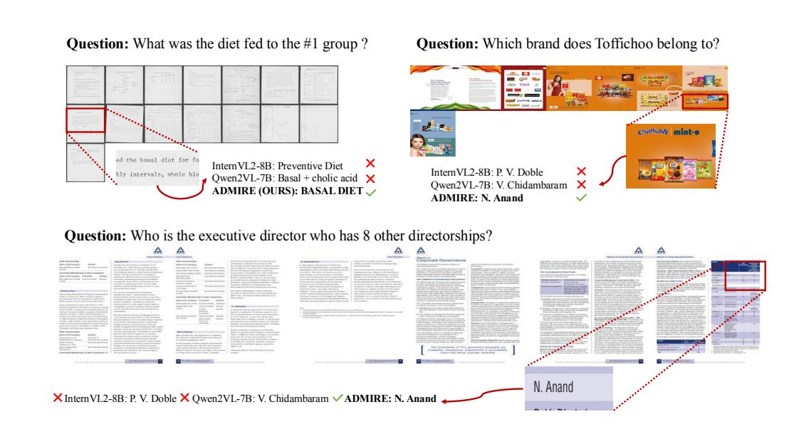

# B Case Study

In this section, we visualize some cases of InternVL2-8B and Qwen2VL-7B in MP-DocVQA, DUDE and PRQA. Limited to the low resolution of images containing key information, the original InternVL2-8B generate the incorrect answer. Our proposed ADMIRE utilizes the text-guided image scorer adaptively to select those images containing key information and enhance their resolution, which enables it to generate the correct answer. As shown in Figure [7,](#page-8-0) Figure [8](#page-10-2) and Figure [9,](#page-11-1) we respectively demonstrate results of InternVL2-8B, Qwen2VL-7B and ADMIRE.

Table 7: Details of datasets.

| Dataset     | Type       | Domain       | Number of Training Set | Number of Validation Set | Range Number of Images | Average Resolution of Images |
|-------------|------------|--------------|---------------------------|-----------------------------|---------------------------|---------------------------------|
| MP-DocVQA   | Document   | Industry     | 36k                       | 5k                          | [1,40]                    | 1811*2145                       |
| DUDE        | Document   | Multi-domain | 24k                       | 5k                          | [1,50]                    | 1743*2177                       |
| NewsVideoQA | Video News | Videos       | 8k                        | 0.7k                        | [3,41]                    | 1246*708                        |
| SlideVQA    | Slide      | Slide Decks  | 10k                       | 1.6k                        | [15,20]                   | 1026*727                        |
| PRQA        | Document   | Industry     | -                         | 1.3k                        | [6,26]                    | 1893*1339                       |

Figure 8: Case study of ADMIRE in MP-DocVQA.

Figure 9: Case study of ADMIRE in DUDE.