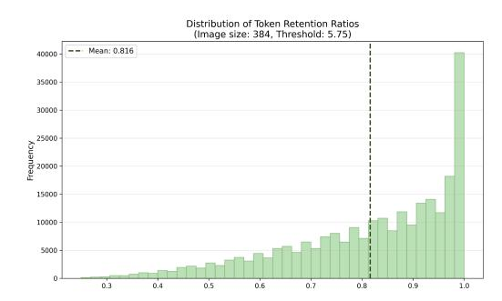

# 2 RELATED WORK

Vision Transformers and Patchification. Vision Transformers (ViTs) [\(Dosovitskiy et al.,](#page-11-0) [2020\)](#page-11-0) are currently the *de facto* standard architecture for computer vision backbones [\(Xu et al.,](#page-14-1) [2022;](#page-14-1) [Kirillov et al.,](#page-11-2) [2023;](#page-11-2) [Peebles & Xie,](#page-13-2) [2022\)](#page-13-2). In contrast to language models, which typically use subword tokenizers [\(Sennrich et al.,](#page-13-1) [2016;](#page-13-1) [Kudo & Richardson,](#page-11-1) [2018\)](#page-11-1) with varying numbers of bits per token, ViTs *patchify* images into equally sized patches, each becoming a token. This can result in an enormous number of tokens, especially at high resolution. Transformer-based generative models [\(Peebles & Xie,](#page-13-2) [2022;](#page-13-2) [Esser et al.,](#page-11-3) [2020\)](#page-11-3) use visual tokenizers, typically using a variational auto-encoder [\(Kingma et al.,](#page-11-4) [2013;](#page-11-4) [Van Den Oord et al.,](#page-13-3) [2017\)](#page-13-3), to project images into a compressed latent space, reducing the input size significantly. Some recent works explore adaptive visual tokenizers [\(Yan et al.,](#page-14-2) [2024;](#page-14-2) [Duggal et al.,](#page-11-5) [2024\)](#page-11-5), which dynamically allocate more tokens to more complex visual inputs, but do not meaningfully speed up training or generation. As a result, image understanding tasks are typically limited to lower resolution.

Reducing ViT Tokens. Accelerating ViTs by removing tokens is a rich area of research. Methods such as pruning [\(Yu & Xiang,](#page-14-3) [2023;](#page-14-3) [Yang et al.,](#page-14-4) [2023;](#page-14-4) [Zheng et al.,](#page-14-5) [2022\)](#page-14-5), compressed representations [\(Wu et al.,](#page-14-6) [2018;](#page-14-6) [Park & Johnson,](#page-13-4) [2023\)](#page-13-4), or quantization [\(Liu et al.,](#page-12-0) [2021b;](#page-12-0) [Li et al.,](#page-12-1) [2022c;](#page-12-1) [Moon et al.,](#page-13-5) [2024\)](#page-13-5) remove redundancies or compactly encode parameters, reducing inference time and memory usage. Alternative attention mechanisms, such as linearized [\(Katharopoulos et al.,](#page-11-6) [2020;](#page-11-6) [Lu et al.,](#page-12-2) [2021\)](#page-12-2) or local window attention [\(Liu et al.,](#page-12-3) [2021a;](#page-12-3) [Wei et al.,](#page-13-6) [2023;](#page-13-6) [Chen et al.,](#page-10-2) [2023b\)](#page-10-2), improve efficiency by limiting token interactions. More related to our work are methods that exploit the inherent redundancy of images [\(Meng et al.,](#page-13-7) [2022;](#page-13-7) [Yin et al.,](#page-14-0) [2022;](#page-14-0) [Kong et al.,](#page-11-7) [2022;](#page-11-7) [Rao et al.,](#page-13-0) [2021\)](#page-13-0) and videos [\(Choudhury et al.,](#page-10-3) [2025;](#page-10-3) [Ding et al.,](#page-11-8) [2023;](#page-11-8) [Wu et al.,](#page-14-7) [2023\)](#page-14-7) by pruning uninformative tokens. While these works are content-aware, most require learning which tokens are unhelpful, negating any training speedup and preventing inference on batch sizes greater than 1. Several methods instead merge tokens based on similarity (Bolya et al., 2022; Bolya & Hoffman, 2023; Liang et al., 2022b; Shang et al., 2024; Cao et al., 2023; Liang et al., 2022a; Tran et al., 2024; Kallini et al., 2024; Lee & Hong, 2024; Wu et al., 2023), which accelerates training. However, merging methods typically combine a constant number of tokens for each input, which can be suboptimal for inputs with varying complexities. APT strikes a balance between these two lines of work by providing significant acceleration to training and inference while maintaining content-awareness.

Adaptive Patch Sizing for Efficient ViTs. Our work is not the first to propose using multiple patch sizes for faster ViTs. Early attempts in this direction (Chen et al., 2021; Beyer et al., 2023; Wang et al., 2024; 2021; Zhou & Zhu, 2023; Hu et al., 2024) train models that are capable of using different patch sizes, but still require a single patch size for each image. Closer to APT are works that allow for varying patch sizes within a single image (An et al., 2024; Ronen et al., 2023; Chen et al., 2023a; Bai et al., 2024). However, CF-ViT (Chen et al., 2023a) and Quadformer (Ronen et al., 2023) rely on a fixed number of patches, neglecting the variability of semantic information across images, which can lead to suboptimal performance. MG-VIT (Zhang et al., 2023b) also supports two patch scales, but relies on attention scores to decide patch sizes, preventing use of efficient attention kernels, and also requires training from scratch, which is significantly more expensive than APT.

Closest to our work is MS-ViT (Havtorn et al., 2023), which, like DynamicViT (Rao et al., 2021) learns a gating network to determine patch sizes and defines separate patch embedding networks for each size. However, it requires significant fine-tuning on pre-trained networks and does not speed up training. APT resolves this issue while demonstrating dramatically larger speedups at higher resolutions and on larger models.

### 3 Method

Our goal is to achieve a significant wall-clock speedup during *both* training and inference by using different-sized patches in different regions of the image. We first describe how we allocate different patch sizes within an image (Section 3.1) and then how we process different-sized regions into the same embedding space (Section 3.2). We then explain how we efficiently handle different input sizes and how we can adapt APT to work on dense visual prediction tasks like object detection.

#### 3.1 DECIDING PATCH SIZES

Consider a vision transformer that takes an  $H \times W \times C$  image as input. The standard ViT partitions the image into a set of  $p \times p$  patches. A linear layer  $\mathcal E$  is applied to each patch to convert it into a token, of size  $d_{embed}$ , resulting in a sequence of  $N = (HW/p^2)$  tokens.

In contrast, our goal is to decide patch size based on the image content, instead of using a constant number of patches. Concretely, we define a fixed number of patch scales S, where the set of patches consists of  $\mathcal{P}=P_1\cup P_2\cup\ldots P_S$ , with each patch in  $P_i$  having size  $2^ip\times 2^ip$ . For example, if S=3,p=16, we are trying to find a smaller set of  $16\times 16,32\times 32$  and  $64\times 64$  patches while maximizing 'information' conveyed. For simplicity, we also impose the constraint that all patches follow a quadtree-like structure following a regular grid.

We use *entropy* H as a measure of a patch's compressibility, given by:

$$H(P) = -\sum_{i=0}^{L-1} p_i \log_2 p_i,$$
(1)

where  $p_i$  is the probability of pixel intensity i. Since patches contain discrete pixel values, we approximate this by binning pixel intensities and computing entropy from the resulting distribution. Entropy quantifies the unpredictability and thus information content of a patch, making it a useful predictor of compressibility—lower entropy indicates higher redundancy. A large patch with low entropy should therefore be efficiently representable by a  $d_{\rm embed}$ -dimensional vector. We discuss alternative measures further in the Appendix.

We obtain the patchification of the image hierarchically, as illustrated in Figure 3. We first divide the image into patches at the coarsest scale  $2^Sp \times 2^Sp$  and compute their entropies. We then retain

Figure 2: **APT overview.** APT works by measuring the entropy at multiple scales and assigning large patch sizes to low entropy patches. All patches are projected to the same size token embedding, and the reduced size input sequence is passed to the transformer.

Figure 3: **Embedding Different Patch Sizes.** The smallest size patches are projected with the patch embedding. Larger patches are both split into their sub-patches and resized; the sub-patches are embedded, aggregated with a convolution layer. These are combined with the resized embedding with a zero-initialized MLP (Zhang et al., 2023a).

all such patches with entropy below a fixed threshold  $\tau_i$ , which is a tunable hyperparameter for each level. We repeat this process until we reach the smallest possible patch size  $p \times p$ , to which we assign all remaining patches.

## 3.2 PATCH AGGREGATION

After dividing the image into different patch sizes, we need to convert these patches into embeddings with dimension  $d_{\mathrm{embed}}$ ; in standard ViTs, this is done with a single linear layer  $\mathcal{E}$ . Prior work on vision transformers with varying patch sizes either resize every patch to  $p \times p$  (Ronen et al., 2023), resize  $\mathcal{E}$  for each size (Beyer et al., 2023), or train S separate patch embedding layers  $\mathcal{E}_i$  for each possible patch size (Havtorn et al., 2023), adding overhead. Resizing allows reasonable performance with no training but can be improved upon—it uses strictly less information than if we applied  $\mathcal{E}$  to the higher-resolution sub-patches.

We combine these strategies, as shown in Figure 3. We resize patches to a uniform size  $p \times p$  but retain copies of larger original patches. For a given patch  $P_i$  of size  $2^i p \times 2^i p$ , we define its constituent  $p \times p$  sub-patches as the set  $\{P_j\}$ . Each sub-patch  $P_j$  is embedded using the standard

embedding layer  $\mathcal{E}$ . The final embedding for patch  $P_i$  is then computed as:

$$\mathcal{E}(P_i) = \operatorname{ZeroMLP}\left(\operatorname{Conv2d}^{(i)}(\{\mathcal{E}(P_j) \mid P_j \subset P_i\})\right) + \mathcal{E}(\operatorname{Resize}_p(P_i)), \tag{2}$$

where  $\operatorname{Conv2d}^{(i)}$  indicates applying a convolutional downsampling layer i times, aggregating embeddings from sub-patches back to size  $p \times p$ . The ZeroMLP, a single linear layer initialized with zero weights inspired by ControlNet (Zhang et al., 2023a), allows the model to gradually incorporate high-resolution details without initially degrading performance, facilitating faster convergence during fine-tuning. In particular, this enables APT to be applied to any pre-trained ViT and matches the performance of the initial model with a single epoch of accelerated fine-tuning.

### 3.3 DYNAMIC INPUT SIZES

Since APT is content-aware, the number of tokens for each image can vary widely. However, in contrast to token pruning works (Rao et al., 2021; Liang et al., 2022b), we do not reduce the size of the input at each layer, but *before* running the model. While most vision works use a fixed resolution, our setting is closer to that of language modeling, and in vision to RLT (Choudhury et al., 2025) and NaViT (Dehghani et al., 2023), where the number of tokens varies, but is predictably dictated by the input data. We follow these methods and employ sequence packing. For a batch of input images with sequence lengths  $\{N_1, N_2, \dots N_B\}$ , we concatenate the tokens into a single sequence with length  $\sum_{i=1}^B N_i$  and construct a block-diagonal mask that ensures tokens only attend to tokens from the same example. This is natively implemented in commonly available attention backends such as FlashAttention (Dao et al., 2022; Dao, 2024) or xFormers (Lefaudeux et al., 2022), and adds no overhead to the network itself as the mask does not change. After running the network, we split the resulting sequence into its constituent subsequences and either extract the class token or compute a pooled representation for each subsequence.

**Positional Encodings.** To handle the positional encodings for the new variable-length sequences, we use positional encoding interpolation, introduced in NaViT (Dehghani et al., 2023). Each smallest-size patch grid of size  $\frac{H}{p} \times \frac{W}{p}$  is assigned an initial positional encoding, whether learned, sinusoidal or RoPE, where p is the base patch size. For larger patch sizes, we obtain the corresponding positional encodings through interpolation: patches of size sp (where s>1) use a  $\frac{H}{sp} \times \frac{W}{sp}$  grid, whose positional encodings are computed by sampling from the original  $\frac{H}{p} \times \frac{W}{p}$  encoding map. For example, patches of size 2p use encodings interpolated to an  $\frac{H}{2p} \times \frac{W}{2p}$  grid, patches of size 4p use  $\frac{H}{4p} \times \frac{W}{4p}$ , and so on. This approach naturally generalizes positional information across different scales while maintaining spatial consistency.

**Adaptation to Downstream Tasks.** Standard methods for dense visual tasks like object detection or semantic segmentation often rely on a feature map that has the same aspect ratio as the image. This is required for methods that rely on transposed convolutions to upsample an input feature map for per-pixel predictions (Li et al., 2022a). In contrast, APT produces a different number of tokens per image, which cannot be simply reshaped into a rectangular feature map. To handle this, we rely on the assumption that the tokens representing larger patches encode simpler features and simply repeat them  $2^{2i}$  times, as in (Havtorn et al., 2023; Bolya & Hoffman, 2023). This yields a fully differentiable feature map that can be upsampled by transposed convolutions and seamlessly applied to downstream tasks. Furthermore, tasks requiring high-resolution dense prediction, such as object detection, often rely on window attention (Liu et al., 2021a; Yuan et al., 2021; Fang et al., 2024), where the image is subdivided into multiple window regions to localize attention and increase efficiency. APT can still be applied even with window-attention. To do this, we divide the image into windows that are multiples of the largest patch-size, and apply our patch assignment strategy as before. Now, each window contains variable numbers of tokens rather than a constant number, and attention is applied within each window. As before, this can be straightforwardly implemented using sequence packing and attention masks with light overhead.

| Model                | Res/Patch | Acc↑ | Img/s ↑ | GFLOPS ↓ | WC Time ↓ | Speedup ↑ |
|----------------------|-----------|------|---------|----------|-----------|-----------|
| ViT-B MAE | 384/16    | 84.2 | 1151    | 49.4     | 11.6h     | -         |
| Random               | 384/16    | 83.4 | 1401    | 21.5     | 8.8h      | +32%      |
| Resizing             | 384/16    | 83.9 | 1390    | 21.5     | 9.0h      | +29%      |
| APT (Ours)           | 384/16    | 84.2 | 1390    | 21.9     | 9.0h      | +29%      |
| ViT-L MAE | 336/14    | 86.1 | 395     | 174.7    | 15.9h     | -         |
| Random               | 336/14    | 85.5 | 550     | 76.2     | 9.6h      | +66%      |
| Resizing             | 336/14    | 85.9 | 527     | 76.2     | 9.9h      | +61%      |
| APT (Ours)           | 336/14    | 86.1 | 527     | 76.8     | 9.9h      | +61%      |
| ViT-L MAE | 448/14    | 86.4 | 190     | 645      | 31.4h     | -         |
| Random               | 448/14    | 85.8 | 314     | 267      | 16.2h     | +94%      |
| Resizing             | 448/14    | 86.0 | 302     | 267      | 16.9h     | +86%      |
| APT (Ours)           | 448/14    | 86.3 | 302     | 268      | 16.9h     | +86%      |

Table 1: **Full Fine-Tuning on ImageNet.** APT significantly reduces the wall-clock time to fine-tune a pre-trained backbone on ImageNet with no degradation in accuracy. We use the MAE (He et al., 2021) training recipe for all cases. Note that ViT-B is trained for 2× more epochs than ViT-L.

| Model        | Res/Patch | Acc ↑ | GFLOPS ↓ | Img/s ↑ | Speedup ↑ | Res/Patch | Acc ↑ | GFLOPS ↓ | Img/s ↑ | Speedup ↑ |
|--------------|-----------|-------|----------|---------|-----------|-----------|-------|----------|---------|-----------|
| ViT-B        | 224/16    | 85.1  | 16.9     | 3310    | -         | 384/16    | 86.1  | 49.4     | 1151    | -         |
| Random       | 224/16    | 83.7  | 12.5     | 3751    | +13%      | 384/16    | 85.0  | 21.5     | 1401    | +22%      |
| Resizing     | 224/16    | 84.6  | 12.5     | 3540    | +7%       | 384/16    | 85.7  | 21.5     | 1390    | +21%      |
| APT-B (Ours) | 224/16    | 85.1  | 12.7     | 3540    | +7%       | 384/16    | 86.1  | 21.9     | 1390    | +21%      |
| ViT-L        | 224/14    | 87.9  | 59.7     | 883     | -         | 336/14    | 88.2  | 174.7    | 395     | _         |
| Random       | 224/14    | 86.9  | 44.3     | 1049    | +19%      | 336/14    | 87.3  | 76.2     | 550     | +39%      |
| Resizing     | 224/14    | 87.4  | 44.3     | 993     | +12%      | 336/14    | 87.9  | 76.2     | 527     | +33%      |
| APT-L (Ours) | 224/14    | 87.8  | 44.5     | 993     | +12%      | 336/14    | 88.1  | 76.8     | 527     | +33%      |
| ViT-H        | 224/14    | 88.3  | 162.0    | 441     | -         | 336/14    | 88.5  | 363.7    | 175     | _         |
| Random       | 224/14    | 87.4  | 92.1     | 568     | +29%      | 336/14    | 87.0  | 158.3    | 272     | +55%      |
| Resizing     | 224/14    | 88.0  | 92.1     | 542     | +23%      | 336/14    | 88.0  | 158.3    | 263     | +50%      |
| APT-H (Ours) | 224/14    | 88.3  | 92.3     | 542     | +23%      | 336/14    | 88.4  | 158.9    | 263     | +50%      |

Table 2: **1-epoch Fine-Tuning on ImageNet.** APT consistently achieves large speedups while matching or sometimes exceeding the original network's performance after fine-tuning for 1 more epoch. Compared to only random masking or only resizing, APT offers the best tradeoff between speed and accuracy.

#### 4 EXPERIMENTS

#### 4.1 Baselines

We categorize token merging approaches into two groups: *input-level* and *layer-level*. Input-level merging reduces tokens directly from image patches before entering the model, which is the category our method belongs to. In contrast, layer-level merging performs reduction within the network during feature propagation. We adopt input-level merging as our main baseline for fairest comparison, but compare to layer-level methods as well.

**Input-level Merging Baselines.** We use three main baselines: random-masking, resizing-only (He et al., 2021; Li et al., 2023) and the original optimized Vanilla implementation from timm. Resizing refers to only resizing the larger patches to the base patch size; This is a stronger version of Quadformer (Ronen et al., 2023), which also resized the larger patches, but used a constant, nonadaptive number of patches per image; instead we use a threshold so that the sequence length is adaptive. Random is a stronger version of FLIP (Li et al., 2023); we compute the token reduction obtained from APT and set it as the random patch dropping rate.

Layer-level Merging Baselines. We benchmark against four baselines: EViT (Liang et al., 2022a), ToMe (Bolya et al., 2022), PPT (Wu et al., 2023) and DTEM (Lee & Hong, 2024). These baselines perform token merging across the ViT layers, removing a constant number of tokens regardless of image content. However, they share a key limitation: none of them are natively compatible with FlashAttention, which makes them even slower than the Vanilla ViT equipped with FlashAttention. To provide a fairer and stronger comparison, we re-implement 'advanced' versions of these baselines with FlashAttention, with the exception of PPT, which relies on attention scores and is thus

- (a) Trade-off comparison on ViT-L/14, 224 × 224. (b) Trade-off comparison on ViT-H/14, 336 × 336.

Figure 4: Accuracy vs. Throughput under different compute budgets. Comparison between APT and layer-level merging methods on ViT-L and ViT-H. For a fairer evaluation, we also include their re-implemented Advanced (Adv) versions with FlashAttention, shown with a dashed line. APT consistently outperforms the baselines in both throughput and accuracy across all compute budgets.

incompatible. For methods that use weighted attention, we disable it to enable FlashAttention. We provide more details in Section [A.](#page-16-0)

## 4.2 IMAGE CLASSIFICATION

Full Fine-Tuning. We provide the results of fine-tuning a vision transformer with APT on two different model scales and resolutions in Table [1.](#page-5-0) Here, 'full' fine-tuning refers to training from a pre-trained self-supervised ViT backbone, rather than an already fine-tuned classification network. In all experiments, we use the official MAE [\(He et al.,](#page-11-13) [2021\)](#page-11-13) pre-trained checkpoint, interpolated to match the target resolution. At lower resolution, APT provides a ∼10% speedup over the baseline with a ∼14% token reduction. However, the speedup increases dramatically for higher resolutions—on 336×336, the speedup doubles. APT also reduces training time more at larger model scales, likely due to the fact that the attention computation dominates much more of the training time per iteration. In all cases, APT matches the baseline while using the exact same training recipe—it can be considered an absolute improvement over standard patching.

Short Fine-Tuning. We next present results from training with APT for 1 epoch starting from a checkpoint already fine-tuned on ImageNet [\(Deng et al.,](#page-10-14) [2009\)](#page-10-14), rather than a pre-trained selfsupervised checkpoint. Compared to other methods like DynamicVIT [\(Rao et al.,](#page-13-0) [2021\)](#page-13-0) or MS-VIT [\(Havtorn et al.,](#page-11-11) [2023\)](#page-11-11) which require 50 or more epochs of fine-tuning to learn a scoring function, thanks to our use of a zero-initialized layer, APT models make high-quality predictions from initialization. With no training, APT only resizes the larger patches to the base size, which is a stronger version of Quadformer [\(Ronen et al.,](#page-13-12) [2023\)](#page-13-12). However, we observe that just one epoch is sufficient to "heal" the degradation from the new patchification scheme and match the original performance of the model, as shown in Table [2.](#page-5-1)

We provide a comparison with representative baselines in Figure [4.](#page-6-0) We compare throughput and ImageNet accuracy to our short fine-tuning results on ViT-L/14 with a resolution of 224 and ViT-H/14 with a resolution of 336. APT consistently outperforms all baselines, including their original versions as well as our improved reproductions using FlashAttention. The results confirm that inputlevel merging is inherently more efficient and reliable than layer-level merging.

## 4.3 VQA AND DENSE VISUAL TASKS

Vision transformers are used for a wide range of tasks beyond image classification; we evaluate how APT affects downstream performance in vision-language understanding tasks as well as dense prediction. Building on our fine-tuning experiment for image classification, we start with a fully finetuned model, and fine-tune for 5% of the total iterations used in each model's fine-tuning scheme. For Visual QA, we fine-tune only the newly introduced ZeroConv and MLP modules, while for detection and segmentation, we fine-tune the entire model.

| Model                                             | Img/s                        | Speedup              | $VQA^{v_2}$                  | GQA                          | $SQA^I$                      | $VQA^T$                      | POPE                         | MME                                  | MMB                          | $MMB^C$                      | MMV                          |
|---------------------------------------------------|------------------------------|----------------------|------------------------------|------------------------------|------------------------------|------------------------------|------------------------------|--------------------------------------|------------------------------|------------------------------|------------------------------|
| LLaVA-1.5-7B Random Resizing APT (Ours)  | 3.70 4.58 4.51 4.51 | +24% +22% +22% | 78.5 76.9 77.5 77.9 | 61.0 60.9 61.1 61.4 | 67.8 67.2 66.8 67.5 | 58.2 54.1 56.5 56.9 | 86.9 86.1 86.6 86.4 | 1510.1 1460.5 1473.8 1474.0 | 64.6 62.7 63.2 63.8 | 58.1 57.6 58.1 58.2 | 30.7 30.5 30.2 30.8 |
| LLaVA-1.5-13B Random Resizing APT (Ours) | 2.22 2.79 2.72 2.72 | +26% +23% +23% | 80.0 78.0 78.9 79.4 | 63.2 60.7 61.1 63.0 | 72.7 72.0 72.0 72.4 | 61.2 55.7 59.1 59.5 | 87.1 86.5 86.8 87.2 | 1530.6 1484.0 1496.9 1511.2 | 68.5 64.7 65.8 66.5 | 63.4 60.8 62.5 63.7 | 35.4 32.0 33.9 34.7 |

Table 3: Transfer to VQA. APT enables significant throughput increase while matching or exceeding performance to the baseline.

| Model                                     | Res                  | Img/s                | Speedup      | mAP                     | AP50                    | Model                                     | Res               | Img/s                | Speedup      | aAcc                    | mIoU                    |
|-------------------------------------------|----------------------|----------------------|--------------|-------------------------|-------------------------|-------------------------------------------|-------------------|----------------------|--------------|-------------------------|-------------------------|
| EVA-02-B Resizing <b>APT (Ours)</b> | 1536 1536 1536 | 3.86 4.41 4.41 | +14% +14% | 58.93 58.43 58.79 | 77.85 77.22 77.65 | EVA-02-L Resizing <b>APT (Ours)</b> | 512 512 512 | 4.40 4.87 4.87 | +11% +11% | 86.67 86.09 86.68 | 59.77 58.81 59.70 |
| EVA-02-L Resizing <b>APT (Ours)</b> | 1536 1536 1536 | 1.62 2.17 2.17 | +30% +30% | 62.28 61.75 62.07 | 80.80 80.27 80.64 | EVA-02-L Resizing <b>APT (Ours)</b> | 640 640 640 | 2.55 2.83 2.83 | +11% +11% | 86.83 86.06 86.82 | 60.05 58.83 60.01 |

tasks supporting window attention.

Table 4: Transfer to Object Detection. APT Table 5: Transfer to Semantic Segmentation. can be scaled to high-resolution dense image APT can handle pixel-level fine-grained tasks without compromising visual acuity.

Visual QA. We first apply APT to the vision backbone of LLaVA (Liu et al., 2023; 2024a). LLaVA is a vision language model (VLM) that combines a vision transformer backbone with a language backbone via a projection layer. In the original paper (Liu et al., 2023), the vision encoder was completely frozen, and only the projection layer was updated. APT matches the original model performance while reducing image tokens and increasing throughput by 23%. Note that APT provides no speedup to the language component, but by reducing the number of visual tokens, it accelerates both the vision backbone and cross attention layers. We find that APT exceeds the original performance of the LLaVA model on a range of vision-language benchmarks (Goyal et al., 2017; Hudson & Manning, 2019; Lu et al., 2022; Singh et al., 2019; Schwenk et al., 2022; Fu et al., 2024; Liu et al., 2024b; Yu et al., 2023).

**Object Detection.** One might expect APT to degrade performance for tasks that require pixel-level understanding, such as object detection. To investigate this, we trained an object detector using the EVA-02 (Fang et al., 2024) backbone with window attention, with a ViTDet (Li et al., 2022b) style detection head. We conduct experiments on the COCO (Lin et al., 2014) dataset at 1536  $\times$ 1536 resolution. APT is able to reduce an impressive 30% of input tokens, drastically speeding up training and inference, while matching the final performance on mAP and AP50. Furthermore, these results demonstrate that APT remains effective under window attention beyond naive full attention, broadening the scope of its application.

Semantic Segmentation. We conduct another experiment on semantic segmentation, which requires fine-grained understanding of object boundaries. We again use the protocol of EVA-02 (Fang et al., 2024), using it as a backbone with a UperNet (Xiao et al., 2018) segmentation model on top. When tested on ADE20K (Zhou et al., 2019; 2017), APT attains baseline performance while reducing 28~32% of the input tokens depending on image resolution, thereby substantially accelerating inference. APT's success at semantic segmentation is particularly encouraging, since it implies that it reduces compute while not sacrificing visual acuity at the pixel level.

## 4.4 ABLATIONS

We ablate components of APT to evaluate their effect on speed and accuracy.

Measuring APT overhead. Next, we measure the computational overhead introduced by APT. Rearranging the input patches and using masks does not have zero computational cost, and given that GPUs are highly optimized for constant input shapes, understanding the cost of adding APT is important. The results of this analysis are in Table 6, showing that with no sequence reduction, APT is

Figure 5: Sequence Length Distribution. The distribution of sequence lengths is concentrated near the maximum, and slowly tails off, stopping at around 30% of the maximum value.

| Res/Patch    | Base (Img/s) | APTτ=−1 |
|--------------|--------------|---------|
| ViT-B 224/16 | 3310         | 3090    |
| ViT-B 384/16 | 1151         | 1030    |
| ViT-L 224/16 | 883          | 811     |
| ViT-L 336/14 | 395          | 360     |
| ViT-H 224/14 | 441          | 418     |
| ViT-H 336/14 | 190          | 180     |

Table 6: APT overhead with no reduction. With no token reduction, APT incurs nontrivial overhead. However, token reduction gives 20%+ speedups relative to the standard implementation, more than covering the discrepancy.

Figure 6: Runtime Breakdown. Although the standard ViT has a faster patch embedding step, APT's transformer cost is less from the reduced token length, leading to a significant overall speedup.

| Model       | w/o training | w/ training |  |  |
|-------------|--------------|-------------|--|--|
| Base        | 88.15        | 88.15       |  |  |
| Residual    | 87.40        | 87.52       |  |  |
| NonZero     | 87.50        | 87.81       |  |  |
| Zero (Ours) | 87.98        | 88.13       |  |  |

Table 7: Ablating Zero-initialization. Using a zero-initialized connection works the best for training APT networks to properly incorporate higher resolution details from the original image, while preserving good-quality predictions before training.

about 10% slower. Next, Figure Figure [6](#page-8-1) measures the speed of the ZeroConv and sequence packing operations. When setting τ = −1, the ZeroConv operation is much faster, since no additional computation is incurred. However, when τ = 5.75, it takes about 10% of the end-to-end model latency. The resulting speedup from removing extra tokens more than makes up for this, though, yielding a net 33% speedup. We also perform the entropy computation on the CPU dataloader, parallelizing it across multiple cores and overlapping it with the GPU model computation. This yields no additional overhead.

Zero-initialization. Finally, we ablate the use of our *zero-initialized* connection for incorporating higher-resolution details in larger patches. In Table [7,](#page-8-0) we compare with a simple residual connection, a non-zero initialized connection, and resizing. We find that initializing to zero offers the best offthe-shelf accuracy as well as the strongest performance after an epoch of training. This matches the finding of ControlNet [\(Zhang et al.,](#page-14-9) [2023a\)](#page-14-9), which showed that zero-initialization works well for adding new capabilities without adding harmful noise to the original model.

Thresholds. The main tunable parameter in APT is the entropy threshold, which can differ per scale and controls how compressible a region must be in order to be retained. For most tasks, we use τ32 = 5.75, τ64 = 4.0, which works well out-of-the-box. We found that object detection required a lower threshold of 2, likely due to the task's reliance on precise edge localization. Despite the smaller threshold, we still observe large speedups in object detection, due to the extremely high resolution inputs. The speed–accuracy trade-off resulting from threshold adjustment is shown in Figure [4,](#page-6-0) and additional analysis and visualizations are provided in Section [C.](#page-18-0) We observe that as the threshold is increased, the accuracy begins to slowly decrease, and eventually the accuracy drops significantly as more and more useful information is blurred in the input.

Figure 7: Visualized Examples. APT consistently places large patches on more homogenous regions and smaller patches on more complex ones. We use conservative thresholds to limit information loss. Images are best viewed zoomed in. More visualizations are in Section [C.](#page-18-0)

## 4.5 EXAMPLE VISUALIZATIONS

We provide qualitative visualizations of the patchification produced by APT with 3 patch scales in Figure [7.](#page-9-0) As desired, APT consistently assigned larger patches to more homogeneous regions of the image. Dark backgrounds, blue sky, and blurry backdrops are all covered by the largest (64×64) patches, while smaller regions that are still simple are given the second largest (32×32). Regions with more detail or high frequency receive smaller patches: people's faces or objects in focus are allocated the most. Each image has a different number of patches, depending on its inherent complexity—the cityscape in the bottom right has significantly more than the simpler cartoon image in the top left. By design, the patches produced by APT are agnostic to downstream goals and unaware of what a user might desire from an image. If the top right image were input to a VLM along with the question "What color is the background?", APT would still assign extremely coarse patches to the pink wall due to its textural simplicity. Additional visualizations are provided in Section [C.](#page-18-0)

