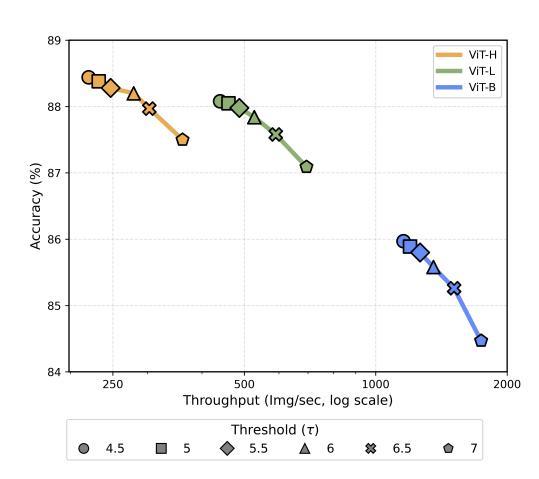
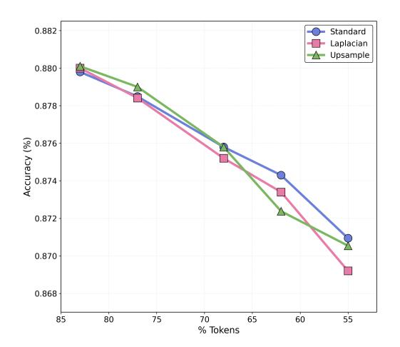

# <span id="page-16-0"></span>A IMPLEMENTATION DETAILS

Hardware Setup. All ImageNet experiments were conducted on a node of 8x NVIDIA A100s, and the experiments on object detection, segmentation, and visual QA were conducted with 8xN-VIDIA RTX A6000. The inference-time results were computed on a single GPU, along with the throughput and FLOPS analysis. We used a single node for all work on this paper.

Layer-level Merging Baselines. We used the official repositories for EViT [\(Liang et al.,](#page-12-5) [2022a\)](#page-12-5), ToMe [\(Bolya et al.,](#page-10-0) [2022\)](#page-10-0), and DTEM [\(Lee & Hong,](#page-12-6) [2024\)](#page-12-6). Since implementations and experiments for ViT-L and ViT-H were not provided, we extended the code to include these two model configurations. In addition to adding the ViT-L and ViT-H variants, all experimental settings (training schedule, enhancements, optimizers, input resolutions, and other hyperparameters) were kept identical to the original baselines to ensure a fair comparison.

Image Classification. We implemented image classification models using the timm library [\(Wightman,](#page-14-14) [2019\)](#page-14-14), leveraging its pretrained checkpoints. The ImageNet-1K dataset [\(Deng et al.,](#page-10-14) [2009\)](#page-10-14) was used for training and evaluation, following prior work [\(Havtorn et al.,](#page-11-11) [2023;](#page-11-11) [Ronen et al.,](#page-13-12) [2023\)](#page-13-12). For the full fine-tuning experiment, we follow the exact MAE training recipe [\(He et al.,](#page-11-13) [2021\)](#page-11-13), training VIT-B for 100 epochs and VIT-L for 50. We use a base learning rate of 1.5e-3 and use standard augmentations, namely RandAug [\(Cubuk et al.,](#page-10-15) [2020\)](#page-10-15), Random Erasing [\(Zhong et al.,](#page-14-15) [2020\)](#page-14-15), random flipping, and cropping. All training was done with 8 GPUs and used batch size 1024. We set layer decay to 0.75 during long fine-tuning. For short fine-tuning, we train the network for 1 epoch with layer decay set to 0.99, and learning rate set to 1e-6, and disable augmentations.

Visual QA. For our Visual Question Answering (VQA) experiments, we utilized the official LLaVA-1.5 [\(Liu et al.,](#page-12-11) [2024a\)](#page-12-11) implementation and its pretrained checkpoints. Unlike the original approach, which collects data and fine-tunes the entire dataset for one epoch, we fine-tuned only 5% of the dataset, as we initialized from an already fine-tuned checkpoint. To adapt to this setting, we reduced the learning rate by a factor of 10 while following all other fine-tuning procedures recommended by LLaVA. The base image resolution was set to 336 with a patch size of 14, as specified in LLaVA's default configuration. A threshold of 5.75 was applied to determine a patch size of 28.

Object Detection. For object detection, we used the official implementation of EVA-02 [\(Fang](#page-11-12) [et al.,](#page-11-12) [2024\)](#page-11-12) along with its pretrained checkpoints, which utilize a window attention mechanism. Fine-tuning was conducted following the recommended procedures outlined in EVA-02. Consistent with our previous experiments, we fine-tuned for 5% of the total iterations while reducing the learning rate by a factor of 10. Following EVA-02's settings, the image resolution was 1536 with a patch size of 16. Patch sizes of 128, 64, and 32 were determined based on threshold values of 0.3, 2, and 2, respectively.

Semantic Segmentation. We also utilized the official EVA-02 implementation along with its pretrained checkpoints for semantic segmentation. The ADE20K dataset [\(Zhou et al.,](#page-15-1) [2019;](#page-15-1) [2017\)](#page-14-13) was used for training and evaluation. Fine-tuning followed the recommended procedures outlined in EVA-02. In alignment with our previous experiments, we fine-tuned for 5% of the total iterations while reducing the learning rate by a factor of 10. According to EVA-02's settings, the image resolution was either 512 or 640, with a patch size of 16. A threshold of 5.75 was applied.

Advanced baselines with FlashAttention. Many adaptive-token baselines including EViT [\(Liang](#page-12-5) [et al.,](#page-12-5) [2022a\)](#page-12-5), ToMe [\(Bolya et al.,](#page-10-0) [2022\)](#page-10-0), and DTEM [\(Lee & Hong,](#page-12-6) [2024\)](#page-12-6) incorporate tokenweighted attention mechanisms on top of standard scaled dot-product attention. While this weighting is central to their design, it also prevents the use of FlashAttention, forcing these models to rely on the much slower unfused vanilla attention kernel. As a result, the baselines run substantially slower than a standard ViT equipped with FlashAttention, creating an unfair comparison in throughput-oriented evaluations. To address this, we re-implement "advanced" versions of these baselines using the unified operator in Listing [1.](#page-17-0) During inference, we disable the weighting operation, allowing the model to employ FlashAttention and achieve speeds comparable to modern ViT implementations. This design ensures that all baselines benefit from FlashAttention when possible, providing a more equitable and technically up-to-date comparison across methods.

<span id="page-17-0"></span>Listing 1: Advanced baselines with FlashAttention. Baselines originally rely on vanilla scaled dot-product attention combined with token-weighted attention, which prevents the use of FlashAttention and significantly slows inference. Our implementation enables a fairer comparison by supporting FlashAttention.

```
1 class AdvancedAttention(Attention):
2 def forward(self, x, mode="weighted_attn", size=None):
3 """
4 Args:
5 x: Tensor of shape (B, N, C)
6 mode:
7 - "flash_attn": use torch.scaled_dot_product_attention
8 - "weighted_attn": proportion attention with token
                weights 'size'
9 - "vanilla_attn": standard scaled dot-product attention
10 size:
11 Tensor of shape (B, N) with per-token weights.
12 """
13 B, N, C = x.shape
14 out1, out2 = self.qkv(x)
15 qkv = out1.reshape(B, N, 3, self.num_heads, self.head_dim).
          permute(2, 0, 3, 1, 4)
16 q, k, v = qkv.unbind(0)
17 q, k = self.q_norm(q), self.k_norm(k)
18
19 q, k, v = q.float(), k.float(), v.float()
20 with torch.cuda.amp.autocast(dtype=torch.float32, enabled=True):
21 # FlashAttention without weighting
22 if mode == "flash_attn":
23 _x = F.scaled_dot_product_attention(
24 q, k, v,
25 attn_mask=None,
26 dropout_p=self.attn_drop.p,
27 is_causal=False
28 )
29
30 # Original implementation of baselines
31 elif mode == "weighted_attn" and size is not None:
32 q = q * self.scale
33 attn = q @ k.transpose(-2, -1)
34 _attn = attn - torch.max(attn, dim=-1, keepdim=True)[0]
35 _attn = _attn.exp_() * size[:, None, None, :].type(torch.
                float32)
36 attn = _attn / _attn.sum(dim=-1, keepdim=True)
37 attn = self.attn_drop(attn)
38 _x = attn @ v
39
40 # Standard scaled dot-product attention
41 elif mode == "vanilla_attn":
42 q = q * self.scale
43 attn = q @ k.transpose(-2, -1)
44 attn = attn.softmax(dim=-1)
45 attn = self.attn_drop(attn)
46 _x = attn @ v
47
48 else:
49 raise ValueError(f"Unknown attention mode: {mode}")
50
51 x = _x.type(x.dtype)
52
53 x = x.transpose(1, 2).reshape(B, N, C)
54 x = self.proj(x)
55 x = self.proj_drop(x)
56
57 return x
```

<span id="page-18-1"></span>



Figure 8: Threshold Effect. Increasing the threshold increases throughput significantly, but after approximately τ = 6.0, the accuracy begins to severely drop off, and is not 'fixable' with fine-tuning.

Figure 9: Analyzing Scorers. We compare the accuracy on ViT-L/336 for different scorers, controlling for the fraction of retained tokens. We find that the the entropy (standard) scorer performs best at high reductions, but that all three are relatively similar.

