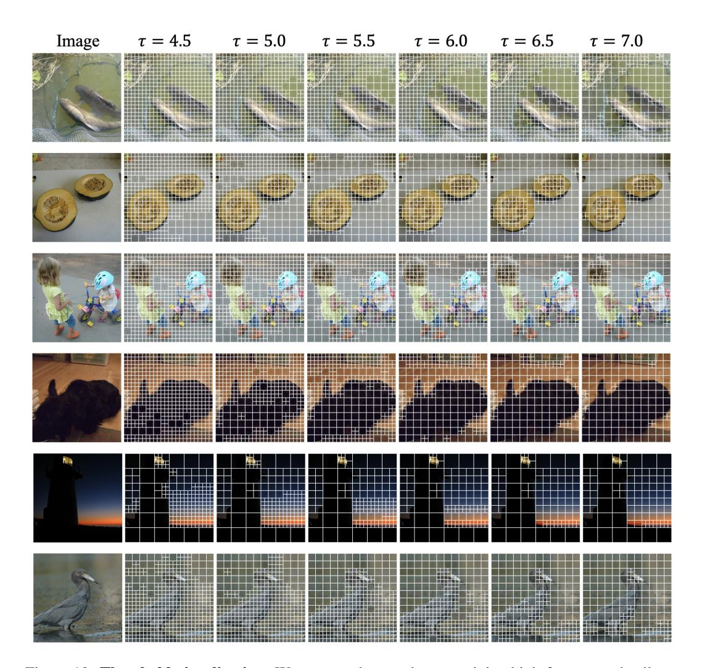
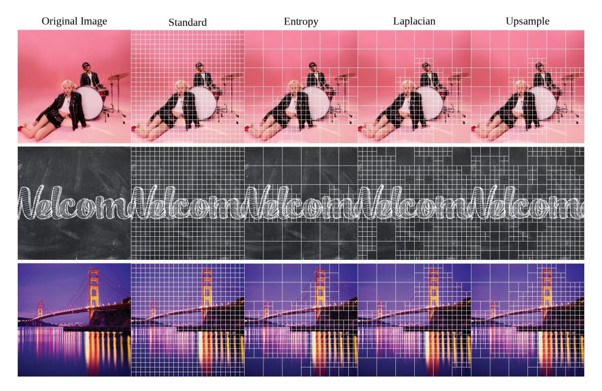
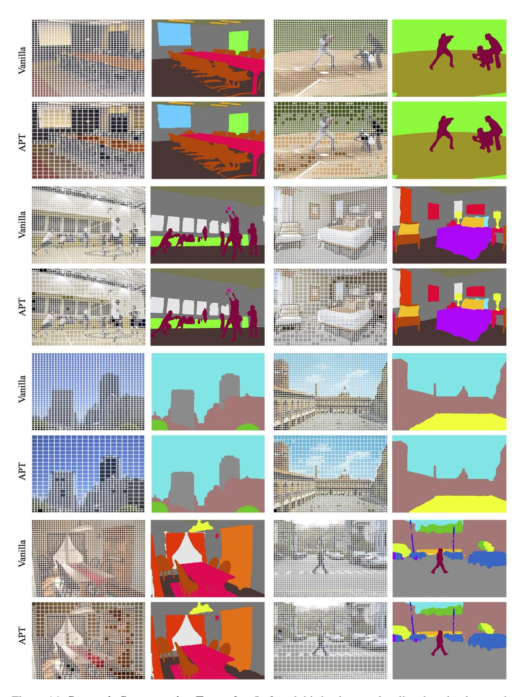

# C ADDITIONAL RESULTS

We provide additional visualizations to illustrate how APT (Adaptive Patch Token) prunes tokens and to analyze the qualitative effects of varying the difference threshold τ , augmentation and scorers. All visualizations were conducted using images at a resolution of 336 × 336 and a patch size of 14 × 14.

Threshold Analysis. The main tunable parameter in APT is the entropy threshold, which can differ per scale and controls how compressible a region must be in order to be retained. Lower values indicate higher sensitivity, and for the vast majority of experiments in this paper, we used τ1 = 5.75, τ2 = 4.0. In Figure [8,](#page-18-1) we vary τ1 for 3 model scales with resolution 336 and patch size 14, measuring ImageNet accuracy. We observe that for threshold values larger than 6.0, accuracy drops significantly, while throughput continues to increase. We find that 5.75 offers a good tradeoff between acceleration and maintaining quality and hypothesize that this is close to the 'true' threshold for compressibility; beyond this point, coarse-scale patches result in information loss. Figure [10](#page-19-0) shows a diverse set of sample images and how our method prunes tokens with relatively lower amounts of information (e.g., background regions or uniform color patches). We fix τ2 = 4.0 and change τ1 from 4.5 to 7. Observing various categories of images, one can see that patches containing high-frequency details or salient object features are consistently preserved. In contrast, less critical regions—such as large uniform areas—are pruned. This visualization confirms that the model potentially increases efficiency by ignoring parts of the image that contribute less to the downstream task.

Scorer Analysis. Figure [11](#page-20-0) qualitatively contrasts the results of an entropy-based scorer with two alternative scores. The entropy-based scorer measures how diverse or complex the distribution of pixel-values within a patch is. If a patch has pixels with a wide range of intensities or colors, it scores higher and is more likely to be retained. This approach naturally favors regions with

Figure 10: Threshold visualization. We can see that patches containing high-frequency details or salient object features are consistently preserved under various thresholds. We used τ = 5.5 for most of the experiments. Zoom in for the best view.

intricate textures, multiple color transitions, or high levels of detail. In comparison, the *Laplacianbased scorer* uses a second-derivative operator (or second-order difference) to detect edges or sharp transitions. Specifically, it looks at how abruptly the pixel intensity changes within a patch. As a result, if there is a strong boundary or a sharp difference in color or brightness, the Laplacian score becomes high, signaling that the patch likely contains important edge information and should be preserved. Finally, we tested an *upsampling-based* scorer, which downsamples the image by a factor of 2 s for each scale index s, then upsamples back to the original resolution. It then compares the average mean squared difference for each patch. This scorer performs similarly to the Laplacian scorer, but can be a little less sensitive to smaller details.

We also measured the accuracy of using each scorer, controlling for the fraction of reduced tokens, the results of which are shown in Figure [9.](#page-18-1) Although they perform similarly, the entropy scorer works better at higher token reductions. At higher token reductions, the Laplacian and upsamplingbased scorers tend to remove more information that is critical to the model, which results in slightly worse performance. However, the differences are quite small and in practice we expect all three could be used interchangeably.

Augmentation Analysis. We compare how APT operates under different data augmentation techniques in Figure [12,](#page-21-0) since these apply transforms to images that make them 'less natural'. In partic-

Figure 11: Scorer visualization. The entropy, Laplacian and upsampling scorers follow generally the same patterns with minor variations. The entropy scorer uses larger patches on regions with very few differing colors, while the upsampling and Laplacian scorers consistently use small patches on high-texture regions.

ular, random erasing removes parts of the image, causing the overall information to be reduced from the outset. As a result, the total number of retained tokens also decreases because many regions lose their distinguishing features. This phenomenon implies that the speed-up gain could be higher during training or fine-tuning—when augmentations are applied repeatedly—than during inference.

Qualitative Results. APT generalizes effectively to downstream visual tasks that require spatial precision, including object detection and semantic segmentation. As illustrated in Figure [13](#page-22-0) and Figure [14,](#page-23-0) APT reliably allocates larger patches to uniform background regions while preserving fine-grained structures with smaller patches around object boundaries and textured areas. Each results support accurate bounding box regression and maintain the pixel-level fidelity necessary for segmentation, demonstrating that APT can deliver significant computational savings without compromising spatial detail or task performance.

Figure 12: Augmentation visualization. We observe that augmentations generally lead to *fewer* tokens. In particular, Random Erasing [\(Zhong et al.,](#page-14-15) [2020\)](#page-14-15), leads to regions that can be tokenized with the large patch sizes, significantly increasing throughput compared to inference time.

Figure 13: Object Detection Examples. First and third columns show the adaptive patch layouts produced by APT, where larger patches correspond to more homogeneous regions and smaller patches capture high-frequency object details. Second and fourth columns show the corresponding object detection outputs, demonstrating that APT preserves essential features for accurate bounding box prediction despite reducing the number of tokens. Images are best viewed zoomed in.

Figure 14: Semantic Segmentation Examples. Left and third columns visualize the adaptive patch assignments generated by APT, illustrating how fine-grained regions (e.g., object boundaries) receive smaller patches. Right and fourth columns display the resulting segmentation maps, showing that pixel-level details are preserved sufficiently for dense prediction tasks, even under token reduction. Images are best viewed zoomed in.