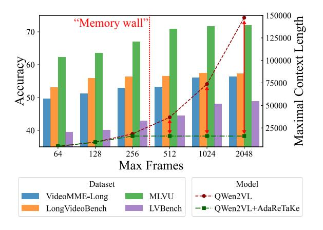
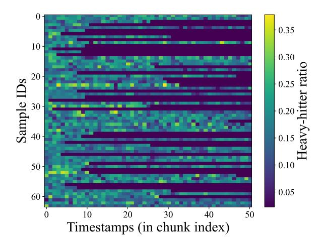
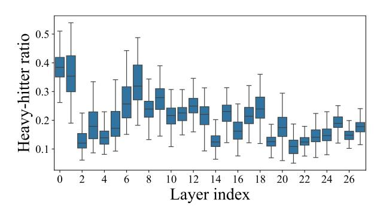

# AdaRETAKE: Adaptive Redundancy Reduction to Perceive Longer for Video-language Understanding

Xiao Wang1\*† Qingyi Si2\* Jianlong Wu1‡ Shiyu Zhu3 Li Cao2 Liqiang Nie1‡

1Harbin Institute of Technology, Shenzhen

2Huawei Technologies Co., Ltd. 3Shandong University

scz.wangxiao@gmail.com, siqingyi@huawei.com, wujianlong@hit.edu.cn

#### **Abstract**

Multimodal Large Language Models (MLLMs) have revolutionized video understanding, vet are still limited by context length when processing long videos. methods compress videos by leveraging visual redundancy uniformly, yielding promising Nevertheless, our quantitative results. analysis shows that redundancy varies significantly across time and model layers, necessitating a more flexible compression strategy. We propose AdaReTAKE, a training-free method that flexibly reduces visual redundancy by allocating compression ratios among time and layers with theoretical guarantees. AdaRETAKE can be seamlessly integrated into existing MLLMs as a plugand-play solution, extending their processing capacity from 256 to 2048 frames while preserving critical information. Experiments on VideoMME, MLVU, LongVideoBench, and LVBench datasets demonstrate that AdaRETAKE outperforms existing methods by 2.3% and 2.8% for 7B and 72B models, respectively, with even greater improvements of 5.9% and 6.0% on the longest LVBench. Our code is available at https://github.com/ SCZwangxiao/video-FlexReduc.git.

#### 1 Introduction

In pursuit of general intelligence, Multimodal Large Language Models (MLLMs) (Li et al., 2024b; Lin et al., 2024; Wang et al., 2025b,a) have revolutionized video understanding. However, current MLLMs require hundreds of tokens to represent a single image (Wang et al., 2024a; Li et al., 2024a; Wang et al., 2023), limiting video lengths to less than 10 minutes (Shen et al., 2024; Gan et al., 2023).

Efforts to extend MLLMs' capabilities for long videos include: agent systems (Zhang et al., 2024a)

Figure 1: AdaReTAKE enables MLLM to perceive longer with fixed context length for video-language understanding.

which retrieve and interpret pre-segmented videos but remain constrained by single-model abilities. Techniques like length extrapolation (Zhang et al., 2024c) and multi-modal sequence parallelism (Xue et al., 2024) enhance usable video context length but introduce more visual redundancy. Rather than extending context length, compression-based methods reduce video tokens into shorter sequences by leveraging visual redundancy (Bolya et al., 2022). Many approaches (He et al., 2024a; Fei et al., 2024) train Q-Former (Li et al., 2023a) to condense videos guided by language or learnable query tokens. Recent advancements (Shen et al., 2024; Wang et al., 2024c) integrate compression into MLLM prefilling, yielding promising results.

In this work, we push the boundaries of compression-based methods in two key ways: first, by optimizing the compression algorithm with insights from quantitative analysis; and second, by scaling the number of frames processed to capture more information from the video.

To dive deeper into compression-based methods, we quantitatively analyze visual redundancy by examining the distribution of influential tokens

\*Equal contribution.

&lt;sup>†Work done during an internship at Huawei.

&lt;sup>‡Corresponding author.

(more likely to be preserved during compression) during MLLM inference, revealing significant variations across video timestamps and LLM layers. These findings show that previous methods with fixed compression ratios fail to capture the dynamic nature of visual redundancy, underscoring the need for a more flexible compression strategy. In light of this, we propose AdaRETAKE, a training-free adaptive video redundancy reduction method. It features two modules: temporaladaptive allocation, which adjusts compression ratios for video sequence features over time, and layer-adaptive allocation, which manages KV cache states across layers. For temporal allocation, we divide a long video into chunks and allocate a compression ratio for each chunk based on the similarity scores between adjacent frames. For layer allocation, we adjust compression ratios across layers based on video-prompt attention scores. Our theoretical analysis demonstrates that this approach reduces the upper bound of L1 compression loss compared to uniform allocation. The combination of the above allocation determines a specific compression ratio for each chunk in each LLM layer. Finally, we apply chunked prefilling for all chunks and the prompt. During this process, the KV caches of each chunk are compressed iteratively based on the accumulated attention scores. AdaRETAKE compresses long videos into shorter sequences, allowing to perceive more informative frames within a fixed GPU memory budget, thereby enhancing long video understanding.

We integrate AdaRETAKE into cutting-edge MLLMs like QWen2-VL [\(Wang et al.,](#page-9-3) [2024a\)](#page-9-3) and LLaVA-Video [\(Zhang et al.,](#page-10-4) [2024e\)](#page-10-4), and conduct extensive experiments across various video understanding benchmarks, including VideoMME [\(Fu et al.,](#page-8-4) [2024\)](#page-8-4), MLVU [\(Zhou et al.,](#page-10-5) [2024\)](#page-10-5), LongVideoBench [\(Wu et al.,](#page-10-6) [2024\)](#page-10-6), and LVBench [\(Wang et al.,](#page-9-9) [2024b\)](#page-9-9). The results show that AdaRETAKE significantly outperforms existing methods, achieving an average improvement of 2.3% and 2.8% across datasets for 7B and 72B models, respectively. On LVBench, the dataset with the longest average video length, the gains are even more pronounced, with improvements of 5.9% and 6.0%, respectively. Additionally, the results on needle QA and temporal grounding tasks further demonstrate that our approach effectively preserves fine-grained temporal grounding capabilities. The ablation study validates the effectiveness of our

temporal and layer-adaptive budget allocation methods. Through comparison with other compression approaches, it further demonstrates the superiority of our method. In summary, our contributions are threefold:

- We identify uneven visual redundancy across time and MLLM layers and develop AdaRETAKE to adaptively reduce it, expanding MLLM capacity from 256 to 2048 frames for long video understanding.
- We design temporal- and layer-adaptive allocation modules to allocate compression ratios across time and MLLM layers, respectively. Theoretical analysis demonstrates that the layer-wise allocation effectively minimizes the upper bound of compression loss.
- Our approach achieves state-of-the-art performance, surpassing existing MLLMs by an average of 2.3% and 2.8% across 4 datasets for 7B and 72B models, respectively.

## 2 Related Work

#### 2.1 MLLM for Long Videos

Most existing multi-modal large language models struggle with extreme token lengths when applied directly to long videos. A commonly used and computationally manageable context length for multimodal training is 8k [\(Shen et al.,](#page-9-6) [2024\)](#page-9-6), which restricts video processing to a few minutes.

Early attempts developed *video agent systems* [\(Zhang et al.,](#page-10-1) [2024a;](#page-10-1) [Wang et al.,](#page-10-7) [2024d;](#page-10-7) [Luo et al.,](#page-9-10) [2024;](#page-9-10) [Liu et al.,](#page-9-11) [2018\)](#page-9-11) that segment videos into shorter clips and use MLLMs with open-source tools for retrieval, aggregation, and interpretation. However, a single model's capabilities remain limited, reducing overall effectiveness. *Length extrapolation methods* [\(Zhang et al.,](#page-10-2) [2024c;](#page-10-2) [Shang et al.,](#page-9-12) [2024;](#page-9-12) [Wei and Chen,](#page-10-8) [2024\)](#page-10-8) extend context windows beyond training lengths, but GPU memory still limits context size. To address this, [Xue et al.](#page-10-3) introduced LongVILA, a *multi-modal sequence parallelism system* that distributes computation across GPUs, but this adds communication overhead [\(Li et al.,](#page-9-13) [2023b\)](#page-9-13), affecting efficiency. In contrast, *compressionbased methods* condense video tokens into shorter sequences. Approaches [\(He et al.,](#page-8-2) [2024a;](#page-8-2) [Fei et al.,](#page-8-3) [2024;](#page-8-3) [Cheng et al.,](#page-8-5) [2024;](#page-8-5) [Zeng et al.,](#page-10-9) [2024a;](#page-10-9) [Man](#page-9-14) [et al.,](#page-9-14) [2024;](#page-9-14) [Han et al.,](#page-8-6) [2024\)](#page-8-6) use Q-Former [\(Li](#page-9-7)

[et al.,](#page-9-7) [2023a\)](#page-9-7) for token compression, reducing redundancy by leveraging language or query tokens. However, Q-Former, trained from scratch, lacks the world knowledge embedded in LLMs, making these methods suboptimal. Recent advances [\(Shu](#page-9-15) [et al.,](#page-9-15) [2024;](#page-9-15) [Shen et al.,](#page-9-6) [2024;](#page-9-6) [Liu et al.,](#page-9-16) [2024;](#page-9-16) [Wang et al.,](#page-9-8) [2024c\)](#page-9-8) integrate compression within the LLM, achieving promising results.

#### 2.2 Token Compression for MLLMs

Token compression methods for LLMs [\(Xiao et al.,](#page-10-10) [2024;](#page-10-10) [Zhang et al.,](#page-10-11) [2023;](#page-10-11) [Feng et al.,](#page-8-7) [2024\)](#page-8-7) reduce sequence length by evicting less important tokens, typically with some performance loss. Given the higher redundancy in visual tokens compared to language tokens [\(Bolya et al.,](#page-8-1) [2022\)](#page-8-1), these methods have been extended to MLLMs [\(Chen et al.,](#page-8-8) [2024;](#page-8-8) [Ye et al.,](#page-10-12) [2024;](#page-10-12) [He et al.,](#page-8-9) [2024b;](#page-8-9) [Zhu et al.,](#page-10-13) [2024\)](#page-10-13). Advancements include merging evicted tokens to reduce information loss [\(Wan et al.,](#page-9-17) [2024;](#page-9-17) [Zhang](#page-10-14) [et al.,](#page-10-14) [2024d\)](#page-10-14) and analyzing redundancy across layers [\(Xing et al.,](#page-10-15) [2024;](#page-10-15) [Tu et al.,](#page-9-18) [2024\)](#page-9-18). However, unlike our adaptive allocation approach, these methods fail to exploit temporal redundancy and allocate compression ratios either monotonically [\(Xing et al.,](#page-10-15) [2024\)](#page-10-15) or via heuristics [\(Tu et al.,](#page-9-18) [2024\)](#page-9-18), resulting in suboptimal performance.

In this paper, we advance token compression methods for MLLMs by adaptively adjusting the compression ratio across timestamps and layers to reduce redundancy more effectively.

## 3 Preliminary Analysis

In this section, we provide a quantitative analysis of the visual redundancy with MLLM for long video understanding. Intuitively, redundancy varies across dimensions: at the frame level, static scenes are more redundant than dynamic ones, and at the model level, deeper layers focus on more abstract features, leading to different attention patterns. To quantify this, we measure redundancy through the ratio of heavy-hitters [\(Zhang et al.,](#page-10-11) [2023\)](#page-10-11), a set of influential tokens essential for generation. By identifying these across dimensions, we validate the varying redundancy levels, providing a strong motivation for our approach to achieve more flexible and efficient compression.

Heavy-hitter ratio to measure redundancy. Denote the number of attention heads as h, length of prompt and video tokens as Lt and Lv, respectively, and the attention scores of them in

Figure 2: Illustrating example of a heavy hitter. We adopt the heavy hitter ratio to measure the redundancy

layer l is A (l) ∈ R h×Lt×Lv . We first calculate the prompt-accumulated head-average attention scores to measure the influence of each video token during generation a ∈ R Lv :

$$\mathbf{a}^{(l)} = \sum_{j=1}^{L_t} \frac{1}{h} \sum_{i=1}^h \mathbf{A}^{(l)}[i,j]. \tag{1}$$

We then calculate the *heavy-hitter ratio* λ (l) ∈ R:

$$\lambda^{(l)} = \frac{1}{L_v} \sum_{i=1}^{L_v} \mathbb{1}\left(\mathbf{a}^{(l)}[i] > p \max\left\{\mathbf{a}^{(l)}\right\}\right), \quad (2)$$

where ⊮(·) ∈ {0, 1} is the indicator function and p = 0.01 is a heuristic constant.A video token is considered important (called a *heavy-hitter*) if its accumulated attention a (l) [i] exceeds p times the maximum attention value in a (l) .

Redundancy among video timestamps. To explore the distribution of redundancy over time, we first split the video tokens into chunks of 10 seconds, and denote the heavy hitter ratio chunk t as λ (t,l) . We randomly sampled 64 videos from VideoMME [\(Fu et al.,](#page-8-4) [2024\)](#page-8-4) and plotted the layer-averaged heavy hitter ratio P k λ (t,l) across different chunks as a heatmap in [Figure 3.](#page-3-0) The temporal redundancy is unevenly distributed, with the heavy-hitter ratio varying up to 3x within a video, as highlighted by the red circle in [Figure 2.](#page-2-0) Redundancy among LLM layers. To investigate the distribution of redundancy across LLM layers in MLLM, we utilized all videos from VideoMME [\(Fu et al.,](#page-8-4) [2024\)](#page-8-4) and plotted heavy hitter ratio

Figure 3: Heavy-hitter ratio among timestamps, showing the unevenly distributed temporal redundancy. The horizontal shaded bars indicate timestamps where the video has ended.

Figure 4: Heavy-hitter ratio among layers, showing the unevenly distributed redundancy among LLM layers.

 $\sum_k \lambda^{(t,l)}$  across different layers as a boxplot in Figure 4. The redundancy is unevenly distributed among the LLM layers. Generally, the heavy hitter ratio is lower in the deeper layers, but significant fluctuations are observed, with local minima at layers 2, 14, and 21, and maxima at layers 7 and 18. This indicates that token compression methods that monotonically assign higher compression ratios to deeper layers, such as PyramidDrop (Xing et al., 2024), are suboptimal for video understanding.

To maximize the use of informative frames within a fixed GPU memory budget, we must design a video compression algorithm that adaptively adjusts the compression ratio across different timestamps and LLM layers.

#### 4 Methods

#### 4.1 Overview

The architecture of AdaRETAKE is shown in Figure 5. To flexibly reduce redundancy across timestamps, we divide video sequences into equal

Figure 5: Illustration of AdaReTAKE.

chunks and the **Temporal-adaptive Allocation** module dynamically applies distinct compression ratios to each chunk. For redundancy across layers, the **Layer-adaptive Allocation** module assigns varying compression ratios to LLM layers. Finally, the **Token Compression** module compresses the KV cache after each chunk's prefilling based on the compression ratios determined by the previous modules, reducing the video sequence length in an MLLM. The general pipeline and these three modules are detailed below.

## 4.2 General Pipeline

Denote T number of frames, N number of tokens in each frame,  $\tau$  number of frames in a chunk (can divide T), S prompt length, L number of LLM layers, and  $C_{max}$  is a refined maximal context length.

Given raw frames and a text prompt as input, the visual encoder and projection layer derive video features  $\mathbf{M} \in \mathbb{R}^{T \times N \times d}$ , and the word embedding layer derives prompt features  $\mathbf{P} \in \mathbb{R}^{S \times d}$ . We split visual features into chunks of  $\tau$  frames:

$$\mathcal{M} = \left[ \mathbf{M}_1, \mathbf{M}_2, ..., \mathbf{M}_{T/\tau} \right], \mathbf{M}_i \in \mathbb{R}^{\tau \times N \times d}.$$
(3)

The temporal-adaptive allocation module will produce a compression ratio (length after compression/original length) for each chunk based on the number of tokens in  $\mathcal{M}$  and  $C_{max}$ :

$$\left[\alpha_1, \alpha_2, \dots, \alpha_{T/\tau}\right], \quad \alpha_i \in \mathbb{R},$$
 (4)

s.t. 
$$\alpha_1 + \alpha_2 + \dots + \alpha_{T/\tau} = \frac{C_{\text{max}} - S}{TN}$$
. (5)

The above equation ensures the final total sequence length (in KV cache memory) is  $C_{max}$ . Note that we do not consider memory usage for other operations since for long sequence inference the KV cache occupies the most GPU memory (Hooper et al., 2024).

We employ chunk-based processing instead of single-frame processing to enhance the robustness of the allocation process and reduce memory overhead in temporal-adaptive allocation, as detailed in Section 4.4.

Due to the autoregressive nature of LLMs, chunked prefilling is applied to each chunk, which is functionally equivalent to standard prefilling (Zeng et al., 2024b). During the i-th iteration, chunk i is first prefilled. For each layer l, the query states of the prompt  $\mathbf{Q}_i^{(l)} \in \mathbb{R}^{S \times d}$  and the KV caches of chunk i  $\mathbf{K}_i^{(l)}, \mathbf{V}_i^{(l)} \in \mathbb{R}^{h \times \tau N \times d}$  are stored, where h is the number of heads. These, along with the chunk's compression ratio  $\alpha_i$ , are processed by the layer-adaptive allocation module to determine the compression ratio for each layer:

$$\left[\alpha_i^{(1)}, \alpha_i^{(2)}, \dots, \alpha_i^{(l)}\right], \quad \alpha_i^{(l)} \in \mathbb{R}, \quad (6)$$

s.t. 
$$\frac{\alpha_i^{(1)} + \alpha_i^{(2)} + \dots + \alpha_i^{(L)}}{L} = \alpha_i.$$
 (7)

Finally, token compression is applied to the visual KV caches of chunk i, deriving the compressed KV cache  $\hat{\mathbf{K}}_i^{(l)}, \hat{\mathbf{V}}_i^{(l)} \in \mathbb{R}^{\alpha_i^{(l)} \tau N \times d}$ . The prompt states are dropped except in the last chunk.

#### 4.3 Temporal-adaptive Allocation

Given chunked video frames  $\mathcal{M}$  and maximal context length  $C_{max}$ , this module calculates the compression ratio for each chunk.

For video features of the *i*-th chunk  $\mathbf{M}_i \in \mathbb{R}^{\tau \times N \times d}$ , we first calculate the distance between adjacent frames  $\mathbf{d}_i \in \mathbb{R}^{\tau-1}$ :

$$\mathbf{d}_{i}[t] = 1 - \sum_{i=1}^{N} \frac{\operatorname{Sim}(\mathbf{M}_{i}[t,j], \mathbf{M}_{i}[t+1,j])}{N}, (8)$$

where  $\mathrm{Sim}(\cdot)$  represents the cosine similarity. We then average  $\mathbf{d}_i$  among its  $\tau-1$  frames to get the averaged distance of i-th chunk  $\bar{d}_i \in \mathbb{R}$ , which reflects the temporal redundancy within the chunk. Finally, the compression ratio  $\alpha_i$  for each chunk is computed by allocating the maximal context length  $C_{\max}$  proportionally to the mean distances:

$$\alpha_i = \frac{C_{max} - S}{TN} \cdot \frac{\bar{d}_i}{\sum_{i=1}^{T/\tau} \bar{d}_i}.$$
 (9)

#### 4.4 Layer-adaptive Allocation

When prefilling chunk i in the l-th LLM layer, we store the query states of the prompt  $\mathbf{Q}_i^{(l)}$ , KV cache of chunk  $\mathbf{K}_i^{(l)}$ ,  $\mathbf{V}_i^{(l)}$ . This module calculates the compression ratio for chunk i in each layer.

In the l-th layer, we first calculate the attention score between prompt and the video tokens  $\mathbf{A}_i^{(l)} \in \mathbb{R}^{h \times S \times \tau N}$ . We then calculate the head-averaged accumulated scores along all prompt tokens to measure the significance score of each token to the prompt,  $\mathbf{a}_i^{(l)} \in \mathbb{R}^{\tau N}$ :

$$\mathbf{a}_{i}^{(l)} = \sum_{i=1}^{S} \frac{1}{h} \sum_{i=1}^{h} \mathbf{A}_{i}^{(l)}[i, j]. \tag{10}$$

To measure the significance of each layer, we calculate the number of tokens with large significance scores, denoted as  $s_i^{(l)} \in \mathbb{Z}$ :

$$s_i^{(l)} = \sum_{j=1}^{\tau N} \mathbb{1}\left(\mathbf{a}_i^{(l)}[j] > \hat{a}_i\right),\tag{11}$$

s.t. 
$$\hat{a}_i = \text{K-th}\left(\mathbf{a}_i^{(1)} \| \cdots \| \mathbf{a}_i^{(l)} \right),$$
 (12)

$$K = \alpha_i \tau N L. \tag{13}$$

where  $\mathbb{M}(\cdot) \in \{0,1\}$  is the indicator function,  $K\text{-th}(\cdot)$  denotes the K-th largest value in the vector, and || denotes vector concatenation operation. Finally, we allocate the compression ratio of each layer by re-weighting the total compression ratio of current  $\alpha_i$  in each layer:

$$\alpha_i^{(l)} = w_i^{(l)} \alpha_i, \tag{14}$$

$$w_i^{(l)} = \frac{s_i^{(l)}}{\sum_{k=1}^l s_i^{(k)}}.$$
 (15)

Note that sometimes the  $\hat{w}_i^{(k)}$  above might be too small. To ensure numerical stability, we introduce a minimal weight  $\epsilon=0.01$  and compute the renormalized re-weighting factor  $\hat{w}_i^{(l)}$ :

$$\hat{w}_i^{(l)} = \frac{\max(w_i^{(l)} - \epsilon, 0)}{\sum_{k=1}^{l} \max(w_i^{(k)} - \epsilon, 0)} (1 - L\epsilon) + \epsilon.$$
(16)

For memory-efficient implementation, we calculate Eqn. (10) after each layer.

### 4.5 Token Compression

After prefilling the *i*-th chunk, we first drop the prompt tokens in the KV cache (except the last

chunk). Based on the compression ratio derived from Eqn. 14, we then compress video tokens by selecting tokens with the top significant scores and then update the KV cache in each layer  $\mathbf{K}^{(l)}$ ,  $\mathbf{V}^{(l)}$ :

$$\mathcal{I} = \operatorname{ArgTopK}(\mathbf{a}_i^{(l)}), \quad K = \alpha_i^{(l)} \tau N, \quad (17)$$

$$\mathbf{K}^{(l)} \leftarrow \left[ \mathbf{K}^{(l)} \parallel \mathbf{K}_i^{(l)}[:, \mathcal{I}] \right], \tag{18}$$

$$\mathbf{V}^{(l)} \leftarrow \left[ \mathbf{V}^{(l)} \parallel \mathbf{V}_i^{(l)} [:, \mathcal{I}] \right]. \tag{19}$$

where  $ArgTopK(\cdot)$  denotes the indices of K elements with the largest value in the vector.

We also provide a theoretical guarantee for our layer-wise budget allocation method. See Appendix A for more details.

**Theorem 4.1.** Let  $I_i^{(l)} \in \{0,1\}$  denotes whether token i in layer l is kept during compression. Given the token sequence budget  $\sum_l \sum_i I_i^{(l)} = K$ , making token compression choices  $\left\{\mathbf{I}_*^{(l)}\right\}_{l=1}^L$  based on top K values in  $\left\{A_i^{(l)}\right\}$  can achieve a near-optimal minimization of the upper bound of token compression loss to  $\epsilon_*^{(l)}$ :

$$\epsilon_*^{(l)} \le 2C + 2C \left(\frac{\epsilon_{opt}^{(l)}}{2C} - 1\right)^{1 - \frac{1}{e}}, \quad (20)$$

where  $\epsilon_{opt}^{(l)}$  is the theoretical minimal of  $\epsilon^{(l)}$  and C is a constant.

#### 5 Experiments

## 5.1 Benchmarks and Implementations

**Video-MME.** Video Multi-Modal Evaluation (Fu et al., 2024) is a pioneering benchmark designed for evaluating video analysis, with diverse video types, and durations. It comprises 900 videos totaling 256 hours, with 2,700 manually labeled complex multiple-choice question-answer pairs across 30 subfields. It has three subsets of different durations: short (< 2min), medium ( $4min \sim 15min$ ), and long (30min  $\sim$  60min). MLVU. Multi-task Long Video Understanding Benchmark (MLVU) (Zhou et al., 2024) has the widest range of video length ranging from 3 minutes to 2 hours. MLVU includes nine evaluation tasks including topic reasoning, anomaly recognition, video summarization, and plot question-answering. LongVideoBench (Wu et al., 2024) is a benchmark for long-context video understanding, consisting of videos up to one hour in length. It includes 3,763 videos with

6,678 annotated multiple-choice questions across 17 categories, focusing on referring reasoning that requires retrieving and analyzing detailed multimodal information from specific temporal segments. **LVBench.** LVBench (Wang et al., 2024b) is a comprehensive benchmark for long video understanding, with an average video length of 4,101 seconds—4 times longer than VideoMME (Fu et al., 2024) and 5 times longer than MLVU (Zhou et al., 2024). It includes 1,549 annotated multiple-choice question-answer pairs covering a wide range of tasks, including entity recognition, event understanding, key information retrieval, temporal grounding, and reasoning.

Implementation Details. We integrated AdaRETAKE into various MLLMs, including LLaVA-Video-7B (Zhang et al., 2024e), QWen2VL-7B (Wang et al., 2024a), QWen2.5VL-7B, and QWen2.5VL-72B. We densely sampled the video at 2 frames per second (fps), with a maximum of 2048 and 1024 frames for 7B and 72B models, respectively. For our main results (Section 5.2), we chose the maximal context length  $C_{max}$  as 16K. In the ablation studies (Section 5.3), we reduced the maximum number of sampled frames to 1024 and the context length to 1K without specification. The evaluation is conducted using LMMs-Eval (Zhang et al., 2024b).

#### 5.2 Main Results

Comparision with SoTAs. We integrated AdaReTAKE with various MLLMs and compared their results with existing long video understanding methods in Table 1. The average improvements on the VideoMME, MLVU, and LVBench datasets are 1.2%, 2.8%, and 6.2%, respectively, with the most significant gains on LVBench. Given that LVBench has the longest average video duration (5x that of MLVU), we hypothesize that our method's ability to effectively compress visual tokens enables MLLMs to process longer and more informative visual sequences, leading to greater improvements with longer video content.

Generalization for various MLLMs. When integrated with different MLLMs of different sizes, AdaReTake brings consistent improvements, demonstrating its generality. With the help of AdaReTake, both the 7B and 72B variants of QWen2.5-VL achieve state-of-the-art results within their respective model sizes. The 7B model sees an average improvement of 2.3%, while the 72B model achieves a 1.5% gain, demonstrating the

| Model                 | LLM Size | VideoMME |         | MLVU | LongVideoBench | LVBench |
|-----------------------|----------|----------|---------|------|----------------|---------|
|                       |          | Long     | Overall | dev  | val            | val     |
| GLM-4V-Plus           | -        | -        | 70.8    | -    | -              | 58.7    |
| GPT-4o                | -        | 65.3     | 71.9    | 64.6 | 66.7           | 27.0    |
| Gemini-1.5-Pro        | -        | 67.4     | 75.0    | -    | 64.0           | 33.1    |
| VITA-1.5              | 7B       | 47.1     | 56.1    | -    | -              | -       |
| mPLUG-Owl3            | 7B       | 50.1     | 59.3    | 63.7 | 52.1           | -       |
| NVILA                 | 8B       | 54.8     | 64.2    | 70.1 | 57.7           | -       |
| ByteVideoLLM          | 14B      | 56.4     | 64.6    | 70.1 | -              | -       |
| TPO                   | 7B       | 55.4     | 65.6    | 71.1 | 60.1           | -       |
| VideoLLaMA3           | 7B       | -        | 66.2    | 73.0 | 59.8           | 45.3    |
| LLaVA-Video           | 7B       | 52.4     | 63.3    | 67.0 | 58.2           | 43.1    |
| LLaVA-Video+AdaRETAKE | 7B       | 53.9     | 64.0    | 70.6 | 59.6           | 49.6    |
| Qwen2-VL              | 7B       | 53.8     | 63.3    | 66.9 | 55.6           | 42.4    |
| QWen2-VL+AdaRETAKE    | 7B       | 56.4     | 64.2    | 72.0 | 57.2           | 48.9    |
| Qwen2.5-VL            | 7B       | 55.6     | 65.4    | 70.2 | 59.5           | 45.3    |
| QWen2.5-VL+AdaRETAKE  | 7B       | 58.3     | 67.7    | 75.0 | 62.6           | 51.2    |
| LLaVA-OneVision       | 72B      | 60.0     | 66.3    | 68.0 | 61.3           | -       |
| Oryx-1.5              | 32B      | 59.3     | 67.3    | 72.3 | 62.0           | 30.4    |
| Aria                  | 8x3.5B   | 58.8     | 67.6    | 70.6 | 65.3           | -       |
| LLaVA-Video           | 72B      | 61.5     | 70.6    | 74.4 | 61.9           | -       |
| Qwen2-VL              | 72B      | 62.2     | 71.2    | -    | 60.4           | 41.3    |
| InternVL2.5           | 72B      | 62.6     | 72.1    | 75.7 | 63.6           | 43.6    |
| Qwen2.5-VL            | 72B      | 63.9     | 72.6    | 74.6 | 65.9           | 47.3    |
| Qwen2.5-VL+AdaRETAKE  | 72B      | 65.0     | 73.5    | 78.1 | 67.0           | 53.3    |

Table 1: Performance comparison on long video understanding. AdaRETAKE achieves consistent gains when integrated into various MLLMs.

| Method      |      | VideoMME | MLVU | LVBench |  |
|-------------|------|----------|------|---------|--|
|             | Long | Overall  | val  | val     |  |
| FastV       | 53.5 | 61.2     | 63.2 | 42.3    |  |
| FitPrune    | 53.6 | 61.2     | 63.6 | 42.0    |  |
| LOOK-M      | 53.6 | 61.0     | 63.8 | 42.6    |  |
| SparseVLM   | 54.4 | 60.7     | 63.0 | 43.9    |  |
| PyramidDrop | 53.1 | 60.5     | 63.7 | 41.6    |  |
| VL-Cache    | 53.2 | 61.3     | 64.5 | 42.4    |  |
| AdaRETAKE   | 55.1 | 62.2     | 65.6 | 44.8    |  |

Table 2: Comparison with other token compression methods for MLLMs. AdaRETAKE outperforms existing approaches by employing a theoretically grounded budget distribution mechanism, in contrast to heuristic or suboptimal allocation strategies.

scaling ability of our method into larger size.

Comparison with other token compression methods. As shown in Table [2,](#page-6-2) AdaRETAKE demonstrates distinct advantages over existing MLLM token compression approaches.

Baseline methods FastV and FitPrune employ accumulated attention scores to evict tokens, while SparseVLM enhances this paradigm through partial token recycling.

PyramidDrop, VL-Cache, and our method address compression ratio allocation. However, PyramidDrop's layer-wise monotonic budget allocation contradicts our layer importance observations in Section [3,](#page-2-1) leading to suboptimal performance. While VL-Cache improves through heuristic-based dynamic allocation, our method is theoretically grounded, achieving superior results.

## 5.3 Ablation Studies

Ablation studies on temporal and layer-wise adaptive allocation. To identify the sources of performance improvements in our model, we conducted ablation studies, as summarized in Table [3.](#page-7-0) In the table, #0 represents the baseline model. In #1, we directly incorporates token compression into baseline model, and in #2, we increase the number of sampled frames while keeping the maximum context length fixed. In #3 and #4 we applly varying compression ratios across different layers and different frames respectively. Finally, #5 extends the context length. First, comparing rows 0,1 and 1,2 reveals that token compression introduces a slight performance drop (-0.8% on average). However, it enables the model to process more frames within the same context length, capturing richer information and ultimately yielding a net performance gain (2.5%

| Model                      | Max frames | Context length | VideoMME-L | MLVU | LVBench | ∆avg |
|----------------------------|------------|----------------|------------|------|---------|------|
| 0 QWen2VL-7B               | 128        | 9K             | 51.2       | 63.5 | 40.1    | -    |
| 1 +token compression       | 128        | 1K             | 50.6       | 62.7 | 39.2    | -0.8 |
| 2 +scale up frames         | 1024       | 1K             | 53.8       | 63.9 | 42.3    | +2.5 |
| 3 +layer-wise allocation   | 1024       | 1K             | 54.3       | 64.6 | 43.5    | +0.8 |
| 4 +temporal allocation     | 1024       | 1K             | 55.1       | 65.6 | 44.8    | +1.0 |
| 5 +scale up context length | 1024       | 16K            | 56.0       | 71.7 | 48.0    | +3.4 |
| 6 +scale up frames         | 2048       | 16K            | 56.4       | 72.0 | 48.9    | +0.6 |

Table 3: Ablation study on different components in our method. Token compression enables richer information capture, optimized compression allocation improves efficiency, and extended context length significantly enhances performance.

|                          |            |                    | MLVU |      | LVBench             |      |
|--------------------------|------------|--------------------|------|------|---------------------|------|
| Method                   | Max Frames | Max Context Length | NQA  | AO   | KIR 37.5 51.2 | TG   |
| LLaVA-Video-7B           | 128        | 25K                | 74.2 | 55.6 |                     | 36.8 |
| LLaVA-Video-7B+AdaRETAKE | 1024       | 16K                | 75.1 | 60.6 |                     | 43.2 |
| Qwen2-VL-7B              | 256        | 18K                | 81.9 | 49.0 | 44.3                | 40.5 |
| QWen2-VL-7B+AdaRETAKE    | 1024       | 16K                | 82.7 | 60.2 | 52.9                | 42.7 |

Table 4: Ablation studies on MLVU and LVBench datasets, evaluating fine-grained perception capabilities across Needle QA (NQA), Action Order (AO), Action Count (AC), Key Information Retrieval (KIR), and Temporal Grounding (TG).

on average versus -0.8%). 2) Comparing rows 2,3 and 3,4 shows that our strategy of distributing the compression ratio across frames and layers enhances performance (by 1.0% and 0.8% on average, respectively), confirming the effectiveness of our AdaRETAKE. 3) Comparing rows 4 and 5 demonstrates that scaling the context length to the typical upper limit of MLLMs [\(Shen et al.,](#page-9-6) [2024\)](#page-9-6) further improves performance significantly, with an average gain of 3.4%.

Perception ability on temporal details. To assess the effectiveness of token compression algorithms in preserving critical temporal details, we conducted ablation studies on the MLVU and LVBench datasets, focusing on Needle QA, Action Order, Key Information Retrieval, and Temporal Grounding. We compared baseline models LLaVA-Video-7B and QWen2-VL-7B, maximizing frame sampling within their constraints (128 and 256 frames, respectively). Results are shown in Table [4.](#page-7-1) Our analysis reveals three key findings: 1) Despite token compression via AdaRETAKE, increasing the maximum sampled frames improved grounding abilities (Needle QA and Temporal Grounding) without compromising temporal order perception (Action Order). This indicates that AdaRETAKE enhances model performance while strengthening fine-grained temporal capabilities. 2) The improvement in MLVU's Action Order

category was significantly higher than in Needle QA (8% vs. 0.8% on average). We attribute this to our method's ability to sample more frames through token compression, thus a denser frame sampling is enabled, which greatly enhances action understanding [\(Li et al.,](#page-9-0) [2024b\)](#page-9-0). 3) In LVBench, under similar baselines, Key Information Retrieval demonstrated a significantly higher improvement compared to Temporal Grounding, with average gains of 11.2% versus 4.3%. We hypothesize that token compression enhances information density, which strengthens comprehensive understanding. We believe this can explain why Key Information Retrieval, a task requiring deeper comprehension, benefits more than perceptual tasks like Temporal Grounding in our results.

