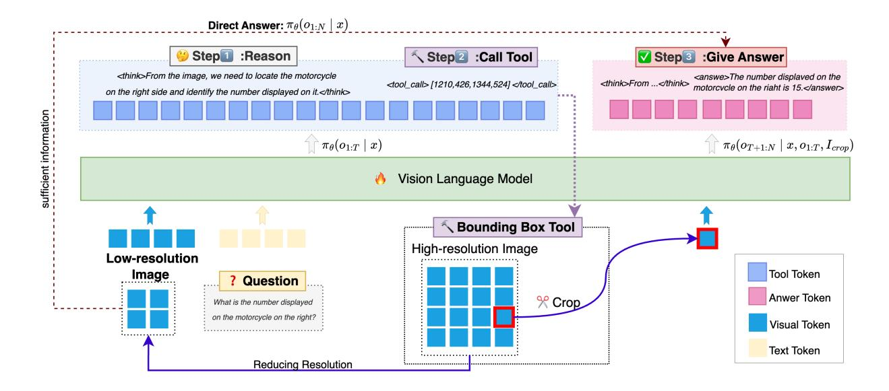

# 2. Related work

Vision Language Model with Reasoning. Recent advances in reasoning LLMs such as OpenAI's o1 [\[12\]](#page-8-15) and DeepSeek R1 [\[8\]](#page-8-16) have accelerated the use of RL to enhance reasoning capabilities [\[44\]](#page-9-11). This trend has extended to VLMs [\[23,](#page-8-17) [28,](#page-9-12) [32,](#page-9-13) [36,](#page-9-14) [38\]](#page-9-15), where most work focuses on high-level semantic reasoning like tool use or chainof-thought explanation. A related direction explores active perception, equipping VLMs with fine-grained control mechanisms [\[10,](#page-8-18) [35,](#page-9-16) [40\]](#page-9-17). Recent systems such as Deep-Eyes [\[50\]](#page-9-7) and Mini-o3 [\[16\]](#page-8-11) support operations like zoom and crop, improving performance on detailed visual tasks. While these methods showcase the power of active visual reasoning for enhancing answer accuracy, how to apply this "thinking with images" paradigm to the goal of computational efficiency, specifically for visual token compression, remains less explored. Our method enables the VLM to autonomously determine the minimum number of visual tokens required for a given task, thereby achieving efficient inference while maintaining performance.

Efficient VLM with Vision Token Compression. Reducing VLM computational cost by vision token compression has become a popular research topic [\[15\]](#page-8-19). Existing methods rely on predefined rules or metrics to compress tokens. For instance, FastV [\[5\]](#page-8-5) prunes a fixed 50% of tokens based on attention scores after the second layer. Pyramid-Drop [\[42\]](#page-9-18) proposes progressive token compression to reduce information loss. Other works leverage cross-modal relevance for token selection, such as SparseVLM [\[49\]](#page-9-6) and VisionZip [\[45\]](#page-9-4), which retain semantically relevant visual tokens. A key limitation of these methods is their dependence on a fixed compression ratio, which lacks adaptability across tasks. VisionThink [\[46\]](#page-9-5) uses RL to decide whether

Figure 2. **FrameWork of AdaptVision.** AdaptVision first processes a 1/4-resolution image. The model then decides whether to answer directly or invoke the bounding box tool to crop a high-resolution region for further analysis before generating the final answer.

to use a low-resolution or the original image, offering limited adaptability but still restricting the model to coarse-grained decisions. In contrast, our approach enables the VLM to learn coarse-to-fine ability and adaptively determine the minimum number of visual tokens for each task.

#### 3. Preliminary

#### 3.1. Reinforcement Learning for LLMs

Recent studies [8, 12] have demonstrated RL effectively enhances the reasoning capabilities of large language models (LLMs). Recently, Group Relative Policy Optimization (GRPO) [31] has been widely used in LLM reasoning. Given a question x, GRPO generates G distinct responses  $\{o_i\}_{i=1}^G$  with sequence length  $N_i$  from the current policy  $\pi_{\theta_{old}}$  and obtains a group of rewards  $\{R_i\}_{i=1}^G$ . GRPO optimizes the policy model  $\pi_{\theta}$  by maximizing the following objective:

$$\mathcal{J}_{\text{GRPO}}(\theta) = \mathbb{E}_{x,o_i}$$

$$\left[ \frac{1}{G} \sum_{i=1}^{G} \left( \frac{1}{N_i} \sum_{t=1}^{N_i} \mathcal{L}_{i,t}(\theta) - \beta \mathbb{D}_{\text{KL}} \left[ \pi_{\theta}(\cdot|x) \mid\mid \pi_{\text{ref}}(\cdot|x) \right] \right) \right]$$
(1)

where  $\mathcal{L}_{i,t}(\theta)$  denotes the token-level loss given by:

$$\mathcal{L}_{i,t}(\theta) = \min\left(\frac{\pi_{\theta}(o_{i,t} \mid x, o_{i, < t})}{\pi_{\theta_{\text{old}}}(o_{i,t} \mid x, o_{i, < t})} A_{i,t}, \right.$$

$$\left. \text{clip}\left(\frac{\pi_{\theta}(o_{i,t} \mid x, o_{i, < t})}{\pi_{\theta_{\text{old}}}(o_{i,t} \mid x, o_{i, < t})}, 1 - \epsilon, 1 + \epsilon\right) A_{i,t}\right), \quad (2)$$

$$A_{i,t} = \frac{R_{i} - \text{mean}(\{R_{i}\}_{i=1}^{G})}{\text{std}(\{R_{i}\}_{i=1}^{G})}, \quad (3)$$

$$\mathbb{D}_{KL}(\pi_{\theta}||\pi_{ref}) = \frac{\pi_{ref}(o_i|q)}{\pi_{\theta}(o_i|q)} - \log \frac{\pi_{ref}(o_i|q)}{\pi_{\theta}(o_i|q)} - 1, \quad (4)$$

where  $\mathbb{D}_{KL}$  is the KL-divergence measure.  $\epsilon$  and  $\beta$  are hyperparameters. The advantage estimate  $A_{i,t}$  is computed using a group of rewards  $\{R_i\}_{i=1}^G$ .

#### 3.2. Vision Language Models

The VLM architectures generally consist of three components: a visual encoder, a modality projector, and a LLM. A commonly used approach for the visual encoder is to employ a pre-trained image encoder like CLIP-VIT [29] that converts input images into visual tokens. The modality projector adjusts the size of these visual tokens to match the embedding size of LLM and to achieve semantic alignment, enabling the LLM to process visual data effectively. The LLM then integrates the aligned visual and textual information to generate responses.

Existing works have revealed that the computational complexity of VLM is strongly influenced by the sequence length [45], where the sequence length is defined as  $n=n_{sys}+n_{img}+n_{question}$ . In typical VLM tasks, the number of vision tokens  $n_{img}$  is often much larger than the other two, sometimes by a factor of 20. Therefore, reducing the number of vision tokens is the key for improving the efficiency of VLMs.

## 4. Methodology

