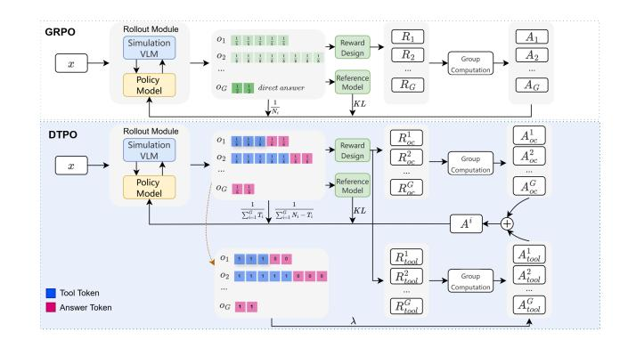
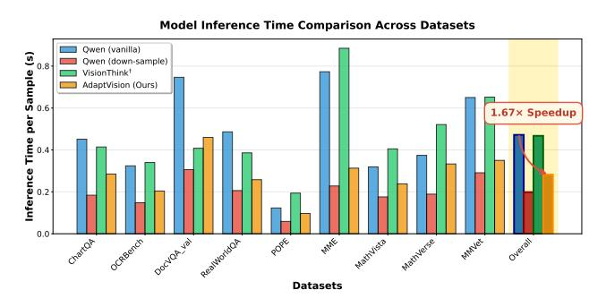
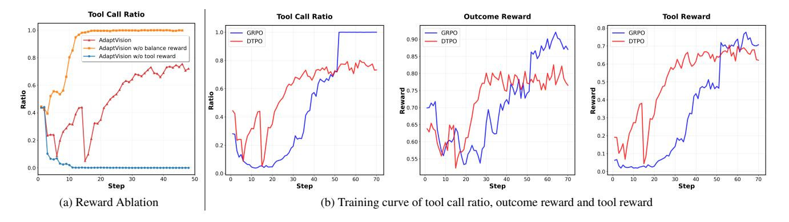
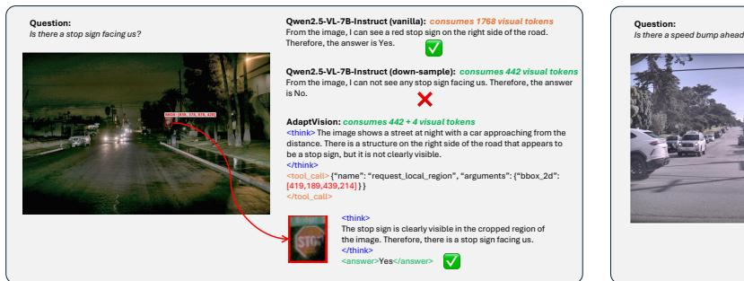
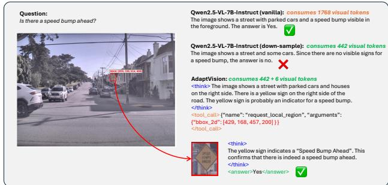

# 4.3. Efficient Learning via Decoupled Turn Policy Optimization

Based on our reward design, we initially employ GRPO [31] for training. We aim to train a VLM that (1) achieves high answering accuracy and (2) minimizes the number of visual tokens used. However, training such a dual-objective policy with GRPO presents two key challenges.

Ambiguous credit assignment Vanilla GRPO provides a single, sequence-level reward to all generated tokens, failing to distinguish between the contributions of two distinct types of actions – the decision to request additional visual tokens and the generation of the final answer. This ambiguity limits effective exploitation and exploration during policy learning. For instance, when the VLM correctly generates bounding boxes while producing an incorrect answer, the model still receives a positive reward for the answer tokens. This may steer the model towards a suboptimal optimization direction. As we will show in the experiments, when training with GRPO, the model initially favors direct answers but then rapidly collapses to excessive tool call, resulting in an unstable training process.

**Imbalanced optimization** As defined in Eq. 5, the policy model generates either a one-turn or two-turn responses for each sample. Depending on their functional roles, the generated tokens can be categorized into two types: *Tool Tokens* and *Answer Tokens*, as shown in Fig. 2. Accordingly, the original GRPO objective in Eq. 2 can be decomposed into two components that separately optimize the tool and answer tokens:

$$\frac{1}{G} \sum_{t=1}^{G} \frac{1}{N_i} \sum_{t=1}^{N_i} \mathcal{L}_{i,t}(\theta) = \underbrace{\frac{1}{G} \sum_{t=1}^{G} \frac{1}{N_i} \sum_{t=1}^{T_i} \mathcal{L}_{i,t}(\theta)}_{\text{Tool Token}} + \underbrace{\frac{1}{G} \sum_{t=1}^{G} \frac{1}{N_i} \sum_{t=T_i+1}^{N_i} \mathcal{L}_{i,t}(\theta)}_{\text{Answer Token}}, \quad (11)$$

where  $T_i$  denotes the number of tool tokens generated in the first turn, and  $N_i-T_i$  represents the number of answer tokens in the second turn. If the model answers directly without tool calls,  $T_i$  is 0. A closer examination of Eq. 11 reveals an inherent optimization imbalance. In two-turn sequences that invoke tools, the gradient contributions from

Figure 3. **Demonstration of vanilla GRPO and our DTPO.** Our DTPO (1) decomposes the policy loss by turns to separately optimize tool and answer tokens, and (2) computes distinct advantages for tool and outcome rewards, enabling balanced optimization and precise credit assignment.

tool tokens are suppressed by the normalization factors  $\frac{1}{N_i}$  and  $\frac{1}{G}$ , causing tool tokens to be under-optimized compared to answer tokens.

To address these challenges, we propose Decoupled Turn Policy Optimization (DTPO). First, we decouple the policy loss by turns and normalize the contributions of tool and answer tokens separately. This adjustment effectively resolves the under-optimization problem of tool tokens.

$$\mathcal{J}_{\text{DTPO}}(\theta) = \mathbb{E}_{x,o_i} \left[ \underbrace{\frac{1}{\sum_{i=1}^{G} T_i} \sum_{i=1}^{G} \sum_{t=1}^{T_i} \mathcal{L}_{i,t}(\theta)}_{\text{Tool Token}} + \underbrace{\frac{1}{\sum_{i=1}^{G} (N_i - T_i)} \sum_{i=1}^{G} \sum_{t=T_i + 1}^{N_i} \mathcal{L}_{i,t}(\theta)}_{\text{Answer Token}} \right]. \quad (12)$$

Second, to enable precise credit assignment, DTPO decouples the advantage estimation by computing distinct advantages for tool and answer tokens, rather than using a single advantage for the entire sequence. Specifically, we compute the advantage for the t-th token as follows:

$$A_{i,t} = \begin{cases} A_{oc}^{(i)} + \lambda \cdot A_{tool}^{(i)}, & \text{direct answer,} \\ A_{oc}^{(i)} + \lambda \cdot A_{tool}^{(i)} \cdot \mathbb{I}(1 \le t \le T_i), & \text{tool call,} \end{cases}$$

$$A_{tool}^{(i)} = \frac{\mathcal{R}_{tool}^{(i)} - \text{mean}(\{\mathcal{R}_{tool}^{(i)}\}_{i=1}^{G})}{\text{std}(\{\mathcal{R}_{tool}^{(i)}\}_{i=1}^{G})}, \qquad (13)$$

$$A_{oc}^{(i)} = \frac{\mathcal{R}_{oc}^{(i)} - \text{mean}(\{\mathcal{R}_{oc}^{(i)}\}_{i=1}^{G})}{\text{std}(\{\mathcal{R}_{oc}^{(i)}\}_{i=1}^{G})}, \qquad (14)$$

where  $A_{tool}^{(i)}$  and  $A_{oc}^{(i)}$  are advantage estimates computed using tool reward and outcome reward respectively, and  $\lambda$  is a hyperparameter that trade-offs two advantages. We set

Table 1. **Performance comparison with previous efficient VLM methods.** Vanilla denotes the Qwen2.5-VL-7B-Instruct model. Down-Sample uses a 1/4-resolution image as input to the Vanilla model. "#Token" indicates the visual token consumption ratio relative to the vanilla model across all benchmarks. "Avg." denotes the average performance relative to the vanilla model on all benchmarks.

| Method                   | ChartQA test | OCRBench test | DocVQA val | MME test    | MMVet test  | RealWorldQA test | POPE test    | MathVista testmini | MathVerse testmini | #Token↓ | Avg.↑ |
|--------------------------|-----------------|------------------|---------------|----------------|----------------|---------------------|-----------------|-----------------------|-----------------------|---------|-------|
|                          |                 |                  | Retain        | 100% Visu      | al Tokens A    | cross All Benchma   | arks            |                       |                       |         |       |
| Vanilla                  | 79.8 100%    | 81.5 100%     | 95.1 100%  | 2316 100%   | 61.6 100%   | 68.6 100%        | 86.7 100%    | 68.2 100%          | 46.3 100%          | 100%    | 100%  |
|                          | '               |                  | Retain        | 25% Visuo      | al Tokens A    | cross All Benchma   | rks             |                       |                       | '       |       |
| Down-Sample              | 62.9 78.8%   | 68.8 84.4%    | 94.3 99.1% | 2270 98.0%  | 54.5 88.5%  | 68.8 100.3%      | 82.8 95.5%   | 62.2 91.2%         | 43.1 93.1%         | 25%     | 92.1% |
|                          |                 |                  | Retain        | 50% Visuo      | al Tokens A    | cross All Benchma   | rks             |                       |                       |         |       |
| SparseVLM                | 73.2 91.7%   | 75.6 92.7%    | 66.8 70.2% | 2282 98.5%  | 51.5 83.6%  | 68.4 99.7%       | 85.5 98.6%   | 66.6 97.6%         | 45.1 97.4%         | 50%     | 92.2% |
| FastV                    | 72.6 91.0%   | 75.8 93.0%    | 93.6 98.4% | 2308 99.6%  | 52.8 85.7%  | 68.8 100.3%      | 84.7 97.7%   | 63.7 93.4%         | 45.0 97.2%         | 50%     | 95.8% |
| VisionZip                | 71.5 89.6%   | 70.5 86.5%    | 93.8 98.6% | 2209 95.4%  | 57.0 92.5%  | 68.6 100%        | 86.3 99.5%   | 64.1 93.9%         | 45.1 97.4%         | 50%     | 94.8% |
|                          |                 |                  |               | L              | ynamic Me      | thods               |                 |                       |                       |         |       |
| VisionThink              | 73.6 92.2%   | 76.8 94.2%    | 92.9 97.7% | 2320 100.2% | 61.7 100.2% | 65.6 95.6%       | 86.3 99.5%   | 62.2 91.2%         | 42.5 91.8%         | 52%     | 95.8% |
| VisionThink † | 73.88 92.6%  | 80.8 99.1%    | 93.7 98.5% | 2392 103.3% | 60.18 97.7% | 68.37 99.7%      | 86.69 100.0% | 65.7 96.3%         | 45.68 98.7%        | 99%     | 98.4% |
| AdaptVision w/o DTPO     | 73.74 92.4%  | 75.9 93.1%    | 93.1 97.9% | 2354 101.6% | 61.28 99.5% | 65.7 95.8%       | 86.8 100.1%  | 64.4 94.4%         | 44.2 95.5%         | 57%     | 96.7% |
| AdaptVision              | 75.92 95.1%  | 76.9 94.4%    | 92.6 97.4% | 2379 102.7% | 64.8 105.2% | 67.32 98.1%      | 86.8 100.1%  | 65.9 96.6%         | 42.3 91.4%         | 33%     | 97.9% |

 $\lambda=0.3$  in this paper. Fig. 3 compares the design of GRPO and DTPO.

#### 5. Experiment

#### 5.1. Evaluation Setup

We conduct experiments on several general VQA benchmarks, including ChartQA [25], OCRBench [22], DocVQA [26], MME [7], MMVet [47], RealWorldQA [41], POPE [18], MathVista [24], MathVerse [48]. AdaptVision is based on Qwen2.5-VL-7B-Instruct [3]. We employ veRL [33] framework for RL training. During training, we set the batch size as 512 and the mini-batch size as 32. We drop the KL term during policy optimization. The initial learning rate of the policy model is 1e - 6. For each prompt, we sample 16 candidate responses using a temperature of 1.0. During inference, we use the vLLM framework and set the temperature to 0. We use training data from Yang et al. [46]\*, which contains VQA samples that can be answered directly using low-resolution images, as well as samples that require high-resolution images for accurate answering.

#### 5.2. Main Results

We compare AdaptVision with existing vision token compression methods, including FastV [5], SparseVLM [49],

Figure 4. **Comparison of Inference Time.** (1) Compared to the vanilla model and VisionThink†, AdaptVision demonstrates significantly reduced inference time due to reduced visual token usage. (2) While AdaptVision requires additional generated tokens for reasoning and tool calls compared to the down-sample model, the resulting increase in inference time remains acceptable.

VisionZip [45], and VisionThink [46]. FastV, Sparse-VLM, and VisionZip are static methods that operate with a pre-defined token retention ratio, while VisionThink and AdaptVision are dynamic methods that vary visual token usage for each sample. For fair comparison, static methods are set to 50% token retention. For VisionThink, we initially used the officially released model† but found it consumed substantially more visual tokens than our method,

\*https://huggingface.co/datasets/Senqiao/VisionThink-Smart-Train

†https://huggingface.co/Senqiao/VisionThink-Efficient

Figure 5. Policy-training comparison: (a) The influence of reward design. (b) GRPO vs. DTPO.

Figure 6. Tool call ratio analysis: (a) Training curves show that DTPO learns a stable and adaptive policy, increasing tool calls for hard samples while decreasing them for simple ones. (b) Across different benchmarks, AdaptVision demonstrates a well-balanced ability to invoke tools when necessary and answer directly when possible.

making the comparison unfair. We thus report two versions: "VisionThink† " for the released model and "Vision-Think" for our reproduction using the public code[‡](#page-6-0) . We also include the vanilla model (100% tokens, high-resolution) and the down-sample model (25% tokens, 1/4 resolution) based on Qwen2.5-VL-7B-Instruct. Results are shown in Table [1.](#page-5-2) Compared to previous vision token compression methods (including FastV, SparseVLM, VisionZip and VisionThink), AdaptVision achieves superior average performance across all benchmarks with significantly fewer visual tokens. Compared to the down-sample model, AdaptVision improves accuracy by 5.8% (92.1% → 97.9%) with only 7% (25% → 33%) more visual tokens, highlighting its effective coarse-to-fine visual reasoning.

Inference Latency We also compare inference time across multiple models: the vanilla model, the down-sample model, and VisionThink† . The end-to-end inference time measurements for each dataset are presented in Fig. [4.](#page-5-3) AdaptVision demonstrates significantly reduced inference time (1.67x overall speedup) compared to both the vanilla model and VisionThink† , primarily due to its more efficient visual token usage. While AdaptVision does require additional token generation for reasoning and tool calls compared to the down-sample model, the resulting increase in inference time remains within acceptable bounds.

#### 5.3. Analysis

Reward Design To investigate the impact of reward design on model behavior, we conduct an ablation study on balance and tool rewards. As shown in Fig. [5a,](#page-6-1) the absence of the balance reward causes the model to quickly collapse to excessive tool use. This occurs because the tool reward incentivizes correct tool use, which generally improves accuracy as training progresses. Conversely, with balance reward, the VLM learns to adaptively regulate tool usage based on the input. Furthermore, the ablation of the tool reward reveals its necessity for exploration: without it, the model collapses to direct answering and fails to invoke the tool after just 10 training steps. In contrast, with the tool reward, the model successfully explores and leverages the tool to enhance performance.

‡https://github.com/dvlab-research/VisionThink

Figure 7. Case study: (1) The vanilla model yields a correct answer but consumes a large number of visual tokens; (2) The down-sample model reduces token usage but fails to answer correctly; (3) AdaptVision smartly invokes the tool to produce a correct answer with minimal visual token cost.

GRPO vs. DTPO We compare the training processes of GRPO and DTPO in Fig. [5b.](#page-6-1) GRPO exhibits an unstable training dynamic: During the early training phase, it struggles to optimize either the tool or outcome reward, causing the tool call ratio to drop near zero and limiting exploration. After approximately 20 steps, both rewards and the tool call ratio surge rapidly, shifting the model from direct answering to excessive tool use, eventually collapsing to tool call. This instability stems from GRPO's ambiguous credit assignment and imbalanced optimization. In contrast, DTPO exhibits a stable and efficient optimization process. Both rewards rise steadily from the start, reflecting effective tool use exploration. The model subsequently converges to a reasonable tool call ratio, demonstrating the effectiveness of DTPO. In Table [1,](#page-5-2) we observe that the GRPO-trained model not only performs worse than DTPO, but it also uses far more visual tokens. This confirms that DTPO is critical for effectively learning the balance between tool use and direct answering. Furthermore, we compare the tool call ratios across different data types. Fig. [6a](#page-6-2) illustrates that our model learns to selectively invoke tools based on task difficulty, while the model trained with GRPO calls tools on all samples, resulting in a 100% tool call ratio.

Adaptive Tool-use We further investigate tool-use efficiency by measuring the proportion of tool call responses across various benchmarks. As shown in Fig. [6b,](#page-6-2) for complex visual tasks like MathVerse and ChartQA that require fine-grained details, the model frequently invokes the tool to better answer the question. For general understanding tasks like POPE, our model rarely calls the tool, thereby maintaining high efficiency. This shows our model has learned adaptive reasoning: it solves problems directly when tools are unnecessary while still leveraging them when beneficial.

#### 5.4. Case Study

In this section, we present a case study to illustrate the efficient visual reasoning process of AdaptVision. We compare AdaptVision with the vanilla model and the downsample model. As shown in Fig. [7,](#page-7-0) the down-sample model, while reducing visual token usage, fails to answer correctly due to insufficient information in the low-resolution image. The vanilla model, using the original high-resolution image, yields a correct answer but at the cost of a large number of visual tokens. In contrast, AdaptVision begins with the lowresolution image, analyzes the question and image, recognizes the informational inadequacy, and then intelligently invokes the tool to crop the most relevant region from the high-resolution image. By acquiring only this essential additional visual information, it produces an accurate answer while minimizing visual token consumption.

## 6. Conclusion

In this paper, we present AdaptVision, a novel paradigm that enables VLMs to autonomously determine the minimum number of visual tokens via adaptive, coarse-to-fine visual reasoning. We propose a Decoupled Turn Policy Optimization (DTPO) algorithm, which handles dual-objective policy learning by decoupling the learning objective and advantage estimation. This leads to a more balanced and effective training process than GRPO. Experiments on multiple VQA benchmarks show that AdaptVision achieves superior performance using significantly fewer visual tokens than previous efficient VLM methods. These results advance the development of computationally efficient and biologically inspired VLMs.

Despite its effectiveness, AdaptVision has several limitations that outline directions for future research. First, our framework currently relies on a single visual tool and a fixed initial compression ratio (1/4 resolution). Expanding the toolset and enabling dynamic resolution selection could further enhance adaptability. Second, the reasoning process is constrained to a maximum of two turns, which may limit deep visual reasoning for complex tasks. We hope that future research will address these limitations, further advancing the development of efficient VLMs.

