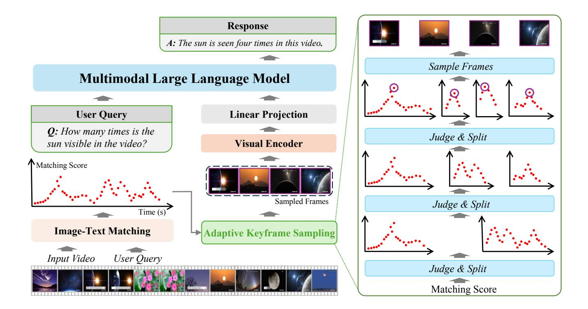
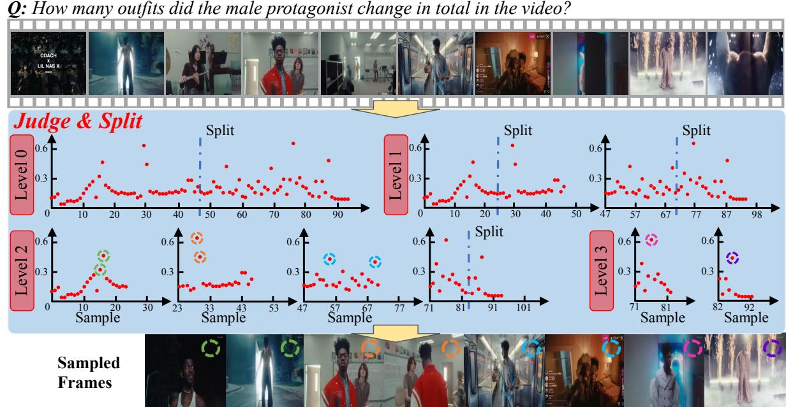
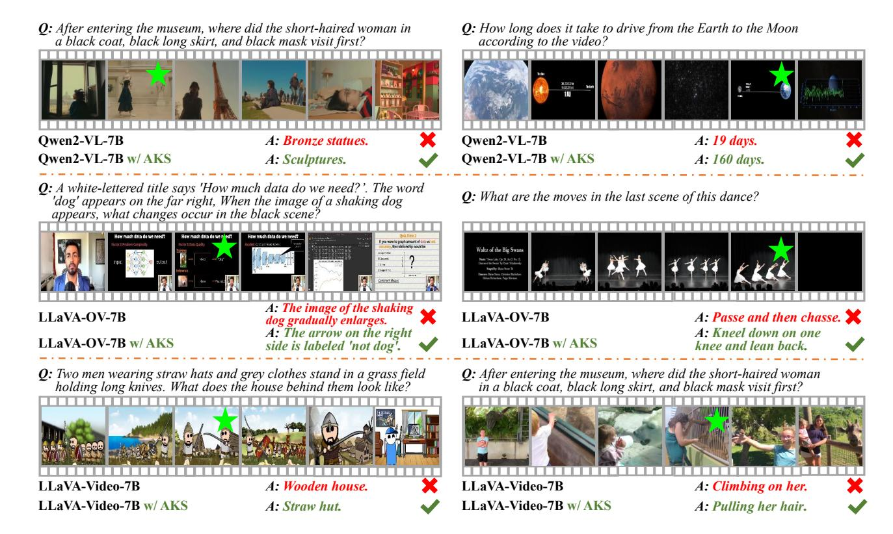
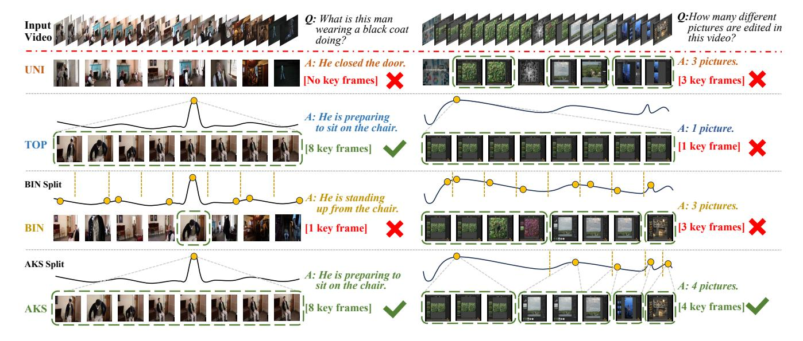
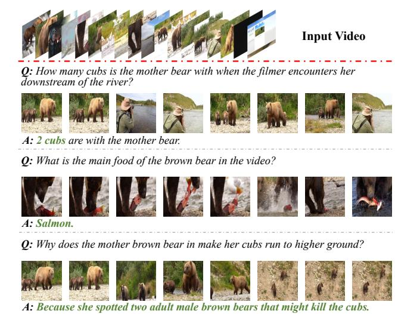
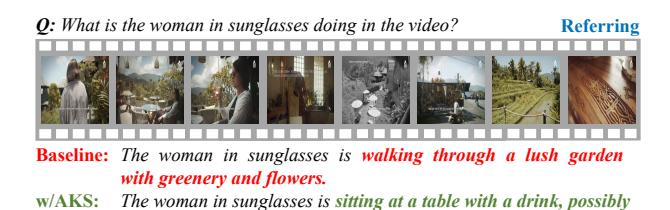
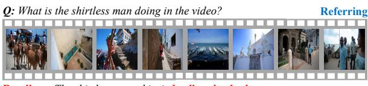
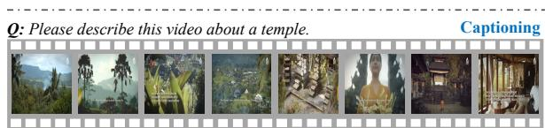

# 3.1. Preliminaries

Within a broad range of video understanding tasks, the model receives a video clip and a text instruction as input and is required to output a text answer. Without loss of generality, we denote the video as V ∈ R T ×W×H×C , where T is the number of frames and W, H, and C denote the width, height, and number of channels, respectively. We consider each frame an image Vt (t ∈ {1, 2, . . . , T}) and apply a pre-trained encoder (*e.g.*, the CLIP ViT-L model [\[32\]](#page-9-7)) to

Figure 2. The overall framework of our approach. We insert a plug-and-play module, Adaptive Keyframe Sampling (AKS, marked in green frames) into the MLLM to improve the quality of sampled keyframes. Each red dot indicates a prompt-frame matching score (*i.e.*,  $s(\mathbf{Q}, \mathbf{F}_t)$ , see Section 3.2). AKS follows a recursive, judge-and-split optimization for keyframe selection (see Section 3.3).

extract a set of visual tokens  $\mathbf{F}_t$  from it. The text instruction (a.k.a., prompt) is denoted as  $\mathbf{Q}$ .

The overall pipeline of our algorithm is illustrated in Figure 2. We use a regular MLLM that addresses video understanding with the template [ User:  $\langle \text{video-tokens} \rangle \rangle$  (textinstruction) Assistant: ], where the video tokens and text instruction are projected into the same feature space using an MLP. For simplicity, we denote the MLLM as a function of  $G(\{\mathbf{F}_t\})$  where we omit the LLM part and only focus on the visual tokens as contexts. With a limited capacity of visual contexts (*i.e.*, the number of video tokens cannot exceed a specific value), the above pipeline encounters difficulty in dealing with long videos where not all video content can be perceived by the MLLM.

A straightforward solution is to select **keyframes** from the input video for token extraction. In other words, the goal is to design a selection function  $\mathrm{KS}_M(\mathbf{Q},\mathbf{F})$  that outputs an index set,  $\mathcal{I} \subseteq \{1,2,\ldots,T\}$  and  $|\mathcal{I}|=M$ , indicating the M best keyframes (M is pre-defined according to the context capacity of the MLLM). Video tokens extracted from the keyframes (i.e.,  $\{\mathbf{F}_t \mid t \in \mathrm{KS}_M(\mathbf{Q},\mathbf{F})\}$  compose of the context of the MLLM. As shown in Figure 1, the quality of keyframe selection is crucial for video understanding, but the function  $\mathrm{KS}_M(\mathbf{Q},\mathbf{F})$  has not been well studied in the community. As an example, a recent MLLM for video understanding [55] simply performed uniform sampling for keyframe selection; with the function  $\mathrm{KS}_M(\cdot)$  not using  $\mathbf{Q}$ 

and F at all, it cannot guarantee to find useful information for question answering.

In what follows, we establish two principles of keyframe selection (Section 3.2), after which we will present AKS, our optimization algorithm (Section 3.3).

#### 3.2. Principles of Keyframe Selection

The keyframe selection function  $KS_M(\mathbf{Q}, \mathbf{F})$  is to maximize the amount of useful information, *i.e.*,

$$KS_M(\mathbf{Q}, \mathbf{F}) = \arg \max_{|\mathcal{I}| = M} G'(\{\mathbf{F}_t \mid t \in \mathcal{I}\}).$$
 (1)

Here, we assume  $G'(\cdot)$  to be a complementary function of  $G(\cdot)$ , indicating the MLLM's confidence about its output. Eqn (1) is mathematically intractable due to two reasons. First, the optimization involves exponentially many candidates of  $\mathcal{I}$ . Second and more importantly, the function  $G'(\cdot)$  is difficult to estimate because there is no supervision for keyframe selection – even when a training set is available and one can compare the output of  $G(\cdot)$  with the ground-truth answer, it is not guaranteed that a correct answer corresponds to a perfect set of keyframes, and vice versa.

We propose a heuristic method to approximate Eqn (1). Intuitively, a set of keyframes is informative when the following conditions are satisfied. (1) The **relevance** between each frame and the prompt is high, *i.e.*, the visual data is

A: The male protagonist changed 5 outfits in total in the video.

Figure 3. An example of adaptive sampling (ADA). 8 keyframes are to be selected from the input video. Each red dot indicates a prompt-frame matching score,  $s(\mathbf{Q}, \mathbf{F}_t)$ . At Level-0 and Level-1, all bins are **split** into two sub-bins; at Level-2, only the rightmost bin is further partitioned while the top-2 scores are **sampled** from the other three bins. Level-3 has reached the maximal depth.

useful for question answering. (2) The **coverage** of the selected frames is sufficient to comprehensively answer the question. Note that the coverage is difficult to quantify, and the second principle is closely related to preventing redundant frames (e.g., neighboring frames with almost the same visual content) from being selected, because (when the size of  $|\mathcal{I}|$  is fixed) they can potentially reduce the amount of other useful information and thus harm the coverage of the entire keyframe set.

Following the analysis above, we reformulate the right-hand side of Eqn (1), yielding:

$$KS_{M}(\mathbf{Q}, \mathbf{F}) = \arg \max_{|\mathcal{I}| = M} \sum_{t \in \mathcal{I}} s(\mathbf{Q}, \mathbf{F}_{t}) + \lambda \cdot c(\mathcal{I}). \quad (2)$$

Here we introduce two quantities,  $r(\mathbf{Q}, \mathbf{F}_t)$  as the relationship between the prompt  $\mathbf{Q}$  and the t-th frame  $\mathbf{F}_t$ , and  $c(\mathcal{I})$  as the coverage of the entire keyframe set over the time axis.  $\lambda$  is the balancing hyper-parameter.

**Computing**  $s(\mathbf{Q}, \mathbf{F}_t)$ . This involves a vision-language (VL) module to measure whether  $\mathbf{F}_t$  contains information for answering  $\mathbf{Q}$ . Although the target MLLM itself  $G(\cdot)$  can play the role, its high computational cost can bring a major burden. In practice, we choose a cheaper VL model (e.g., CLIP [32] or BLIP ITM [16]) for replacement.

**Estimating**  $c(\mathcal{I})$ . Measuring coverage is an open problem which is related to the homogeneity of data distribution. In mathematics, Ripley's K-function [33] is a popular way to measure homogeneity. Given the timestamp set  $\mathcal{I}$  and any

search radius r < T, the K-function of r, denoted as  $\hat{K}(r)$ , is proportional to the number of  $(t_i, t_j)$  pairs satisfying  $|t_i - t_j| < r$ . The distribution of  $\mathcal{I}$  is considered homogeneous (i.e., covering the entire time axis) if  $\hat{K}(r)$  is approximately proportional to  $r^2$ .

To adapt K-function to computing coverage (closely related but a bit different from homogeneity) as well as reducing computational overhead, we introduce bins with width r and approximate  $\mathbb{I}(|t_i-t_j|< r)$  as whether  $t_i$  and  $t_j$  fall into the same bin. We perform a recursive partition. At the first level, we set 2 bins with the bin width being T/2, i.e., the time axis [0,T) is partitioned into 2 non-overlapping bins, [0,T/2) and [T/2,T). With the numbers of keyframes falling within these bins being  $m_1$  and  $m_2$ ,  $c(\mathcal{I})$  adds a penalty term  $|m_1-m_2|$  since an uneven distribution implies weak coverage in the bin with fewer keyframes. At the second level, each of [0,T/2) and [T/2,T) is further partitioned into two bins, and the same calculation continues. The recursion stops at the L-th level, where  $L\leqslant \lceil\log_2 M\rceil$  is a hyper-parameter.

#### 3.3. Adaptive Keyframe Sampling

With the complex definition of  $c(\mathcal{I})$ , it is difficult to find a closed-form or accurate optimization for Eqn (2). This part discusses an approximation. Compared to the baseline that only relies on  $s(\mathbf{Q}, \mathbf{F}_t)$  scores, we name such methods timestamp-aware optimization for its ability to consider timestamps for better keyframe selection results.

We first discuss two special cases. (1) When λ = 0 (*i.e.*, coverage is neglected), Eqn [\(2\)](#page-3-1) is solved by simply selecting the top-M frames of the largest scores. We name this strategy TOP, short for 'top sampling'; as shown in Figure [5,](#page-6-0) in some cases, it results in all keyframes being located within a small range of time and the MLLM missing important information in other moments. (2) When λ → +∞ (*i.e.*, coverage is strictly guaranteed), Eqn [\(2\)](#page-3-1) is solved by selecting the frame within the highest score in each bin as the keyframe (when the number of bins exceeds M, the champion frames with the highest scores are preserved). We name this strategy BIN, short for 'binned sampling'. This situation further degenerates to the uniform sampling baseline [\[55\]](#page-10-1) if a dummy VL model is used for scoring (*i.e.*, s(Q, Ft) is a constant over t). We name this strategy UNI, short for 'uniform sampling'.

In other cases (0 < λ ≪ +∞), we adopt a hierarchical optimization method that follows the definition of c(I). At the first level, we determine how to allocate M keyframes into two bins, [0, T /2) and [T /2, T). We recall the relevance scores of all frames, s(Q, Ft), and compute the average scores over all frames (denoted as sall) and over M frames with the highest scores (denoted as stop). If there is only one keyframe to be selected, or stop − sall surpasses a threshold, sthr, we believe that it is important to guarantee the top-scored frames to be sampled (*i.e.*, maximizing the first term of Eqn [\(2\)](#page-3-1)), so the algorithm directly returns the top-M frames as keyframes. Otherwise, we split the current bin into two sub-bins with the number of keyframes evenly allocated (*i.e.*, maximizing the second term of Eqn [\(2\)](#page-3-1)), and then recursively call the above programs in the sub-bins. We name this strategy ADA, short for 'adaptive sampling'. Note that the hyper-parameter λ is not explicitly tuned; its role is replaced by sthr.

Figure [3](#page-3-2) uses an example to show how adaptive sampling (ADA) works. ADA is a compromise between the special cases, TOP and BIN. As we shall see in experiments (see Section [4.4\)](#page-6-1), ADA absorbs the advantages of TOP and BIN and achieves the best practice of video understanding.

## 4. Experiments

### 4.1. Experimental Setup and Details

Dataset and evaluation. We utilize the popular LMMs-Eval [\[51\]](#page-9-20) to evaluate the performance of AKS. We use two popular benchmarks LongVideoBench [\[43\]](#page-9-1), and VideoMME [\[10\]](#page-8-2), for long video understanding. The length of videos in this dataset can exceed one hour, so the quality of keyframe selection plays a crucial role in visual understanding. We establish AKS beyond three recent videobased MLLMs (see the next paragraph). We do not tune the parameters of these MLLMs, but only change the input frames into those selected by AKS. To highlight the impor-

Table 1. Video-based question answering accuracy (%) of different approaches on LongVideoBench (LVB) val and VideoMME (V-MME). AKS is applied upon three baseline approaches. Frames and LLM indicate the number of video frames fed into the MLLM and the number of parameters in the LLM part, respectively.

| Method                | Frames | LLM | LVB val | V-MME |
|-----------------------|--------|-----|---------|-------|
| GPT-4V [28]           | 256    | –   | 61.3    | 59.9  |
| GPT-4o [29]           | 256    | –   | 66.7    | 71.9  |
| Gemini-1.5-Flash [35] | 256    | –   | 61.6    | 70.3  |
| Gemini-1.5-Pro [35]   | 256    | –   | 64.0    | 75.0  |
| VideoLLaVA [20]       | 8      | 7B  | 39.1    | 39.9  |
| MiniCPM-V 2.6 [46]    | 64     | 8B  | 54.9    | 60.9  |
| PLLaVA [44]           | 32     | 34B | 53.2    | -     |
| VILA [21]             | -      | 40B | -       | 60.1  |
| Qwen2-VL [41]         | 32     | 7B  | 55.5    | 57.6  |
| Qwen2-VL w/ AKS       | 32     | 7B  | 60.5    | 59.9  |
| LLaVA-OV [15]         | 32     | 7B  | 54.8    | 56.5  |
| LLaVA-OV w/ AKS       | 32     | 7B  | 59.3    | 58.4  |
| LLaVA-Video [55]      | 64     | 7B  | 58.9    | 64.4  |
| LLaVA-Video w/ AKS    | 64     | 7B  | 62.7    | 65.3  |

tance of keyframe selection, we do not use video subtitles to assist question answering. This setting also allows us to weaken the impact of the LLM's strength and maximally focus on visual understanding.

Implementation details. We investigate three video-based MLLMs as our baseline, namely, Qwen2VL [\[41\]](#page-9-3), LLaVA-OV [\[15\]](#page-8-4), and LLaVA-Video [\[55\]](#page-10-1). LongVideoBench and VideoMME contain multi-choice questions; to answer these questions, these MLLMs followed a similar prompt involving the question (in text), video frames (as tokens), and options (in text). Specifically, as the strongest baseline, LLaVA-Video used SigLIP [\[49\]](#page-9-25) as its vision encoder and Qwen2-7B [\[45\]](#page-9-26) as its large language model. With capacities to process up to 32 or 64 video frames, these MLLMs offer basic abilities of video understanding, but they were built upon uniformly sampled keyframes and can miss important information.

To reduce computational costs, we sample the candidate frames from the raw video at 1 frame per second. The prompt (in text) and each t-th frame (as image) are fed into the text and visual encoders of BLIP [\[16\]](#page-8-19) to obtain Q and Ft, after which s(Q, Ft) is computed via image-text matching (ITM), *i.e.*, the similarity between Q and Ft. One can also replace BLIP with other vision-language models (*e.g.*, CLIP [\[32\]](#page-9-7)); see the ablation in Section [4.4.](#page-6-1) We use ADA sampling unless otherwise specified.

### 4.2. Comparison to the State-of-the-Art

Quantitative results. We first compare the accuracy of video question answering between our approach and

Figure 4. AKS improves the baseline MLLMs for video understanding. The left three examples come from LongVideoBench while the right three come from VideoMME. Green stars indicate keyframes selected by AKS (note that 64 keyframes are selected for each video).

some recent MLLMs. Results are summarized in Table 1. AKS brings consistent accuracy gain over three baselines, *e.g.*, upon Qwen2VL, the improvement is 5.0% on LongVideoBench and 2.3% on VideoMME; even upon LLaVA-Video, the strongest baseline, these numbers are 3.8% and 0.9%, respectively. These improvements not only make our method surpass other competitors with a similar computational complexity (*i.e.*, input no more than 64 frames, LLM no larger than 7B), but also allow it to achieve higher levels set by larger models (*e.g.*, with AKS, LLaVA-Video-7B reports 62.7% on LongVideoBench, which is 0.8% higher than the LLaVA-Video-72B model without AKS, and 1.4% and 1.1% higher than GPT-4V and Gemini-1.5-Flash, two proprietary models using 256 input frames).

Qualitative results. In Figure 4, we display representative video understanding results of AKS (based on LLaVA-Video-7B) and others. One can see that the selected keyframes are closely related to the question; this allows the MLLM, with a limited capacity of context, to get a comprehensive view of question-related content and thus obtain the correct answer. As a side comment, we find that VideoMME contains many questions that require a high-level comprehension of the video content in which uniform sampling is a safe choice; nevertheless, AKS still finds more informative frames and improves the accuracy, although the gain is smaller than that on LongVideoBench. Please also

Table 2. Video-based question answering accuracy (%) of different sampling strategies. LLaVA-Video-7B with AKS is tested. Please refer to Section 3.3 for the explanations of these abbreviations and Section 4.3 for the analysis of results.

| Sampling | LongVideoBench val | VideoMME |  |
|----------|--------------------|----------|--|
| UNI      | 58.9               | 64.4     |  |
| TOP      | 62.4               | 63.7     |  |
| BIN      | 60.2               | 65.2     |  |
| ADA      | 62.7               | 65.3     |  |

see the appendix for more examples.

### 4.3. Diagnostic on Keyframe Selection

This part aims to diagnose how AKS works and ablates design choices of AKS. We build our test upon the strongest baseline, LLaVA-Video.

MLLMs benefit from better keyframes. To show how keyframe selection impacts video understanding, we test different strategies described in Section 3.3. Table 2 lists the results. Beyond the baseline (*i.e.*, UNI sampling), ADA sampling (our default choice in Section 4.2) achieves the best practice, while each of TOP and BIN samplings is better than the other in one benchmark. Note that the MLLM (*i.e.*, LLaVA-Video-7B) remains unchanged throughout all these tests. In other words, all the improvements owe to

Figure 5. Two examples of how different sampling strategies impact video understanding. The left case comes from LongVideoBench (focusing on one moment) and the right one comes from VideoMME (relying on multiple moments). Each curve shows the  $s(\mathbf{Q}, \mathbf{F}_t)$  score over time, and the yellow circles indicate the position of sampled keyframes. We also annotate the number of **true** keyframes and the reason for each failure case below the answer.

AKS in selecting higher-quality keyframes.

**Visualizing keyframe selection.** Figure 5 shows two representative examples and explains how the style of questions varies across LongVideoBench and VideoMME and how it impacts the preference between **TOP** and **BIN**. Many questions of LongVideoBench are focused on a simple moment (e.g., 'What is a person doing at a specific time point?'), so TOP sampling (i.e., without constraints in temporal distribution) often works well in locating these keyframes, while **BIN** sampling limits the number of keyframes within each bin and results in information loss. On the contrary, the questions of VideoMME often require the model to collect information from multiple moments (e.g., 'How many times does something happen?'), so **BIN** sampling is a safe choice to locate keyframes in different bins, while TOP sampling can lose information in weak peaks. ADA sampling absorbs the advantages of TOP and BIN strategies and adaptively allocates keyframes to the desired position (see the example in Figure 3) – this is why it achieves the best results in both benchmarks.

Figure 6 shows an interesting example that, on the same input video, AKS selects different sets of keyframes based on the prompt. This increases the flexibility that a frozen MLLM can adapt to different scenarios.

#### 4.4. Ablative Studies

The frequency of sampling keyframe candidates. To decrease the extra computational cost brought by AKS, we sample fewer keyframe candidates (*i.e.*, one frame per 2/4/8/10 seconds, and compare the results with the standard 1-fps method. Results are summarized in Table 3.

Figure 6. AKS selects different keyframe sets to answer different questions. All answers are correct.

On LongVideoBench, even at 0.1 fps, all results are higher than the baseline (*i.e.*, 57.4%, 57.9%, 58.9% at 16, 32, 64 frames). VideoMME shows a similar trend, and 0.25 fps seems a safe option to surpass the baseline. It is worth exploring more efficient pre-filtering algorithms towards a better tradeoff between accuracy and efficiency.

The VL model for computing  $s(\mathbf{Q}, \mathbf{F}_t)$  scores. We analyze the impact of using different VL models for computing prompt-frame relevance. We study three options, *i.e.*, BLIP [16] (the default choice in this paper), Sevila (used in [47]), and CLIP [32]. Results are summarized in Table 4. We find that BLIP works better on LongVideoBench

Table 3. Question answering accuracy (%) w.r.t. different sampling frequencies. LLaVA-Video-7B is used as the MLLM.

| Frames             | Sampling Frequency (fps) |      |      |       |      |  |  |
|--------------------|--------------------------|------|------|-------|------|--|--|
| of MLLM            | 1                        | 0.5  | 0.25 | 0.125 | 0.1  |  |  |
| LongVideoBench val |                          |      |      |       |      |  |  |
| 16                 | 61.6                     | 60.7 | 60.6 | 61.1  | 59.4 |  |  |
| 32                 | 61.9                     | 62.1 | 59.8 | 60.2  | 58.5 |  |  |
| 64                 | 62.7                     | 62.2 | 61.8 | 60.1  | 60.1 |  |  |
| VideoMME           |                          |      |      |       |      |  |  |
| 16                 | 62.2                     | 63.0 | 62.2 | 61.0  | 61.6 |  |  |
| 32                 | 64.6                     | 64.7 | 65.1 | 64.4  | 64.4 |  |  |
| 64                 | 65.3                     | 65.1 | 64.9 | 64.0  | 64.2 |  |  |

Table 4. Question answering accuracy (%) w.r.t. different VL scorers. LLaVA-Video-7B is used as the MLLM.

| Frames             | Uniform     | BLIP | Sevila | CLIP |  |  |  |
|--------------------|-------------|------|--------|------|--|--|--|
| LongVideoBench val |             |      |        |      |  |  |  |
| 16                 | 57.4        | 61.6 | 59.2   | 60.2 |  |  |  |
| 32                 | 57.9        | 61.9 | 60.9   | 61.9 |  |  |  |
| 64                 | 58.9        | 62.7 | 61.5   | 62.2 |  |  |  |
| VideoMME           | <del></del> |      |        |      |  |  |  |
| 16                 | 60.6        | 62.2 | 63.0   | 63.1 |  |  |  |
| 32                 | 63.9        | 64.6 | 63.7   | 65.0 |  |  |  |
| 64                 | 64.4        | 65.3 | 65.1   | 65.6 |  |  |  |

Table 5. Ablating L and  $s_{thr}$  together. Left: LVB, Right: V-MME.

| $L$ $s_{\rm thr}$ | 0.0       | 0.2               | 0.4       | 0.6       | 0.8               | 1.0       |
|-------------------|-----------|-------------------|-----------|-----------|-------------------|-----------|
| 1                 | 62.4/63.8 | 62.4/64.0         | 62.5/64.2 | 62.0/64.1 | 61.8/63.8         | 61.9/64.0 |
| 2                 | 62.4/63.8 | 62.0/64.0         | 62.4/64.0 | 61.8/63.5 | 61.7/63.4         | 62.0/63.6 |
| 3                 | 62.4/63.8 | <b>62.8</b> /64.0 | 62.6/54.5 | 62.1/64.4 | 62.2/64.4         | 62.1/64.4 |
| 4                 | 62.4/63.8 | 62.7/64.1         | 62.7/64.3 | 62.2/64.9 | 62.1/65.0         | 62.2/65.0 |
| 5                 | 62.4/63.8 | 62.7/64.1         | 62.2/64.7 | 61.7/65.0 | 61.3/ <b>65.3</b> | 61.7/65.2 |
| 6                 | 62.4/63.8 | 62.7/64.0         | 62.3/64.5 | 61.8/65.0 | 61.3/65.1         | 61.4/65.1 |

while CLIP works better on VideoMME. This is because CLIP was trained on generic image-text pairs while BLIP learned from object-level data – correspondingly, questions in LongVideoBench and VideoMME are more focused on objects and global perception, respectively.

ADA hyper-parameters, L and  $s_{\rm thr}$ . Lastly, we study the impact of L and  $s_{\rm thr}$ . Results are summarized in Table 5. One can see that LongVideoBench prefers smaller L and  $s_{\rm thr}$  values than VideoMME. This is because the key information on LongVideoBench is more concentrated (i.e., many questions are related to single moments) while that on VideoMME is more diverse (multi-moment data are required for question answering). AKS offers a flexible ability to switch between different 'modes' and achieves better results in both datasets.

Baseline: The shirtless man shirt is leading the donkeys.

w/AKS: The shirtless man is standing in a small, rectangular pool with turquoise water.

enjoying the view.

Baseline: The video opens with a view of a lush tropical landscape, featuring tall palm trees and a mountain range in the background. The sky is overcast, and there's a sense of tranquility. As the video progresses, the camera pans to reveal more of the forested area, with dense foliage and a few buildings visible in the distance. The colors are vibrant, with greens of various shades dominating the scene. There are no visible texts or subtitles in the video.

w/AKS: The video opens with a blurry shot of a temple structure, followed by a clearer view of the temple's intricate carvings and statues. The temple appears to be made of stone and is adorned with detailed sculptures of mythical creatures and deities. The sky is visible in the background, suggesting that the temple is outdoors. The video then transitions to a close-up of a statue, highlighting its craftsmanship and the texture of the stone. The final frames show a wider shot of the temple, emphasizing its grandeur and the surrounding natural environment.

Figure 7. Extending AKS for video referring and captioning. The baseline results are produced upon uniform keyframe sampling. Red and green texts indicate incorrect and correct descriptions.

#### 4.5. Generalization to Other Tasks

Being an off-the-shelf algorithm, AKS is easily applied to other video understanding tasks. Here we showcase two examples known as video referring and captioning. For this purpose, we use the LLaVA-Video-7B model, switch the text prompt into 'What is [target] doing in the video?' or 'Please describe this video.', and remove the options. Qualitative results are shown in Figure 7. As seen, to obtain a comprehensive description of long videos, it is crucial to locate keyframes and feed them into the MLLM as visual contexts. AKS benefits from its keyframe selection ability and helps the MLLM to generate much better answers.

#### 5. Conclusions

This paper focuses on improving the ability of MLLMs for long video understanding. The main difficulty arises from the limited capacity of MLLMs which urges us to feed informative visual tokens into the model. For this purpose, we present the Adaptive Keyframe Sampling (AKS) algorithm which (1) uses a vision-language model to estimate the **relevance** and (2) applies an adaptive optimization algorithm to facilitate the **coverage** of selected keyframes. Quantitative and qualitative studies validate the effectiveness of

AKS over different baselines and benchmarks. Our work reveals that a pre-filtering stage brings considerable benefit to video understanding and advocates for further studies in this direction.

### References

- [1] Jean-Baptiste Alayrac, Jeff Donahue, Pauline Luc, Antoine Miech, Iain Barr, Yana Hasson, Karel Lenc, Arthur Mensch, Katherine Millican, Malcolm Reynolds, et al. Flamingo: a visual language model for few-shot learning. *Advances in Neural Information Processing Systems*, 35:23716–23736, 2022. [2](#page-1-0)
- [2] Kirolos Ataallah, Xiaoqian Shen, Eslam Abdelrahman, Essam Sleiman, Mingchen Zhuge, Jian Ding, Deyao Zhu, Jurgen Schmidhuber, and Mohamed Elhoseiny. Goldfish: ¨ Vision-language understanding of arbitrarily long videos. *arXiv preprint arXiv:2407.12679*, 2024. [2](#page-1-0)
- [3] Tom Brown, Benjamin Mann, Nick Ryder, Melanie Subbiah, Jared D Kaplan, Prafulla Dhariwal, Arvind Neelakantan, Pranav Shyam, Girish Sastry, Amanda Askell, et al. Language models are few-shot learners. *Advances in neural information processing systems*, 33:1877–1901, 2020. [2](#page-1-0)
- [4] Wei-Lin Chiang, Zhuohan Li, Zi Lin, Ying Sheng, Zhanghao Wu, Hao Zhang, Lianmin Zheng, Siyuan Zhuang, Yonghao Zhuang, Joseph E Gonzalez, et al. Vicuna: An open-source chatbot impressing gpt-4 with 90%\* chatgpt quality. *See https://vicuna. lmsys. org (accessed 14 April 2023)*, 2023.
- [5] Aakanksha Chowdhery, Sharan Narang, Jacob Devlin, Maarten Bosma, Gaurav Mishra, Adam Roberts, Paul Barham, Hyung Won Chung, Charles Sutton, Sebastian Gehrmann, et al. Palm: Scaling language modeling with pathways. *arXiv preprint arXiv:2204.02311*, 2022.
- [6] Hyung Won Chung, Le Hou, Shayne Longpre, Barret Zoph, Yi Tay, William Fedus, Yunxuan Li, Xuezhi Wang, Mostafa Dehghani, Siddhartha Brahma, et al. Scaling instruction-finetuned language models. *arXiv preprint arXiv:2210.11416*, 2022. [2](#page-1-0)
- [7] Wenliang Dai, Junnan Li, Dongxu Li, Anthony Meng Huat Tiong, Junqi Zhao, Weisheng Wang, Boyang Li, Pascale Fung, and Steven C. H. Hoi. Instructblip: Towards generalpurpose vision-language models with instruction tuning. *arXiv preprint arXiv:2305.06500*, 2023. [2](#page-1-0)
- [8] Jacob Devlin, Ming-Wei Chang, Kenton Lee, and Kristina Toutanova. Bert: Pre-training of deep bidirectional transformers for language understanding. *arXiv preprint arXiv:1810.04805*, 2018. [2](#page-1-0)
- [9] Alexey Dosovitskiy, Lucas Beyer, Alexander Kolesnikov, Dirk Weissenborn, Xiaohua Zhai, Thomas Unterthiner, Mostafa Dehghani, Matthias Minderer, Georg Heigold, Sylvain Gelly, et al. An image is worth 16x16 words: Transformers for image recognition at scale. *arXiv preprint arXiv:2010.11929*, 2020. [2](#page-1-0)
- [10] Chaoyou Fu, Yuhan Dai, Yongdong Luo, Lei Li, Shuhuai Ren, Renrui Zhang, Zihan Wang, Chenyu Zhou, Yunhang Shen, Mengdan Zhang, et al. Video-mme: The first-ever comprehensive evaluation benchmark of multi-modal llms in

- video analysis. *arXiv preprint arXiv:2405.21075*, 2024. [1,](#page-0-1) [2,](#page-1-0) [5,](#page-4-2) [12](#page-11-0)
- [11] Bo He, Hengduo Li, Young Kyun Jang, Menglin Jia, Xuefei Cao, Ashish Shah, Abhinav Shrivastava, and Ser-Nam Lim. Ma-lmm: Memory-augmented large multimodal model for long-term video understanding. In *Proceedings of the IEEE/CVF Conference on Computer Vision and Pattern Recognition*, pages 13504–13514, 2024. [2](#page-1-0)
- [12] Mojan Javaheripi, Sebastien Bubeck, Marah Abdin, Jy- ´ oti Aneja, Sebastien Bubeck, Caio Cesar Teodoro Mendes, ´ Weizhu Chen, Allie Del Giorno, Ronen Eldan, Sivakanth Gopi, et al. Phi-2: The surprising power of small language models. *Microsoft Research Blog*, 2023. [2](#page-1-0)
- [13] Alexander Kirillov, Eric Mintun, Nikhila Ravi, Hanzi Mao, Chloe Rolland, Laura Gustafson, Tete Xiao, Spencer Whitehead, Alexander C. Berg, Wan-Yen Lo, Piotr Dollar, ´ and Ross Girshick. Segment Anything. *arXiv preprint arXiv:2304.02643*, 2023. [2](#page-1-0)
- [14] Xin Lai, Zhuotao Tian, Yukang Chen, Yanwei Li, Yuhui Yuan, Shu Liu, and Jiaya Jia. LISA: Reasoning Segmentation via Large Language Model. *arXiv preprint arXiv:2308.00692*, 2023. [1,](#page-0-1) [2](#page-1-0)
- [15] Bo Li, Yuanhan Zhang, Dong Guo, Renrui Zhang, Feng Li, Hao Zhang, Kaichen Zhang, Yanwei Li, Ziwei Liu, and Chunyuan Li. Llava-onevision: Easy visual task transfer. *arXiv preprint arXiv:2408.03326*, 2024. [2,](#page-1-0) [5,](#page-4-2) [11](#page-10-5)
- [16] Junnan Li, Dongxu Li, Caiming Xiong, and Steven Hoi. Blip: Bootstrapping language-image pre-training for unified vision-language understanding and generation. In *International Conference on Machine Learning*, pages 12888– 12900. PMLR, 2022. [4,](#page-3-3) [5,](#page-4-2) [7](#page-6-3)
- [17] Junnan Li, Dongxu Li, Silvio Savarese, and Steven Hoi. BLIP-2: Bootstrapping Language-Image Pre-training with Frozen Image Encoders and Large Language Models. *arXiv preprint arXiv:2301.12597*, 2023. [2](#page-1-0)
- [18] KunChang Li, Yinan He, Yi Wang, Yizhuo Li, Wenhai Wang, Ping Luo, Yali Wang, Limin Wang, and Yu Qiao. Videochat: Chat-centric video understanding, 2024. [2](#page-1-0)
- [19] Zhaowei Li, Qi Xu, Dong Zhang, Hang Song, Yiqing Cai, Qi Qi, Ran Zhou, Junting Pan, Zefeng Li, Van Tu Vu, Zhida Huang, and Tao Wang. Groundinggpt:language enhanced multi-modal grounding model, 2024. [2](#page-1-0)
- [20] Bin Lin, Yang Ye, Bin Zhu, Jiaxi Cui, Munan Ning, Peng Jin, and Li Yuan. Video-llava: Learning united visual representation by alignment before projection, 2023. [1,](#page-0-1) [2,](#page-1-0) [5](#page-4-2)
- [21] Ji Lin, Hongxu Yin, Wei Ping, Pavlo Molchanov, Mohammad Shoeybi, and Song Han. Vila: On pre-training for visual language models. In *Proceedings of the IEEE/CVF Conference on Computer Vision and Pattern Recognition*, pages 26689–26699, 2024. [5](#page-4-2)
- [22] Haotian Liu, Chunyuan Li, Qingyang Wu, and Yong Jae Lee. Visual Instruction Tuning. *arXiv preprint arXiv:2304.08485*, 2023. [1,](#page-0-1) [2](#page-1-0)
- [23] Jiajun Liu, Yibing Wang, Hanghang Ma, Xiaoping Wu, Xiaoqi Ma, Xiaoming Wei, Jianbin Jiao, Enhua Wu, and Jie Hu. Kangaroo: A powerful video-language model supporting long-context video input. *arXiv preprint arXiv:2408.15542*, 2024. [2](#page-1-0)

- [24] Ze Liu, Yutong Lin, Yue Cao, Han Hu, Yixuan Wei, Zheng Zhang, Stephen Lin, and Baining Guo. Swin transformer: Hierarchical vision transformer using shifted windows. In *Proceedings of the IEEE/CVF international conference on computer vision*, pages 10012–10022, 2021. [2](#page-1-0)
- [25] Ruipu Luo, Ziwang Zhao, Min Yang, Junwei Dong, Da Li, Pengcheng Lu, Tao Wang, Linmei Hu, Minghui Qiu, and Zhongyu Wei. Valley: Video assistant with large language model enhanced ability, 2023. [2](#page-1-0)
- [26] Muhammad Maaz, Hanoona Rasheed, Salman Khan, and Fahad Shahbaz Khan. Video-chatgpt: Towards detailed video understanding via large vision and language models, 2023. [2](#page-1-0)
- [27] Shehan Munasinghe, Rusiru Thushara, Muhammad Maaz, Hanoona Abdul Rasheed, Salman Khan, Mubarak Shah, and Fahad Khan. Pg-video-llava: Pixel grounding large videolanguage models, 2023. [2](#page-1-0)
- [28] OpenAI. Gpt-4v. [https://openai.com/index/](https://openai.com/index/gpt-4v-system-card/) [gpt-4v-system-card/](https://openai.com/index/gpt-4v-system-card/), 2023. [5](#page-4-2)
- [29] OpenAI. Hello gpt-4o. [https : / / openai . com /](https://openai.com/index/hello-gpt-4o/) [index/hello-gpt-4o/](https://openai.com/index/hello-gpt-4o/), 2024. [5](#page-4-2)
- [30] Rui Qian, Xiaoyi Dong, Pan Zhang, Yuhang Zang, Shuangrui Ding, Dahua Lin, and Jiaqi Wang. Streaming long video understanding with large language models. *arXiv preprint arXiv:2405.16009*, 2024. [2](#page-1-0)
- [31] Jihao Qiu, Yuan Zhang, Xi Tang, Lingxi Xie, Tianren Ma, Pengyu Yan, David Doermann, Qixiang Ye, and Yunjie Tian. Artemis: Towards referential understanding in complex videos. *arXiv preprint arXiv:2406.00258*, 2024. [2](#page-1-0)
- [32] Alec Radford, Jong Wook Kim, Chris Hallacy, Aditya Ramesh, Gabriel Goh, Sandhini Agarwal, Girish Sastry, Amanda Askell, Pamela Mishkin, Jack Clark, et al. Learning transferable visual models from natural language supervision. In *International conference on machine learning*, pages 8748–8763. PMLR, 2021. [2,](#page-1-0) [4,](#page-3-3) [5,](#page-4-2) [7](#page-6-3)
- [33] Brian D Ripley. The second-order analysis of stationary point processes. *Journal of applied probability*, 13(2):255– 266, 1976. [4](#page-3-3)
- [34] Enxin Song, Wenhao Chai, Guanhong Wang, Yucheng Zhang, Haoyang Zhou, Feiyang Wu, Haozhe Chi, Xun Guo, Tian Ye, Yanting Zhang, et al. Moviechat: From dense token to sparse memory for long video understanding. In *Proceedings of the IEEE/CVF Conference on Computer Vision and Pattern Recognition*, pages 18221–18232, 2024. [2](#page-1-0)
- [35] Gemini Team, Rohan Anil, Sebastian Borgeaud, Yonghui Wu, Jean-Baptiste Alayrac, Jiahui Yu, Radu Soricut, Johan Schalkwyk, Andrew M Dai, Anja Hauth, et al. Gemini: a family of highly capable multimodal models. *arXiv preprint arXiv:2312.11805*, 2023. [5](#page-4-2)
- [36] Romal Thoppilan, Daniel De Freitas, Jamie Hall, Noam Shazeer, Apoorv Kulshreshtha, Heng-Tze Cheng, Alicia Jin, Taylor Bos, Leslie Baker, Yu Du, et al. Lamda: Language models for dialog applications. *arXiv preprint arXiv:2201.08239*, 2022. [2](#page-1-0)
- [37] Yunjie Tian, Lingxi Xie, Xiaopeng Zhang, Jiemin Fang, Haohang Xu, Wei Huang, Jianbin Jiao, Qi Tian, and Qixiang Ye. Semantic-aware generation for self-supervised visual representation learning. *arXiv preprint arXiv:2111.13163*, 2021. [2](#page-1-0)

- [38] Yunjie Tian, Lingxi Xie, Zhaozhi Wang, Longhui Wei, Xiaopeng Zhang, Jianbin Jiao, Yaowei Wang, Qi Tian, and Qixiang Ye. Integrally Pre-Trained Transformer Pyramid Networks. In *2023 IEEE/CVF Conference on Computer Vision and Pattern Recognition*, pages 18610–18620. IEEE, 2023. [2](#page-1-0)
- [39] Yunjie Tian, Tianren Ma, Lingxi Xie, Jihao Qiu, Xi Tang, Yuan Zhang, Jianbin Jiao, Qi Tian, and Qixiang Ye. Chatterbox: Multi-round multimodal referring and grounding. *arXiv preprint arXiv:2401.13307*, 2024. [1,](#page-0-1) [2](#page-1-0)
- [40] Hugo Touvron, Thibaut Lavril, Gautier Izacard, Xavier Martinet, Marie-Anne Lachaux, Timothee Lacroix, Baptiste ´ Roziere, Naman Goyal, Eric Hambro, Faisal Azhar, et al. ` Llama: Open and efficient foundation language models. *arXiv preprint arXiv:2302.13971*, 2023. [2](#page-1-0)
- [41] Peng Wang, Shuai Bai, Sinan Tan, Shijie Wang, Zhihao Fan, Jinze Bai, Keqin Chen, Xuejing Liu, Jialin Wang, Wenbin Ge, et al. Qwen2-vl: Enhancing vision-language model's perception of the world at any resolution. *arXiv preprint arXiv:2409.12191*, 2024. [2,](#page-1-0) [5,](#page-4-2) [11](#page-10-5)
- [42] Yuetian Weng, Mingfei Han, Haoyu He, Xiaojun Chang, and Bohan Zhuang. Longvlm: Efficient long video understanding via large language models. *arXiv preprint arXiv:2404.03384*, 2024. [2](#page-1-0)
- [43] Haoning Wu, Dongxu Li, Bei Chen, and Junnan Li. Longvideobench: A benchmark for long-context interleaved video-language understanding. *arXiv preprint arXiv:2407.15754*, 2024. [1,](#page-0-1) [2,](#page-1-0) [5,](#page-4-2) [12](#page-11-0)
- [44] Lin Xu, Yilin Zhao, Daquan Zhou, Zhijie Lin, See Kiong Ng, and Jiashi Feng. Pllava: Parameter-free llava extension from images to videos for video dense captioning. *arXiv preprint arXiv:2404.16994*, 2024. [1,](#page-0-1) [5](#page-4-2)
- [45] An Yang, Baosong Yang, Binyuan Hui, Bo Zheng, Bowen Yu, Chang Zhou, Chengpeng Li, Chengyuan Li, Dayiheng Liu, Fei Huang, et al. Qwen2 technical report. *arXiv preprint arXiv:2407.10671*, 2024. [5](#page-4-2)
- [46] Yuan Yao, Tianyu Yu, Ao Zhang, Chongyi Wang, Junbo Cui, Hongji Zhu, Tianchi Cai, Haoyu Li, Weilin Zhao, Zhihui He, et al. Minicpm-v: A gpt-4v level mllm on your phone. *arXiv preprint arXiv:2408.01800*, 2024. [5](#page-4-2)
- [47] Shoubin Yu, Jaemin Cho, Prateek Yadav, and Mohit Bansal. Self-chained image-language model for video localization and question answering. *Advances in Neural Information Processing Systems*, 36, 2024. [7](#page-6-3)
- [48] Aohan Zeng, Xiao Liu, Zhengxiao Du, Zihan Wang, Hanyu Lai, Ming Ding, Zhuoyi Yang, Yifan Xu, Wendi Zheng, Xiao Xia, et al. Glm-130b: An open bilingual pre-trained model. *arXiv preprint arXiv:2210.02414*, 2022. [2](#page-1-0)
- [49] Xiaohua Zhai, Basil Mustafa, Alexander Kolesnikov, and Lucas Beyer. Sigmoid loss for language image pre-training. In *Proceedings of the IEEE/CVF International Conference on Computer Vision*, pages 11975–11986, 2023. [5](#page-4-2)
- [50] Hang Zhang, Xin Li, and Lidong Bing. Video-llama: An instruction-tuned audio-visual language model for video understanding, 2023. [2](#page-1-0)
- [51] Kaichen Zhang, Bo Li, Peiyuan Zhang, Fanyi Pu, Joshua Adrian Cahyono, Kairui Hu, Shuai Liu, Yuanhan

- Zhang, Jingkang Yang, Chunyuan Li, et al. Lmms-eval: Reality check on the evaluation of large multimodal models. *arXiv preprint arXiv:2407.12772*, 2024. [5](#page-4-2)
- [52] Susan Zhang, Stephen Roller, Naman Goyal, Mikel Artetxe, Moya Chen, Shuohui Chen, Christopher Dewan, Mona Diab, Xian Li, Xi Victoria Lin, et al. Opt: Open pre-trained transformer language models. *arXiv preprint arXiv:2205.01068*, 2022. [2](#page-1-0)
- [53] Shilong Zhang, Peize Sun, Shoufa Chen, Min Xiao, Wenqi Shao, Wenwei Zhang, Kai Chen, and Ping Luo. GPT4RoI: Instruction Tuning Large Language Model on Region-of-Interest. *arXiv preprint arXiv:2307.03601*, 2023. [1,](#page-0-1) [2](#page-1-0)
- [54] Xiaosong Zhang, Yunjie Tian, Lingxi Xie, Wei Huang, Qi Dai, Qixiang Ye, and Qi Tian. Hivit: A simpler and more efficient design of hierarchical vision transformer. In *The Eleventh International Conference on Learning Representations*, 2022. [2](#page-1-0)
- [55] Yuanhan Zhang, Jinming Wu, Wei Li, Bo Li, Zejun Ma, Ziwei Liu, and Chunyuan Li. Video instruction tuning with synthetic data. *arXiv preprint arXiv:2410.02713*, 2024. [1,](#page-0-1) [2,](#page-1-0) [3,](#page-2-3) [5,](#page-4-2) [11](#page-10-5)
- [56] Bin Zhu, Bin Lin, Munan Ning, Yang Yan, Jiaxi Cui, HongFa Wang, Yatian Pang, Wenhao Jiang, Junwu Zhang, Zongwei Li, Wancai Zhang, Zhifeng Li, Wei Liu, and Li Yuan. Languagebind: Extending video-language pretraining to nmodality by language-based semantic alignment, 2024. [2](#page-1-0)

