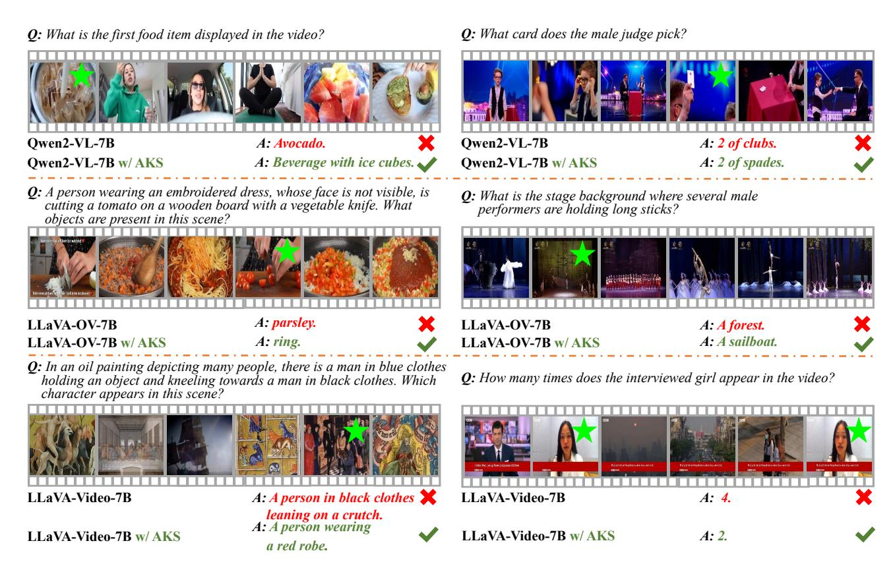

# A. Details of the ADA Algorithm

In Algorithm [1,](#page-10-6) we present the detailed pseudocode of our ADA algorithm. To accelerate the experimental process, we pre-process the video frames (sampled at 1 frame per second along with the corresponding questions) by inputting them into the VL scorer to obtain the corresponding scores. These scores are then stored in a list referred to as matching score. Each element in matching score consists of the matching score for a specific video frame and the corresponding question. We begin by employing a recursive strategy to partition the matching scores list into sublists of varying lengths, according to the partitioning rule outlined in Section 3.3. Subsequently, based on the lengths of these sublists, we select different numbers of frames with the highest matching scores from each sublist to construct the final set of video frames. This final set is then sent to the language model for visual understanding.

### B. More Visualization Results

In Figure [8,](#page-11-1) we show more examples of video understanding results of AKS (based on three baselines, LLaVA-Video-7B [\[55\]](#page-10-1), Qwen2-VL-7B [\[41\]](#page-9-3), and LLaVA-OV-7B [\[15\]](#page-8-4)). As shown, our approach benefits from the ability to locate keyframes so that the MLLM receives effective visual information for understanding. The ability easily transfers to various MLLMs in a plug-and-play manner.

```
Algorithm 1: ADA: Adaptive Keyframe Selection
 Input: matching scores: A list, where each
        element is the matching score of a frame and
        the corresponding question
 level: Current recursion level
 max level: Maximum recursion level
 sthr: Threshold
 M: Number of frames to select
 Output: selected frames: Indices of the selected
          M frames
 Function SplitSegments(matching scores,
  level, max level, sthr, M):
    split scores ← [] // List of completed
         segments
    new scores ← [] // List of segments
         to further split
    foreach matching score in matching scores
      do
        sall ← mean(matching score)
        stop ← mean(topk(matching score, M))
        m ← stop − sall
        if m ≥ sthr then
            Append matching score to split scores
        else if level < max level then
            Split matching score into two bins
             from the center, denoted as split1 and
             split2
            Append split1 and split2 to new scores
    if new scores is not empty then
        deeper scores ← SplitSegments
         (new scores, level + 1, max level, sthr,
         M//2
               level)
        split scores ←
         merge(split scores, deeper scores)
    return split scores
 Function SelectFrames(segments, M):
    total length ← Total length of all segments
    selected frames ← []
    foreach segment in segments do
        mi ←
         ⌊M × length(segment)/total length⌋
        Select the top mi highest-scoring frame
         indices from segment
        Append the selected indices to
         selected frames
    return selected frames
 Main:
    matching scores ← [matching score]
    segments ← SplitSegments
```

(matching scores, level, max level, sthr) selected frames ← SelectFrames

(segments, M) return selected frames

<span id="page-11-1"></span><span id="page-11-0"></span>

Figure 8. More examples of AKS enhance the baseline MLLMs for video understanding. The left three examples come from LongVideoBench [43] while the right three are from VideoMME [10]. Green stars indicate keyframes selected by AKS.