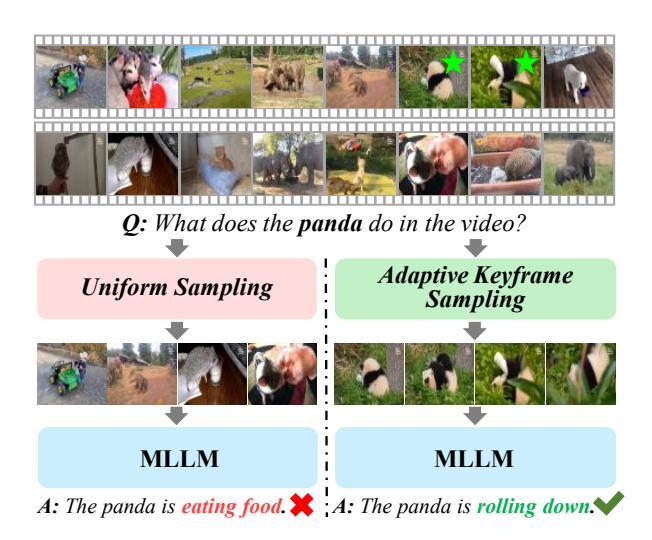

# Abstract

*Multimodal large language models (MLLMs) have enabled open-world visual understanding by injecting visual input as extra tokens into large language models (LLMs) as contexts. However, when the visual input changes from a single image to a long video, the above paradigm encounters difficulty because the vast amount of video tokens has significantly exceeded the maximal capacity of MLLMs. Therefore, existing video-based MLLMs are mostly established upon sampling a small portion of tokens from input data, which can cause key information to be lost and thus produce incorrect answers. This paper presents a simple yet effective algorithm named Adaptive Keyframe Sampling (AKS). It inserts a plug-and-play module known as keyframe selection, which aims to maximize the useful information with a fixed number of video tokens. We formulate keyframe selection as an optimization involving (1) the relevance between the keyframes and the prompt, and (2) the coverage of the keyframes over the video, and present an adaptive algorithm to approximate the best solution. Experiments on two long video understanding benchmarks validate that AKS improves video QA accuracy (beyond strong baselines) upon selecting informative keyframes. Our study reveals the importance of information pre-filtering in video-based MLLMs.Our codes are available at [https://github.com/ncTimTang/AKS.](https://github.com/ncTimTang/AKS)*

## 1. Introduction

"*You can't manage what you can't measure.*"

*— Peter Drucker*

Recent years have witnessed a rapid development of multimodal large language models (MLLMs) [\[14,](#page-8-0) [22,](#page-8-1) [39,](#page-9-0) [53\]](#page-10-0) for open-world visual understanding. Among the large corpus of research in MLLMs, a straightforward and important direction is to generalize them to video data. Compared to still images, videos contain richer and more complex visual

Figure 1. The accuracy of video-based MLLMs heavily relies on the quality of keyframes. The above example shows a long video from VideoMME [\[10\]](#page-8-2) where keyframes are marked with green stars. The same MLLM (*i.e.*, LLaVA-Video [\[55\]](#page-10-1)) is used for answering the question. Uniform sampling (the default setting in [\[55\]](#page-10-1)) finds irrelevant frames (the MLLM mostly performs a random guess), while our algorithm (AKS) finds keyframes and produces the correct answer.

content, thus raising serious challenges to MLLMs including key information retrieval, summarization, logical inference, *etc*. Many benchmarks [\[10,](#page-8-2) [43\]](#page-9-1) have been established to evaluate MLLMs for video understanding.

A typical framework of image-based MLLMs involves encoding the input image into a set of visual tokens and feeding them as the context of LLMs. When this framework was transplanted to videos, especially long videos, a difficulty arose from the limited capacity of MLLMs, *i.e.*, the maximal number of visual tokens that MLLMs can process is much fewer than that of an entire video; in other words, not all video tokens can be perceived by MLLMs. To bridge the gap, recent approaches [\[20,](#page-8-3) [44\]](#page-9-2) often sam-

\*Equal contribution.

pled a small portion of frames from the input video; consequently, the performance of these MLLMs heavily relies on the quality of selected frames (*i.e.*, keyframes). Despite its importance, the keyframe selection algorithm has not been carefully designed, *e.g.*, LLaVA-Video [\[55\]](#page-10-1) simply applied a uniform sampling strategy which, as shown in Figure [1,](#page-0-0) is prone to losing important information and thus leads to incorrect outputs of video understanding.

This paper presents a systematic study on keyframe selection and reveals its importance to video understanding and beyond. We formulate keyframe selection as a plugand-play module before the MLLM's visual encoder; its goal is to maximize the usefulness of the keyframes in video understanding. Intuitively, we propose two key aspects to be considered, namely, (1) relevance (*i.e.*, how the keyframes are related to the question) and (2) coverage (*i.e.*, how the keyframe set covers the useful information in the entire video). Specifically, we quantify the target by (1) computing relevance between each candidate frame and the prompt using a vision-language (VL) model, and (2) estimating coverage by recursively partitioning the video into bins and counting the number of keyframes within each bin. We show that maximizing relevance and coverage alone produces simple baselines for keyframe selection, while a proper tradeoff between them, obtained by the proposed Adaptive Keyframe Sampling (AKS) algorithm, leads to the best practice of video understanding.

We evaluate our approach on LongVideoBench [\[43\]](#page-9-1) and VideoMME [\[10\]](#page-8-2), two benchmarks for long video understanding. We investigate three frame-based MLLMs (Qwen2VL [\[41\]](#page-9-3), LLaVA-OV [\[15\]](#page-8-4), and LLaVA-Video [\[55\]](#page-10-1)) as the baseline and insert AKS as an off-the-shelf module to improve the quality of keyframes. Our approach achieves consistent accuracy gain throughout all tests. Specifically, when AKS is integrated with LLaVA-Video-7B, we set new records on these two benchmarks with 7B models. We further validate that the improvement owes to higher-quality keyframes found by AKS, demonstrating that MLLMs become stronger with more informative visual contexts. Our study reveals that pre-filtering visual data is crucial and will be a long-lasting research topic for MLLMs in perceiving high-dimensional data, *e.g.*, long videos, and even 4D data.

## 2. Related Work

Large language models (LLMs) and multimodal LLMs (MLLMs). LLMs [\[3](#page-8-5)[–6,](#page-8-6) [8,](#page-8-7) [36,](#page-9-4) [40,](#page-9-5) [48,](#page-9-6) [52\]](#page-10-2) have marked a new era in AI, showcasing significant potential in unifying various tasks covering language understanding and generation. To extend LLMs for visual understanding, the community has focused on aligning visual and language data within a unified feature space [\[32\]](#page-9-7). There are generally two types of approaches, (1) internal adaptation, such as [\[1\]](#page-8-8), that integrates cross-attention mechanisms within LLMs to achieve vision-language alignment, and (2) external adaptation, such as [\[7,](#page-8-9) [17,](#page-8-10) [22\]](#page-8-1), that trains additional modules for the same purpose. Consequently, vision foundation models [\[9,](#page-8-11) [13,](#page-8-12) [24,](#page-9-8) [32,](#page-9-7) [37,](#page-9-9) [38,](#page-9-10) [54\]](#page-10-3) have evolved into multimodal LLMs (MLLMs) [\[14,](#page-8-0) [22,](#page-8-1) [39,](#page-9-0) [53\]](#page-10-0), enabling them to perform language-guided visual understanding tasks.

Video-based MLLMs. Researchers have extended MLLMs to video understanding. Early efforts in this area include VideoChat [\[18\]](#page-8-13), Video-ChatGPT [\[26\]](#page-9-11), Video-LLaMA [\[50\]](#page-9-12), Video-LLaVA [\[20\]](#page-8-3), LanguageBind [\[56\]](#page-10-4), and Valley [\[25\]](#page-9-13), *etc*. Different from still images, videos contain rich content that, when encoded as visual tokens, exceed the maximal context capacity of MLLMs. Most of the above methods have sampled video frames to fit MLLMs; some of them, such as Video-ChatGPT [\[26\]](#page-9-11), introduced more efficient video features. There are also studies on instancelevel video understanding have been proposed, such as LEGO [\[19\]](#page-8-14) for moment retrieval, PG-Video-LLaVA [\[27\]](#page-9-14) for video grounding, and Artemis [\[31\]](#page-9-15) for video referring, enriching the corpus of video understanding.

MLLMs for Long Video Understanding. Going one step further, long video understanding faces greater challenges due to the increased difficulty of keyframe selection, leading to significant loss of critical information. While some MLLMs (*e.g.*, Kangaroo [\[23\]](#page-8-15) and LLaVA-Video [\[55\]](#page-10-1)) utilize language models with larger context capacities to allow more frames to be encoded and processed, many others have designed specific strategies to mitigate this issue. For example, MovieChat [\[34\]](#page-9-16) employed both short-term and long-term memory banks to compress and preserve video content. Similarly, MA-LMM [\[11\]](#page-8-16) VideoStreaming [\[30\]](#page-9-17) used a Q-former and a small language model (phi-2 [\[12\]](#page-8-17)), to condense video data, while LongVLM [\[42\]](#page-9-18) adopted token merging to decrease the number of video tokens. Goldfish [\[2\]](#page-8-18) integrated short video understanding with information retrieval to answer complex queries. In summary, these approaches aim to reduce the number of video tokens, but there is often no guarantee that key information in the video can be preserved. *This work presents a simple yet effective algorithm that maximally preserves important information for long video understanding.*

### 3. Method

