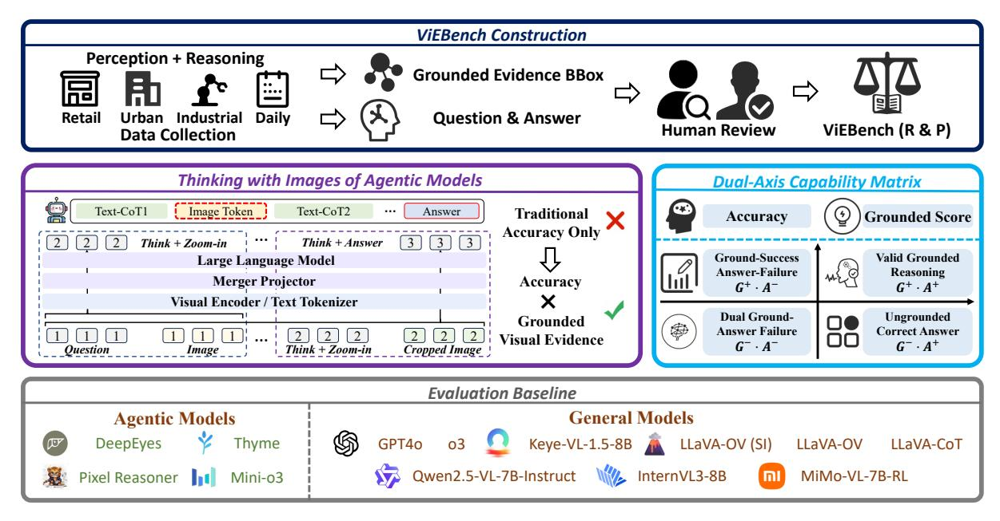
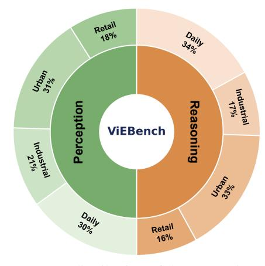
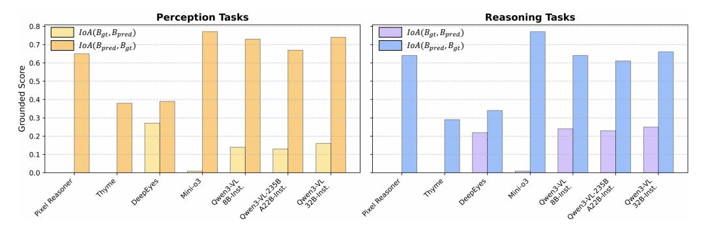

# 2 Related Work

## 2.1 Vision-Language Models

The landscape of Vision-Language Models (VLMs) has evolved from early alignment-based models to powerful large-scale multimodal systems. End-toend models, such as the GPT series [\(Hurst et al.,](#page-8-7) [2024\)](#page-8-7), Gemini series [\(Team et al.,](#page-9-10) [2024,](#page-9-10) [2023;](#page-9-11) [Co](#page-8-8)[manici et al.,](#page-8-8) [2025\)](#page-8-8) and open-source leaders like InternVL [\(Zhu et al.,](#page-10-2) [2025a;](#page-10-2) [Wang et al.,](#page-9-12) [2025\)](#page-9-12), LLaVA-OneVision [\(Li et al.,](#page-8-9) [2024a\)](#page-8-9) and Qwen-VL [\(Bai et al.,](#page-8-10) [2025b](#page-8-10)[,a\)](#page-8-0), typically process images through a fixed-resolution vision encoder. While these models have demonstrated remarkable zeroshot capabilities, they often suffer from "visual forgetting" when dealing with high-resolution images due to the information loss inherent in global downsampling [\(Wang et al.,](#page-9-6) [2024;](#page-9-6) [Li et al.,](#page-8-11) [2025a\)](#page-8-11). Recent efforts have attempted to mitigate this by scaling parameters or incorporating mixture-of-experts (MoE) architectures [\(Bai et al.,](#page-8-0) [2025a\)](#page-8-0), yet the underlying black-box nature of their perception remains a significant hurdle for verifiable reasoning.

## 2.2 Thinking-with-Images

To overcome the resolution bottleneck, a new paradigm [\(Zhang et al.,](#page-10-3) [2025a;](#page-10-3) [Zhu et al.,](#page-10-4) [2025b;](#page-10-4) [Li et al.,](#page-8-12) [2024b\)](#page-8-12) known as "Thinking-with-Images" has emerged, manifesting primarily through agen-

Figure 1: Traditional benchmarks provide a superficial thinking evaluation by relying solely on final answer accuracy, which fails to detect if a model correctly answers via irrelevant visual regions. In contrast, ViEBench performs a faithful "Thinking-with-Images" audit by cross-referencing answer accuracy with visual grounding alignment. Our dual-axis capability matrix deconstructs VLMs performance into four fine-grained quadrants to provide a diagnostic map that identifies whether correct predictions are rooted in sound visual evidence.

tic models. These systems, such as Pixel Reasoner [\(Su et al.,](#page-9-0) [2025a\)](#page-9-0) and the Qwen3-VL series [\(Bai](#page-8-0) [et al.,](#page-8-0) [2025a\)](#page-8-0), empower VLMs with the autonomy to dynamically interact with their visual input. By invoking external tools for zooming, these models can focus on task-relevant regions to capture finegrained details that are sub-perceptual in global views [\(Lai et al.,](#page-8-1) [2025;](#page-8-1) [Zheng et al.,](#page-10-0) [2025;](#page-10-0) [Zhang](#page-10-5) [et al.,](#page-10-5) [2025b\)](#page-10-5). While this active perception mimics human saccadic eye movements and enables superior performance in dense scenes, it also introduces a new layer of complexity: the need to verify whether the model's visual operations are logically aligned with its final conclusions [\(Li et al.,](#page-8-13) [2025b;](#page-8-13) [Hu et al.,](#page-8-14) [2024\)](#page-8-14).

## 2.3 Thinking-with-Images Evaluation

As the community shifts toward agentic vision, existing multimodal benchmarks [\(Yue et al.,](#page-10-6) [2024,](#page-10-6) [2025;](#page-10-7) [Li et al.,](#page-9-13) [2025f,](#page-9-13)[d\)](#page-8-5) have become increasingly inadequate for auditing the reasoning process. Traditional high-resolution benchmarks like InfoVQA [\(Mathew et al.,](#page-9-8) [2022\)](#page-9-8) and HRBench [\(Wang et al.,](#page-9-6) [2024\)](#page-9-6) focus predominantly on perception-heavy tasks (e.g., OCR or object counting) without evaluating complex logical reasoning. While recent efforts like Argus Inspection [\(Yao et al.,](#page-9-14) [2025\)](#page-9-14) attempt to bridge this gap by incorporating realworld commonsense for causal reasoning, these evaluations still largely focus on the final output. Although V\* Bench [\(Wu and Xie,](#page-9-7) [2024\)](#page-9-7) and VisualProbe [\(Lai et al.,](#page-8-1) [2025\)](#page-8-1) highlight the necessity of zooming, they rely solely on outcome-oriented metrics (accuracy), failing to account for cases where

a model arrives at the correct answer through lucky guesses rather than precise grounding. Furthermore, to our knowledge, none of the existing suites provide expert-annotated gold BBox to verify the accuracy of visual operations in the model's "thinking" process. By introducing fine-grained metrics, ViEBench provides the first comprehensive framework to ensure that the "Thinking-with-Images" process is both transparent and process-verifiable.

## 3 ViEBench

## 3.1 Overview

The core philosophy of ViEBench is to transition VLMs evaluation from an outcome-oriented black box to a process-verifiable diagnostic framework by isolating the interplay between visual localization and logical reasoning. This is achieved through a dual-axis capability audit that evaluates models along the orthogonal dimensions of reasoning integrity and grounding precision, allowing researchers to decouple a model's ability to locate evidence from its ability to interpret it. As shown in Fig. [2,](#page-3-0) by deconstructing performance into diagnostic quadrants, ViEBench identifies specific failure modes that standard accuracy metrics often mask. This structural approach is supported by a high-quality benchmark spanning four realworld scenarios where task-critical evidence is subperceptual and necessitates a verifiable "Thinkingwith-Images" process.

Figure 2: ViEBench audits the consistency between visual grounding and logical reasoning in agentic VLMs. By integrating expert-annotated BBox with a dual-axis evaluation protocol, we categorize model behaviors into four diagnostic metrics, providing a more rigorous assessment beyond accuracy only.

## 3.2 Dual-Axis Capability Matrix

To systematically audit the alignment between a model's reasoning and its visual operations, we propose the dual-axis capability matrix. This framework evaluates each task instance along two orthogonal dimensions: the correct answer axis, which measures the correctness of the final textual answer, and the valid grounding axis, which quantifies the precision of the model's generated visual crops. By mapping model performance into this two-dimensional space, we define a taxonomy of four functional quadrants. This matrix allows us to move beyond holistic accuracy and specifically isolate "hallucinatory reasoning," where a model arrives at a correct conclusion despite focusing on irrelevant or misleading image regions.

We define a set of metrics based on the Intersection-over-Area (IoA) (Xiang et al., 2023) between the model's generated crop ( $B_{pred}$ ) and the ground-truth gold BBox ( $B_{gt}$ ). Unlike the standard Intersection-over-Union (IoU) (Rezatofighi et al., 2019), the IoA metric provides a more nuanced measure of spatial inclusion. Specifically,

$$IoA(B_{pred}, B_{gt}) = \frac{Area(B_{pred}) \cap Area(B_{gt})}{Area(B_{gt})}$$

quantifies the extent to which the target evidence is covered by the model's crop, while the reverse formulation.

$$IoA(B_{gt}, B_{pred}) = \frac{Area(B_{pred}) \cap Area(B_{gt})}{Area(B_{pred})}$$

measures the concentration of the target within the crop area. To ensure a robust assessment that accounts for both precise tight crops and conservative expansive crops, we define the final IoA score as the maximum of these two directional metrics:

$$IoA = \max(IoA(B_{pred}, B_{gt}), IoA(B_{gt}, B_{pred})).$$

To facilitate a fine-grained analysis, we categorize the model's performance into four quadrants based on grounding (G) and answer (A) consistency:  $G^+$  and  $G^-$  denote successful (IoA>0.5) and failed  $(IoA\leq 0.5)$  grounding respectively, while  $A^+$  and  $A^-$  indicate correct and incorrect textual answers. As shown in Fig. 2, we propose the following metrics:

- Accuracy (Acc.): The percentage of queries where the final textual answer is correct, regardless of the grounding quality.
- **Grounded Score (GS):** The percentage of samples achieving successful grounding, representing the model's fundamental reliability in locating evidence.
- Valid Grounded Reasoning  $(G^+ \cdot A^+)$ : The ratio of samples where IoA > 0.5 and the answer is correct. This is the primary metric for verifiable reasoning.
- Ground-Success Answer-Failure  $(G^+ \cdot A^-)$ : The ratio of samples where IoA > 0.5 but the answer is incorrect.
- Ungrounded Correct Answer  $(G^- \cdot A^+)$ :

The ratio of samples where IoA ≤ 0.5 *but* the answer is correct, indicating a reliance on textual CoT or redundant crop.

- Dual Ground-Answer Failure (G− · A−): The ratio of samples where both the grounding (IoA ≤ 0.5) and the answer are incorrect.
- Tool Ratio (TR): The proportion of queries where the model invokes a zooming operation.

## 3.3 Data Collection

Tasks. To systematically evaluate the agentic capabilities of VLMs, we categorize our tasks into two distinct dimensions: *perception* and *reasoning*. *Perception tasks* focus on the model's fundamental ability to locate and identify fine-grained visual elements within high-resolution inputs. In contrast, *reasoning tasks*—a distinctive feature of ViEBench—require that the model not only identify visual details, but also integrate these visual cues with prior knowledge and execute multi-step logical reasoning to derive correct answers.

Image Sources and Scenarios. Our data collection process is designed to capture the complexity and diversity of real-world visual reasoning tasks by curating a representative set of images sourced from both extensive web searches and the Visual-Probe [\(Lai et al.,](#page-8-1) [2025\)](#page-8-1). These images are categorized into four distinct scenarios, including *retail, urban, industry* and *daily life,* selected primarily because they represent high-stakes environments where the reliability of a model's visual grounding is paramount. Furthermore, these scenarios provide a rich spectrum of visual scales, ranging from the cluttered, fine-grained environments of retail shelves to the expansive, multi-object scenes of urban landscapes, thereby offering a comprehensive testbed for spatial reasoning.

## 3.4 Annotation and Human Review

The annotation process for ViEBench involves a multi-stage pipeline to ensure the highest level of ground-truth reliability. For each selected image, professional annotators are tasked with identifying the "minimal indispensable evidence" required to answer the associated query. This evidence is enclosed in a precise gold BBox, which serves as the spatial reference for our IoA-based audit. In addition to spatial grounding, annotators provide the ground-truth answer and categorize the task as either perception-heavy (requiring fine-grained

Figure 3: Representative examples from ViEBench across four real-world scenarios. Each case illustrates a complex reasoning task where the critical evidence is spatially sparse and requires precise cropping to resolve.

identification) or reasoning-heavy (requiring multistep logical integration). To guarantee quality, a secondary team of senior reviewers performs a verification of every instance. Any sample where the gold BBox is ambiguous or the reasoning chain is deemed non-verifiable is either refined or discarded, ensuring that every task in ViEBench presents a clear and objective challenge for the model.

Figure 4: Scene distribution of the perception and reasoning categories in ViEBench.

Table 2: Performance of Models with Tools (Agentic Models). Inst. denotes Instruction-tuned models.

| Model                    | Accuracy Acc. ↑ | Grounded Score $GS \uparrow$ | Valid Grounded Reasoning $G^+\cdot A^+\uparrow$ | Ground-Success Answer-Failure $G^+\cdot A^-\downarrow$ | $\begin{array}{c} \textbf{Ungrounded} \\ \textbf{Correct Answer} \\ \textbf{G}^- \cdot \textbf{A}^+ \downarrow \end{array}$ | Dual Ground- Answer Failure $G^-\cdot A^-\downarrow$ | Tool Ratio TR |
|--------------------------|-----------------|------------------------------|-------------------------------------------------|--------------------------------------------------------|-----------------------------------------------------------------------------------------------------------------------------|---------------------------------------------------------|---------------------|
|                          |                 |                              | Perception                                      |                                                        |                                                                                                                             |                                                         |                     |
| Pixel Reasoner           | 77%             | 65%                          | 54%                                             | 12%                                                    | 24%                                                                                                                         | 11%                                                     | 95%                 |
| Thyme                    | 77%             | 38%                          | 38%                                             | 0%                                                     | 44%                                                                                                                         | 19%                                                     | 16%                 |
| DeepEyes                 | 79%             | 44%                          | 41%                                             | 3%                                                     | 38%                                                                                                                         | 18%                                                     | 100%                |
| Mini-o3                  | 73%             | 78%                          | 65%                                             | 10%                                                    | 8%                                                                                                                          | 17%                                                     | 97%                 |
| Qwen3-VL-8B-Inst.        | 74%             | 73%                          | 66%                                             | 7%                                                     | 9%                                                                                                                          | 17%                                                     | 98%                 |
| Qwen3-VL-235B-A22B-Inst. | 73%             | 69%                          | 62%                                             | 7%                                                     | 11%                                                                                                                         | 20%                                                     | 100%                |
| Qwen3-VL-32B-Inst.       | 81%             | 75%                          | 71%                                             | 4%                                                     | 9%                                                                                                                          | 16%                                                     | 93%                 |
|                          |                 |                              | Reasoning                                       |                                                        |                                                                                                                             |                                                         |                     |
| Pixel Reasoner           | 59%             | 64%                          | 40%                                             | 23%                                                    | 23%                                                                                                                         | 15%                                                     | 80%                 |
| Thyme                    | 69%             | 29%                          | 29%                                             | 0%                                                     | 57%                                                                                                                         | 14%                                                     | 7%                  |
| DeepEyes                 | 60%             | 40%                          | 27%                                             | 13%                                                    | 33%                                                                                                                         | 27%                                                     | 100%                |
| Mini-o3                  | 58%             | 78%                          | 47%                                             | 28%                                                    | 11%                                                                                                                         | 14%                                                     | 97%                 |
| Qwen3-VL-8B-Inst.        | 71%             | 67%                          | 57%                                             | 10%                                                    | 15%                                                                                                                         | 18%                                                     | 92%                 |
| Qwen3-VL-235B-A22B-Inst. | 71%             | 66%                          | 54%                                             | 13%                                                    | 18%                                                                                                                         | 16%                                                     | 95%                 |
| Qwen3-VL-32B-Inst.       | 74%             | 68%                          | 56%                                             | 13%                                                    | 17%                                                                                                                         | 15%                                                     | 95%                 |

#### 3.5 Statistics

The finalized ViEBench benchmark consists of 200 high-resolution multiple-choice QA pairs, meticulously curated to ensure a balanced distribution across scenarios and cognitive demands. Quantitatively, the dataset is perfectly bifurcated into perception (50%) and reasoning (50%) tasks, providing an even ground for evaluating both fine-grained recognition and complex logical reasoning across four key real-world scenarios: urban (32%), daily life (32%), industrial (19%) and retail (17%). We provide some representative examples in Fig. 3.

A defining characteristic of ViEBench is the extreme spatial sparsity of task-critical evidence, a design choice specifically intended to necessitate active "Thinking-with-Images" behaviors. The expert-annotated gold BBox occupies a very small proportion of the total image area, averaging only 0.32% for perception-based queries and 0.63% for reasoning-based ones. This deliberate concentration of information ensures that essential visual cues remain sub-perceptual in standard global downsamplings, thereby compelling models to execute precise local zooming and cropping to resolve the evidence. To ensure the integrity of the benchmark, every instance was produced through a rigorous pipeline involving exhaustive expert manual annotation, resulting in a diagnostic suite that is both empirically challenging and process-verifiable.

#### 4 Experiment

#### 4.1 Baselines

To provide a comprehensive benchmark of current VLM capabilities, we evaluate two distinct cate-

gories of models:

Models with Tools (Agentic Models). This category comprises agentic systems that utilize external tools for zooming operations. These include Pixel Reasoner (Su et al., 2025a), Thyme (Zhang et al., 2025b), DeepEyes (Zheng et al., 2025), Mini-o3 (Lai et al., 2025), Qwen3-VL-8B-Instruct, Qwen3-VL-235B-A22B-Instruct and Qwen3-VL-32B-Instruct (Bai et al., 2025a). These models are evaluated on their ability to strategically invoke tools to locate evidence before generating a final answer.

Models without Tools (End-to-end VLMs). This category includes state-of-the-art generalpurpose VLMs and models specifically optimized for CoT reasoning (Wei et al., 2022). We evaluate proprietary frontiers such as GPT-40 (Hurst et al., 2024) and o3 (OpenAI, 2025), alongside leading open-source models including Qwen2.5-VL-7B-Instruct (Bai et al., 2025b), InternVL3-8B (Zhu et al., 2025a), and LLaVA-OneVision (OV) (Li et al., 2024a). Specifically, for the LLaVA series, we include both the standard LLaVA-OV and its LLaVA-OV (SI) variant. We also incorporate specialized reasoning models such as LLaVA-CoT (Xu et al., 2025), Keye-VL-1.5-8B (Yang et al., 2025), and MiMo-VL-7B-RL (Xiaomi et al., 2025), which are designed to enhance the depth of reasoning.

## 4.2 Evaluation Protocol

We employ distinct evaluation pipelines and reporting scopes for the two categories of baselines. For models with tools (agentic models), we strictly adhere to the evaluation settings and environment configurations specified in their respective official

Table 3: Performance of Models without Tools (End-toend VLMs). (Inst. denotes Instruction-tuned)

| Model               | Accuracy   |           |  |  |
|---------------------|------------|-----------|--|--|
|                     | Perception | Reasoning |  |  |
| GPT4o               | 66%        | 64%       |  |  |
| o3                  | 71%        | 69%       |  |  |
| Qwen2.5-VL-7B-Inst. | 74%        | 58%       |  |  |
| InternVL3           | 75%        | 63%       |  |  |
| LLaVA-CoT           | 51%        | 49%       |  |  |
| LLaVA-OV (SI)       | 62%        | 63%       |  |  |
| LLaVA-OV            | 62%        | 56%       |  |  |
| Keye-VL-1.5-8B      | 72%        | 65%       |  |  |
| MiMo-VL-7B-RL       | 71%        | 60%       |  |  |

repositories to ensure tools are invoked as intended; for these models, we report the full set of seven metrics to perform a comprehensive process-level audit. In contrast, for models without tools (endto-end VLMs), we utilize the VLMEvalKit [\(Duan](#page-8-15) [et al.,](#page-8-15) [2024\)](#page-8-15) framework to ensure a fair comparison. Since these end-to-end models lack an explicit cropping mechanism to expose their internal focus, we report only their overall accuracy.

## 5 Main Results and Analysis

Tab. [2](#page-5-0) and Tab. [3](#page-6-0) provide a comprehensive evaluation of state-of-the-art VLMs. Due to the restricted accessibility of internal cropping results from proprietary closed-source models, our analysis primarily focuses on open-source agentic models; however, developers and model hosts can readily apply this auditing framework to diagnose and refine the reasoning behaviors of any specific model.

## 5.1 Necessity of Reasoning-centric Evaluation

The comparative results between perception and reasoning tasks in Tab. [2](#page-5-0) demonstrate the necessity of ViEBench, as conventional benchmarks measuring only final accuracy fail to capture the capability collapse that occurs when task complexity increases. On simpler perception-oriented tasks, the performance gap between models is relatively narrow, and accuracy remains high; for instance, Mini-o3 [\(Lai et al.,](#page-8-1) [2025\)](#page-8-1) achieves 73%. However, on complex reasoning queries, its Accuracy (Acc.) drops significantly to 58%. Crucially, this decline occurs despite the model maintaining an identical Grounded Score (GS) of 78% across both categories. This decoupling of localization success and final correctness suggests that while the model's perception remains stable, the reasoning demands of ViEBench expose a latent reasoning

bottleneck. Without a specialized reasoning-centric benchmark, such a significant drop in performance would be hidden within total accuracy scores, making ViEBench essential for identifying the limits of agentic models beyond basic recognition.

## 5.2 Fine-grained Audit via Capability Matrix

By deconstructing performance into four G/A quadrants, ViEBench enables a transparent audit of reasoning processes indistinguishable through accuracy alone. The Semantic Reasoning Bottleneck characterizes models with superior perception but deficient logic; for instance, in reasoning tasks, Mini-o3 [\(Lai et al.,](#page-8-1) [2025\)](#page-8-1) achieves the highest GS (78%) yet exhibits a peak Ground-Success and Answer-Failure (G+ · A−) rate (28%). This proves failure stems not from blind search, but from an inability to synthesize localized cues into correct conclusions. Conversely, Superficial Correctness exposes models like DeepEyes [\(Zheng et al.,](#page-10-0) [2025\)](#page-10-0) with high Ungrounded Correct Answer (G− · A+) rates, suggesting significant redundant cropping where correct answers are reached despite misplaced visual focus. Finally, Grounded Reasoning Integrity confirms the reliability of top-tier models like Qwen3-VL-32B-Instruct [\(Bai et al.,](#page-8-0) [2025a\)](#page-8-0), which achieves a high Valid Grounded Reasoning (G+ · A+) score (71% in perception) with minimal G− · A+ (9%), proving its success derives from faithful visual evidence. This mapping precisely identifies whether a model's bottleneck lies in perception or reasoning integration. This diagnostic depth enables ViEBench to expose failure modes that remain invisible to traditional benchmarks.

## 5.3 Adaptive Thinking and Tool Efficiency

A significant finding is the variation in adaptivity across models, particularly regarding the trade-off between tool efficiency and grounding precision. Thyme [\(Zhang et al.,](#page-10-5) [2025b\)](#page-10-5) achieves a competitive Acc. (77% in perception) while maintaining an exceptionally low Tool Ratio (TR) of 16%, suggesting an efficient adaptive mechanism that invokes "Thinking-with-Images" only for highly ambiguous samples. However, in reasoning categories, Thyme's GS remains limited, and its G− · A+ rate reaches 57%, indicating that its tool calls frequently result in redundant cropping. For such efficient models, the path to improvement lies in recalibrating tool-invocation triggers to ensure that limited crops are precisely aligned with task-critical evidence. By reducing these redundant or mis-

Figure 5: We visualize IoA(Bgt, Bpred) and IoA(Bpred, Bgt) across perception and reasoning tasks. The results reveal distinct strategies. (Inst. denotes Instruction-tuned)

aligned operations, models can further minimize per-instance inference time and avoid potential interference from irrelevant visual noise, ultimately strengthening the G+ · A+ path without sacrificing their computational advantage.

## 5.4 Grounding and Reasoning Alignment

We observe a core challenge in cognitive consistency, defined as the model's ability to maintain reasoning integrity once the correct evidence is localized. By comparing the GS and G+·A+, we find that Pixel Reasoner [\(Su et al.,](#page-9-0) [2025a\)](#page-9-0) exhibits robust consistency in perception tasks. In these cases, it achieves a GS of 65%, and a high proportion of these samples (54%) are successfully converted into G+ · A+. However, its performance decays significantly in reasoning tasks, where a similar GS of 64% only yields a G+ · A+ score of 40%. This decay indicates that while the model's spatial search capability is consistent across task types, its reasoning capability remains fragile when integrating visual evidence. Localization is a necessary but insufficient condition for reasoning; the substantial gap observed in reasoning tasks suggests that the model often identifies the correct evidence but fails to construct a reliable CoT for complex queries.

## 5.5 Spatial Alignment and Crop Strategies

The bidirectional IoA analysis in Fig. [5](#page-7-0) provides deeper insights into the specific "Thinking-with-Images" behaviors of different models, revealing that a tighter crop does not inherently guarantee superior reasoning. Models such as Mini-o3 [\(Lai](#page-8-1) [et al.,](#page-8-1) [2025\)](#page-8-1) and the Qwen3-VL series [\(Bai et al.,](#page-8-0) [2025a\)](#page-8-0) generally exhibit an expansive coverage strategy, characterized by high IoA(Bpred, Bgt) values results. This pattern indicates that while their generated crops are relatively large compared to the target evidence, they successfully encompass the entire gold BBox. Crucially, the Qwen3-VL

series demonstrates that such moderate spatial redundancy is not a hindrance; by effectively utilizing visual cues within these larger crops, Qwen3- VL-32B-Instruct achieves high G+ · A+ and low G+ · A− rates. Conversely, models like DeepEyes [\(Zheng et al.,](#page-10-0) [2025\)](#page-10-0) often generate more concentrated crops with higher IoA(Bgt, Bpred) levels, yet this tighter spatial focus does not translate into performance gains in reasoning accuracy. This divergence validates the design of our evaluation metric, which prioritizes the coverage of essential evidence over mere boundary precision. It further suggests that for agentic VLMs, over-optimizing for tight BBox coordinates during training may be counterproductive. Instead, the focus should remain on developing adaptive cropping mechanisms that allow models to determine an optimal viewing scale based on their reasoning capacity, ensuring that sufficient context is preserved to support the subsequent CoT.

## 6 Conclusion

In this paper, we address a critical gap in the evaluation of agentic VLMs by moving beyond simplistic outcome-oriented metrics toward a processverifiable paradigm. Through ViEBench, we provide a rigorous diagnostic framework that leverages fine-grained perception and complex reasoning tasks to evaluate the capabilities of agentic VLMs within high-resolution environments. Our dual-axis capability matrix uniquely decomposes performance into grounding accuracy and reasoning logic, revealing that current models frequently rely on "ungrounded correct answers" or struggle to synthesize evidence even after successful localization. These findings underscore that the next frontier for VLMs lies in achieving cognitive consistency between visual perception and logical inference.

