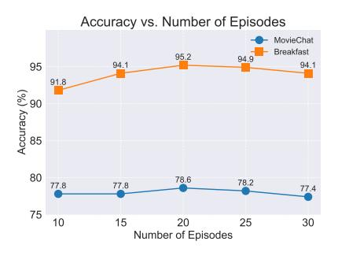

# 5.3. Pilot Study: ECO and SeTR as plug-in modules

In this pilot study, we demonstrate the versatility and effectiveness of our Episodic COmpressor (ECO) and Semantics reTRiever (SeTR) by integrating them into three state-of-theart video-language models: MA-LMM [\[14\]](#page-8-6), LongVA [\[51\]](#page-9-17),

| Model         | Acc.  | Time         | Mem. (GB) |
|---------------|-------|--------------|-----------|
| LLaVA-OV (7B) | 58.26 | 1            | 40.6      |
| + ECO         | 58.93 | 0.650 (-35%) | 33.4      |
| + SeTR        | 59.30 | 0.673 (-33%) | 33.4      |

Table 4. Zero-shot performance comparison of LLaVA-OneVision with and without ECO and SeTR integration on VideoMME.

and LLaVA-OneVision [\[19\]](#page-8-15) and evaluate them on two challenging benchmarks: MovieChat-1k [\[32\]](#page-9-1) and VideoMME (w/o sub.) [\[13\]](#page-8-16). The results are reported in Tables [5,](#page-5-1) [3](#page-5-2) and [4.](#page-5-2) ECO: A Lightweight Episode Compressor. Integrating ECO, we notice consistent and substantial improvements across all models. Most notably, replacing MA-LMM's memory bank with ECO yields a significant 3.4% increase in accuracy while simultaneously reducing inference time[2](#page-5-3) by 43% and keeping memory usage constant. Similar efficiency gains are observed when integrated with LongVA [\[51\]](#page-9-17) and LLaVA-OneVision [\[19\]](#page-8-15), where ECO maintains or improves accuracy while reducing latency by 30% and 35%, respectively, and almost halving the GPU memory usage in the case of LongVA.

SeTR: An Efficient Semantics Retriever. To further validate the complementary nature of our modules, we integrate SeTRinto the same three models. As evidenced in Tables [5,](#page-5-1) [3,](#page-5-2) and [4,](#page-5-2) SeTR consistently enhances the models' performance. For MA-LMM, we observe a substantial 3.8% increase in accuracy and a 0.11 improvement in score, achieved with only a minimal 1.5% increase in inference time. This demonstrates SeTR's ability to extract rich semantic information while maintaining computational efficiency. When combined with ECO, the integration of SeTR into LongVA and LLaVA-OneVision yields further accuracy improvements

2 Inference time relative to the baseline

|       | Acc.        | Score |
|-------|-------------|-------|
| w/o   | 55.1        | 3.55  |
| Rand. | 76.9        | 4.13  |
| FIFO  | 77.1        | 4.15  |
| ECO   | <b>78.6</b> | 4.23  |

Table 6. Ablations on the memory update design of our Episodic COmpressor.

| 00                | Accuracy and Inference Time comparison |                |      |  |      |           |       |                   |
|-------------------|----------------------------------------|----------------|------|--|------|-----------|-------|-------------------|
| 80                | ToMe MA-LM                             | M ES (Ours) | 78.6 |  |      | 467       |       | 550               |
| 75 (%) <b>f</b> : |                                        | 73.3           |      |  |      |           |       | 450 (s) emil      |
| Accuracy (%)      |                                        |                |      |  | 259  |           | 250   | nference Time (s) |
| 65                | 64.8                                   |                |      |  |      |           | 250   | 250               |
| 60                | А                                      | ccuracy (      | %)   |  | Infe | rence Tim | e (s) | 150               |

Figure 3. Our method is 46% faster than MA-LMM while being 5.3% more accurate, and registers an absolute gain of 13.8% accuracy compared to ToMe.

|         | Acc.        | Score |
|---------|-------------|-------|
| w/o     | 73.3        | 4.09  |
| MaxPool | 70.4        | 3.99  |
| AvgPool | 73.3        | 4.04  |
| K-Means | 75.7        | 4.11  |
| SeTR    | <b>78.6</b> | 4.23  |

Table 7. Ablations on different semantic compression methods.

Figure 4. Effect of the number of ECO episodes on the model's accuracy on the MovieChat-1k and Breakfast datasets.

|          | Acc. |
|----------|------|
| fQFormer | 93.2 |
| vQFormer | 94.1 |
| HQFormer | 95.2 |

Table 8. Performance comparison between frame Q-Former, video Q-Former and our hierarchical Q-Former.

Figure 5. Effect of the SeTR 's keep ratio on the model's accuracy on the MovieChat-1k and Breakfast datasets.

of 0.37% for both models, while preserving the significant latency and memory usage reductions.

The consistent performance improvements achieved by both modules across different architectures and datasets underscore their effectiveness as plug-and-play solutions for enhancing video-language models. For MA-LMM, we evaluate SeTR in conjunction with their existing memory bank, demonstrating its ability to extract complementary semantic information. For LongVA and LLaVA-OneVision, we showcase the additive benefits of incorporating both modules sequentially, highlighting their synergistic relationship in improving model capabilities while maintaining efficiency.

#### 5.4. Ablation Studies

Ablations are conducted on the MovieChat-1k test set (global mode) using the zero-shot setting with additional ablations on the Breakfast dataset using the fully-supervised setting. These experiments focus on our two primary contributions, ECO and SeTR. For extended and more comprehensive ablations, please refer to Section H.4 (in the Supp.). We also visualize the features extracted by each module in Section H.7.1 How important is ECO? In Table 6, we demonstrate the critical role of ECO through several experiments. The results indicate that the absence of our ECO and the Episodic Q-Former leads to a significant degradation in model performance due to the model lacking micro-level continuous representations. We further explore alternative update strategies, including randomly selecting features to retain (Rand.)

and employing a first-in-first-out (FIFO) streaming approach. Our proposed update strategy outperforms both the Rand. and FIFO methods, highlighting its efficacy in retaining more relevant episodes.

How important is SeTR? SeTR is designed to complement the episodic knowledge of our model with semantic insights. In Table 7, we observe that removing SeTR results in a 5% drop in accuracy. Additionally, we show that naive methods such as max and average pooling are not as effective.

Do we need a hierachical Q-Former? Yes. We conducted an ablation study on the Breakfast dataset [18], to evaluate the efficacy of our proposed hierarchical Q-Former architecture. As shown in Table 8, our hierarchical Q-Former achieves superior performance with an accuracy of 95.2%, outperforming both flat frame-level (fQFormer) and videolevel (vQFormer). This improvement can be attributed to the hierarchical structure's ability to capture multi-scale features, effectively aggregating information from frame to video level. By first processing frame-level details and then aggregating them at the video level, our approach mitigates information loss that may occur in direct video-level processing while avoiding the computational intensity of processing every frame individually.

How effective and efficient is ECO compared to other memory compressors? To demonstrate the effectiveness and efficiency of our proposed ECO, we conduct a comparative analysis against two strong existing compression techniques: ToMe [3] and MA-LMM [14] in Figure 3. We calcu-

late the inference time for each model on the MovieChat-1k dataset. Powered by ECO, HERMES achieves the highest accuracy (78.6%) among all models, outperforming MA-LMM by 5.3% and ToMe by a substantial 13.8%. HERMES also achieves the highest inference speed among the compared models, while maintaining superior accuracy. It is slightly faster than ToMe and significantly outperforms MA-LMM, reducing inference time by 46% relative to the latter. These results demonstrate our model's ability to deliver state-ofthe-art accuracy without compromising on efficiency.

Hyperparameters for ECO and SeTR. Our experiments on the MovieChat-1k (zero-shot) and Breakfast (fullysupervised) datasets reveal compelling insights into the optimal configuration of ECO (Figure [4\)](#page-6-2) and SeTR (Figure [5\)](#page-6-2). For ECO, we discover that an episodic memory size of 20 consistently yields peak performance across both datasets, achieving a 78.6% accuracy on MovieChat-1k and a 95.2% on Breakfast. This sweet spot balances comprehensive video representation with computational efficiency, as larger memory sizes show diminishing returns. SeTR's performance proved equally intriguing, with a keep ratio of 20% (reducing representations by 80%) emerging as the optimal choice for both datasets. Such results demonstrate the resilience of *HERMES* to hyperparameter variations suggesting that it is suitable for deployment across diverse video understanding datasets with minimal hyperparameter tuning.

