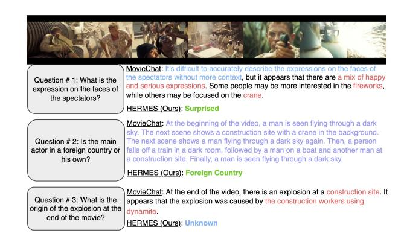

# 6. Limitations

While HERMES demonstrates significant efficiency and performance gains, it relies on heuristics for both episodic compression and semantic retrieval, which may occasionally fail to capture subtle but important temporal details or contextual nuances. Furthermore, the episodic compressor and semantic retriever operate independently, potentially allowing redun-

Figure 6. Qualitative Results: We select a challenging video from the MovieChat-1k dataset and pose various difficult questions to both MovieChat [\[32\]](#page-9-1) and HERMES. The results demonstrate our model's superior ability to answer both fine-grained questions (Q1 and Q3) and general questions (Q2). Answers highlighted in blue denote tentative answers, red denote wrong answers, purple denote hallucinations, and green denote correct answers.

dancy. Due to computational constraints, we were unable to pretrain HERMES on large-scale video datasets, limiting direct comparisons with extensively pretrained models like LLaVA-OneVision on benchmarks such as VideoMME. Nevertheless, the substantial improvements achieved through our lightweight integration approach suggest promising directions when combined with more computational resources.

