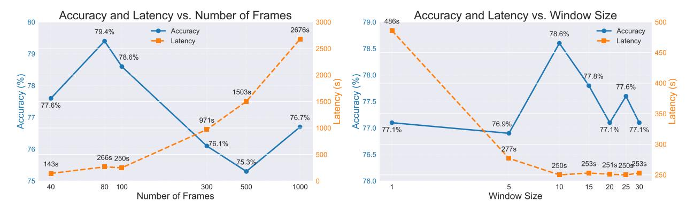

# H.4.1. How does the number of frames affect the model's accuracy and latency?

MovieChat [32] processes 2048 frames for each video, while we use only 100 frames, as previous studies have demonstrated how redundant video data is [31, 42]. Given that the MovieChat-1k dataset contains very long videos (some exceeding 14,000 frames), we conducted experiments to extend the number of frames our model processes. Specifically, we experiment with 40, 80, 100, 300, 500, and 1000 frames while keeping the number of episodes constant. As for the SeTR keep ratio, we decrease it in function of the number frames so that the number of semantic features we keep equals 20.

We observe a complex relationship between model accu-

Figure 9. Accuracy and latency as functions of the number of frames processed: This figure demonstrates the non-monotonic relationship between accuracy and frame count, with peak performance at 80 frames. Latency increases super-linearly with frame count while accuracy stalls, highlighting the redundancy of video data.

Figure 10. Accuracy and latency as functions of input window size: The graph illustrates the interplay between model accuracy, processing latency, and the window size. Notably, accuracy peaks at a window size of 10, while latency stabilizes for window sizes of 10 and above. In all cases the accuracy only slightly fluctuates.

racy, processing latency, and the number of frames analyzed. Figure 9 illustrates these relationships, providing insights into the performance trade-offs of our model. As evident from Figure 9, the relationship between accuracy and the number of frames is non-monotonic. Accuracy initially increases as the number of frames grows, reaching a peak of 79.4% at 80 frames with a modest latency (note that we use 100 frames as the default parameter in other experiments for consistency with other datasets). This suggests that up to this point, additional frames provide valuable context that enhances the model's understanding. However, beyond 80 frames, we observe a decline in accuracy, possibly due to the introduction of noise or irrelevant information from temporally distant parts of the video.

Latency, on the other hand, exhibits a near-linear increase with the number of frames up to 300 frames, after which it grows super-linearly. This rapid increase in latency for higher frame counts underscores the computational challenges of processing large numbers of frames, particularly in real-time or near-real-time applications.

Interestingly, the model's performance at 1000 frames (76.7% accuracy) is lower than its performance at 40 frames (77.6% accuracy), but with a significantly higher latency (2676s vs. 143s). This observation highlights the diminishing returns and potential drawbacks of simply increasing the number of processed frames. It also underscores the importance of thoughtful frame selection in video understanding tasks. Future work could explore adaptive frame selection techniques that dynamically adjust the number of frames based on video content, potentially optimizing both accuracy and efficiency.

