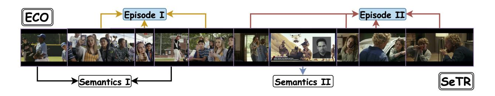

# HERMES: temporal-coHERent long-forM understanding with Episodes and Semantics

Gueter Josmy Faure1 Jia-Fong Yeh1 Min-Hung Chen2 Hung-Ting Su1 Shang-Hong Lai4 Winston H. Hsu1

1National Taiwan University 2NVIDIA 4National Tsing Hua University

Figure 1. Semantic Knowledge and Episodic Memory Aggregation: Our Episodic COmpressor (ECO) processes and aggregates temporal information across different scales: (I) Social interactions among adolescents in an outdoor setting, and (II) Complex family dynamics portrayed through parent-child interactions. Simultaneously, our Semantics reTRiever (SeTR) extracts high-level semantic information: (I) The contextual environment of a baseball game, and (II) The intersection of media consumption and domestic life through a news broadcast. This dual-level approach enables comprehensive video understanding by capturing both specific events and overarching concepts.

