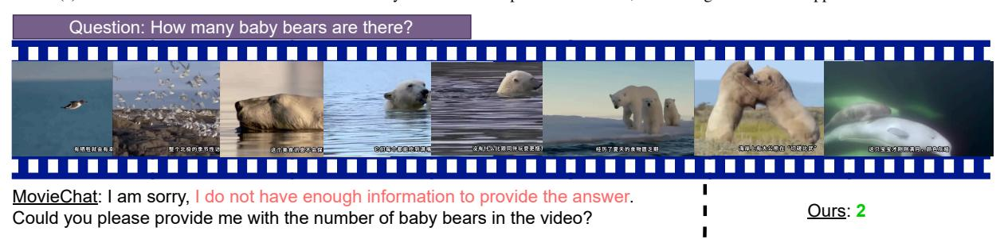

# H.8. Error Analysis: When does HERMES fail and why?

Our model, while generally effective, demonstrates several notable failure cases that warrant further investigation and improvement. Figure [13](#page-15-1) illustrates examples where the model's predictions deviate from ground truth answers, revealing key limitations in contextual reasoning and temporal information integration. Figure [13](#page-15-1) presents two sets of video frame sequences that highlight shortcomings in our model's performance. In the top row, we observe a documentary on marine life. Despite clear visual cues of underwater scenes and diving equipment, the model incorrectly predicts that no one got underwater. The bottom row showcases a more complex scenario from a wildlife documentary. Here, the model exhibits multiple errors: It underestimates the number of cheetahs involved in the hunt, predicting only one when at least three are present. This indicates a weakness in quantitative reasoning across temporally distributed information. The model incorrectly predicts that the cheetah's hunt was unsuccessful, contradicting the visual evidence. This error points to difficulties in inferring outcomes from sequences of events. Lastly, the model fails to recognize the fate of

(a) Animal Identification: MovieChat mistakenly identifies a Leopard as a Cheetah, even though no Cheetah appears in the video.

(b) Animal Counting: This question is particularly challenging because the bears appear infrequently in the video, and the question specifically asks about "baby bears." Despite MovieChat analyzing 2048 frames and our model only analyzing 100 frames, our model was able to locate and count the baby bears accurately.

(c) Determining People's Relationships: We compare our results with those of MA-LMM, with both models trained on the LVU dataset. Thanks to our episodic memory compression, our model excels at determining people's relationships across thousands of frames of interactions.

Figure 11. Qualitative results demonstrating the capabilities of our model compared to MovieChat and MA-LMM across different tasks. (a) Animal identification shows MovieChat's confusion between Leopard and Cheetah. (b) Animal counting highlights the challenge of locating baby bears with limited appearances in the video, where our model outperforms despite fewer frames. (c) Relationship determination benefits from our episodic memory compression, enabling better identification of relationships over extended interactions.

a dead baby giraffe, predicting "nothing" when the correct answer is "eaten by hyenas".

These examples emphasize the need for improved mechanisms to aggregate and reason over long-range temporal dependencies, as well as enhanced capabilities in scene understanding and event inference.

