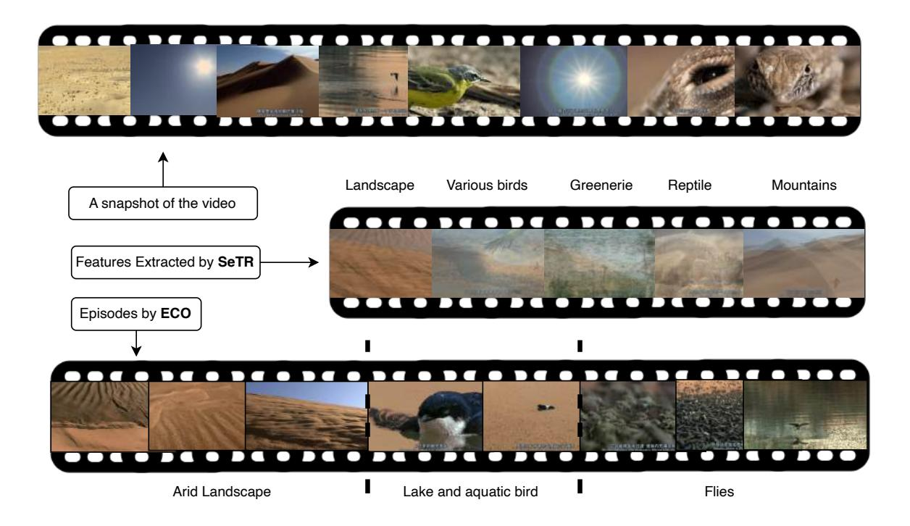

# H.9. How is our approach related to cognitive processes?

Our approach to long-form video understanding is inspired by cognitive processes involving memory and comprehension. According to the literature on neuroscience [\[30,](#page-9-22) [38,](#page-9-23) [39\]](#page-9-24),

Figure 12. Visualization of ECO and SeTR: The top row presents a curated visual summary of the video, showcasing key scenes such as landscapes, wildlife, and environmental features. The middle row highlights the functionality of SeTR, which extracts semantic features and clusters frames into thematic groups, including "Landscape," "Various Birds," and "Reptiles." Finally, the bottom row illustrates the operation of ECO, which segments the video into coherent narrative episodes, such as "Arid Landscape," "Lake and Aquatic Bird," and "Flies." Together, these modules provide both high-level abstraction and detailed episodic structure for comprehensive video understanding.

Figure 13. Where and when HERMES fail: The top row shows a marine life video where the model fails to recognize underwater scenes. The bottom row depicts a wildlife documentary where the model struggles with quantitative reasoning and event inference across multiple frames. These cases highlight limitations in contextual understanding and temporal information integration.

human cognition involves two primary types of memory: episodic and semantic. Episodic memory is the ability to recall specific events or episodes, while semantic memory refers to the storage of general knowledge and concepts. These forms of memory are crucial for understanding longform narratives, where a coherent understanding arises from the integration of specific events and overarching themes.

The proposed HERMES model incorporates these cognitive processes through its two main components, ECO and SeTR. ECO, akin to the function of episodic memory, selectively retains and compresses key events from the video, allowing the model to form a structured representation of the narrative as it unfolds. This approach is an oversimplified abstraction of findings in cognitive neuroscience, which highlight the role of the hippocampus in the consolidation of episodic memories [\[9,](#page-8-21) [30\]](#page-9-22), and the concept of *subjective time* [\[1\]](#page-8-22) that sees a scene (or a video) not as a series of frames but as a series of experiences. The hippocampus enables the organization of temporally distinct experiences into a coherent memory trace, something that we aim to capture with ECO. Moreover, the sequential processing and aggregation of information in our model align with the concept of event segmentation in cognitive psychology [\[47\]](#page-9-25). Humans naturally segment continuous experiences into discrete events, which aids in memory formation and recall.

Meanwhile, SeTR functions similarly to semantic memory, extracting and reinforcing high-level semantic cues. This process mirrors how the brain integrates detailed episodic memories with broader semantic knowledge stored in the neocortex [\[2,](#page-8-23) [23\]](#page-8-24). Also related is the concept of gist extraction which involves rapidly comprehending the essence or overall meaning of a scene or situation [\[26\]](#page-8-25). This ability allows humans to quickly understand the context of a complex scene without processing every detail. Our SeTR operates similarly by identifying and extracting high-level semantic cues that provide a concise overview of the scene and actions.

The integration of these cognitive processes not only aligns with human-like comprehension but also offers a framework for efficiently handling the vast and diverse information present in long-form videos. Significant improvements over existing state-of-the-art models, underscore the effectiveness of this cognition-inspired approach. While our model is a oversimplified abstraction of human cognition, it provides a foundation for exploring more complex cognitive mechanisms in future work.