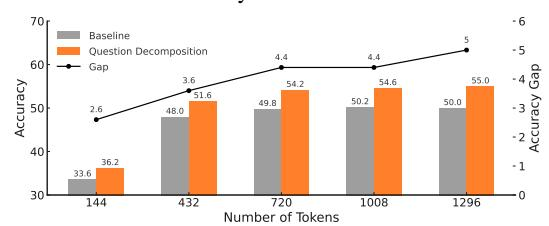

# 2.1 Training-based Video-LLMs

Training-based Video-LLMs learn video understanding through fine-tuning image-pretrained VLMs on large-scale video datasets. Video-ChatGPT [\(Maaz et al.,](#page-10-4) [2024\)](#page-10-4) extends LLaVA [\(Liu](#page-10-5) [et al.,](#page-10-5) [2023\)](#page-10-5) with temporal and spatial pooling. VidF4 [\(Liang et al.,](#page-10-6) [2024\)](#page-10-6) enhances BLIP-2 with frame scoring for adaptive sampling. LongVU [\(Shen et al.,](#page-10-7) [2024\)](#page-10-7) applies query-guided frame selection and token merging across frames to compress videos. VideoChat [\(Li et al.,](#page-10-0) [2023c\)](#page-10-0) employs Q-Former for token compression, and VideoChat2 [\(Li et al.,](#page-10-1) [2024\)](#page-10-1) improves alignment and instruction tuning. Video-LLaVA [\(Lin et al.,](#page-10-2) [2024\)](#page-10-2) introduces a shared projector to unify image and video encoders. Video-LLaMA [\(Zhang et al.,](#page-11-1) [2023;](#page-11-1) [Cheng et al.,](#page-9-0) [2024\)](#page-9-0) integrates video, audio, and language for multimodal tasks. LLaVA-NeXT-Video [\(Zhang et al.,](#page-11-2) [2024\)](#page-11-2) fine-tunes LLaVA-NeXT [\(Liu et al.,](#page-10-8) [2024\)](#page-10-8) with DPO [\(Rafailov et al.,](#page-10-9) [2023\)](#page-10-9) to improve performance. LITA [\(Huang et al.,](#page-9-1) [2024\)](#page-9-1) adopts a slow-fast architecture [\(Feichten](#page-9-3)[hofer et al.,](#page-9-3) [2019;](#page-9-3) [Xiao et al.,](#page-11-5) [2020\)](#page-11-5) for spatiotemporal modeling. While effective, these methods are computationally expensive.

### 2.2 Training-free Video-LLMs

Training-free Video-LLMs, in contrast, extend image-pretrained VLMs to video without additional fine-tuning. IG-VLM [\(Kim et al.,](#page-9-2) [2024\)](#page-9-2) constructs a grid-view image from video frames

and feeds it into a frozen LLM with prompt-based adaptation. FreeVA (Wu, 2024a) explores temporal aggregation but relies on few frames. SF-LLaVA (Xu et al., 2024) applies a slow-fast design inspired by action recognition (Feichtenhofer et al., 2019; Xiao et al., 2020; Huang et al., 2024). TS-LLaVA (Qu et al., 2024) uses a thumbnail-and-sampling strategy to create compact visual prompts with supplementary tokens. While promising, few training-free approaches directly address the perception bottleneck caused by fixed compression strategies and the token overload resulting from the limited visual token capacity of image-pretrained VLMs, leaving a gap that this work aims to fill.

### 3 Method

### 3.1 Challenges in Image-to-Video Adaptation

Given that video inputs yield substantially more visual tokens than static images, effective token compression and comprehensive understanding of the resulting representations are crucial for adapting image-pretrained VLMs to video. However, the perception bottleneck hinders efficient compression with minimal information loss, while token overload limits comprehensive interpretation of the compressed tokens, as their number still exceeds the capacity of image-pretrained VLMs.

### 3.1.1 Perception Bottleneck

The perception bottleneck arises from static compression strategies such as uniform frame sampling and spatial average pooling, which, despite their efficiency, lack semantic adaptivity and tend to discard informative cues that are unevenly distributed across temporal and spatial dimensions. This limits the model's ability to capture fine-grained visual details. Figure 2a illustrates this issue by comparing the performance of the 7B LLaVA-NeXT model on the EgoSchema benchmark using 5 input frames under different compression strategies. Compared to the uncompressed baseline, static methods lead to notable performance degradation. In contrast, our dynamic compression alleviates this drop and even surpasses the baseline by reducing redundancy while preserving informative visual cues.

### 3.1.2 Token Overload

Token overload arises when video inputs, even after compression, contain substantially more visual tokens than static images, exceeding the processing capacity of image-pretrained VLMs. As a result, performance no longer improves with increas-

(a) Accuracy comparison on EgoSchema with 5 input frames. The X-axis denotes compression strategies; the Y-axis indicates accuracy.

(b) Accuracy of the baseline and its question decomposition variant on EgoSchema using 10 input frames, under varying visual token counts determined by different top-k activation retention ratios. The X-axis indicates the number of input tokens, and the Y-axis indicates accuracy.

Figure 2: (a) Static compression treats all content uniformly, discarding informative cues that are dynamically distributed across temporal and spatial dimensions, thereby limiting fine-grained perception. In contrast, dynamic compression better preserves key visual cues across both dimensions. (b) As the number of input tokens increases, the accuracy of the baseline saturates, indicating limited utility of excessive tokens. In contrast, question decomposition consistently expands the accuracy gap, demonstrating its ability to more effectively leverage large token inputs.

ing token count, as the model cannot effectively interpret the excess information. Figure 2b illustrates this effect by comparing the performance of the vanilla 7B LLaVA-NeXT and its question decomposition variant on EgoSchema using 10 input frames, under varying numbers of visual tokens determined by different top-k activation retention ratios. The vanilla model exhibits initial improvements followed by a performance plateau as the token count increases, indicating a typical token overload effect. In contrast, question decomposition consistently outperforms the baseline, with a widening accuracy gap that demonstrates superior scalability to larger token volumes.

