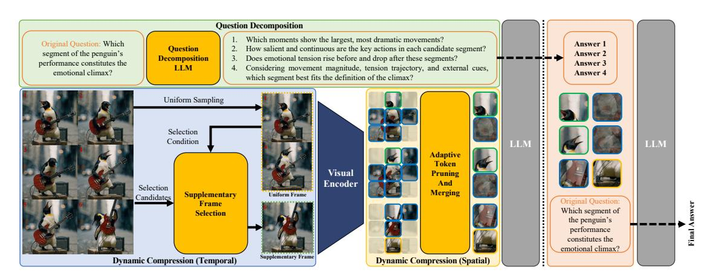

# 3.2 D-CoDe: Dynamic Compression and Question Decomposition Adapting

Our observations suggest that the perception bottleneck and token overload hinder effective compression and interpretation of visual inputs, thus limiting the adaptation of image-pretrained VLMs

Figure 3: The D-CoDe pipeline consists of two components: dynamic compression and question decomposition. Dynamic compression augments temporal uniform sampling by selecting supplementary frames to retain informative segments, then discards uninformative spatial tokens and merges semantically similar ones to reduce redundancy while preserving essential visual information. Question decomposition reformulates complex queries into subquestions, guiding the model to attend to diverse aspects of the video and enabling comprehensive understanding.

to video understanding. To tackle these challenges, we introduce D-CoDe, a training-free framework that scales image-pretrained VLMs to video by integrating dynamic compression and question decomposition, as shown in Figure 3. The dynamic compression module augments uniform sampling with supplementary frames to retain informative segments, then filters out uninformative spatial tokens and merges semantically similar ones to balance semantic fidelity and token efficiency. The question decomposition module reformulates complex queries into focused sub-questions, guiding the model's attention to distinct aspects of the video and enabling comprehensive understanding.

### 3.2.1 Formulation of Video-LLM Inference

Let  $V = \{I_t\}_{t=1}^T$  denote a video consisting of T frames. For each frame  $I_t$ , visual features are extracted using a pretrained image encoder (e.g., CLIP (Radford et al., 2021)), yielding:

$$\mathbf{F}_t = \text{VisualEnc}(I_t).$$
 (1)

The resulting sequence of visual features is denoted as  $\mathbf{F}_{1:T} = \{\mathbf{F}_1, \mathbf{F}_2, \dots, \mathbf{F}_T\}$ . This visual representation, together with the query Q, is then provided to the LLM to generate the final answer:

$$A_{\text{final}} = \text{LLM}(\mathbf{F}_{1:T}, Q). \tag{2}$$

### 3.2.2 Dynamic Compression

As discussed in Section 3.1.1, the perception bottleneck stems from static compression strategies that fail to retain salient information unevenly distributed across temporal and spatial dimensions.

Figure 4: To mitigate the temporal perception bottleneck, that is, to avoid missing informative video content, supplementary frames are selected based on their semantic dissimilarity to uniformly sampled ones, where similarity is measured using global features extracted by the CLIP visual encoder.

To address this, we introduce dynamic compression, which integrates semantic-aware frame selection with adaptive spatial token pruning and merging, thereby enhancing fine-grained detail retention while reducing redundancy.

As illustrated in Figure 4, to adapt temporal granularity based on content complexity, a two-stage strategy is employed to select N representative frames from a video  $\mathcal V$  of T frames. In the first stage,  $\lfloor \alpha \cdot N \rfloor^1$  frames are uniformly sampled across the sequence, where  $\alpha \in (0,1)$  denotes the uniform sampling ratio, forming  $\mathcal V_{\text{uniform}}$  that provides coarse temporal coverage. To emphasize informative segments, the remaining  $(N-\lfloor \alpha \cdot N \rfloor)$  frames are iteratively selected from the unchosen candi-

dates. At each iteration, the frame with the lowest average semantic similarity to the current selected set  $V_{\text{selected}}$  is identified as the supplementary frame  $I^*$  and appended to  $V_{\text{selected}}$ :

$$I^* = \underset{I_m \in \mathcal{V} \setminus \mathcal{V}_{\text{selected}}}{\arg \min} \frac{1}{|\mathcal{V}_{\text{selected}}|} \sum_{I_n \in \mathcal{V}_{\text{selected}}} s_{m,n}. \quad (3)$$

Here,  $V_{\text{selected}}$  is initialized with  $V_{\text{uniform}}$ , and the similarity  $s_{m,n}$  between frames  $I_m$  and  $I_n$  is computed as the cosine similarity between their CLIP-based global features,  $\mathbf{g}_t = \text{CLIP}_{\mathbf{v}}(I_t)$ :

$$s_{t,t'} = \frac{\langle \mathbf{g}_t, \mathbf{g}_{t'} \rangle}{\|\mathbf{g}_t\|_2 \cdot \|\mathbf{g}_{t'}\|_2}, \quad \forall t, t' \in \{1, \dots, T\}.$$

The selection process continues until N frames are chosen, forming a frame set that balances temporal coverage and highlights informative segments.

Furthermore, to reduce spatial redundancy while preserving semantic information, token compression is applied to each selected frame, which involves pruning uninformative visual tokens based on their activation magnitudes and merging tokens according to their cosine similarity, as illustrated in Figure 5. Specifically, given a set of M visual tokens  $\mathbf{F} = \{\mathbf{f}_i\}_{i=1}^M$  extracted from a selected frame, the  $\ell_2$  norm of each token is computed as a proxy for salience, indicating its relative contribution to the overall visual representation:

$$a_i = \|\mathbf{f}_i\|_2. \tag{5}$$

The top- $\lfloor \beta \cdot M \rfloor$  tokens exhibiting the highest activation magnitudes are retained, where  $\beta \in (0,1)$  specifies the retention ratio:

$$\mathbf{F}_{\text{selected}} = \left\{ \mathbf{f}_j \mid j \in \text{TopK}\left( \{a_i\}_{i=1}^M, \lfloor \beta \cdot M \rfloor \right) \right\}.$$
(6)

To further eliminate redundancy within  $\mathbf{F}_{\text{selected}}$ , a greedy token merging algorithm is applied. Let  $\pi$  denote a permutation over the indices of  $\mathbf{F}_{\text{selected}}$  such that the tokens are sorted in descending order of activation magnitudes, i.e.,  $a_{\pi(1)} \geq a_{\pi(2)} \geq \cdots \geq a_{\pi(\lfloor \beta M \rfloor)}$ . The unmerged tokens are then traversed iteratively in the order defined by  $\pi$ , with each token considered as a potential anchor for redundancy merging. For each anchor token  $\mathbf{f}_{\pi(i)}$ , its cosine similarity with other unmerged tokens is computed as:

$$\operatorname{sim}(\mathbf{f}_{\pi(i)}, \mathbf{f}_j) = \frac{\langle \mathbf{f}_{\pi(i)}, \mathbf{f}_j \rangle}{\|\mathbf{f}_{\pi(i)}\|_2 \cdot \|\mathbf{f}_i\|_2}.$$
 (7)

Figure 5: To mitigate the spatial perception bottleneck, spatial tokens are first pruned based on their  $\ell_2$  activation magnitudes. The remaining informative tokens are then grouped according to cosine similarity and aggregated via mean pooling, thereby reducing redundancy while preserving semantic fidelity.

Based on the computed similarities, tokens whose similarity to the anchor exceeds a predefined threshold  $\tau \in (0,1)$  are deemed redundant and grouped with the anchor token  $\mathbf{f}_{\pi(i)}$  to form a redundancy cluster:

$$\mathcal{N}_{\pi(i)} = \left\{ j \neq \pi(i) \middle| \begin{array}{l} \sin(\mathbf{f}_{\pi(i)}, \mathbf{f}_j) \ge \tau, \\ \mathbf{f}_j \text{ is unmerged} \end{array} \right\}. \quad (8)$$

To consolidate the cluster, a representative token is obtained by averaging the anchor and its redundant counterparts:

$$\mathbf{f}_{\pi(i)}^{\text{rep}} = \frac{1}{1 + |\mathcal{N}_{\pi(i)}|} (\mathbf{f}_{\pi(i)} + \sum_{j \in \mathcal{N}_{\pi(i)}} \mathbf{f}_j). \quad (9)$$

After computing the representative token  $\mathbf{f}_{\pi(i)}^{\mathrm{rep}}$ , all tokens in the cluster  $\mathcal{N}_{\pi(i)}$  are marked as inactive and skipped in subsequent iterations. This process repeats until all tokens are either merged or selected as anchors, resulting in a compressed token set  $\mathbf{F}_{\mathrm{compressed}} = \{\mathbf{f}_{\pi(i)}^{\mathrm{rep}}\}$  for each selected frame.

To form the final visual representation, the compressed token sets from all N selected frames are concatenated as follows:

$$\mathbf{F}_{\text{final}} = \operatorname{Concat} \left( \mathbf{F}_{\text{compressed}}^{(k)} \right)_{k=1}^{N}.$$
 (10)

The resulting compact sequence is subsequently fed into the LLM for downstream processing.

### 3.2.3 Question Decomposition

Although dynamic compression reduces redundancy and preserves essential visual information, it still produces a number of visual tokens that exceed the capacity of image-pretrained VLMs. As

 $^1\lfloor \cdot \rfloor$  denotes the floor function, which rounds a value down to the nearest integer.

Table 1: Prompt Template for Question Decomposition

#### Question Decomposition Prompt

I am working on a video understanding task. Your job is to break down the given question into a series of subquestions that guide the model toward solving the problem. The subquestions should focus on temporal and dynamic aspects of the video, rather than just static information that could be answered from a single frame. I will provide a question, and you should output the corresponding subquestions in English.

Question: "{*user question here*}"

Output the subquestions as a Python list of strings.

a result, the model fails to comprehensively interpret the compressed tokens, a limitation known as token overload (Section [3.1.2\)](#page-2-2). To address this, we introduce question decomposition, which reformulates the original query into a sequence of focused sub-questions, directing the model's attention to distinct aspects of the video and enabling progressive understanding.

To implement this strategy, we construct a structured system prompt (Table [1\)](#page-5-0) to guide the generation of focused sub-questions. Given this prompt, a sequence of sub-questions is derived from the input query Q using a pretrained question decomposition LLM M with temperature t:

$$Q_1, Q_2, \dots, Q_n = \mathcal{M}(Q, t), \tag{11}$$

where each Qi targets a distinct aspect of the video, such as character location, actions, interactions, or scene transitions.

Subsequently, each sub-question Qi is independently processed by the LLM, conditioned on the shared visual input Ffinal:

$$A_i = \text{LLM}(\mathbf{F}_{\text{final}}, Q_i), \quad i = 1, 2, \dots, n. \quad (12)$$

Finally, the responses {A1, A2, . . . , An} are concatenated to form an auxiliary prompt segment. This aggregated textual input, together with the original query Q and the compressed visual token sequence Ffinal, is then fed into the LLM to generate the final answer:

$$A_{\text{final}} = \text{LLM}(\mathbf{F}_{\text{final}}, \text{Concat}(A_1, \dots, A_n), Q).$$
 (13)

### 4 Experiments

### 4.1 Benchmarks and Metrics

Multiple Choice VideoQA Benchmarks. The multiple choice setting tests model's ability to select the correct answer from a set of options. We

evaluate on three benchmarks: NExT-QA [\(Xiao](#page-11-6) [et al.,](#page-11-6) [2021\)](#page-11-6) for causal and temporal understanding, EgoSchema [\(Mangalam et al.,](#page-10-11) [2023\)](#page-10-11) for schemalevel interpretation in egocentric videos, and IntentQA [\(Li et al.,](#page-10-12) [2023a\)](#page-10-12) for intention recognition from subtle cues. Accuracy is used as the evaluation metric.

Open-Ended VideoQA Benchmarks. The open-ended setting requires generating natural language answers based on video content. We evaluate on four benchmarks: MSVD-QA [\(Chen and Dolan,](#page-9-4) [2011\)](#page-9-4), based on textual descriptions of short clips; MSRVTT-QA [\(Xu et al.,](#page-11-7) [2016\)](#page-11-7), featuring diverse web videos with complex scenes; TGIF-QA [\(Jang](#page-9-5) [et al.,](#page-9-5) [2019\)](#page-9-5), focusing on repetition counting and state transitions in GIFs; and ActivityNet-QA [\(Yu](#page-11-8) [et al.,](#page-11-8) [2019\)](#page-11-8) (abbreviated as ANet-QA), comprising long videos with rich activity semantics. Response quality is assessed using GPT-based metrics: GPT-Accuracy for factual correctness, and GPT-Score (0–5) for completeness and fluency. All evaluations use gpt-3.5-turbo-0125 for consistency [\(Wu,](#page-11-9) [2024b\)](#page-11-9).

### 4.2 Implementation Details

D-CoDe is built upon the image-pretrained LLaVA-NeXT [\(Liu et al.,](#page-10-8) [2024\)](#page-10-8) with 7B parameters. Following SF-LLaVA [\(Xu et al.,](#page-11-4) [2024\)](#page-11-4), we adopt rotary position embeddings (RoPE) [\(Su et al.,](#page-10-13) [2024\)](#page-10-13) with a scaling factor of 2 to extend the context length to 8192 tokens. For each input video, we sample N frames, where N is empirically determined based on the average video length of the corresponding dataset. All frames are uniformly resized to 336 × 336 to construct the visual input sequence. In the dynamic compression module, we use a uniform frame sampling ratio α = 0.85, retain salient tokens with a ratio β = 0.625, and merge semantically similar tokens using a cosine similarity threshold τ = 0.9. For question decomposition, we use gpt-3.5-turbo-0125 as the question decomposition LLM, with a temperature of t = 0.5 to balance diversity and consistency. The number of generated sub-questions n is not constrained. All experiments are conducted on a single NVIDIA RTX A6000 GPU.

### 4.3 Comparison on Multiple Choice VideoQA

Table [2](#page-6-0) summarizes the multiple choice VideoQA results. D-CoDe consistently outperforms all prior methods, including both training-free and trainingrequired models.

Table 2: Results on Multiple Choice Benchmarks

| Method                    | Multiple Choice VideoQA (Accuracy) NextQA EgoSchema |      | IntentQA |  |
|---------------------------|-----------------------------------------------------------|------|----------|--|
| Training-Required Methods |                                                           |      |          |  |
| Video-LLaVA               | 60.5                                                      | 37.0 | N/A      |  |
| Video-LLaMA2              | N/A                                                       | 51.7 | N/A      |  |
| MovieChat+                | 54.8                                                      | 56.4 | N/A      |  |
| Vista-LLaMA               | 60.7                                                      | N/A  | N/A      |  |
| Training-Free Methods     |                                                           |      |          |  |
| DeepStack-L               | 61.0                                                      | 38.4 | N/A      |  |
| M3                        | 63.1                                                      | 36.8 | 58.8     |  |
| IG-VLM                    | 63.1                                                      | 35.8 | 60.3     |  |
| SF-LLaVA                  | 64.2                                                      | 47.2 | 60.1     |  |
| TS-LLaVA                  | 66.5                                                      | 50.2 | 61.7     |  |
| D-CoDe (Ours)             | 68.3                                                      | 58.0 | 64.2     |  |

Notably, on EgoSchema, a challenging benchmark with long-form egocentric videos and schema-based questions where training-required models usually perform better, D-CoDe surpasses the second-best training-free method TS-LLaVA by 7.8%. It is also the first training-free model to outperform all training-required ones, exceeding the best of them, MovieChat+, by 1.6%. These results demonstrate the effectiveness of our question decomposition strategy for understanding complex video content.

### 4.4 Comparison on Open-Ended VideoQA

Table [3](#page-6-1) presents the open-ended VideoQA results. Compared to multiple-choice tasks, these benchmarks involve simpler questions, often asking what, who, or yes/no, which are less suitable for decomposition. Therefore, only the dynamic compression module is applied. Despite this, D-CoDe outperforms most existing methods, including both training-free and training-required models.

D-CoDe achieves the highest accuracy on MSVD-QA (80.0%) and TGIF-QA (79.1%), which focus on visual recognition and temporal reasoning, respectively. These results demonstrate its effectiveness in preserving fine-grained visual details. D-CoDe also performs well on the more challenging ActivityNet-QA, which consists of long videos with complex activities, reaching 56.4% accuracy and a GPT-Score of 3.4.

On MSRVTT-QA, D-CoDe performs slightly below SF-LLaVA and TS-LLaVA, likely due to the dataset's frequent scene transitions that favor models with slow-fast processing structures.

Table 3: Results on Open-Ended Benchmarks

| Method        | Open-Ended VideoQA (Accuracy/Score) |                       |          |          |  |  |
|---------------|-------------------------------------|-----------------------|----------|----------|--|--|
|               | MSVD                                | MSRVTT                | TGIF     | ANet     |  |  |
|               | Training-Required Methods           |                       |          |          |  |  |
| Video-LLaMA   | 51.6/2.5                            | 29.6/1.8              | N/A      | 12.4/1.1 |  |  |
| Video-LLaMA2  | 70.9/3.8                            | N/A                   | N/A      | 50.2/3.3 |  |  |
| Video-ChatGPT | 64.9/3.3                            | 49.3/2.8              | 51.4/3.0 | 35.2/2.7 |  |  |
| VideoGPT+     | 72.4/3.9                            | 60.6/3.6              | 74.6/4.1 | 50.6/3.6 |  |  |
| Video-LLaVA   | 70.7/3.9                            | 59.2/3.5              | 70.0/4.0 | 45.3/3.3 |  |  |
| MovieChat     | 75.2/3.8                            | 52.7/2.6              | N/A      | 45.7/3.4 |  |  |
| MovieChat+    | 76.5/3.9                            | 53.9/2.7              | N/A      | 48.1/3.4 |  |  |
| VideoChat     | 56.3/2.8                            | 45.0/2.5              | 34.4/2.3 | 26.5/2.2 |  |  |
| VideoChat2    | 70.0/3.9                            | 54.1/3.3              | N/A      | 49.1/3.3 |  |  |
| Vista-LLaMA   | 65.3/3.6                            | 60.5/3.3              | N/A      | 48.3/3.3 |  |  |
| LLaMA-VID     | 69.7/3.7                            | 57.7/3.2              | N/A      | 47.4/3.3 |  |  |
| PLLaVA        | 76.6/4.1                            | 62.0/3.5              | 77.5/4.1 | 56.3/3.5 |  |  |
|               |                                     | Training-Free Methods |          |          |  |  |
| FreeVA        | 73.8/4.1                            | 60.0/3.5              | N/A      | 51.2/3.5 |  |  |
| DeepStack-L   | 76.0/4.0                            | N/A                   | N/A      | 49.3/3.1 |  |  |
| IG-VLM        | 78.8/4.1                            | 63.7/3.5              | 73.0/4.0 | 54.3/3.4 |  |  |
| SF-LLaVA      | 79.1/4.1                            | 65.8/3.6              | 78.7/4.2 | 55.5/3.4 |  |  |
| TS-LLaVA      | 79.0/4.1                            | 65.1/3.6              | 77.7/4.1 | 56.7/3.4 |  |  |
| D-CoDe (Ours) | 80.0/4.1                            | 64.2/3.5              | 79.1/4.1 | 56.4/3.4 |  |  |

Table 4: Module Ablation on EgoSchema

| Module                              | Acc. (↑) |
|-------------------------------------|----------|
| Baseline                            | 44.8     |
| + dynamic spatial token compression | 50.6     |
| + dynamic temporal frame selection  | 51.8     |
| + question decomposition            | 58.0     |

### 4.5 Ablation Study

Module Ablation. We evaluate the contribution of each component in D-CoDe through ablation studies on the EgoSchema dataset using 15 input frames. As shown in Table [4,](#page-6-2) all modules contribute incremental performance gains. The baseline adopts the naive training-free extension of LLaVA-NeXT from [\(Zhang et al.,](#page-11-2) [2024\)](#page-11-2), which employs uniform frame sampling and spatial average pooling, yielding 44.8% accuracy. Introducing dynamic spatial token compression increases accuracy to 50.6% by removing redundancy while preserving salient visual cues. Incorporating dynamic temporal frame selection further improves performance to 51.8% by prioritizing semantically diverse frames. Finally, applying question decomposition raises accuracy to 58.0%, highlighting its effectiveness in guiding the model to focus on distinct semantic aspects of video.

Sampling Strategy Ablation. As shown in Table [5,](#page-7-0) we evaluate frame sampling strategies on EgoSchema with D-CoDe without question decomposition. Compared to uniform sampling, questionaware sampling [\(Wang et al.,](#page-11-10) [2023,](#page-11-10) [2024b\)](#page-10-14) yields

Table 5: Sampling Strategy Ablation on EgoSchema

| Key Frame Sampling Strategy          | Acc. (↑) |
|--------------------------------------|----------|
| Uniform Sampling                     | 50.6     |
| Question-aware Sampling              | 51.4     |
| Supplementary Frame Selection (Ours) | 51.8     |

Table 6: Compression Range Ablation on EgoSchema

| Spatial Mergeable Distance Constraint | Acc. (↑) |
|---------------------------------------|----------|
| ≤ 4 neighboring tokens                | 51.4     |
| ≤ 5 neighboring tokens                | 51.4     |
| ≤ 6 neighboring tokens                | 52.0     |
| no constraint (Ours)                  | 51.8     |

higher accuracy by selecting frames most semantically similar to the question using CLIP, but still performs worse than our diverse-based supplementary frame selection. This is because questionaware sampling overemphasizes query-relevant segments, limiting broader temporal modeling, whereas our method preserves more diverse visual information and thereby enhances video understanding.

Compression Range Ablation. We evaluate spatial compression range by introducing a patch distance constraint and testing on EgoSchema with D-CoDe without question decomposition. As shown in Table [6,](#page-7-1) restricting merges within 5 patches reduces accuracy, while relaxing the constraint to 6 patches improves performance. These results indicate that narrow merge ranges fail to compress redundant tokens effectively and hinder comprehension, whereas broader ranges reduce redundancy while preserving spatial structure, leading to improved video understanding.

Decomposition Prompt Ablation. As shown in Table [7,](#page-7-2) we evaluate prompt variants on EgoSchema. Removing task and background explanation drops accuracy, underscoring the value of contextual guidance. Excluding "temporal and dynamic aspects" lowers performance, confirming the importance of temporal cues. By contrast, rephrasing with different wording yields better accuracy, suggesting that performance is determined by semantic content and is robust to structural or wording variations.

Decomposed Content Ablation. Table [8](#page-7-3) evaluates the impact of decomposed content on EgoSchema. Compared with no question decomposition (None), sub-questions reduce accuracy, whereas sub-answers yield the best performance. These results indicate that the gain mainly derives

Table 7: Prompt Ablation on EgoSchema

| Prompt Variant                              | Acc. (↑) |
|---------------------------------------------|----------|
| Default (Ours, as shown in Table 1)         | 58.0     |
| No task/background explanation              | 53.2     |
| Removed "temporal and dynamic aspects"      | 54.8     |
| Rephrased (same meaning, different wording) | 58.4     |

Table 8: Decomposed Content Ablation on EgoSchema

| Decomposed Content                | Acc. (↑) |
|-----------------------------------|----------|
| None (w/o Question Decomposition) | 51.8     |
| Sub-Questions                     | 50.4     |
| Sub-Answers (Ours)                | 58.0     |

from intermediate answers rather than the structured thought process, as sub-answers provide more diverse supporting content for video understanding.

Visualization. Figure [6](#page-8-0) and Figure [7](#page-8-1) visualize the effect of D-CoDe's dynamic compression along the temporal and spatial dimensions, respectively. In the temporal dimension, supplementary frames (green), selected based on maximal semantic difference from uniformly sampled frames (yellow), enhance temporal diversity and reduce the risk of missing key actions due to fixed-interval sampling. In the spatial dimension, low-saliency tokens are discarded, while the remaining ones are clustered and merged based on semantic similarity, preserving essential content and significantly reducing redundancy. Figure [8](#page-8-2) presents a comparison of the baseline model's attention distribution over the same visual input when prompted with the original question and its decomposed sub-questions. The observed shift in attention peaks suggests that question decomposition effectively guides the model to focus on distinct aspects of the inputs.

