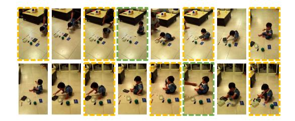
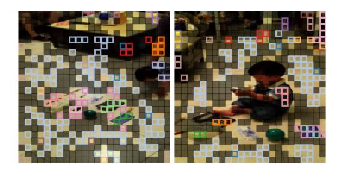
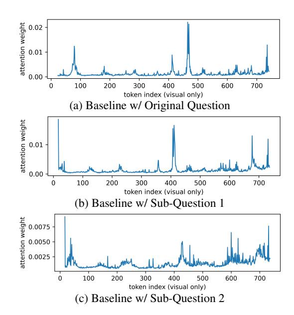

# 5 Conclusion

In this paper, we investigate two key challenges in adapting image-pretrained VLMs to video understanding: the perception bottleneck, which arises from static compression strategies that uniformly process visual inputs and discard salient cues unevenly distributed across temporal and spatial dimensions; and token overload, which occurs when video inputs yield significantly more tokens than images, exceeding the model's capacity for comprehensive understanding. To address these challenges, we propose D-CoDe, a training-free adaptation framework that combines dynamic compression with question decomposition. Dynamic compression alleviates the perception bottleneck by

Figure 6: Dynamic Compression (Temporal): To complement uniform sampling (yellow), supplementary frames (green) are selected from the remaining video frames based on semantic dissimilarity, thereby enhancing temporal diversity in the visual input.

Figure 7: Dynamic Compression (Spatial): Tokens with low salience (black) are removed, and the remaining tokens are semantically clustered (indicated by color) and merged, minimizing redundancy while preserving essential visual information.

adaptively selecting representative frames and performing content-aware spatial token pruning and merging, thereby preserving detail while reducing redundancy. In parallel, question decomposition mitigates token overload by reformulating complex queries into focused sub-questions that guide the model to attend to distinct aspects of the video, enabling comprehensive understanding. Experiments demonstrate that D-CoDe significantly improves performance on VideoQA benchmarks and shows strong potential for complex video-language tasks.

### Limitations

The main limitation of D-CoDe lies in its relatively lower performance on videos with frequent scene transitions, compared to models employing slowfast structures. Although D-CoDe efficiently compresses visual input and preserves key information, it still faces a trade-off between temporal and spatial retention, a limitation less evident in models such as SF-LLaVA and TS-LLaVA. To address this, future work could explore integrating a slow-fast architecture into D-CoDe to better balance temporal and spatial modeling. Additionally, incorporating a memory bank, which is commonly used in Vid-LLMs to enhance temporal awareness and

Figure 8: Visualization of the impact of different queries on the attention distribution of the baseline model over the same visual input on IntentQA with 5 input frames. The baseline adopts the naive training-free extension of LLaVA-NeXT proposed in [\(Zhang et al.,](#page-11-2) [2024\)](#page-11-2).

maintain long-range context, may further improve the model's ability to handle complex video inputs.

Another limitation is the difficulty in understanding durations and timestamps, a common challenge for Vid-LLMs [\(Imam et al.,](#page-9-6) [2025\)](#page-9-6). While D-CoDe handles relative temporal reasoning well, precise temporal understanding remains difficult for these training-free frameworks. Addressing this may require task-specific training or architectural modifications, as shown in LLaVA-ST [\(Li et al.,](#page-10-15) [2025\)](#page-10-15).

### Ethics Statement

The outputs of D-CoDe may occasionally contain biased or inappropriate content, potentially due to underlying biases in the base model LLaVA-NeXT [\(Liu et al.,](#page-10-8) [2024\)](#page-10-8). These outputs do not reflect the authors' views. As with other generative AI systems, D-CoDe raises important ethical concerns related to content reliability and fairness. We encourage future work to implement safeguards such as dataset auditing, bias evaluation, and content attribution (e.g., watermarking), and to prioritize responsible deployment practices that balance innovation with societal impact.

### Acknowledgment

This material is based upon work supported by the Air Force Office of Scientific Research under award number FA9550-23-1-0290.

