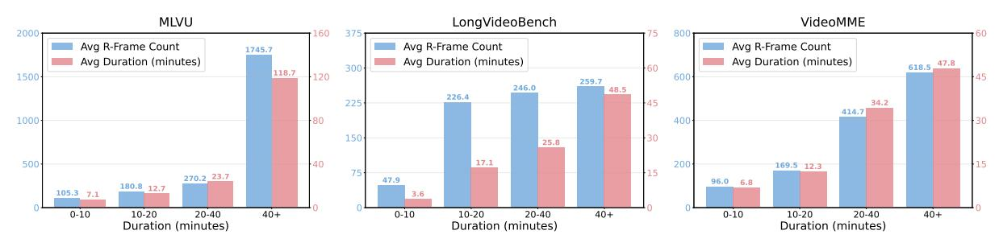

# **E.2 More Results of CAFS**

To further analyze the performance of CAFS on specific examples, we conduct an evaluation about the relationship between the number of *r-frames* and video duration.

**Non-Linear information scaling in videos.** Figure [10](#page-20-1) reveals that the *r-frame* count does not scale linearly with video duration. This non-linearity is prominent in LongVideoBench [\[55\]](#page-14-1): videos in the 0 − 10 minute bracket average 47*.*9 *r-frames*, whereas those in the 10 − 20 minute bracket average 226*.*4. This finding exposes a fundamental limitation of fixed-rate sampling strategies (e.g., *N* frames/video or *M* frames/sec). Such approaches implicitly assume a uniform information distribution, leading to a suboptimal trade-off: sparse sampling risks information loss, while dense sampling incurs high temporal redundancy. CAFS bypasses this limitation by dynamically adapting its selection to the video's content density.

**High context compression efficiency.** CAFS effectively condenses prolonged video-level context into a sparse, salient set of *r-frames*. For instance, on MLVU [\[54\]](#page-14-0), videos in the 10 − 20 minute bracket (12*.*7 min avg.) are reduced to just 180*.*8 *r-frames* on average. This represents a sparse sampling interval of approximately one *r-frame* every 4*.*22 seconds, demonstrating CAFS's capability to efficiently distill essential information from extended video sequences.

**Figure 10:** Correlation between video duration and the number of r-frames selected by the CAFS method across different benchmarks.

