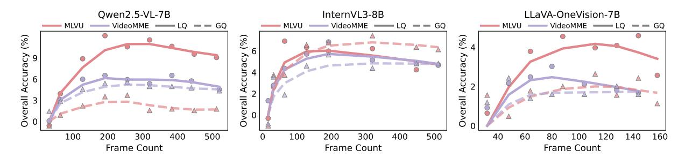
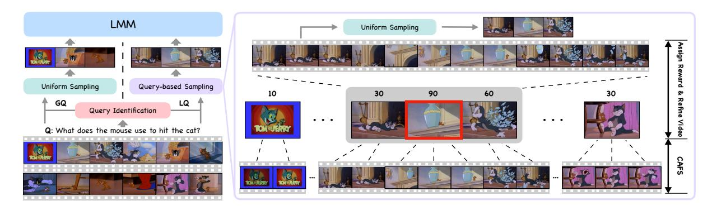

# 3 Revisiting Inference Mechanism of LMM in Video Understanding

Consider a video V with T frames, denoted as  $\{f_i\}_{i=1}^T$ , along with a query Q. In VQA task, the model receives the video V and the query Q as inputs and is tasked with generating a response A that accurately addresses the query. In contemporary approaches, due to computational limitations and the language model's restricted context length L, only a subset of N uniformly sampled frames, denoted as  $\{f_i'\}_{i=1}^N$ , is processed, where  $N \ll T$ . These selected frames are then combined with the query Q and fed into the LMM, which autoregressively generates the answer A:

$$A = LMM([f'_1; f'_2; \dots; f'_N; Q]).$$
(1)

Obviously, a small subset of N frames is often insufficient to capture the full content of a video, particularly in longer sequences. To address this, recent studies [66, 67] have focused on extending model context lengths to allow more frames as input. However, this raises an important question: Does increasing the number of uniformly sampled input frames enhance performance on VQA task?

More frames do not mean improved performance. To investigate this, we conducted an evaluation using three pretrained LMMs: Qwen2.5-VL-7B [16], InternVL3-8B [68], and LLaVA-OneVision-7B [3], across three long-form video understanding benchmarks: MLVU [54], VideoMME [56], and LongVideoBench [55]. We employed uniform frame sampling with varying frame counts to evaluate the impact of frame count on model performance. As illustrated in Figure 2, a consistent pattern emerges across all models and benchmarks: performance initially improves with more input frames but declines beyond a certain point.

**Figure 3: Relative accuracy on localized and global queries.** Plotted as the deviation from the initial baseline, the results demonstrate that performance degradation at high frame counts is predominantly attributed to LQ, while GQ remains relatively stable.

**Query classification.** To better understand the underlying causes of this performance degradation, we systematically examined the impact of different query types. Prior studies [17, 18, 69–71] have already identified a class of queries that relate directly to specific, localized segments of a video, such as "What kind of bike is the man riding?", which we now classify as localized queries (LQ). However, these works frequently overlook another important category of queries requiring a comprehensive understanding of the entire video. We define such queries as global queries (GQ), with a typical example being "What title best summarizes this video?"

**Performance trends vary across query types.** Following the definition, we manually categorize queries from MLVU [54] and VideoMME [56], and evaluate the same models on these two query types. As shown in Figure 3, while performance on global queries remains relatively stable with increasing frame count, performance on localized queries drops significantly. We attribute this to global queries benefiting from holistic information, whereas excess frames introduce noise for localized tasks. These results highlight the necessity of pre-classifying query types to optimize efficiency; specifically, global queries can rely on standard uniform sampling, avoiding the computational overhead of key frame search techniques.

### 4 Method: DIG

Overview. In this section, we formally introduce  $\mathbf{DIG}$ , a novel, training-free frame selection framework for LMMs that dynamically adapts to the query type.  $\mathbf{DIG}$  begins by classifying the given query as either localized or global (§4.1). For global queries, the final input frames are uniformly sampled across the entire video. In contrast, for localized queries, we first employ a content-adaptive frame selection method to extract highly representative frames (§4.2), which are then evaluated by the LMM through reward scoring to assess their relevance to the query (§4.3). Then a refined video is carefully constructed through a search procedure guided by these rewards (§4.4) and final input frames are uniformly sampled from the refined video.

### 4.1 Query Type Identification

As established in Section 3, the performance trends vary across query types. Therefore, we first employ a LLM to classify a given query Q as either global or localized (see Appendix  $\mathbb C$  for prompt details). For global queries, the LMM performs direct inference on uniformly sampled frames. Localized queries, in contrast, are addressed using the specialized approach detailed below.

### 4.2 Content-Adaptive Frame Selection (CAFS)

To effectively address the localized query, it is essential to extract relevant frames from the video. However, exhaustive frame-wise analysis of long-form videos is computationally infeasible. This necessitates obtaining a compact yet informative subset of frames. Previous methods typically rely on static sampling (e.g., uniform or fixed-rate) [17, 18, 64, 65]. This static approach presents a dilemma: low-rate sampling may yield a sparse representation that misses critical events, while high-rate sampling produces a large and redundant frame set. To address this, we propose *Content-Adaptive Frame Selection*, a method that adaptively selects representative frames, referred to as *r-frames*, based on high-level semantic content in the video such as objects and scenes.

**Figure 4:** Overview of DIG. The LLM first classifies the query type. Global queries utilize uniform sampling across the entire video, while localized queries employ CAFS and reward assignment to construct a refined video prior to sampling. The selected frames are subsequently processed by the LMM for final inference.

**Distance calculation.** Given a 2-fps sampled video with M frames  $\{f_{I_i}\}_{i=1}^M$  with their corresponding frame indices  $\{I_i\}_{i=1}^M$ , we first utilize DINOv2 [22] to extract robust visual features from each frame, which results in a sequence of feature vectors  $\{V_{I_i}\}_{i=1}^M$ . To accurately measure the dissimilarity between these consecutive frames, we compute the feature distance  $d_i$  between  $f_{I_i}$  and  $f_{I_{i+1}}$  using the following formula:

$$d_i = 1 - \sin(V_{I_i}, V_{I_{i+1}}), \tag{2}$$

where  $\text{sim}(\cdot,\cdot)$  denotes cosine similarity. This yields a sequence of distances  $\{d_i\}_{i=1}^{M-1}$ .

**R-Frame selection.** Due to frequent scene transitions or camera cuts in long videos, the pairwise frame similarity often exhibits abrupt changes, resulting in numerous peaks in the distance sequence. Specifically,  $d_i$  is identified as a peak if  $d_{i-1} < d_i$  and  $d_{i+1} < d_i$ . To reduce noise effects, only peaks with prominence greater than 0.1 are valid. This threshold has been found effective through empirical observation. We denote the indices of these valid peaks as  $\{K_j\}_{j=1}^N \subset \{I_i\}_{i=1}^M$ , where N < M. These peaks serve as segmentation points, dividing the video into distinct segments. Within each segment, the low pairwise distances between frames indicate visual consistency. Therefore, we select only one frame from each segment to capture its semantic content. For simplicity, we choose the midpoint frame of each segment, resulting in a set of r-frames indexed by  $\{I'_j\}_{j=1}^{N-1} = \{(K_j + K_{j+1})/2\}_{j=1}^{N-1}$ . By aggregating r-frames, we obtain a compact representation that effectively summarizes the essential visual content of the entire video.

### 4.3 Reward Assignment

To accurately identify the relevance of r-frames to the given query Q, existing methods typically use either: (1) multimodal models like CLIPScore [17, 18, 57, 72], or (2) object detection models to localize specific query-related entities in individual frames [20]. However, these traditional methods are often severely constrained by mere surface-level feature matching and reliance on fixed vocabularies, which fundamentally limits their ability to capture complex contextual reasoning and broader world knowledge. To address this, we directly leverage the LMM itself to assess frame relevance by assigning reward scores, with a simplified version of our prompt below.

**Two-dimensional scoring.** Since many queries, particularly those involving "why" or "how", cannot be fully addressed by a single frame, evaluating the relevance of individual frames independently may lead to incomplete or biased assessments. To mitigate this, we design the LMM to consider two complementary factors: (1) the direct relevance of the current frame to the query, and (2) whether the content of the current frame indicates that adjacent frames may contain supplementary information that contributes to a more comprehensive response.

#### Reward Model Prompt (Simplified)

Frame:  $\langle f_i \rangle$ ; Query:  $\langle Q \rangle$ ; Please follow these steps to finish scoring:

- 1. Describe the sampled frame, focusing only on elements relevant to the question, if any.
- 2. Assign a relevance score between 0 and 100 based on: (1) Direct usefulness of the frame for answering the query. (2) Whether it suggests adjacent frames may contain relevant context.

### 4.4 Video Refinement

Building upon the preceding steps, we have obtained the set of peak indices  $\{K_j\}_{j=1}^N$ , the *r-frame* indices  $\{I_j'\}_{j=1}^{N-1}$ , and the reward values  $\{R_j\}_{j=1}^{N-1}$  assigned to these *r-frames*. The next step is to select the most query-relevant *r-frames* based on the reward values  $\{R_j\}_{j=1}^{N-1}$ .

**Iterative reward-guided selection.** In contrast to the commonly employed Top-K selection, which applies a fixed hyperparameter across varying scenarios, we introduce a parameter-free methodology. Given the initial rewards  $\{R_j\}_{j=1}^{N-1}$ , we iteratively refine this set until it stabilizes.

- *Step 1.* Compute the mean of the current reward set:  $\overline{R}$ .
- Step 2. Update each reward value by thresholding below the mean value:

$$R'_{j} = \max(R_{j} - \overline{R}, 0), \quad \forall j = 1, \dots, N - 1.$$

$$(3)$$

Step 3. Finally, let S be the resulting set of candidate indices {j | R'j > 0}. Compare S directly with the set of positive indices obtained from the previous iteration. If S is strictly unchanged, terminate the entire iteration process. Otherwise, update the current reward set {Rj} ← {R'j} and repeat from Step 1.

Upon termination, the selected *r-frames*, denoted by  $I_f$ , are formally defined as those *r-frames* whose corresponding reward values in the final iteration are positive:  $I_f = \{I'_j \mid R'_j > 0\}_{j=1}^{N-1}$ . This criterion ensures that all *r-frames* in the final selection set possess a reward larger than average.

**Segment combination.** Since r-frames exhibit high feature similarity with their adjacent frames, it indicates an opportunity to incorporate fine-grained information beyond simply using them as input to the LMM. Specifically, for each selected r-frame indexed by  $I'_j$ , we consider the video segment in the interval  $[K_j, K_{j+1}]$  for richer temporal details. To capture more relevant context, we also consider adjacent r-frames within a window of length wlen, specifically those with index range from  $I'_{j-wlen}$  to  $I'_{j+wlen}$ . This results in the video segment spanning the index range  $[K_{j-wlen}, K_{j+wlen+1}]$ . Then we combine the corresponding video segments of all selected r-frames via union operation, resulting in a refined video containing query-relevant and fine-grained content. Finally, we uniformly sample frames from this refined video as input to the LMM.

### 5 Experiment

### 5.1 Experiment Settings

**Datasets.** We comprehensively evaluate our proposed approach on three benchmarks: MLVU [54], LVB [55], and VideoMME [56], which contain complex videos ranging from several minutes to multiple hours, allowing us to assess long-form video understanding capabilities. For VideoMME [56], we focus only on the medium and long splits. We don't use any subtitles, ensuring that evaluation is strictly based on pure visual understanding. Further benchmark details are provided in Appendix A.

**Implementation details.** The LMMs used are Qwen2.5-VL-7B [16] and Qwen2.5-VL-32B [16]. The LLM used for query identification is Qwen3-Next-80B-A3B [73]. Each input frame is represented using 56 tokens. The hyperparameter *wlen* is set to 2. All experiments are conducted on 8 A100 GPUs within LMMs-Eval [74] framework. Additionally, we utilize vLLM backend [75] to accelerate inference during the query identification and reward assignment stages. As baselines, we choose AKS [18] and Q-Frame [64], and uniform sampling (UNI). Detailed baseline configurations and extended experiments on Qwen3-VL-8B [76] are available in Appendix F.

### 5.2 Main Results

Comparison with existing methods. As shown in Table 1, compared with uniform sampling and competitive baselines including Q-Frame [64] and AKS [18], **DIG** consistently improves performance on both Qwen2.5-VL-32B [16] and Qwen2.5-VL-7B [16] across input frame numbers from 8 to 256. Notably, with 32 frames, **DIG** significantly boosts the accuracy of Qwen2.5-VL-7B [16] by 7.68% on MLVU [54] and 4.51% on LongVideoBench [55] compared to uniform sampling. This superiority extends to the more powerful Qwen2.5-VL-32B [16], where **DIG** achieves better performance across almost all reported settings, effectively enhancing even a strong base model where other methods struggle to show consistent gains.

**Table 1:** *Performance comparison between different frame selection methods. Base LMMs are Qwen2.5-VL-32B [\[16\]](#page-11-2) (left) and Qwen2.5-VL-7B [\[16\]](#page-11-2) (right). Bold indicates best performance, while Red Box denote results inferior to uniform sampling.*

| Method       | #Frames | MLVU  | LVB   | VideoMME |       |
|--------------|---------|-------|-------|----------|-------|
|              |         |       |       | Medium   | Long  |
| UNI          | 8       | 55.93 | 53.40 | 53.89    | 51.56 |
| Q-Frame [64] | 8       | 56.03 | 53.78 | 54.03    | 49.63 |
| DIG (Ours)   | 8       | 61.55 | 56.77 | 54.12    | 51.21 |
| UNI          | 16      | 58.79 | 54.67 | 55.44    | 53.33 |
| Q-Frame [64] | 16      | 57.73 | 56.62 | 55.09    | 51.11 |
| DIG (Ours)   | 16      | 66.21 | 58.86 | 58.62    | 52.18 |
| UNI          | 32      | 61.91 | 57.89 | 57.89    | 53.33 |
| AKS [18]     | 32      | 66.42 | 59.31 | 59.89    | 56.00 |
| Q-Frame [64] | 32      | 60.95 | 57.37 | 60.43    | 55.90 |
| DIG (Ours)   | 32      | 70.69 | 61.86 | 60.87    | 57.76 |
| UNI          | 64      | 66.24 | 59.01 | 64.33    | 55.67 |
| AKS [18]     | 64      | 69.41 | 61.41 | 64.67    | 58.44 |
| Q-Frame [64] | 64      | 66.05 | 59.61 | 62.80    | 57.72 |
| DIG (Ours)   | 64      | 74.19 | 63.65 | 66.24    | 58.19 |
| UNI          | 128     | 70.24 | 61.78 | 68.89    | 59.67 |
| AKS [18]     | 128     | 72.77 | 62.00 | 68.33    | 61.44 |
| Q-Frame [64] | 128     | 70.10 | 60.06 | 68.21    | 59.28 |
| DIG (Ours)   | 128     | 75.20 | 65.60 | 69.00    | 62.29 |
| UNI          | 192     | 71.76 | 63.80 | 69.56    | 62.00 |
| AKS [18]     | 192     | 73.46 | 62.45 | 69.89    | 61.00 |
| DIG (Ours)   | 192     | 76.66 | 66.42 | 70.11    | 63.42 |

|              |         |       | LVB   | VideoMME |       |
|--------------|---------|-------|-------|----------|-------|
| Method       | #Frames | MLVU  |       | Medium   | Long  |
| UNI          | 8       | 53.64 | 51.23 | 51.36    | 45.84 |
| Q-Frame [64] | 8       | 54.42 | 54.23 | 50.81    | 49.21 |
| DIG (Ours)   | 8       | 58.64 | 55.20 | 54.23    | 46.88 |
| UNI          | 16      | 56.43 | 54.45 | 55.94    | 48.12 |
| Q-Frame [64] | 16      | 56.81 | 57.37 | 53.78    | 49.02 |
| DIG (Ours)   | 16      | 63.98 | 57.89 | 56.81    | 51.93 |
| UNI          | 32      | 59.52 | 56.92 | 59.08    | 52.02 |
| AKS [18]     | 32      | 65.07 | 59.31 | 59.22    | 53.11 |
| Q-Frame [64] | 32      | 60.03 | 56.39 | 56.64    | 51.57 |
| DIG (Ours)   | 32      | 67.20 | 60.43 | 61.62    | 53.24 |
| UNI          | 64      | 63.61 | 58.94 | 61.01    | 51.27 |
| AKS [18]     | 64      | 66.59 | 60.66 | 62.94    | 53.44 |
| Q-Frame [64] | 64      | 63.43 | 57.52 | 61.32    | 53.70 |
| DIG (Ours)   | 64      | 70.65 | 61.41 | 62.61    | 55.30 |
| UNI          | 128     | 67.31 | 61.86 | 65.89    | 54.84 |
| AKS [18]     | 128     | 68.68 | 60.36 | 65.67    | 55.93 |
| Q-Frame [64] | 128     | 68.03 | 59.76 | 65.91    | 54.81 |
| DIG (Ours)   | 128     | 71.40 | 63.13 | 66.78    | 55.69 |
| UNI          | 192     | 69.03 | 61.93 | 67.01    | 55.82 |
| AKS [18]     | 192     | 69.93 | 61.26 | 68.22    | 54.41 |
| DIG (Ours)   | 192     | 72.32 | 64.32 | 68.00    | 58.24 |
| UNI          | 256     | 69.15 | 61.48 | 66.31    | 57.12 |
| AKS [18]     | 256     | 71.50 | 61.03 | 67.56    | 55.11 |
| DIG (Ours)   | 256     | 72.46 | 64.62 | 67.66    | 57.76 |

**Scalability and performance consistency.** In well-resourced environments, performance analysis at minimal frame counts (e.g., 8 or 16) offers limited practical insight, as applications typically seek to maximize frame utilization within given constraints. Therefore, unlike most previous works [\[17](#page-11-3)[–19,](#page-11-10) [21,](#page-11-4) [64\]](#page-14-10) that validate performance in low-frame regimes (*<* 64 frames), we conduct an evaluation that scales inputs to high frame densities (e.g., 256 frames). Under these conditions, as detailed in Table [1,](#page-6-0) AKS [\[18\]](#page-11-9) and Q-Frame [\[64\]](#page-14-10) can exhibit performance degradation relative to uniform sampling as frame counts increase. For instance, when utilizing the Qwen2.5-VL-7B [\[16\]](#page-11-2) with 128 input frames, both AKS [\[18\]](#page-11-9) and Q-Frame [\[64\]](#page-14-10) underperformed uniform sampling by 1–2% on LongVideoBench [\[55\]](#page-14-1). In contrast, **DIG** demonstrates consistent performance gains over uniform sampling across all tested LMMs and most input frame configurations.

