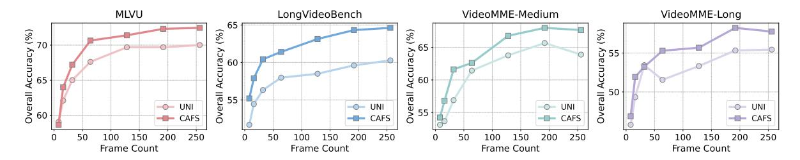
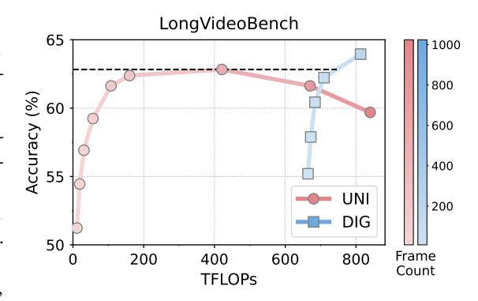

# 6.1 Frame Selection Strategy vs. Query Type

To examine the impact of different frame selection strategies on global versus localized queries, we leverage the query classifications established in Section 3 and then compare the performance of uniform sampling against our proposed frame selection pipeline on each query type.

**Efficacy of uniform sampling on GQ.** As clearly illustrated in the right two charts of Figure 5, standard uniform sampling consistently achieves performance comparable to, or occasionally even superior to, our complex pipeline on GQs. This observation suggests that global queries generally necessitate comprehensive and temporally diverse information from the video content, which uniform sampling effectively provides.

**Superiority of keyframe selection on LQ.** For LQs, our pipeline consistently outperforms uniform sampling, as shown in the left three charts of Figure 5. This result demonstrates our method's effectiveness in accurately identifying and extracting the specific video segments relevant to localized inquiries. These findings underscore the importance of a query-aware sampling strategy: identifying the query type is essential to determine whether to employ broad sampling for global context or targeted extraction for specific details.

### 6.2 Analysis of CAFS Effectiveness

Let  $f_j$  denote the frame indexed by j, and let  $V_j$  represent its feature vector obtained via DINOv2 [22]. We define the set of r-frames as  $\{f_{I_i}\}_{i=1}^N$  with indices  $\{I_i\}_{i=1}^N$ . To assess their effectiveness in capturing the high-level semantic content within a video, we introduce two quantitative metrics.

**Localized Coverage (LoC).** This metric assesses the effectiveness with which each r-frame captures its local temporal visual context. More specifically, for each r-frame  $f_{I_i}$ , four neighboring frames are sampled uniformly from its surrounding temporal window. The LoC score is then computed as the average similarity between the r-frame and its sampled neighbors across all r-frames.

$$LoC = \frac{1}{4N} \sum_{i=1}^{N} \sum_{j=0}^{3} sim \left( V_{I_i}, V_{M_{i,j}} \right),$$
where  $M_{i,j} = I_i + (j-1.5) \cdot \lfloor (I_{i+1} - I_{i-1})/6 \rfloor$ 

**Table 2:** Performance comparison with rewards from Qwen2.5-VL-32B [16], Qwen2.5-VL-7B [16] and CLIPScore [63] across various benchmarks. **Bold** indicates best performance. The base LMM used is Qwen2.5-VL-7B [16].

| Method              | #Frames | MLVU | LVB  |             | VideoMME |      |
|---------------------|---------|------|------|-------------|----------|------|
|                     |         |      | 2,2  | Short       | Medium   | Long |
| CLIPScore [63]      | 8       | 57.4 | 52.6 | 62.3        | 51.1     | 49.0 |
| Qwen2.5-VL-7B [16]  | 8       | 58.6 | 55.2 | 63.6        | 54.2     | 46.9 |
| Qwen2.5-VL-32B [16] | 8       | 60.6 | 55.6 | 64.2        | 52.6     | 47.2 |
| CLIPScore [63]      | 16      | 62.2 | 54.3 | 67.2        | 55.9     | 49.4 |
| Qwen2.5-VL-7B [16]  | 16      | 64.0 | 57.9 | 67.8        | 56.8     | 51.9 |
| Qwen2.5-VL-32B [16] | 16      | 64.0 | 59.2 | 68.1        | 57.6     | 50.2 |
| CLIPScore [63]      | 32      | 65.4 | 56.2 | 70.0        | 58.6     | 51.2 |
| Qwen2.5-VL-7B [16]  | 32      | 67.2 | 60.4 | 70.3        | 61.6     | 53.2 |
| Qwen2.5-VL-32B [16] | 32      | 67.9 | 60.6 | 72.6        | 61.4     | 53.1 |
| CLIPScore [63]      | 64      | 67.2 | 59.6 | 72.7        | 62.4     | 54.7 |
| Qwen2.5-VL-7B [16]  | 64      | 70.7 | 61.4 | 73.3        | 62.6     | 55.3 |
| Qwen2.5-VL-32B [16] | 64      | 71.0 | 63.4 | 74.4        | 64.8     | 54.7 |
| CLIPScore [63]      | 128     | 69.6 | 61.0 | 73.3        | 64.0     | 55.8 |
| Qwen2.5-VL-7B [16]  | 128     | 71.4 | 63.1 | 74.9        | 66.8     | 55.7 |
| Qwen2.5-VL-32B [16] | 128     | 72.6 | 65.2 | <b>75.4</b> | 69.2     | 57.1 |
| CLIPScore [63]      | 192     | 71.0 | 62.5 | 74.6        | 63.9     | 54.8 |
| Qwen2.5-VL-7B [16]  | 192     | 72.3 | 64.3 | 75.9        | 68.0     | 58.2 |
| Qwen2.5-VL-32B [16] | 192     | 73.9 | 65.4 | 76.2        | 69.2     | 57.4 |
| CLIPScore [63]      | 256     | 71.2 | 61.9 | 75.0        | 64.7     | 57.0 |
| Qwen2.5-VL-7B [16]  | 256     | 72.5 | 64.6 | 76.3        | 67.7     | 57.8 |
| Qwen2.5-VL-32B [16] | 256     | 74.3 | 64.5 | 76.8        | 68.9     | 59.1 |

**Figure 7:** *Performance Comparison of CAFS and uniform sampling in DIG pipeline.* The base LMM is Qwen2.5-VL-7B [16].

**Global Coverage (GIC).** This metric evaluates how well the *r-frames* collectively represent the entire video content. Ideally, each frame in the video should be similar to at least one *r-frame*. To compute it, we randomly sample 200 frames from the video, denoted as  $\{f_x\}_{x\in\mathcal{X}}$ . For each frame  $f_x$ , we find the maximum similarity to any *r-frame* and average these values across all sampled frames:

$$GIC = \frac{1}{|\mathcal{X}|} \sum_{x \in \mathcal{X}} \max_{i \in [1, N]} sim(V_{I_i}, V_x)$$

$$(5)$$

**Baseline selection.** We evaluate CAFS against two standard baselines: UNI (uniform frame sampling) and FPS (uniform frames-per-second sampling). The assessment is conducted on MLVU [54] and VideoMME [56]. To ensure a fair comparison, the average number of selected frames is kept consistent across all methods.

**Analysis.** As shown in Figure 6, the overall performance of standard uniform sampling declines with increasing video duration. This limitation arises from using a fixed number of frames across videos of varying lengths, which inevitably leads to significant redundancy in short videos and inadequate semantic coverage in long videos. Moreover, while regular fps sampling maintains stable performance, CAFS consistently outperforms it, particularly for videos

Figure 8: Performance comparison of different window lengths (wlen) in DIG pipeline. The base LMM is Owen2.5-VL-32B [16].

over 10 minutes. This indicates that key semantic information in videos does not grow linearly with length, and that CAFS is more effective at selecting informative frames.

**Comparison with uniform sampling in DIG.** We compare CAFS with uniform sampling within the **DIG** by replacing CAFS-extracted *r-frames* with standard uniformly sampled ones. As experimentally shown in Figure 7, CAFS robustly outperforms uniform sampling across all benchmarks. In addition, the observed performance gap widens with more input frames, further highlighting the fundamental limitation of uniform sampling: for long videos it cannot sample sufficient frames to adequately cover information for the subsequent reasoning process, while CAFS can effectively adapt to videos of any length and ensures significantly better coverage.

### 6.3 Reward Assignment: LMM vs. CLIPScore

We evaluate the reward assignment mechanism employed by the LMMs in **DIG** by comparing it to a common alternative: computing frame-query similarity using CLIP [72]. Specifically, we substitute all reward values originally assigned by the LMM with corresponding CLIPScore [63].

LMMs exhibit superior capability as reward assigners. As illustrated in Table 2, the rewards generated by LMMs (Qwen2.5-VL-7B/32B [16]) demonstrate superior performance across the benchmarks in most cases, particularly as the number of frames increases. This underscores the LMM's capacity to deliver more precise and semantically rich reward signals through its advanced reasoning abilities and broad world knowledge. In contrast, CLIPScore [63] depends on superficial feature matching and often fails to capture nuanced or visually complex query requirements.

Better LMMs yield superior rewards. The experimental results in Table 2 also clearly indicate that employing the larger Qwen2.5-VL-32B [16] as the reward assigner outperforms the smaller 7B variant, even on a short-video benchmark like VideoMME-short [56]. This confirms that more advanced LMMs provide considerably more precise reward signals, thereby facilitating more accurate identification of query-relevant frames. Furthermore, this directly highlights the inherent flexibility of our framework: we can effectively decouple the reward mechanism from the inference backbone. By leveraging a separate, reasoning-intensive Image-LMM for frame selection, we can significantly enhance the final performance of the primary Video-LMM.

### 6.4 Impact of Window Length

To investigate how different values of wlen affect performance, we conduct an evaluation using settings of  $wlen \in \{0, 2, 4, 8\}$ , while keeping all other settings identical.

Comparison with different window length. As shown in Figure 8, setting wlen=0 yields the lowest performance across all benchmarks. This deficit is particularly pronounced on LongVideoBench [55], which necessitates reasoning over extended temporal contexts. This indicates that most queries cannot be effectively resolved within only a single scene, but instead require information from the surrounding temporal context. However, performance does not monotonically improve with wlen. When wlen is set to a high value, such as 8, performance degrades compared to wlen=2 and 4. This proves that an excessively large window introduces irrelevant contextual information, creating noise that is detrimental to localized queries. Therefore, wlen=2 appears to strike the optimal balance, achieving the best results across the benchmarks.

### 6.5 Efficiency of DIG

To evaluate computational cost, we measure and compare the FLOPs of our **DIG** pipeline against uniform sampling on LongVideoBench [55]. The reported FLOPs represent the average computation required per QA pair.

**Performance-Efficiency analysis.** As demonstrated in Figure 9, the uniform sampling approach exhibits a clear performance bottleneck. As the number of input frames scales, its accuracy saturates at a peak of 62.5%. Further increases in computation and frame count do not yield better performance. In contrast, **DIG** successfully overcomes this limitation. While operating at a higher computational budget ( $\geq 680$  TFLOPs), **DIG** demonstrates positive performance scaling, surpassing the uniform sampling's peak accuracy once computation exceeds 720 TFLOPs and continuing to improve thereafter.

Figure 9: Comparison between Accuracy and FLOPs. The base LMM is Qwen2.5-VL-7B [16].

### 7 Conclusion

In this work, we find that optimal frame selection in video understanding depends on the query type (global vs. localized). Based on this, we propose **DIG**, a training-free framework that adapts to this typology: it employs efficient uniform sampling for global queries while reserving a multi-stage pipeline for localized queries where targeted selection is essential. This dual approach ensures both high performance and efficiency. Extensive experiments across diverse long-form video benchmarks and LMMs validate that **DIG** consistently outperforms baselines and robustly scales LMM performance for inputs from 8 to 256 frames.

#### References

- [1] Haotian Liu, Chunyuan Li, Qingyang Wu, and Yong Jae Lee. Visual instruction tuning, 2023. URL https://arxiv.org/abs/2304.08485.
- [2] Shengbang Tong, Ellis Brown, Penghao Wu, Sanghyun Woo, Manoj Middepogu, Sai Charitha Akula, Jihan Yang, Shusheng Yang, Adithya Iyer, Xichen Pan, Ziteng Wang, Rob Fergus, Yann LeCun, and Saining Xie. Cambrian-1: A fully open, vision-centric exploration of multimodal llms, 2024. URL https://arxiv.org/abs/2406.16860.
- [3] Bo Li, Yuanhan Zhang, Dong Guo, Renrui Zhang, Feng Li, Hao Zhang, Kaichen Zhang, Peiyuan Zhang, Yanwei Li, Ziwei Liu, and Chunyuan Li. Llava-onevision: Easy visual task transfer, 2024. URL https://arxiv.org/abs/2408.03326.
- [4] Min Shi, Fuxiao Liu, Shihao Wang, Shijia Liao, Subhashree Radhakrishnan, Yilin Zhao, De-An Huang, Hongxu Yin, Karan Sapra, Yaser Yacoob, et al. Eagle: Exploring the design space for multimodal llms with mixture of encoders. *arXiv preprint arXiv:2408.15998*, 2024.
- [5] Zhe Chen, Jiannan Wu, Wenhai Wang, Weijie Su, Guo Chen, Sen Xing, Muyan Zhong, Qinglong Zhang, Xizhou Zhu, Lewei Lu, et al. Internvl: Scaling up vision foundation models and aligning for generic visual-linguistic tasks. In *CVPR*, pages 24185–24198, 2024.
- [6] Muhammad Maaz, Hanoona Rasheed, Salman Khan, and Fahad Shahbaz Khan. Video-chatgpt: Towards detailed video understanding via large vision and language models. *arXiv preprint arXiv:2306.05424*, 2023.
- [7] Kevin Lin, Faisal Ahmed, Linjie Li, Chung-Ching Lin, Ehsan Azarnasab, Zhengyuan Yang, Jianfeng Wang, Lin Liang, Zicheng Liu, Yumao Lu, et al. Mm-vid: Advancing video understanding with gpt-4v (ision). *arXiv preprint arXiv:2310.19773*, 2023.
- [8] Ce Zhang, Taixi Lu, Md Mohaiminul Islam, Ziyang Wang, Shoubin Yu, Mohit Bansal, and Gedas Bertasius. A simple llm framework for long-range video question-answering. *arXiv preprint arXiv:2312.17235*, 2023.

- [9] Bin Lin, Yang Ye, Bin Zhu, Jiaxi Cui, Munan Ning, Peng Jin, and Li Yuan. Video-llava: Learning united visual representation by alignment before projection. *arXiv preprint arXiv:2311.10122*, 2023.
- [10] Peng Jin, Ryuichi Takanobu, Wancai Zhang, Xiaochun Cao, and Li Yuan. Chat-univi: Unified visual representation empowers large language models with image and video understanding. In *CVPR*, pages 13700–13710, 2024.
- [11] Shuhuai Ren, Linli Yao, Shicheng Li, Xu Sun, and Lu Hou. Timechat: A time-sensitive multimodal large language model for long video understanding. In *Proceedings of the IEEE/CVF Conference on Computer Vision and Pattern Recognition*, pages 14313–14323, 2024.
- [12] Boqiang Zhang, Kehan Li, Zesen Cheng, Zhiqiang Hu, Yuqian Yuan, Guanzheng Chen, Sicong Leng, Yuming Jiang, Hang Zhang, Xin Li, Peng Jin, Wenqi Zhang, Fan Wang, Lidong Bing, and Deli Zhao. Videollama 3: Frontier multimodal foundation models for image and video understanding, 2025. URL [https://arxiv.org/](https://arxiv.org/abs/2501.13106) [abs/2501.13106](https://arxiv.org/abs/2501.13106).
- [13] Zesen Cheng, Sicong Leng, Hang Zhang, Yifei Xin, Xin Li, Guanzheng Chen, Yongxin Zhu, Wenqi Zhang, Ziyang Luo, Deli Zhao, and Lidong Bing. VideoLLaMA 2: Advancing Spatial-Temporal Modeling and Audio Understanding in Video-LLMs, October 2024.
- [14] Yuanhan Zhang, Jinming Wu, Wei Li, Bo Li, Zejun Ma, Ziwei Liu, and Chunyuan Li. Video instruction tuning with synthetic data, 2024. URL <https://arxiv.org/abs/2410.02713>.
- [15] Hang Zhang, Xin Li, and Lidong Bing. Video-llama: An instruction-tuned audio-visual language model for video understanding, 2023. URL <https://arxiv.org/abs/2306.02858>.
- [16] Shuai Bai, Keqin Chen, Xuejing Liu, Jialin Wang, Wenbin Ge, Sibo Song, Kai Dang, Peng Wang, Shijie Wang, Jun Tang, Humen Zhong, Yuanzhi Zhu, Mingkun Yang, Zhaohai Li, Jianqiang Wan, Pengfei Wang, Wei Ding, Zheren Fu, Yiheng Xu, Jiabo Ye, Xi Zhang, Tianbao Xie, Zesen Cheng, Hang Zhang, Zhibo Yang, Haiyang Xu, and Junyang Lin. Qwen2.5-vl technical report, 2025. URL <https://arxiv.org/abs/2502.13923>.
- [17] Shuming Liu, Chen Zhao, Tianqi Xu, and Bernard Ghanem. Bolt: Boost large vision-language model without training for long-form video understanding, 2025. URL <https://arxiv.org/abs/2503.21483>.
- [18] Xi Tang, Jihao Qiu, Lingxi Xie, Yunjie Tian, Jianbin Jiao, and Qixiang Ye. Adaptive keyframe sampling for long video understanding, 2025. URL <https://arxiv.org/abs/2502.21271>.
- [19] Sicheng Yu, Chengkai Jin, Huanyu Wang, Zhenghao Chen, Sheng Jin, Zhongrong Zuo, Xiaolei Xu, Zhenbang Sun, Bingni Zhang, Jiawei Wu, Hao Zhang, and Qianru Sun. Frame-voyager: Learning to query frames for video large language models, October 2024.
- [20] Jinhui Ye, Zihan Wang, Haosen Sun, Keshigeyan Chandrasegaran, Zane Durante, Cristobal Eyzaguirre, Yonatan Bisk, Juan Carlos Niebles, Ehsan Adeli, Li Fei-Fei, Jiajun Wu, and Manling Li. Re-thinking temporal search for long-form video understanding, 2025. URL <https://arxiv.org/abs/2504.02259>.
- [21] Hui Sun, Shiyin Lu, Huanyu Wang, Qing-Guo Chen, Zhao Xu, Weihua Luo, Kaifu Zhang, and Ming Li. Mdp3: A training-free approach for list-wise frame selection in video-llms, 2025. URL [https://arxiv.org/abs/2501.](https://arxiv.org/abs/2501.02885) [02885](https://arxiv.org/abs/2501.02885).
- [22] Maxime Oquab, Timothée Darcet, Théo Moutakanni, Huy Vo, Marc Szafraniec, Vasil Khalidov, Pierre Fernandez, Daniel Haziza, Francisco Massa, Alaaeldin El-Nouby, Mahmoud Assran, Nicolas Ballas, Wojciech Galuba, Russell Howes, Po-Yao Huang, Shang-Wen Li, Ishan Misra, Michael Rabbat, Vasu Sharma, Gabriel Synnaeve, Hu Xu, Hervé Jegou, Julien Mairal, Patrick Labatut, Armand Joulin, and Piotr Bojanowski. Dinov2: Learning robust visual features without supervision, 2024. URL <https://arxiv.org/abs/2304.07193>.
- [23] Abhimanyu Dubey, Abhinav Jauhri, Abhinav Pandey, Abhishek Kadian, Ahmad Al-Dahle, Aiesha Letman, Akhil Mathur, Alan Schelten, et al. The llama 3 herd of models, August 2024.
- [24] OpenAI, Josh Achiam, Steven Adler, Sandhini Agarwal, Lama Ahmad, et al. Gpt-4 technical report, March 2024.

- [25] Tom B. Brown, Benjamin Mann, Nick Ryder, Melanie Subbiah, Jared Kaplan, Prafulla Dhariwal, Arvind Neelakantan, Pranav Shyam, Girish Sastry, Amanda Askell, Sandhini Agarwal, Ariel Herbert-Voss, Gretchen Krueger, Tom Henighan, Rewon Child, Aditya Ramesh, Daniel M. Ziegler, Jeffrey Wu, Clemens Winter, Christopher Hesse, Mark Chen, Eric Sigler, Mateusz Litwin, Scott Gray, Benjamin Chess, Jack Clark, Christopher Berner, Sam McCandlish, Alec Radford, Ilya Sutskever, and Dario Amodei. Language models are few-shot learners, 2020. URL <https://arxiv.org/abs/2005.14165>.
- [26] Hugo Touvron, Thibaut Lavril, Gautier Izacard, Xavier Martinet, Marie-Anne Lachaux, Timothée Lacroix, Baptiste Rozière, Naman Goyal, Eric Hambro, Faisal Azhar, Aurelien Rodriguez, Armand Joulin, Edouard Grave, and Guillaume Lample. Llama: Open and efficient foundation language models, 2023. URL [https:](https://arxiv.org/abs/2302.13971) [//arxiv.org/abs/2302.13971](https://arxiv.org/abs/2302.13971).
- [27] Baolin Peng, Chunyuan Li, Pengcheng He, Michel Galley, and Jianfeng Gao. Instruction tuning with gpt-4, 2023. URL <https://arxiv.org/abs/2304.03277>.
- [28] Aakanksha Chowdhery, Sharan Narang, Jacob Devlin, Maarten Bosma, Gaurav Mishra, Adam Roberts, Paul Barham, Hyung Won Chung, Charles Sutton, Sebastian Gehrmann, Parker Schuh, Kensen Shi, Sasha Tsvyashchenko, Joshua Maynez, Abhishek Rao, Parker Barnes, Yi Tay, Noam Shazeer, Vinodkumar Prabhakaran, Emily Reif, Nan Du, Ben Hutchinson, Reiner Pope, James Bradbury, Jacob Austin, Michael Isard, Guy Gur-Ari, Pengcheng Yin, Toju Duke, Anselm Levskaya, Sanjay Ghemawat, Sunipa Dev, Henryk Michalewski, Xavier Garcia, Vedant Misra, Kevin Robinson, Liam Fedus, Denny Zhou, Daphne Ippolito, David Luan, Hyeontaek Lim, Barret Zoph, Alexander Spiridonov, Ryan Sepassi, David Dohan, Shivani Agrawal, Mark Omernick, Andrew M. Dai, Thanumalayan Sankaranarayana Pillai, Marie Pellat, Aitor Lewkowycz, Erica Moreira, Rewon Child, Oleksandr Polozov, Katherine Lee, Zongwei Zhou, Xuezhi Wang, Brennan Saeta, Mark Diaz, Orhan Firat, Michele Catasta, Jason Wei, Kathy Meier-Hellstern, Douglas Eck, Jeff Dean, Slav Petrov, and Noah Fiedel. Palm: Scaling language modeling with pathways, 2022. URL <https://arxiv.org/abs/2204.02311>.
- [29] Hyung Won Chung, Le Hou, Shayne Longpre, Barret Zoph, Yi Tay, William Fedus, Yunxuan Li, Xuezhi Wang, Mostafa Dehghani, Siddhartha Brahma, Albert Webson, Shixiang Shane Gu, Zhuyun Dai, Mirac Suzgun, Xinyun Chen, Aakanksha Chowdhery, Alex Castro-Ros, Marie Pellat, Kevin Robinson, Dasha Valter, Sharan Narang, Gaurav Mishra, Adams Yu, Vincent Zhao, Yanping Huang, Andrew Dai, Hongkun Yu, Slav Petrov, Ed H. Chi, Jeff Dean, Jacob Devlin, Adam Roberts, Denny Zhou, Quoc V. Le, and Jason Wei. Scaling instruction-finetuned language models, 2022. URL <https://arxiv.org/abs/2210.11416>.
- [30] Susan Zhang, Stephen Roller, Naman Goyal, Mikel Artetxe, Moya Chen, Shuohui Chen, Christopher Dewan, Mona Diab, Xian Li, Xi Victoria Lin, Todor Mihaylov, Myle Ott, Sam Shleifer, Kurt Shuster, Daniel Simig, Punit Singh Koura, Anjali Sridhar, Tianlu Wang, and Luke Zettlemoyer. Opt: Open pre-trained transformer language models, 2022. URL <https://arxiv.org/abs/2205.01068>.
- [31] Deyao Zhu, Jun Chen, Xiaoqian Shen, Xiang Li, and Mohamed Elhoseiny. Minigpt-4: Enhancing vision-language understanding with advanced large language models, October 2023.
- [32] Jiajun Liu, Yibing Wang, Hanghang Ma, Xiaoping Wu, Xiaoqi Ma, Xiaoming Wei, Jianbin Jiao, Enhua Wu, and Jie Hu. Kangaroo: A powerful video-language model supporting long-context video input, 2024. URL <https://arxiv.org/abs/2408.15542>.
- [33] Antoine Yang, Arsha Nagrani, Paul Hongsuck Seo, Antoine Miech, Jordi Pont-Tuset, Ivan Laptev, Josef Sivic, and Cordelia Schmid. Vid2seq: Large-scale pretraining of a visual language model for dense video captioning, March 2023.
- [34] Lin Chen, Xilin Wei, Jinsong Li, Xiaoyi Dong, Pan Zhang, Yuhang Zang, Zehui Chen, Haodong Duan, Zhenyu Tang, Li Yuan, et al. Sharegpt4video: Improving video understanding and generation with better captions. In *NeurIPS*, volume 37, pages 19472–19495, 2024.
- [35] Hao Wu, Huabin Liu, Yu Qiao, and Xiao Sun. Dibs: Enhancing dense video captioning with unlabeled videos via pseudo boundary enrichment and online refinement. In *2024 IEEE/CVF Conference on Computer Vision and Pattern Recognition (CVPR)*, pages 18699–18708, June 2024.

- [36] Wenhao Chai, Enxin Song, Yilun Du, Chenlin Meng, Vashisht Madhavan, Omer Bar-Tal, Jenq-Neng Hwang, Saining Xie, and Christopher D. Manning. Auroracap: Efficient, performant video detailed captioning and a new benchmark, 2025. URL <https://arxiv.org/abs/2410.03051>.
- [37] Shen Yan, Tao Zhu, Zirui Wang, Yuan Cao, Mi Zhang, Soham Ghosh, Yonghui Wu, and Jiahui Yu. Videococa: Video-text modeling with zero-shot transfer from contrastive captioners, 2023. URL [https://arxiv.org/abs/](https://arxiv.org/abs/2212.04979) [2212.04979](https://arxiv.org/abs/2212.04979).
- [38] Wonkyun Kim, Changin Choi, Wonseok Lee, and Wonjong Rhee. An image grid can be worth a video: Zero-shot video question answering using a vlm. *IEEE Access*, 2024.
- [39] Juhong Min, Shyamal Buch, Arsha Nagrani, Minsu Cho, and Cordelia Schmid. Morevqa: Exploring modular reasoning models for video question answering. In *2024 IEEE/CVF Conference on Computer Vision and Pattern Recognition (CVPR)*, pages 13235–13245, June 2024.
- [40] Bin Lin, Yang Ye, Bin Zhu, Jiaxi Cui, Munan Ning, Peng Jin, and Li Yuan. Video-llava: Learning united visual representation by alignment before projection, 2024. URL <https://arxiv.org/abs/2311.10122>.
- [41] Yaoyao Zhong, Junbin Xiao, Wei Ji, Yicong Li, Weihong Deng, and Tat-Seng Chua. Video question answering: Datasets, algorithms and challenges, 2022. URL <https://arxiv.org/abs/2203.01225>.
- [42] Min Shi, Shihao Wang, Chieh-Yun Chen, Jitesh Jain, Kai Wang, Junjun Xiong, Guilin Liu, Zhiding Yu, and Humphrey Shi. Slow-fast architecture for video multi-modal large language models, 2025. URL [https://arxiv.](https://arxiv.org/abs/2504.01328) [org/abs/2504.01328](https://arxiv.org/abs/2504.01328).
- [43] Mingze Xu, Mingfei Gao, Zhe Gan, Hong-You Chen, Zhengfeng Lai, Haiming Gang, Kai Kang, and Afshin Dehghan. Slowfast-llava: A strong training-free baseline for video large language models, 2024. URL [https:](https://arxiv.org/abs/2407.15841) [//arxiv.org/abs/2407.15841](https://arxiv.org/abs/2407.15841).
- [44] Orr Zohar, Xiaohan Wang, Yann Dubois, Nikhil Mehta, Tong Xiao, Philippe Hansen-Estruch, Licheng Yu, Xiaofang Wang, Felix Juefei-Xu, Ning Zhang, Serena Yeung-Levy, and Xide Xia. Apollo: An exploration of video understanding in large multimodal models, 2024. URL <https://arxiv.org/abs/2412.10360>.
- [45] Min Shi, Fuxiao Liu, Shihao Wang, Shijia Liao, Subhashree Radhakrishnan, Yilin Zhao, De-An Huang, Hongxu Yin, Karan Sapra, Yaser Yacoob, Humphrey Shi, Bryan Catanzaro, Andrew Tao, Jan Kautz, Zhiding Yu, and Guilin Liu. Eagle: Exploring the design space for multimodal llms with mixture of encoders, 2025. URL <https://arxiv.org/abs/2408.15998>.
- [46] Enxin Song, Wenhao Chai, Guanhong Wang, Yucheng Zhang, Haoyang Zhou, Feiyang Wu, Haozhe Chi, Xun Guo, Tian Ye, Yanting Zhang, Yan Lu, Jenq-Neng Hwang, and Gaoang Wang. Moviechat: From dense token to sparse memory for long video understanding, 2024. URL <https://arxiv.org/abs/2307.16449>.
- [47] Howard Yen, Tianyu Gao, and Danqi Chen. Long-context language modeling with parallel context encoding, 2024. URL <https://arxiv.org/abs/2402.16617>.
- [48] Zijia Zhao, Haoyu Lu, Yuqi Huo, Yifan Du, Tongtian Yue, Longteng Guo, Bingning Wang, Weipeng Chen, and Jing Liu. Needle in a video haystack: A scalable synthetic evaluator for video mllms, 2025. URL [https:](https://arxiv.org/abs/2406.09367) [//arxiv.org/abs/2406.09367](https://arxiv.org/abs/2406.09367).
- [49] Xinhao Li, Yi Wang, Jiashuo Yu, Xiangyu Zeng, Yuhan Zhu, Haian Huang, Jianfei Gao, Kunchang Li, Yinan He, Chenting Wang, Yu Qiao, Yali Wang, and Limin Wang. Videochat-flash: Hierarchical compression for long-context video modeling, 2025. URL <https://arxiv.org/abs/2501.00574>.
- [50] Peng Jin, Ryuichi Takanobu, Wancai Zhang, Xiaochun Cao, and Li Yuan. Chat-univi: Unified visual representation empowers large language models with image and video understanding, 2024. URL [https://arxiv.org/abs/](https://arxiv.org/abs/2311.08046) [2311.08046](https://arxiv.org/abs/2311.08046).
- [51] Enxin Song, Wenhao Chai, Guanhong Wang, Yucheng Zhang, Haoyang Zhou, Feiyang Wu, Haozhe Chi, Xun Guo, Tian Ye, Yanting Zhang, Yan Lu, Jenq-Neng Hwang, and Gaoang Wang. Moviechat: From dense token to sparse memory for long video understanding. In *2024 IEEE/CVF Conference on Computer Vision and Pattern Recognition (CVPR)*, pages 18221–18232, Seattle, WA, USA, June 2024. IEEE. ISBN 9798350353006.

- [52] Xiaoqian Shen, Yunyang Xiong, Changsheng Zhao, Lemeng Wu, Jun Chen, Chenchen Zhu, Zechun Liu, Fanyi Xiao, Balakrishnan Varadarajan, Florian Bordes, Zhuang Liu, Hu Xu, Hyunwoo J. Kim, Bilge Soran, Raghuraman Krishnamoorthi, Mohamed Elhoseiny, and Vikas Chandra. Longvu: Spatiotemporal adaptive compression for long video-language understanding, October 2024.
- [53] Xiao Wang, Qingyi Si, Jianlong Wu, Shiyu Zhu, Li Cao, and Liqiang Nie. Retake: Reducing temporal and knowledge redundancy for long video understanding, 2025. URL <https://arxiv.org/abs/2412.20504>.
- [54] Junjie Zhou, Yan Shu, Bo Zhao, Boya Wu, Zhengyang Liang, Shitao Xiao, Minghao Qin, Xi Yang, Yongping Xiong, Bo Zhang, Tiejun Huang, and Zheng Liu. Mlvu: Benchmarking multi-task long video understanding, 2025. URL <https://arxiv.org/abs/2406.04264>.
- [55] Haoning Wu, Dongxu Li, Bei Chen, and Junnan Li. Longvideobench: A benchmark for long-context interleaved video-language understanding, 2024. URL <https://arxiv.org/abs/2407.15754>.
- [56] Chaoyou Fu, Yuhan Dai, Yongdong Luo, Lei Li, Shuhuai Ren, Renrui Zhang, Zihan Wang, Chenyu Zhou, Yunhang Shen, Mengdan Zhang, Peixian Chen, Yanwei Li, Shaohui Lin, Sirui Zhao, Ke Li, Tong Xu, Xiawu Zheng, Enhong Chen, Rongrong Ji, and Xing Sun. Video-mme: The first-ever comprehensive evaluation benchmark of multi-modal llms in video analysis, 2024. URL <https://arxiv.org/abs/2405.21075>.
- [57] Xiaohan Wang, Yuhui Zhang, Orr Zohar, and Serena Yeung-Levy. Videoagent: Long-form video understanding with large language model as agent, 2024. URL <https://arxiv.org/abs/2403.10517>.
- [58] Ziyang Wang, Shoubin Yu, Elias Stengel-Eskin, Jaehong Yoon, Feng Cheng, Gedas Bertasius, and Mohit Bansal. Videotree: Adaptive tree-based video representation for llm reasoning on long videos, 2025. URL [https:](https://arxiv.org/abs/2405.19209) [//arxiv.org/abs/2405.19209](https://arxiv.org/abs/2405.19209).
- [59] Zeyuan Yang, Delin Chen, Xueyang Yu, Maohao Shen, and Chuang Gan. Vca: Video curious agent for long video understanding, 2025. URL <https://arxiv.org/abs/2412.10471>.
- [60] Yue Fan, Xiaojian Ma, Rujie Wu, Yuntao Du, Jiaqi Li, Zhi Gao, and Qing Li. Videoagent: A memory-augmented multimodal agent for video understanding, 2024. URL <https://arxiv.org/abs/2403.11481>.
- [61] Kirolos Ataallah, Xiaoqian Shen, Eslam Abdelrahman, Essam Sleiman, Mingchen Zhuge, Jian Ding, Deyao Zhu, Jürgen Schmidhuber, and Mohamed Elhoseiny. Goldfish: Vision-language understanding of arbitrarily long videos. In *ECCV*, pages 251–267. Springer, 2024.
- [62] Roy Ganz, Yair Kittenplon, Aviad Aberdam, Elad Ben Avraham, Oren Nuriel, Shai Mazor, and Ron Litman. Question aware vision transformer for multimodal reasoning, 2024. URL <https://arxiv.org/abs/2402.05472>.
- [63] Jack Hessel, Ari Holtzman, Maxwell Forbes, Ronan Le Bras, and Yejin Choi. Clipscore: A reference-free evaluation metric for image captioning, 2022. URL <https://arxiv.org/abs/2104.08718>.
- [64] Shaojie Zhang, Jiahui Yang, Jianqin Yin, Zhenbo Luo, and Jian Luan. Q-frame: Query-aware frame selection and multi-resolution adaptation for video-llms, 2025. URL <https://arxiv.org/abs/2506.22139>.
- [65] Jinhui Ye, Zihan Wang, Haosen Sun, Keshigeyan Chandrasegaran, Zane Durante, Cristobal Eyzaguirre, Yonatan Bisk, Juan Carlos Niebles, Ehsan Adeli, Li Fei-Fei, Jiajun Wu, and Manling Li. T\*: Re-thinking temporal search for long-form video understanding, 2025. URL <https://arxiv.org/abs/2504.02259>.
- [66] Yukang Chen, Fuzhao Xue, Dacheng Li, Qinghao Hu, Ligeng Zhu, Xiuyu Li, Yunhao Fang, Haotian Tang, Shang Yang, Zhijian Liu, Ethan He, Hongxu Yin, Pavlo Molchanov, Jan Kautz, Linxi Fan, Yuke Zhu, Yao Lu, and Song Han. Longvila: Scaling long-context visual language models for long videos, 2024. URL [https:](https://arxiv.org/abs/2408.10188) [//arxiv.org/abs/2408.10188](https://arxiv.org/abs/2408.10188).
- [67] Peiyuan Zhang, Kaichen Zhang, Bo Li, Guangtao Zeng, Jingkang Yang, Yuanhan Zhang, Ziyue Wang, Haoran Tan, Chunyuan Li, and Ziwei Liu. Long context transfer from language to vision, 2024. URL [https://arxiv.](https://arxiv.org/abs/2406.16852) [org/abs/2406.16852](https://arxiv.org/abs/2406.16852).

- [68] Jinguo Zhu, Weiyun Wang, Zhe Chen, Zhaoyang Liu, Shenglong Ye, Lixin Gu, Hao Tian, Yuchen Duan, Weijie Su, Jie Shao, Zhangwei Gao, Erfei Cui, Xuehui Wang, Yue Cao, Yangzhou Liu, Xingguang Wei, Hongjie Zhang, Haomin Wang, Weiye Xu, Hao Li, Jiahao Wang, Nianchen Deng, Songze Li, Yinan He, Tan Jiang, Jiapeng Luo, Yi Wang, Conghui He, Botian Shi, Xingcheng Zhang, Wenqi Shao, Junjun He, Yingtong Xiong, Wenwen Qu, Peng Sun, Penglong Jiao, Han Lv, Lijun Wu, Kaipeng Zhang, Huipeng Deng, Jiaye Ge, Kai Chen, Limin Wang, Min Dou, Lewei Lu, Xizhou Zhu, Tong Lu, Dahua Lin, Yu Qiao, Jifeng Dai, and Wenhai Wang. Internvl3: Exploring advanced training and test-time recipes for open-source multimodal models, 2025. URL [https:](https://arxiv.org/abs/2504.10479) [//arxiv.org/abs/2504.10479](https://arxiv.org/abs/2504.10479).
- [69] Xiaoqian Shen, Yunyang Xiong, Changsheng Zhao, Lemeng Wu, Jun Chen, Chenchen Zhu, Zechun Liu, Fanyi Xiao, Balakrishnan Varadarajan, Florian Bordes, Zhuang Liu, Hu Xu, Hyunwoo J. Kim, Bilge Soran, Raghuraman Krishnamoorthi, Mohamed Elhoseiny, and Vikas Chandra. Longvu: Spatiotemporal adaptive compression for long video-language understanding, 2024. URL <https://arxiv.org/abs/2410.17434>.
- [70] Guo Chen, Yicheng Liu, Yifei Huang, Yuping He, Baoqi Pei, Jilan Xu, Yali Wang, Tong Lu, and Limin Wang. Cg-bench: Clue-grounded question answering benchmark for long video understanding, 2024. URL [https:](https://arxiv.org/abs/2412.12075) [//arxiv.org/abs/2412.12075](https://arxiv.org/abs/2412.12075).
- [71] Tianyuan Qu, Longxiang Tang, Bohao Peng, Senqiao Yang, Bei Yu, and Jiaya Jia. Does your vision-language model get lost in the long video sampling dilemma?, 2025. URL <https://arxiv.org/abs/2503.12496>.
- [72] Alec Radford, Jong Wook Kim, Chris Hallacy, Aditya Ramesh, Gabriel Goh, Sandhini Agarwal, Girish Sastry, Amanda Askell, Pamela Mishkin, Jack Clark, Gretchen Krueger, and Ilya Sutskever. Learning transferable visual models from natural language supervision, 2021. URL <https://arxiv.org/abs/2103.00020>.
- [73] Qwen Team. Qwen3 technical report, 2025. URL <https://arxiv.org/abs/2505.09388>.
- [74] Kaichen Zhang, Bo Li, Peiyuan Zhang, Fanyi Pu, Joshua Adrian Cahyono, Kairui Hu, Shuai Liu, Yuanhan Zhang, Jingkang Yang, Chunyuan Li, and Ziwei Liu. Lmms-eval: Reality check on the evaluation of large multimodal models, 2024. URL <https://arxiv.org/abs/2407.12772>.
- [75] Woosuk Kwon, Zhuohan Li, Siyuan Zhuang, Ying Sheng, Lianmin Zheng, Cody Hao Yu, Joseph E. Gonzalez, Hao Zhang, and Ion Stoica. Efficient memory management for large language model serving with pagedattention. In *Proceedings of the ACM SIGOPS 29th Symposium on Operating Systems Principles*, 2023.
- [76] Shuai Bai, Yuxuan Cai, Ruizhe Chen, Keqin Chen, Xionghui Chen, Zesen Cheng, Lianghao Deng, Wei Ding, Chang Gao, Chunjiang Ge, Wenbin Ge, Zhifang Guo, Qidong Huang, Jie Huang, Fei Huang, Binyuan Hui, Shutong Jiang, Zhaohai Li, Mingsheng Li, Mei Li, Kaixin Li, Zicheng Lin, Junyang Lin, Xuejing Liu, Jiawei Liu, Chenglong Liu, Yang Liu, Dayiheng Liu, Shixuan Liu, Dunjie Lu, Ruilin Luo, Chenxu Lv, Rui Men, Lingchen Meng, Xuancheng Ren, Xingzhang Ren, Sibo Song, Yuchong Sun, Jun Tang, Jianhong Tu, Jianqiang Wan, Peng Wang, Pengfei Wang, Qiuyue Wang, Yuxuan Wang, Tianbao Xie, Yiheng Xu, Haiyang Xu, Jin Xu, Zhibo Yang, Mingkun Yang, Jianxin Yang, An Yang, Bowen Yu, Fei Zhang, Hang Zhang, Xi Zhang, Bo Zheng, Humen Zhong, Jingren Zhou, Fan Zhou, Jing Zhou, Yuanzhi Zhu, and Ke Zhu. Qwen3-vl technical report, 2025. URL <https://arxiv.org/abs/2511.21631>.
- [77] Jason Wei, Xuezhi Wang, Dale Schuurmans, Maarten Bosma, Brian Ichter, Fei Xia, Ed Chi, Quoc Le, and Denny Zhou. Chain-of-thought prompting elicits reasoning in large language models, 2023. URL [https:](https://arxiv.org/abs/2201.11903) [//arxiv.org/abs/2201.11903](https://arxiv.org/abs/2201.11903).
- [78] LLama3 Team. The llama 3 herd of models, 2024. URL <https://arxiv.org/abs/2407.21783>.
- [79] OpenAI. gpt-oss-120b & gpt-oss-20b model card, 2025. URL <https://arxiv.org/abs/2508.10925>.
- [80] DeepSeek-AI. Deepseek-r1: Incentivizing reasoning capability in llms via reinforcement learning, 2025. URL <https://arxiv.org/abs/2501.12948>.
- [81] Junnan Li, Dongxu Li, Caiming Xiong, and Steven Hoi. Blip: Bootstrapping language-image pre-training for unified vision-language understanding and generation, 2022. URL <https://arxiv.org/abs/2201.12086>.

