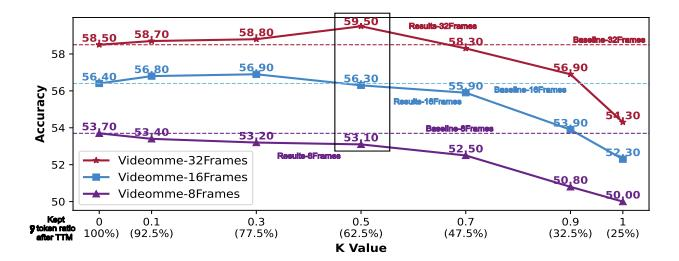
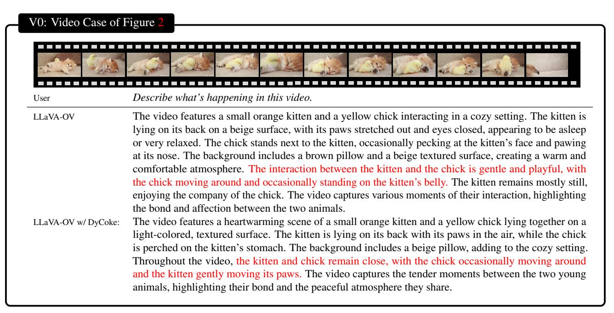
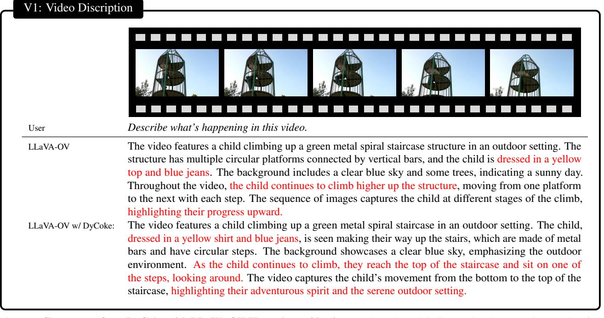

# Supplementary Material

| Method       | FR   | AS          | AP          | AA          | FA          | UA          | OE          | OI   | os          | MD          | AL          | ST          | AC          | MC          | MA          | SC          | FP          | CO          | EN           | ER   | CI          | Avg.        |
|--------------|------|-------------|-------------|-------------|-------------|-------------|-------------|------|-------------|-------------|-------------|-------------|-------------|-------------|-------------|-------------|-------------|-------------|--------------|------|-------------|-------------|
|              |      |             |             |             |             |             |             |      | LL          | aVA-C       | V-7B        |             |             |             |             |             |             |             |              |      |             |             |
| Full Tokens  | 100% | 72.3        | 70.0        | 78.0        | 46.0        | 78.5        | 54.0        | 82.0 | 37.0        | 23.0        | 49.0        | 92.0        | 47.5        | 47.5        | 69.5        | 51.5        | 45.0        | 69.0        | 36.5         | 80.0 | 47.0        | 58.8        |
| PruMerge     | 51%  | 60.6        | 66.5        | 71.0        | 38.0        | 76.5        | 52.5        | 65.5 | 35.5        | 33.0        | 45.0        | 89.5        | 42.0        | 43.0        | 63.0        | 51.0        | 48.0        | 53.5        | 33.5         | 78.0 | 37.0        | 53.9        |
| FastV        | 43%  | 73.9        | 71.5        | 79.5        | 44.5        | <u>78.0</u> | <u>55.6</u> | 82.0 | <u>40.0</u> | 19.0        | 50.0        | 94.0        | 43.5        | 43.0        | 71.0        | <u>52.0</u> | 49.0        | 70.5        | 34.5         | 76.0 | <u>40.5</u> | 58.4        |
| Ours (K=0.5) | 59%  | 74.5        | 71.0        | 76.5        | 47.0        | 77.0        | 56.6        | 82.5 | 37.5        | 22.5        | <u>48.5</u> | 93.0        | 47.5        | <u>47.5</u> | 73.0        | 51.5        | <u>49.5</u> | <u>69.0</u> | 36.0         | 73.5 | 48.0        | <u>59.1</u> |
| Ours (K=0.7) | 43%  | 72.3        | 73.5        | <u>77.0</u> | <u>46.0</u> | 78.5        | 55.1        | 82.5 | 40.5        | <u>23.5</u> | 50.0        | <u>93.5</u> | <u>45.5</u> | 48.5        | <u>71.5</u> | 52.5        | 52.0        | <u>69.0</u> | <u>35.0</u>  | 80.0 | 48.0        | 59.6        |
|              |      |             |             |             |             |             |             |      | LLa         | VA-O        | V-0.5B      |             |             |             |             |             |             |             |              |      |             |             |
| Full Tokens  | 100% | 57.5        | 63.5        | 55.5        | 36.5        | 61.0        | 47.0        | 68.5 | 34.0        | 20.0        | 0.0         | 87.5        | 43.0        | 30.0        | 55.5        | 40.0        | 0.0         | 47.5        | 31.0         | 0.0  | 42.5        | 48.2        |
| PruMerge     | 46%  | 37.8        | 49.5        | 59.0        | 28.5        | 52.0        | 46.5        | 48.5 | 30.0        | 21.0        | 37.0        | 85.5        | 38.0        | 29.0        | 50.0        | 34.5        | 37.5        | 36.5        | 28.5         | 60.5 | 41.0        | 42.6        |
| FastV        | 46%  | 55.3        | <u>63.0</u> | 53.5        | 35.0        | 60.5        | 46.0        | 63.0 | <u>34.0</u> | <u>21.5</u> | <u>38.5</u> | 85.0        | 44.0        | 29.5        | 53.0        | 39.0        | 38.0        | 46.0        | <u> 29.5</u> | 61.0 | 45.5        | 47.0        |
| Ours (K=0.5) | 60%  | <u>55.9</u> | 64.0        | 55.0        | <u>36.5</u> | 63.5        | 46.0        | 69.5 | 35.0        | 22.0        | 40.0        | 86.0        | 44.0        | 29.5        | 55.0        | <u>36.0</u> | 40.5        | <u>46.5</u> | 30.0         | 63.5 | <u>43.5</u> | 48.1        |
| Ours (K=0.7) | 44%  | 57.5        | 62.0        | <u>56.0</u> | 38.5        | 61.5        | 45.5        | 68.0 | 34.0        | 21.0        | 40.0        | 87.0        | 43.5        | 29.5        | 54.5        | 35.5        | <u>39.5</u> | 48.5        | 29.0         | 62.5 | 43.0        | <u>47.8</u> |

Table 7. Performance comparison on MVBench with an input image sampling frame count of 32 frames, where a retained ratio of 100% indicates that no token pruning method is used. All values with higher metrics perform better. The highest value for each metric is marked in **bold**, while the second highest is marked with <u>underlined</u>.

#### A. MVBench Dataset

#### A.1. Brief Overview

To complement the illustration, we provide a brief description of the 20 tasks included in the MVBench dataset. The MVBench dataset focuses on evaluating the model's temporal reasoning ability, spanning basic perceptual to advanced cognitive tasks across nine broad categories, including complex tasks such as action recognition, object localization, and scene transformation. Each task requires the model to handle dynamic changes in video sequences, compensating for the limitations in temporal understanding found in existing still-image tasks. For example, in the "action" task, the model must recognize action sequences, predict future actions, and distinguish between similar actions to achieve a nuanced understanding of human behavior in videos. Additionally, MVBench includes tasks involving object interaction and state changes, such as determining whether an object is present in a video or identifying object position changes over different periods. The dataset also includes high-level cognitive tasks such as "counterfactual reasoning" and "episodic reasoning," requiring the model to speculate on causality in complex situations and navigate based on an egocentric perspective. The 20 tasks in the Tab. 2 are: AS (action sequence), AP (action prediction), AA (action antonymy), FA (fine-grained action), UA (unexpected action), OE (object existence), OI (object interaction), OS (object shuffle), MD (movement direction), AL (action localization), ST (scene transition), AC (action counting), MC (movement counting), MA (movement attributes), SC (state change), FP (fine-grained pose), CO (character order), EN (egocentric navigation), ER (episodic reasoning), and CI (counterfactual inference).

| Model         | d     | m      | T  | Tokens/Frame |
|---------------|-------|--------|----|--------------|
| LLaVA-OV-0.5B | 896   | 4,864  | 24 | 196          |
| LLaVA-OV-7B   | 3,584 | 18,944 | 28 | 196          |
| LLaVA-OV-72B  | 8,192 | 29,568 | 80 | 196          |

Table 8. Comparison of LLaVA-OV Models [18] across different model configurations (0.5B, 7B, and 72B): d means the hidden state size; m is the intermediate size of the FFN; the total number of transformer layers is denoted as T.

## A.2. Supplementary Experimental Data

Tab. 3 presents the performance and inference speedup of LLaVA-OV-0.5B and LLaVA-OV-7B models [18] on MVBench [23] after token compression across varying input frame numbers. Supplementary results for each sub-metric accuracy of MVBench in the 32-frame input case are provided in Tab. 7.

### **B.** Model Hyperparameters

In Sec. 4.1, we evaluated token compression using computational cost FLOPs, calculating that multi-head attention (MHA) and feedforward network (FFN) modules are the two primary computational costs. Here, n represents the number of tokens, d is the hidden state size and m is the intermediate size of the FFN. For the three sizes of VLLMs used in this work, we provide supplementary explanations for n, m, d, and the total number of transformer layers T, as shown in Tab. 8.

## C. Computing Cost Evaluation.

We examine the total FLOPs of the prefilling stage and the decoding stage. Consider a transformer layer employ-

Figure 5. Performance vs. K values in different input frames.

ing multi-head attention (MHA) and feed-forward network (FFN) modules. Let n,d, and m denote the number of tokens, the hidden state size, and the intermediate size of the FFN, respectively. In the prefilling phase, the total FLOPs can be estimated as  $4nd^2 + 2n^2d + 2ndm$ . For the decoding phase, considering the significant contribution of the KV cache, the computational consumption for R total iterations (i.e., predicting R tokens) is  $R\left(4d^2+2dm\right)+2\sum_{i=1}^R d\times(n+i)$ . We unify R=100 for calculation in the experiments. Thus, for an LLM with T total transformer layers, the total FLOPs can be expressed as follows,

FLOPs = 
$$T(4nd^2 + 2n^2d + 2ndm)$$
  
+  $TR\left((4d^2 + 2dm) + 2\left(dn + \frac{d(R+1)}{2}\right)\right)$ . (8)

FLOPs are employed as a metric to quantify token computation, ensuring a fair comparison with other methods; however, they do not directly indicate the final inference speed.

#### **D.** Ablation Study about *k* and Input Frames

As shown in Figure 5, we investigate the relationship among the numerical value of k, the number of input frames (32, 16, and 8), and the overall model performance. Our results indicate that with a low number of input frames, token compression consistently leads to a decline in model performance. However, as the number of input frames increases—that is, as the multiplicity of visual tokens grows—the adverse impact of token compression on model performance gradually diminishes, eventually outperforming the baseline model. This phenomenon arises because more input frames introduce increased information redundancy and noise, which can be mitigated through moderate token compression, thereby maintaining performance with a slight enhancement.

#### E. Discussion and Future Work

### E.1. Compatible with Flash Attention

Flash Attention requires additional computation during the inference stage to compute the attention score matrix. However, combining Dycoke with Flash Attention does not impose significant additional computational overhead, as the attention score is computed only at a specific layer during

each decoding iteration. Moreover, the computational complexity is substantially lower than that of the prefilling phase.

#### E.2. Future Work

DyCoke marks the first significant advancement in dynamic token pruning to improve inference efficiency in video large language models (VLLMs), yet some challenges remain for further exploration. Firstly, although DyCoke's compression strategy effectively reduces token redundancy, specific video contexts (e.g., rapid scene changes or critical time shifts) may still incur minor information loss. While the dynamic token selection mechanism mitigates this risk, future work will focus on developing more fine-grained token compression methods for highly dynamic video content. Secondly, although token compression reduces memory consumption and enhances reasoning speed, fully deploying LLMs on mobile devices remains challenging due to their scale. Thus, we aim to integrate advanced compression techniques, such as quantization and distillation, to develop more efficient VLLMs.

#### F. More Visualizations

Figure 6. Showcases of our DyCoke with LLaVA-OV 7B on long video input. The red mark indicates that the reasoning results after token compression remain consistent with the original results, highlighting content comprehension.

Figure 7. Showcases of our DyCoke with LLaVA-OV 7B on short video input. The red mark indicates that the reasoning results after token compression remain consistent with the original results, highlighting content comprehension.