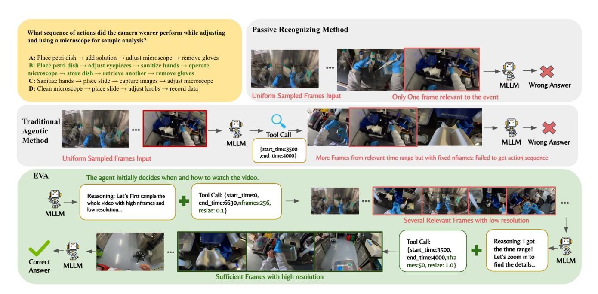

# 1. Introduction

Video understanding has emerged as a cornerstone of multimodal intelligence [\[1,](#page-8-0) [47\]](#page-10-0), enabling a wide range of applications such as video question answering, retrieval, and embodied perception. As multimodal large language models (MLLMs) become increasingly capable of integrating vision, language, and reasoning [\[13\]](#page-8-1), a new research frontier is opening up—transforming them from passive perception models into active agents. This naturally raises a fundamental question: *How can an MLLM-based Agent decide when and how to watch a video autonomously?*

Most existing video understanding systems still treat MLLMs as passive recognizers—they process entire videos or uniformly sampled frames to generate responses, without any notion of selective attention or adaptive reasoning [\[18,](#page-9-0) [33,](#page-10-1) [47\]](#page-10-0), as illustrated in Figure [1.](#page-1-0) Recent agentbased approaches take a step forward by introducing external tools such as frame-selection modules [\[17,](#page-9-1) [28,](#page-10-2) [37\]](#page-10-3). However, these pipelines remain largely handcrafted—built upon fixed parameters, rigid workflows, and limited exploration capabilities (e.g., fixed sampling rates). Moreover, even these "agent-based" methods typically start their reasoning after being fed a set of uniformly sampled frames together with the textual query, making them still perceptionfirst rather than truly planning-driven, which results in redundant visual processing and limited reasoning efficiency on long videos.

To bridge this gap, we advocate a planning-beforeperception paradigm, where the agent first reasons solely from the textual query to decide what to watch, when to watch, and how to watch, before engaging with any visual input. We formulate such video understanding as an iterative process of *summary–planning–action–reflection*. This paradigm allows the agent to progressively refine its perception and reasoning in response to the query, selectively attending to informative moments while avoiding unnecessary computation. Through this lens, an MLLM evolves from a passive video recognizer into an active, adaptive, and autonomous agentic watcher.

At the heart of our approach lies an iterative perception, reasoning, and tool usage paradigm that couples visual summary, planning, tool calling, and reflection thinking. The central challenge is to enable the model to operate effectively within this reasoning loop: learning how to generate the initial tool call based solely on the query without watching the video, how to continue reasoning when

\*Equal contribution ‡Project Lead †Corresponding author: luotto@sensetime.com Our Code and model are at [this link.](https://github.com/wangruohui/EfficientVideoAgent)

Figure 1. Given a question that requires the MLLM to figure out action sequences from an extremely long video (over 6600 seconds), the traditional uniformed sampling method is limited by the content length of the MLLM, and it is extremely hard for it to sample all the keyframes to answer the question correctly. As for the Traditional Agentic Method, the agent will also be given the uniformly sampled frames along with the video, which already occupy a lot of context. Although the agent can call tools to extract frames from a specific time range, the tool is rigid and the agent cannot adjust the fps and resolution, which leads to potential information loss. However, in EVA, the agent can arrange the tokens wisely. It can first watch the whole video with low resolution and high fps to get an overview of the video without costing too many visual tokens. After it finds the key time range, it will extract frames with high fps and high resolution, which leads to the correct answer.

the available visual information is insufficient, and how to avoid over-exploration or becoming trapped in unnecessary iterations.

To address this challenge, we introduce a three-stage training strategy. In the initial training stage, we construct a Supervised Fine-Tuning (SFT) Cold-Start dataset to instill core video-agent capabilities: tool-call formatting, interleaved image–text reasoning, frame-level understanding, and basic frame-selecting strategies. This cold-start phase supplies the model with a stable behavioral prior that eases later, more aggressive optimization. The second stage uses a Kahneman–Tversky Optimization (KTO) [\[10\]](#page-8-2) dataset composed of both successful and failed strategy trajectories. KTO guides the agent to prefer effective strategies while avoiding common failure modes; by correcting these known bad cases prior to GRPO [\[32\]](#page-10-4), it improves convergence, robustness, and stability during online policy optimization. Third, we introduce an online reinforcement learning stage based on Group Relative Policy Optimization (GRPO), which employs multiple data-driven rewards for both openended and multiple-choice question answering (QA). These standard yet flexible reward signals balance reasoning depth with computational efficiency, enabling scalable and adaptive policy learning for video understanding.

Together, these mechanisms enable the agent to learn an adaptive policy for multi-round perception, planning, and tool usage, ensuring effective video understanding while controlling redundant computation.

To ensure stable and reproducible agentic reinforcement learning, we curate and construct a series of highquality datasets for both the SFT cold-start and reinforcement learning stages. Specifically, we introduce the EVA-SFT, EVA-KTO, and EVA-RL datasets. The EVA-SFT comprises 10k high-quality samples covering both general and task-specific agent training data. The EVA-KTO includes 11k labeled frame-selection strategies, capturing diverse success and failure trajectories to guide strategy optimization. The EVA-RL contains 9.6k open-ended video QA pairs and 1.1k multiple choice questions.

Overall, our main contributions are summarized as follows:

- A novel and efficient RL-based video agent (EVA). We propose a planning-before-perception framework featuring iterative summary–plan–action–reflection cycles, enabling efficient and interpretable video understanding.
- Simple yet effective three-stage end to end training pipeline. Our framework combines SFT cold-start, KTO correction, and GRPO optimization into a scalable pro-

cess that jointly enhances reasoning depth and computational efficiency.

• High-quality datasets and strong empirical results. We construct the EVA-SFT, EVA-KTO, and EVA-RL datasets to support stable training, achieving state-of-theart performance across multiple video benchmarks.

