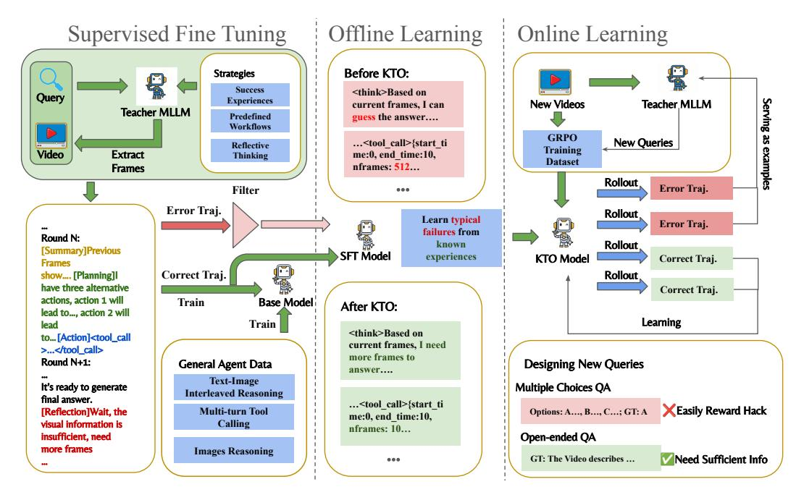
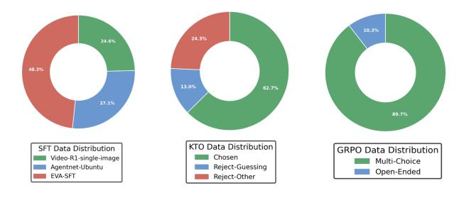

# 3. Method

### 3.1. Problem Setup

We formulate the active video understanding problem as a Markov Decision Process (MDP). At each timestep t, the agent observes a belief state:

$$s_t = \{q, h_t, F_t\},$$
 (1)

where q denotes the user query, ht represents the interleaved text–frame history, and Ft corresponds to the visual evidence (frames) obtained from tool calls. The policy of the agent is parameterized as πθ(at | st).

In video understanding tasks, answering a query does not always require observing uniformly sampled frames. In some cases, such frames are redundant, while in others they fail to provide sufficient evidence for correct reasoning—worse yet, presenting the full video upfront may mislead the planner by anchoring it to spurious or noisy visual cues [\[16,](#page-8-3) [28,](#page-10-2) [37\]](#page-10-3). Therefore, at the initial step s0, the model is provided only with the query q, without any visual information in our settings. To enable the agent to autonomously plan its use of visual tokens, we design a flexible *frameselection tool* that allows both temporal and spatial control.

| Parameter  | Description                  |
|------------|------------------------------|
| start time | Start of the temporal window |
| end time   | End of the temporal window   |
| nframes    | Number of frames to sample   |
| resize     | Spatial downsampling ratio   |

The *start time* and *end time* specify the temporal window, while *nframes* denotes the number of frames to sample within this interval. The *resize* parameter enables flexible zoom-in and zoom-out operations.

Intuitively, selecting a larger number of frames enables the agent to better capture dynamic actions, while choosing a higher spatial resolution allows it to extract finer visual details from each frame. This tool schema provides a broad exploration space, encouraging the agent to learn how to allocate temporal and spatial information across rounds to derive precise answers.

Traditional agentic methods can be viewed as constrained instances of our proposed EVA framework. They typically employ fixed workflows—such as processing the entire video from the start—and offer limited action freedom (e.g., selecting only a time range). In contrast, EVA can not only execute these human-designed workflows but also dynamically adapt its plan based on the query and the extracted visual evidence, thereby enabling a more general and flexible paradigm for agentic video understanding.

Training such an end-to-end autonomous video agent requires not only visual comprehension and tool-use capabilities but also strong planning skills to determine *what to watch* and *when to answer* based on the question and available visual evidence. Hence, diverse high-quality datasets and efficient training strategies are crucial for developing such a general-purpose agent.

### 3.2. Data Construction

Supervised Fine-Tuning Data Pipeline We begin by employing Qwen2.5-VL-72B as the teacher MLLM and

Figure 2. Data Pipeline and Training Stage of EVA. The base model is first fine-tuned on synthetic dataset with certain reasoning and tool-calling pattern. Then we use KTO to help the model learn from typical failures. Finally, we introduce a Data-Enhanced Multi-Stage GRPO training pipeline, where we collect the failure cases of current policy and employ an teacher MLLM to generate new open-ended video QA dataset.

prompting it to generate high-quality agentic video understanding data following our problem setup. The source video QA pairs come from llava-video [\[47\]](#page-10-0), a short video QA dataset, and cgbench [\[3\]](#page-8-6), a long video QA dataset. To further enhance data diversity and quality, we design a variety of prompts to guide the teacher model. These include: *Past Success Experiences* generated and summarized by the teacher MLLM itself; *Diverse Workflow Hints* that instruct the model on how to plan and select frames efficiently; and *Reflective Thinking Prompts* that encourage the model to carefully consider its actions.

Inspired by Zhang et al. [\[44\]](#page-10-11), each SFT data instance follows the format: Summary + Planning + Action + Reflection. In the Summary stage, the MLLM generates a detailed description of the content for each frame, which explicitly pushes the model to attend to the returned visual evidence and thereby better ground its understanding of the tool's parameters and outputs. During Planning, since an autonomous video agent possesses maximum flexibility to select actions from an extremely large action space, it is crucial to train its ability to propose potential actions based on current information while estimating their cost and outcome. In the Action stage, the model generates appropriate tool calls. Finally, as models tend to produce answers without sufficient visual evidence, resulting in degraded performance, we construct Reflection data that guide the model to evaluate whether the available visual information is adequate before producing an answer. If not, the model continues to call tools to gather additional information.

Kahneman-Tversky Optimization Data Pipeline The SFT-trained model effectively learns tool-calling formats and reasoning patterns; however, it still struggles to select appropriate strategies. Several typical failure cases share similar patterns: the model may generate answers without sufficient visual evidence, sample too many frames within a short temporal window, or too few frames across a relatively long one. To address these recurrent failures and stabilize subsequent online reinforcement learning, we employ the KTO framework. Unlike DPO [\[31\]](#page-10-12), which requires pairwise preference data and thus enforces a shared dialogue round—an assumption misaligned with our multi-turn interaction setting that may truncate strategies—KTO only requires single-sample preference labels ("chosen" or "rejected"). Compared with GRPO, KTO further enables the model to learn from externally collected experiences rather than self-play, leading to a more stable and sample-efficient training process. Specifically, we collect incorrect trajectories from the SFT data construction pipeline and categorize them as rejected samples. The criterion of data selection are two folds. Firstly, we use LLM As Judge to select the trajectories whose reasoning process shows it do not have enough visual tokens but still generate a answer, representing for guessing. Secondly, We also resample high-quality

Figure 3. Distribution of the Training Dataset

successful trajectories as chosen data. This setup allows the model to learn fine-grained preferences between fully successful and failed trajectories. Figure [2](#page-3-0) illustrates representative examples before and after applying KTO.

GRPO Data Pipeline. GRPO is an online reinforcement learning framework in which the model generates multiple rollouts by itself and iteratively learns from both successes and failures. However, conventional GRPO typically relies on a static training dataset, and the model only iterates through it for a few epochs. This limitation becomes more pronounced when training a video agent. Traditional GRPO learns from failures based solely on a fixed query–video pair, which constrains the diversity of challenges encountered. For instance, the model may realize that its counting ability is weak, yet it can only improve from a limited set of failed queries and videos.

To address this issue, we introduce a Data-Enhanced GRPO pipeline. We first construct a reinforcement learning dataset by collecting failure cases from the KTO-trained model. After several GRPO training steps, we further gather new failure cases and use them as in-context examples for the teacher MLLM, which then generates new question–answer pairs for unseen videos from HD-VILA [\[41\]](#page-10-13), conditioned on those examples. And We will re-train GRPO model on the enhanced dataset.

Specifically, the teacher MLLM is prompted to produce open-ended QA pairs with concise answers. Compared to directly designing multiple-choice questions, this open-ended formulation mitigates reward hacking caused by answer guessing and offers a more efficient generation process for the teacher model, since designing balanced multiple-choice options often introduces unintended information cues and additional complexity.

### 3.3. Reinforcement Learning

We optimize the model via reinforcement learning using a mixed-format dataset. Specifically, we train EVA on both multiple-choice and open-ended questions. For multiple-choice questions, we adopt the Completeness Self-Verification (CSV) reward [\[28\]](#page-10-2) to ensure that EVA explicitly identifies the correct frames rather than relying on random guessing. For open-ended questions, we utilize the ROUGE score as the reward signal.

### 3.3.1. GRPO Primer

We employ *Group Relative Policy Optimization* (GRPO) [\[32\]](#page-10-4), a KL-regularized policy optimization method that encourages high-return behaviors while constraining the policy to remain close to a reference model πref initialized via SFT and KTO. The training objective is formulated as:

$$\max_{\theta} \mathbb{E}_{\tau \sim \pi_{\theta}} [R(\tau)] - \lambda \mathbb{E}_{(s,a) \sim \pi_{\theta}} [KL(\pi_{\theta}(\cdot \mid s) \parallel \pi_{ref}(\cdot \mid s))].$$
(2)

### 3.3.2. Reward Shaping

Accuracy Reward. Our GRPO training corpus contains both *open-ended* and *multiple-choice* question–answer pairs. Accordingly, we design a composite reward function that adapts to these two types of supervision:

$$R(\tau) = w_{\rm acc} \, r_{\rm acc} + w_{\rm fmt} \, r_{\rm fmt}. \tag{3}$$

The accuracy reward is defined as:

$$r_{\rm acc} = \begin{cases} r_{\rm csv}, & \text{if multiple-choice,} \\ r_{\rm rouge}, & \text{if open-ended.} \end{cases}$$
 (4)

Specifically, for multiple-choice tasks, we set up the same base model to act as a judge, feeding it the question alongside EVA's last round of retrieved images. We set rcsv = 1 if and only if both the judge and EVA produce the correct answer; otherwise, rcsv = 0.

For open-ended tasks, let R1, R2, RL ∈ [0, 1] denote the ROUGE-1, ROUGE-2, and ROUGE-L F1 scores between the generated answer and the ground truth (with stemming). The averaged ROUGE reward is then defined as:

$$r_{\text{rouge}} = \frac{1}{3} (R_1 + R_2 + R_L) \in [0, 1].$$
 (5)

Format Reward. We also introduce a format reward to prevent the model from directly guessing the answer without proper reasoning. Specifically, if the model generates a tool call but ultimately yields an incorrect answer, we provide a compensatory format reward of 0.05. Considering that the expected accuracy for random guessing is approximately 0.20 or 0.25 (depending on the number of choices), this deliberately low reward discourages the model from exploiting the formatting structure to gain undeserved points through random guessing.

