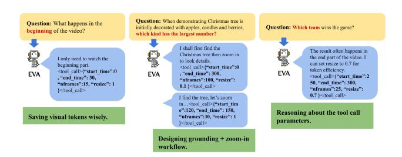

# **4.4.** Computation Efficiency Compared with Uniform Sampling Schema

Although our agent performs multi-round planning and perception, its overall computation remains highly efficient. As shown in Table 1, the total number of tokens is comparable to or even lower than static uniform-sampling baselines, with text tokens occupying only a small fraction of the computation budget. Consequently, the inference runtime does not scale with the number of reasoning steps but is instead dominated by the compact set of adaptively selected visual tokens. This allows our agent to achieve competitive or superior efficiency compared with uniform sampling, despite operating under a more expressive reasoning framework.

Figure 6. Diverse Workflows generated by EVA.

### 4.5. Case Study

Figure 6 illustrates the diverse workflows produced by EVA for different types of questions. Many queries require visual information from only a specific segment of the video (e.g., the beginning or the end). Under the plan-before-perception scheme, EVA allocates visual tokens precisely where needed, avoiding redundant usage that often occurs in traditional MLLM or agent methods, which perceive before reasoning or tool-calling.

When a query genuinely requires extensive visual evidence, EVA can also behave like conventional video agents—first sampling uniformly for grounding and then zooming in on key frames to extract finer details, showing EVA is a more general video agent.

The larger action space further differentiates EVA from existing Video Agents. For example, when performing a zoom-in operation, prior agents can only adjust the temporal range but cannot vary both the number of sampled frames and the spatial resolution. In contrast, EVA autonomously selects all relevant parameters, enabling workflows that not only cover those of other agents but also surpass them through more efficient visual token usage.

### 5. Conclusion and Limitation

In this work, we take a step toward building truly autonomous video-understanding agents by introducing a query-driven framework that integrates understanding, planning, tool use, and reflection in an iterative loop. Through a three-stage training paradigm—SFT cold-start, KTO, and GRPO with a commonly used reward—the model learns to balance perceptual efficiency and reasoning depth, progressively evolving from a passive video recognizer into an adaptive and self-directed agentic watcher. Despite these promising results, our approach still faces several limitations. The current reasoning loop relies on pre-defined tool interfaces and may struggle with unseen or noisy query distributions. Future work will explore more flexible tool ecosystems, self-evolving reasoning strategies, and cross-modal memory mechanisms to further enhance autonomy and generalization in long-horizon video understanding.

