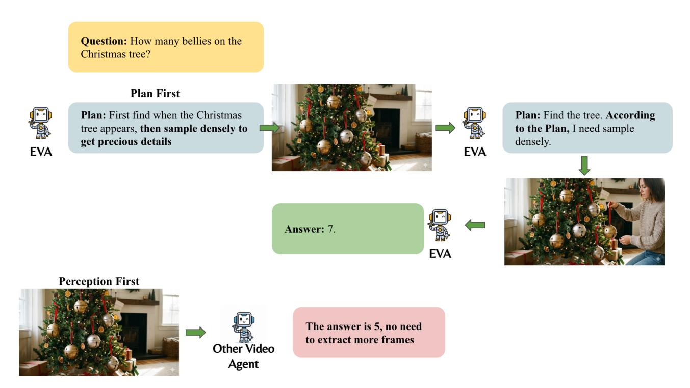
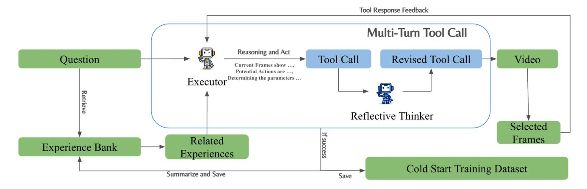

# 6. Appendix

### 6.1. Why plan before perception

The core philosophy that distinguishes EVA from prior video-agent systems is its planning-before-perception paradigm. This new agentic video-understanding framework offers several key advantages.

Avoiding visual misguidance. Under the traditional perception-first paradigm, uniformly sampled frames often

Figure 7. The advantage of plan before perception matters

contain irrelevant or noisy actions that mislead the model during reasoning. In contrast, planning-first allows the agent to construct a textual plan that clarifies its intent before interacting with the video. This plan serves as a guiding prior, steering the agent toward the visual evidence that is truly required by the question and preventing distraction from irrelevant content. As illustrated in Figure [7,](#page-11-0) EVA first formulates a plan that guides its subsequent observation process, enabling it to inspect the video with explicit purpose. Other video agents, however, are forced to rely solely on uniformly sampled frames, which frequently introduce sampling bias. Such bias can distort the agent's perception and lead to incorrect conclusions. Without an explicit plan, even agents equipped with frame-selection tools cannot reliably decide when and how to use them.

Saving visual tokens. For long videos, sampling the entire content at high resolution is prohibitively expensive. In many cases, only a small temporal segment or a lowresolution preview is sufficient for answering the query. Planning-before-perception naturally reduces visual-token usage by enabling the agent to identify which parts of the video matter, thereby improving both efficiency and accuracy.

Active perception rather than passive observation. Traditional perception–reasoning pipelines inherently operate under a passive observation regime, where the model is restricted to whatever frames are provided to it and therefore lacks the ability to control what visual evidence should be acquired. Such passivity fundamentally limits reasoning: when the observation is fixed, the model's understanding is constrained by noise, sampling bias, and irrelevant visual content. In contrast, agentic intelligence requires an active perceptual process in which the system explicitly determines what information is necessary, decides how to obtain it, and selectively interacts with the environment through tool calls to gather targeted visual evidence. The planningbefore-perception paradigm enables precisely this mode of active perception. By formulating an explicit plan prior to observing the video, the agent first establishes a hypothesis about what information is needed for solving the task, and then acquires only the relevant content to verify or refine this hypothesis. This deliberative loop—intention formation followed by targeted perception—allows the agent to transcend passive frame consumption and instead engage in purposeful, goal-driven visual information gathering, which is essential for robust and scalable video understanding.

### 6.2. Data Pipeline Details

We developed a Multi-Agent Data Pipeline to generate a high-quality supervised fine-tuning dataset, as detailed in Figure [8.](#page-12-1) Upon receiving a query, an Executor agent analyzes the current context—consisting of the initial query

Figure 8. Cold Start Data Pipeline

and, in subsequent rounds, relevant video frames—to evaluate potential actions and their expected outcomes. The Executor then optimizes action parameters and determines whether sufficient information exists to submit a final answer. Proposed tool calls are further scrutinized by a Reflective Thinker, which assesses the reasonableness of the parameters. Following this multi-turn loop, successful trajectories are archived in an Experience Bank. These trajectories are retrieved based on query similarity to guide the Executor, thereby enhancing its success rate in future iterations.

### 6.3. EVA Behavior Analysis

### How the EVA attribute its computation in each round.

To understand why the EVA schema surpasses both the baseline approaches and the traditional agentic paradigm, we further analyze the distribution of visual-token usage across rounds, which highlights the autonomous behavior of our agent compared with other methods. We compute the visual-token attribution for EVA and contrast it with the baselines, which allocate all visual tokens in the first round. Figure [9](#page-13-0) illustrates the distributions of frames (nframe × resize), nframes, resize, and time range over different rounds. From these results, we observe that EVA initially explores the video using a large number of frames and a long temporal span. However, in the second round, both nframes and the time range drop sharply, while the resize factor continues to increase, indicating that EVA zooms in to gather more fine-grained information. This progression clearly demonstrates EVA's agentic decision-making capability.

