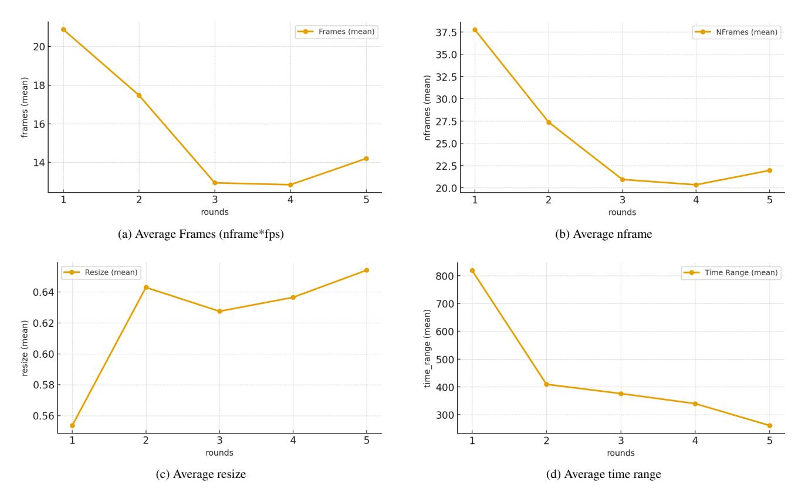
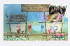
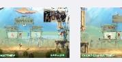
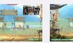
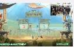
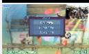
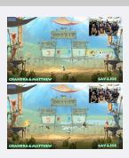
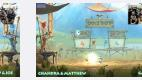
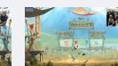
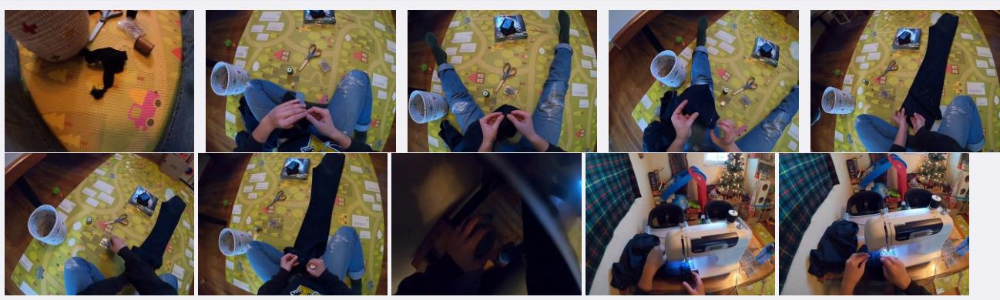

# 6.4. Evaluation on Non-Multi-Choice Benchmark

ELV-Halluc [\[24\]](#page-9-10) is a benchmark designed to evaluate semantic aggregation hallucination (SAH) in multimodal large language models (MLLMs) using in-video and outvideo QA pairs. The SAH ratio is defined as:

$$SAH Ratio = \frac{OutAcc - InAcc}{1 - InAcc}$$

SAH denotes the phenomenon where a model accurately perceives frame-level semantic information but generates hallucinations during the aggregation of this information into event-level semantics. This unique failure mode necessitates that models first achieve precise frame-level visual perception while demonstrating robust temporal localization capabilities—particularly proficiency in understanding temporal sequences of video events.

Table [4](#page-13-1) presents the key experimental results on the ELV-Halluc benchmark. Specifically, our proposed EVA model achieves the highest Overall Accuracy among all compared models and reduces the SAH-ratio from 8.8% to 5% in contrast to Qwen2.5-VL-7B. Such superior performance fully demonstrates the remarkable capability of EVA: on one hand, our agentic tool-call framework provides the model with more visual details during the required time intervals, which effectively enhances the model's frame-level perception ability; on the other hand, the reinforcement learning (RL)-based training paradigm requires the model to accurately locate the timestamps that necessitate tool calls during the training process, thereby consolidating the model's mapping ability between semantics and temporal sequence.

### 6.5. Evaluation Details

We use vLLM to serve EVA. Our frame selection tool extracts frames in jpg format, which are then fed into the next round of processing. All evaluations are conducted using the original video resolution (720p).

For the baselines, we evaluate Qwen2.5-VL with video input. We set min pixels to 1280 × 28 × 28 and max pixels to 16384 × 28 × 28.

<span id="page-13-0"></span>

Figure 9. EVA statistics across rounds.

<span id="page-13-1"></span>

| Models               | LLM size  | Visual Details |      | Object |      |      | Action |      |      | Declarative Content |      |      | Avg Acc↑ | Avg Diff.↓ | SAH Ratio↓ |     |
|----------------------|-----------|----------------|------|--------|------|------|--------|------|------|---------------------|------|------|----------|------------|------------|-----|
|                      |           | In.            | Out. | Diff.  | In.  | Out. | Diff.  | In.  | Out. | Diff.               | In.  | Out. | Diff.    |            |            |     |
| Closed Source Models |           |                |      |        |      |      |        |      |      |                     |      |      |          |            |            |     |
| GPT-4o               | /         | 8.5            | 14.2 | 5.7    | 16.3 | 17.5 | 1.2    | 13   | 15.2 | 2.2                 | 13.3 | 12.2 | -1.1     | 13.7       | 2          | 2.2 |
| Open Source Models   |           |                |      |        |      |      |        |      |      |                     |      |      |          |            |            |     |
| Qwen2.5VL-3B         | 3B        | 2.2            | 10.5 | 8.3    | 7.7  | 13.8 | 6.1    | 5    | 8    | 3                   | 6    | 6    | 0        | 7.4        | 4.3        | 4.5 |
| LLaVA-OV-7b          | 7B        | 4.5            | 16.5 | 12     | 6.75 | 11.5 | 4.75   | 3.5  | 9.5  | 6                   | 6    | 7    | 1        | 8.1        | 5.9        | 6.2 |
| Qwen2.5VL-7b         | 7B        | 10.2           | 26   | 15.8   | 17.5 | 30.7 | 13.2   | 13   | 20.7 | 7.7                 | 16.8 | 10.5 | -6.3     | 18.1       | 7.6        | 8.8 |
| InternVL3-8B         | 7B        | 12.5           | 19.5 | 7.0    | 14.5 | 19.5 | 5.0    | 13.5 | 20.5 | 7.0                 | 12.8 | 17.7 | 4.9      | 16.3       | 5.9        | 6.8 |
| InternVL3-14B        | 14B       | 17.5           | 24.5 | 7.0    | 22.8 | 24.5 | 1.7    | 16.3 | 17.7 | 1.4                 | 15.2 | 15.5 | 0.3      | 19.2       | 2.6        | 3.1 |
| Qwen2.5VL-32B        | 32B       | 16.5           | 24.5 | 8.0    | 21.7 | 24.5 | 2.8    | 17.2 | 15.0 | -2.2                | 15.2 | 7.2  | -8       | 17.7       | 0.1        | 0.2 |
| InternVL3-38B        | 32B       | 25.3           | 29   | 3.7    | 24.2 | 28   | 3.8    | 24   | 30   | 6                   | 24.5 | 24.2 | -0.3     | 26.1       | 3.3        | 4.3 |
|                      | Our Model |                |      |        |      |      |        |      |      |                     |      |      |          |            |            |     |
| EVA                  | 7B        | 21.7           | 27.6 | 5.9    | 24.1 | 25.3 | 1.2    | 27.6 | 32.3 | 4.7                 | 23.2 | 26.5 | 3.3      | 26.2       | 3.8        | 5.0 |

Table 4. Main results on ELV-Halluc. Diff. denotes the gap between in-video and out-video accuracy. All accuracies are shown as percentages.

### 6.6. Prompts

We show the prompts for the reflective thinker in the section, revealing how we construct high-quality training data.

Prompt for the Reflective Thinker Prompt [10](#page-14-0) is the prompt for the reflector.

### 6.7. Case Visualization

Success Case: Multi-turn Grounding and Zoom-In Figure [11](#page-15-0) shows a success case. Given the query and the video length, the EVA carefully ponders several potential actions, including dense sampling, sparse sampling, and keyframe extraction. It then thinks about what new information each action will bring and what they will cost. Finally,

```
You are the REFLECTOR agent that audits the EXECUTOR agent's planning and the current tool plan, and fixes
       mistakes before the tool is executed.
You will be given:
- Video duration and question
- The EXECUTOR's last round (Round N-1) thoughts including Summary/Analysis/Plan and its tool call JSON, with
    computed stats (fps and visual budget)
- The newly proposed tool call for Round N, with computed stats
Your job: decide whether the Round N plan violates any of the following rules. If any rule is violated, output a
    corrected Analysis, Plan, and tool call JSON. Keep the Summary from Round N UNCHANGED (the caller will stitch
     it back). If there is NO issue, think first then output <NO_CHANGE>.
Rules to check:
1) If the global sampling did NOT find information, do NOT randomly select a video segment (e.g., middle part).
    Instead, increase the global sampling density and resolution AGGRESSIVELY: raise resize from ˜0.1 to at least
     0.5; increase nframes by at least 3x, while keeping fps ≤1.
2) If the model want to focus on a specific time range according to the visual information, that is correct and
    just do not change it.
2) If a specific segment was already densely sampled (fps == 1) in Round N-1, do NOT continue dense sampling on
    the same segment next; instead increase global sampling density/resolution to search globally.
3) If the visual budget in a tool call is too small (< 15), increase it to at least 15 by adjusting resize and/or
     nframes.
4) If fps > 1, set fps = 1 by reducing nframes to at most end_time - start_time.
5) If there is no problem, after thinking output <NO_CHANGE> as the only content.
```

Figure 10. Reflector Prompt

it generates an efficient tool-call to get a brief overview of the video. In the second round, the EVA generates a new tool call based on the first-round frames, allocating enough visual budget to the corresponding segment.

Success Case: Direct Dense Sampling Given the query, the EVA autonomously plans and figures out the most efficient way to find the correct answer. Some Video-QA questions do need dense and high-resolution frames, just like what baseline passive MLLMs do. In these cases, the EVA will go back to the traditional unified sampling method and generate the correct answer after the first tool call. Figure [12](#page-16-0) shows an example.

<span id="page-15-0"></span>Use Frame Select Tool to Analyze the video and generate an answer to the question.

Video Length: 397 seconds. Original video resolution: 720p. What triggers the 'GOAAAAAL!!' animation during gameplay?

*To tackle this, I first need to understand what the question is asking: I'm looking for the specific moment that triggers the 'GOAAAAAL!!' animation during gameplay. This means I have to find a frame that clearly shows this animation and identify its cause.*

*Next, I consider all the potential strategies at my disposal. There's dense sampling, sparse sampling, keyframe extraction, and hybrid approaches like the one I'm leaning towards—customized sampling combined with aggressive resizing. Each method has its own set of arguments that I can tweak to suit my needs better.*

*Dense sampling would give me lots of frames across the entire video, which might be useful for spotting the exact moment. However, it could also be overwhelming and computationally expensive. Keyframe extraction aims to cover the essence of the video by focusing on significant frames, but it may not provide enough detail about the gameplay nuances. Sparse sampling might give me an overview of the whole video.*

```
"tool": "frame_select",
"arguments": {
  "start_time": 0, "end_time": 397, "nframes": 10, "resize": 0.1
```














If more information is needed, call the frame selection tool again. Question: What triggers the 'GOAAAAAL!!' animation during gameplay?

*From the low-resolution frames provided, we see various gameplay scenes involving characters and text references like "GOAAAAAL!!". However, the exact trigger for the 'GOAAAAAL!!' animation isn't clear. The scenes with players positioned near goals or scoring actions seem promising leads.*

*To pinpoint the exact moment the 'GOAAAAAL!!' animation occurs, I will select a segment of the video around frames showing scoring attempts or celebratory moments. A closer inspection of the given frames suggests that the frame at [03:24] shows a character near a goal post, potentially just before scoring. Therefore, focusing on the segment around this frame for a higher-resolution analysis makes sense.*

*I'll select a segment from [03:20] to [04:10], capturing 100 frames at a higher resolution (resize=0.4) to get more detail without overloading resources. This should help identify any subtle cues leading up to the 'GOAAAAAL!!' animation.*

```
"tool": "frame_select",
  "start_time": 200, "end_time": 250, "nframes": 100, "resize": 0.4
```









*(... Uniformly sampled 10 frames from 100 frames: indices 0, 10, 20, ..., 90 ...)*

If more information is needed, call the frame selection tool again. Question: What triggers the 'GOAAAAAL!!' animation during gameplay?

*The increased resolution has provided clearer visuals, particularly highlighting the 'GOAAAAAL!!' animations that coincide with successful goals. Observing the frames, the animation appears when a character scores a goal, as indicated by the ball entering the opposing team's goal area. The transition to the celebration scene, including the activation of the 'GOAAAAAL!!' text and confetti, corresponds directly to the ball crossing the goal line.*

*Based on the gameplay analyzed so far, the key triggers for the 'GOAAAAAL!!' animation appear to be:*

*1. The ball reaching the opponent's goal area. 2. The scoring team's character celebrating the goal.*

*Given these observations, no further analysis is necessary since the pattern indicating how the animation is triggered is evident. The frames demonstrate that the animation is directly linked to scoring actions within the game.*

Answer: The 'GOAAAAAL!!' animation is triggered when the ball successfully enters the opponent's goal area, signaling a successful score in the game. The frames show that the celebration and animation activate immediately after the ball crosses the goal line, confirming this as the primary trigger.

<span id="page-16-0"></span>Use Frame Select Tool to Analyze the video and generate an answer to the question.

Video Length: 1218 seconds. Original video resolution: 384p.

What was the process followed by the camera wearer to set up the sewing machine during the holiday-themed Scene 6?

- A: Set up the sewing station, placed tools on the table, connected the machine to power, threaded the needle, and began sewing.
- B: Positioned sewing materials, removed the cover, connected power cables, wound the bobbin, threaded the machine, and powered on.
- C: Cleared the workspace, uncovered the sewing machine, connected necessary cables, adjusted the needle, and wound the bobbin.
- D: Moved to the table, arranged sewing items, uncovered the machine, connected cables, powered on, prepared and threaded the machine.

*To answer the user's question about the process followed by the camera wearer to set up the sewing machine during the holiday-themed Scene 6, I need to analyze the video content. Since the video length is 1218 seconds, I'll start by sampling frames from the entire video to get an overview. This should help me identify the relevant scene and the process described in the options.*

```
"tool": "frame_select",
  "start_time": 0,
  "end_time": 1218,
  "nframes": 60,
  "resize": 0.5
```



*(... Displaying first 10 of 60 frames ...)*

If more information is needed, call the frame selection tool again.

Question: What was the process followed by the camera wearer to set up the sewing machine during the holiday-themed Scene 6?

- A: Set up the sewing station, placed tools on the table, connected the machine to power, threaded the needle, and began sewing.
- B: Positioned sewing materials, removed the cover, connected power cables, wound the bobbin, threaded the machine, and powered on.
- C: Cleared the workspace, uncovered the sewing machine, connected necessary cables, adjusted the needle, and wound the bobbin. D: Moved to the table, arranged sewing items, uncovered the machine, connected cables, powered on, prepared and threaded the machine.

*The video shows the person setting up the sewing machine by connecting cables, removing the cover, and threading the machine. The process aligns with option D.* Answer:

D

Figure 12. Two-Round Case