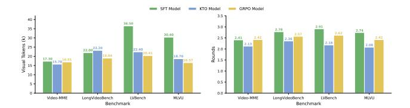
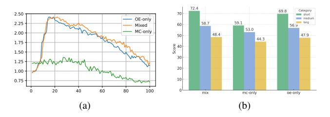

# Zero-Shot Performance on Video Reasoning Bench.

We further evaluate EVA on the Video-Holmes benchmark, which assesses diverse reasoning abilities. As shown in Table [3,](#page-6-1) despite being evaluated in a zero-shot setting, EVA achieves competitive overall performance (32.6%, 32.9% and 36.7% for EVAs), comparable to open-source models such as Video-R1 and VideoChat-R1 with uniformly sampled frame schema. This demonstrates the strong transferability of our reasoning-driven video agent: even without task-specific supervision, EVA can generalize to multi-step reasoning and causal understanding across long temporal contexts. The results highlight that our planning-beforeperception paradigm not only improves efficiency but also enables robust general reasoning in video understanding.

## 4.3. Ablation Study

Training Schema Our ablation study confirms the SFT–KTO–GRPO sequence provides a clear evolutionary path for EVA. As shown in Fig. [4](#page-7-0) and Table [2,](#page-6-0) the SFT

Table 2. Main performance on multiple video understanding benchmark. Baseline results are directly cited from [\[17\]](#page-9-1).The number of frames for EVA, which is indicated by \*, is estimated by assuming 650 visual tokens per frame for fair comparison; the actual number of frames may vary depending on the resolution determined by the model adaptively.

|                       | LongVideoBench |      | MLVU    |      |        | VideoMME-Long/Overall | LVBench |      |  |
|-----------------------|----------------|------|---------|------|--------|-----------------------|---------|------|--|
| Model                 | Frame          | Acc  | Frame   | Acc  | Frame  | Acc                   | Frame   | Acc  |  |
| Close Source Models   |                |      |         |      |        |                       |         |      |  |
| GPT-4o [19]           | 32             | 58.2 | 0.5 fps | 64.6 | 384    | 65.3/71.9             | 60      | 48.9 |  |
| Gemini-1.5-Pro [34]   | 32             | 55.2 | -       | -    | 0.5fps | 67.4/75.0             | 3600    | 33.1 |  |
| Static Frame Sampling |                |      |         |      |        |                       |         |      |  |
| ShareGPT4Video [4]    | 16             | 39.7 | 16      | 46.4 | 16     | 35.0/39.9             | -       | -    |  |
| LongVA [45]           | -              | -    | 256     | 56.3 | 128    | 46.2/52.6             | -       | -    |  |
| VITA-1.5-7B [15]      | -              | -    | -       | -    | 16     | 47.1/56.1             | -       | -    |  |
| Video-R1 [13]         | 32             | 52.7 | 32      | 60.2 | 32     | 49.4/59.9             | 32      | 35.3 |  |
| VideoChat-R1 [22]     | 32             | 49.1 | 32      | 54.3 | 32     | 46.2/-                | 32      | 34.3 |  |
| Qwen2.5-VL [2]        | 32             | 43.2 | 32      | 48.4 | 32     | 44.7/53.6             | 32      | 31.6 |  |
| Adaptive Agent        |                |      |         |      |        |                       |         |      |  |
| VideoAgent [11]       | -              | -    | -       | -    | 87     | 49.0/56.0             | 25.5    | 29.3 |  |
| FrameThinker [17]     | 21.1           | 52.9 | 23.2    | 59.1 | 24.1   | 47.6/-                | 23.9    | 36.6 |  |
| VideoMTR [40]         | -              | -    | -       | -    | 32     | 51.0/59.0             | -       | -    |  |
| Ours                  |                |      |         |      |        |                       |         |      |  |
| EVA-SFT               | 33.8*          | 49.9 | 46.7*   | 52.3 | 26.6*  | 45.8/56.0             | 56.2*   | 26.5 |  |
| EVA-KTO               | 35.6*          | 53.2 | 28.7*   | 57.4 | 24.1*  | 45.1/56.5             | 34.5*   | 36.0 |  |
| EVA-GRPO              | 25.3*          | 55.0 | 22.2*   | 68.3 | 22.8*  | 48.4/60.2             | 26.8*   | 43.3 |  |

Table 3. Zero-shot performance on video reasoning benchmark: Video-Holmes [\[8\]](#page-8-8), where SR stands for Social Reasoning; IMC stands for Intention & Motive Chaining; TCI stands for Temporal Causal Inference; TA Timeline Analysis; MHR stands for Multimodal Hint Reasoning; PAR stands for Physical Anomaly Reasoning; CTI stands for Core Theme Inference.

| Model                 | Frame | SR   | IMC  | TCI  | TA   | MHR  | PAR  | CTI  | Overall |
|-----------------------|-------|------|------|------|------|------|------|------|---------|
| Close Source Models   |       |      |      |      |      |      |      |      |         |
| GPT-4o [19]           | 32    | 50.0 | 49.6 | 38.8 | 30.0 | 44.0 | 39.2 | 37.0 | 42.0    |
| Gemini-2.0-Flash [34] | -     | 41.8 | 33.7 | 23.1 | 20.5 | 30.1 | 26.8 | 33.7 | 30.6    |
| Open Source Model     |       |      |      |      |      |      |      |      |         |
| InternVL2.5-8B [7]    | 32    | 28.0 | 32.2 | 21.5 | 7.7  | 25.7 | 23.8 | 22.6 | 23.8    |
| InternVL3-8B [49]     | 32    | 29.5 | 40.7 | 37.9 | 35.1 | 24.6 | 38.9 | 24.1 | 32.3    |
| Qwen2.5-VL-7B [2]     | 32    | 38.4 | 34.8 | 17.6 | 30.0 | 27.1 | 18.6 | 25.2 | 27.8    |
| SEED-Bench-R1 [6]     | 32    | 42.8 | 35.1 | 25.6 | 40.5 | 29.2 | 29.9 | 32.6 | 33.5    |
| VideoChat-R1 [22]     | 32    | 42.1 | 38.8 | 24.5 | 39.5 | 29.5 | 27.8 | 29.3 | 33.0    |
| Video-R1 [13]         | 32    | 48.6 | 41.7 | 28.9 | 34.5 | 31.0 | 33.6 | 35.6 | 36.5    |
| Ours                  |       |      |      |      |      |      |      |      |         |
| EVA-SFT               | 11.5* | 44.5 | 33.7 | 26.4 | 39.5 | 23.2 | 31.9 | 32.2 | 32.6    |
| EVA-KTO               | 5.8*  | 48.6 | 36.2 | 22.7 | 39.5 | 22.9 | 32.0 | 31.1 | 32.9    |
| EVA-GRPO              | 36.8* | 49.3 | 39.5 | 30.4 | 44.5 | 27.1 | 37.6 | 35.2 | 37.2    |

model consumes a large number of frames and rounds yet achieves the lowest performance, indicating that supervised fine-tuning alone teaches the agent to follow tool-calling formats but not to explore videos efficiently. The KTO model significantly reduces both frame consumption and interaction rounds while delivering a substantial improvement over SFT. Interestingly, the GRPO model further reduces the number of sampled frames compared to KTO, yet in-

creases the number of interaction rounds, and achieves the highest scores across all benchmarks. This reveals a shift in exploration strategy: rather than passively consuming fewer frames in fewer steps, the GRPO-trained agent learns to engage in more deliberate, multi-round reasoning while allocating its visual token budget more precisely in each round. These results illustrate that our training scheme progressively transforms the Video Agent from a format-following

Figure 4. Distribution of Rounds and Visual Token cross Models and Benchmarks

Figure 5. Ablation study on the GRPO training dataset. The comparison between multi-choice (MC) only, open-ended (OE) only, and mixed (MC+OE) data shows that mixed data provides a more effective learning environment for the agent, which leads to better performance on VideoMME.

imitator into a strategic video explorer that actively plans when and where to look.

Data Composition in GRPO Although KTO effectively encourages broader exploration, we observe that the model may still hack the reward by producing plausible but visually unsupported guesses when limited visual evidence is available. To mitigate this issue, we introduce open-ended data during GRPO, forcing the agent to ground its answers in the visual content even when exploring diverse trajectories. As illustrated in Fig. 5, mixing open-ended data with task-specific data leads to more stable training and clearly improved performance, demonstrating that proper data composition is crucial for preventing reward hacking and ensuring visually consistent reasoning.

