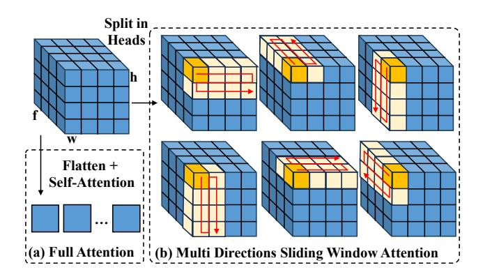
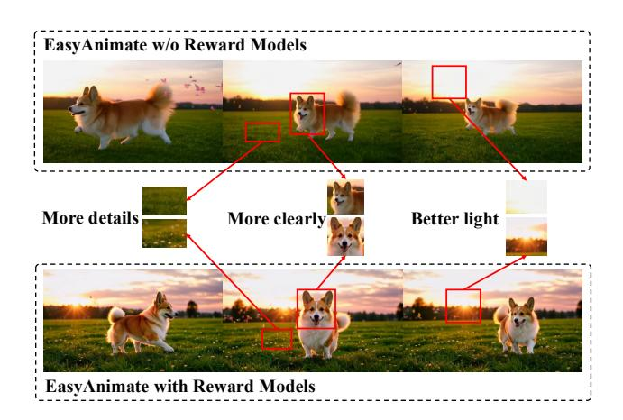
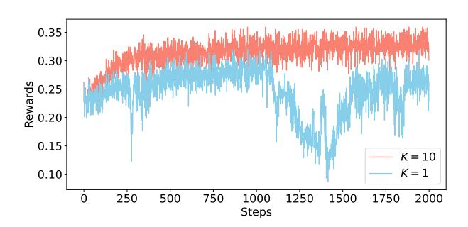
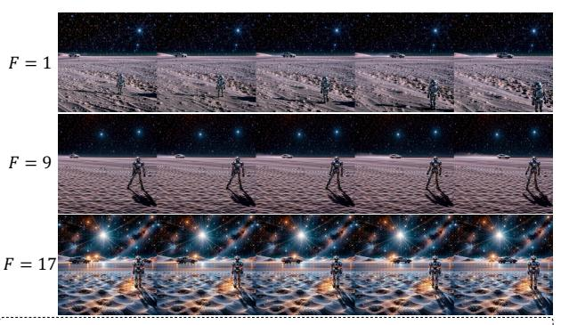

# 3 Architecture

EasyAnimate comprises a text encoder, a diffusion transformer and a video VAE. We first introduce our innovative Hybrid Windows

<span id="page-3-0"></span>

Figure 4: The details of full attention and multidirectional sliding window attention.

Attention, followed by descriptions of the text encoder, diffusion transformer, and video VAE in sequence.

## 3.1 Hybrid Window Attention

Similar to existing diffusion transformer based video generation models, we initially explored 3D full attention. However, as video resolution and frame count increased, the computational cost grew quadratically. For a model containing 12 billion parameters, producing a 1024×1024 video with 49 frames on a single A100 GPU required almost 30 minutes, posing a great challenge for many applications. This underscores the necessity to reduce the model's computational costs. Sliding window attention mechanism has been extensively utilized in large language models to reduce computational complexity [3, 24]. However, applying sliding window attention directly to video generation is inadequate, as existing window attention is single dimension, which fails to account for the 3D locality of video tokens and increases the risk of sudden changes.

### <span id="page-3-1"></span>Algorithm 1 Multidirectional Sliding Window Attention

```
Split Q, K, V into 6 head groups: Qs, Ks, Vs
Initialize sliding\_dirs \leftarrow [fhw, fwh, hfw, hwf, wfh, whf]

for i = 1 to 6 do

Rearrange Qs[i], Ks[i], Vs[i] from fhw to sliding\_dirs[i]
\nend for

Concat Qs, Ks, Vs into Q, K, V

Q, K, V \leftarrow \text{WINDOW\_FLASH\_ATTENTION}(Q, K, V)

Split Q, K, V into 6 head groups: Qs, Ks, Vs

for i = 1 to 6 do

Rearrange Qs[i], Ks[i], Vs[i] from sliding\_dir[i] to fhw
\nend for
```

To address this issue, we propose a multidirectional sliding window attention module that partitions heads into groups, with each group performing sliding window attention in a different direction, as illustrated in Figure 4. Compared to original one-dimensional sliding window attention, our multidirectional design greatly expands the model's 3D receptive field. It also enables efficient computation via standard multi-head attention libraries like FlashAttention [14], as shown in Algorithm 1. Alternative designs like spatial-temporal

<span id="page-3-2"></span>

| Res. | Type   | Train Latency ↓ (s/Iter@1bs) | <b>Test Latency</b> ↓ (s/Iter) |
|------|--------|------------------------------|--------------------------------|
| 768  | Full   | 36.68                        | 11.44                          |
|      | Hybrid | 31.84 <b>(-13.19%)</b>       | 9.28 <b>(-18.89%)</b>          |
| 1024 | Full   | 77.04                        | 28.63                          |
|      | Hybrid | 59.79 <b>(-22.39%)</b>       | 21.32 <b>(-25.53%)</b>         |

Table 1: Speed on A100 GPUs. Hybrid means Hybrid Windows Attention. Full means Full Attention.

decoupled attention [62] require multiple attention passes, while our approach needs only one, leading to higher efficiency. Finally, we interleave 3D full attention with multidirectional sliding window attention, creating the Hybrid Window Attention model. As shown in Table 1, sliding window attention significantly reduces training and inference time, with this benefit becoming increasingly evident as sequence length grows.

#### 3.2 Text Encoder

Existing text encoders such as CLIP and T5 generally suffers from limited text understanding ability, such as missing fine-grained details or misunderstanding complex object relationships. Moreover, the input length of the CLIP model is limited to 77 words, which is far from sufficient. Compared to CLIP and T5, MLLMs such as Qwen2-VL exhibit superior performance on various visual language understanding and reasoning tasks. Unlike text-based models, MLLMs unify textual and visual tokens into a single representation space, which corresponds precisely to the task of video generation from text. We believe this is beneficial for optimizing diffusion models. The Qwen2-VL-7B model is a leading example of MLLMs, achieving top performance among similarly scaled models. Thus, we select Qwen2-VL-7B as our text encoder, which also supports multilingual text inputs as an added benefit.

We extract features from the penultimate hidden layer of Qwen2-VL. The extracted textual features are then concatenated with video tokens into a single sequence to facilitate self-attention computation and further promote the alignment between multi-modal tokens. We notice that textual features often show a much larger L2 norm compared to video features, which start as white noise from a standard normal distribution. This discrepancy in L2 norm distribution leads to instabilities in optimizing diffusion models. To mitigate this issue, we apply RMSNorm [60] to the textual features. The normalized textual features are further transformed by a fully connected layer to reduce the discrepancy with video features.

#### 3.3 Video Diffusion Transformer

The video diffusion architecture is illustrated in Figure 3(a). In the model, we concatenate text and video embeddings for self-attention to promote alignment between visual and semantic information. However, significant disparities exist between the feature spaces of these two modalities, leading to potential discrepancies in the numerical scale of their embeddings. To address this issue, we utilize MMDiT [44] as the foundational component of our model. Specifically, MMDiT incorporates distinct fully connected structures and

feed-forward networks (FFNs) for each modality, thereby enhancing their alignment. Following CogVideoX [58], we use 3D RoPE [46] for positional embeddings by applying 1D RoPE to each spatial dimension and allocating 3/8, 3/8, and 2/8 of the hidden channels, which are then concatenated to form the final 3D RoPE encoding. Initial experiments showed rectified flow loss outperforms DDPM loss, so we adopt it in our experiments.

We also build an inpaint model that reconstructs targeted regions by incorporating reference images and masks, enabling video generation from start and end frames and supporting video editing, as shown in Figure 3(b). Moreover, we train a multifunctional control model using conditions like trajectory, OpenPose, scribble, canny, MLSD, HED, and depth, with details presented in Figure 3(c).

## 3.4 3D Causal VAE

To mitigate the computational complexity stemming from the 3D nature of video data, we use a 3D causal VAE to compress the videos across both spatial and temporal dimensions. Despite its efficiency gains, the VAE itself demands significant computational resources. The causal property of the 3D VAE allows us to cache the previous latent state and connect it with the next frame for processing. We apply spatial and temporal slicing to the VAE, greatly reducing memory use during long, high-resolution video decoding. During VAE training, we sample frames at varying intervals to improve robustness in cross-frame encoding and decoding. Following MovieGen [37], we add a loss term to penalize latent encodings, reducing speckle artifacts during pixel-space video decoding.

### 4 Model Training

The model training is divided into four steps: data preprocessing, VAE training, DiT training, and post-training. We provided a detailed explanation excluding the VAE training.

## 4.1 Data Curation

We collect raw videos from public datasets including Panda-70M [11], InternVid [54], MiraData [25] and Pexels [36], as well as from internal sources. To construct a high-quality video dataset for training, we use a data preprocessing pipeline, shown in Figure 2, consisting of three stages: video splitting, filtering, and captioning.

**Video Splitting**: We detect scene changes with PySceneDetect [40] and split videos into single-shot clips using FFmpeg [18], following Panda-70M [11]. Video clips under 3 seconds are discarded, while those over 10 seconds are recursively split.

We identified some video clips still containing scene transitions: 1. starting with frames from the previous scene; 2. ending with frames from the next scene; 3. fade-ins or fade-outs. To mitigate their impact on temporal consistency, we discarded the beginning and ending frames. Next, we extracted I-frames near scene changes and combined them with the first and last frame to compute semantic consistency using CLIP and DINO [35].

**Video Filtering**: Based on the video clips obtained in the previous stage, we sequentially filter out low-quality data to avoid harming the model, based on three dimensions:

**I. Aesthetic Score**: To filter out video clips with poorly aesthetic and visually unappealing content, we calculate the average aesthetic score of uniformly sampled frames using the SigLIP-based aesthetic

<span id="page-4-0"></span>

| Stage              | Pretrain | Pretrain-HR | Finetune |
|--------------------|----------|-------------|----------|
| Video Clips        | 33.72M   | 25.10M      | 0.47M    |
| <b>Image Clips</b> | 2.87M    | 2.87M       | 0.04M    |
| Video Source       | ALL      | ALL         | HQ       |
| Res. Thr.          | -        | 512         | 720      |
| Motion Thr.        | 0.50     | 0.50        | 2.00     |
| Aesthetic Thr.     | 4.00     | 4.00        | 4.50     |
| Text Thr.          | 0.02     | 0.02        | 0.02     |

Table 2: The dataset after filtering with different constraints. The Thr. means the threshold. The Res. means the resolution. The HQ means high quality videos.

score predictor [1], which outperforms the original LAION CLIP-based prediction model [45] in our evaluation.

**II. Text Score**: To filter out video clips containing excessive text (*e.g.*, subtitles), we apply the text detection model CRAFT [2] to calculate the average text area proportion of uniformly sampled frames as the text score.

**III. Motion Score**: To filter clips with low motion (*e.g.*, static images) or extremely dynamics (*e.g.*, slideshow), we use the Farneback algorithm [17] in OpenCV [34] to compute the average optical flow between frames as the motion score. Additionally, we train a classifier to detect camera shake in video clips, which motion scores often fail to capture.

Given the above three dimensions, we progressively increase the corresponding filtering thresholds along with resolution to obtain datasets for different training stages, as shown in Table 2.

**Video Captioning**: Recent studies [4, 33] highlight the value of dense and short captions in visual generation. We employ InternVL2-40B [12] to generate dense captions for video clips and refine them with LLama-3-70B [15] to remove subjectivity and enhance suitability as training prompts. Additionally, LLama-3-70B summarizes a subset of dense captions into short captions. To address MLLMs' inability to describe camera movements (*e.g.*, tilt, dolly), we trained a specialized classification model and integrated detected movements into video captions. Additionally, we used VideoCLIP-XL-v2 [51] to compute caption-video similarity, ensuring alignment and enhancing prompt-following capability in training datasets.

We curate approximately 34M video-text and 3M image-text pairs for joint image-video training, using aesthetic filtering on JourneyDB [48] and caption annotations from ALLaVa [7].

#### 4.2 DiT Training

Training with Token Length: We design a new video training strategy based on token length. As a key engineering optimization, it allows the model to adapt to different resolutions and frame counts while improving training efficiency. The main factor influencing the training speed of diffusion transformers is sequence length, which is further dictated by the combination of video resolution and video length. As the model is trained on GPU cluster, the workload on different GPUs could be seriously unbalanced under naive settings, as indicated by Figure 5(a). To balance the workload across different GPUs, we selected samples with similar token

<span id="page-5-0"></span>

| d                           |                                                                                                           |
|-----------------------------|-----------------------------------------------------------------------------------------------------------|
| $512 \times 512 \times 49$  |                                                                                                           |
| $576 \times 1024 \times 49$ |                                                                                                           |
| $1344 \times 768 \times 49$ |                                                                                                           |
| Token Length                |                                                                                                           |
| $512 \times 512 \times 49$  |                                                                                                           |
| $576 \times 1024 \times 21$ |                                                                                                           |
| $1344 \times 768 \times 9$  | 1                                                                                                         |
|                             | 512 × 512 × 49<br>576 × 1024 × 49<br>1344 × 768 × 49<br>Token Length<br>512 × 512 × 49<br>576 × 1024 × 21 |

Figure 5: Illustration of Training with Token Length. We train videos with similar token lengths in one step.

<span id="page-5-1"></span>

| Methods            | Origin | TTL                               |
|--------------------|--------|-----------------------------------|
| Tokens/Iter@256bs↑ | 6.17m  | 13.63m <b>(+120.91</b> % <b>)</b> |

Table 3: Comparison of "Origin Method" and "Training with Token Length" (TTL) in terms of the number of tokens trained per iteration (Batch Size: 256, Resolution: 1024×1024, Frame Count: 49).

lengths at each training phase. As shown in Figure 5(b), a 49-frame video at  $512 \times 512$  resolution and a 21-frame video at  $768 \times 768$  resolution have comparable sequence lengths; therefore, they can be jointly trained in the same phase. We measure the efficiency of the training strategies by the total number of tokens trained per iteration. Our method demonstrates an improvement of 120.91% compared to the naive method, as shown in Table 3.

**Progressive Training:** The EasyAnimate follows a multi-stage training process. Following PixArt [10], EasyAnimate adopts a progressive training strategy, moving from lower to higher resolutions. Unlike PixArt, our approach involves the utilization of reward models during the post-training phase. The training stages before post-training are outlined as follows.

I. VAE-adapt: Aligns DiT parameters with VAE using SAM [26] image data.

**II. Pretraining:** Pretraining starts with an initially filtered dataset (**Pretrain** in Table 2), using a token length of  $256 \times 256 \times 49$ . Subsequently, continued pretraining employs a resolution-filtered dataset (**Pretrain-HR** in Table 2) with a token length of  $512 \times 512 \times 49$ .

**III. Finetune**: Finetuning model's image-to-video capabilities by a finely filtered dataset (Finetune in Table 2), initially with a token length of  $512 \times 512 \times 49$ , followed by a token length of  $1024 \times 1024 \times 49$ .

### 4.3 Post Training with Reward Backpropagation

After pretraining on large scaled text-video paired datasets, the model could generate videos according to textual prompts. Nevertheless, the generated videos might fall short of human performance due to the vast expressive space inherent in videos. A close examination of the initial generation results show that certain detailed textual descriptions are overlooked, and some of the videos could not achieve the aesthetic level of cinematic quality. To further enhance the quality of generated videos, we adopt reward backpropagation [13, 39] with LoRA [22] to fine-tune the DiT model for better alignment with human preferences. Given a differentiable reward

model R [1, 55, 61], reward backpropagation aims to optimize the DiT parameters  $\theta$  so that videos generated by the sampling process maximize empirical reward. The objective can be formulated as:

$$L(\theta) = -\frac{1}{|\mathcal{P}|} \sum_{\mathbf{c} \in \mathcal{P}} R(\text{sample}(\theta, \mathbf{c}, \mathbf{x}_T), \mathbf{c})$$
 (1)

where sample  $(\theta, \mathbf{c}, \mathbf{x}_T), \mathbf{c})$  refers to the sampling process from time  $t = T \to 0$  with condition  $\mathbf{c}, \mathcal{P}$  refers to the prompt training dataset.

In fact, not all denoising steps in the sampling chain require backpropagation. To save GPU memory and reduce computation, previous works [13, 39] only optimize the last step (*i.e.*,  $K \to 0$ , where K = 1), while the beginning  $T \to K$  steps are detached from the computation graph. However, we find optimizing only the last step in EasyAnimate is far from sufficient: the convergence speed is slow and not stable. A detailed analysis of the training process reveals that the gradient norm is considerably smaller when employing a rectified flow-based probability path compared to a DDPM-based probability path. Detailed comparisons of K are shown in Section 5.2. As EasyAnimate utilizes flow-matching sampling in both training and inference, we set K = 10 in EasyAnimate.

Besides, VADER calculates the reward on multiple uniformly sampled frames with an image-based reward model. However, we found that calculating rewards across multiple frames not only consumes more GPU memory but also impairs the dynamics and generalization of the generated videos. Detailed results are shown in Section 5.2. Thus, we set F = 1 in EasyAnimate.

#### 5 Experiment

#### 5.1 Evaluation

Automated Evaluation: To comprehensively evaluate the performance of text-to-video generation models, we employ a series of metrics on the VBench [23]. We primarily focus on the Total Score, Quality Score, and Semantic Score. The Total Score is the overall score from VBench, the Quality Score emphasizes visual quality, and the Semantic Score focuses on semantic information. We compare the performance of EasyAnimate with other models in Table 4. EasyAnimate achieves the best performance across multiple metrics and demonstrates competitive results. Particularly in the aesthetic metrics, guided by human preference models, EasyAnimate's generated results exhibit excellent aesthetic quality. These findings show that EasyAnimate excels in both video generation quality and prompt semantics interpretation, accurately capturing object relationships.

**Human Evaluation**: Besides automatic evaluation with VBench, we conduct a comparative analysis involving human evaluations on HunyuanVideo [27], CogVideoX, and EasyAnimate. We randomly selected 100 prompts from T2V-CompBench [47], which cover various aspects, was provided to human evaluators. To ensure unbiased assessments, the videos were shuffled for a process of blind evaluation. The quality of the generated videos was evaluated based on three key criteria: perceptual quality, text-video consistency, and adherence to physical laws. As shown in Table 5, the results demonstrate that EasyAnimate achieved the highest preference from human evaluators across all categories.

<span id="page-6-0"></span>

| Models             | Total<br>Score | Quality<br>Score | Semantic<br>Score | Aesthetic<br>Quality | Subject<br>Consistency | Spatial<br>Relationship | Object<br>Class | Scene |
|--------------------|----------------|------------------|-------------------|----------------------|------------------------|-------------------------|-----------------|-------|
| AnimateDiff-V2     | 80.27          | 82.90            | 69.75             | 67.16                | 95.30                  | 34.60                   | 90.90           | 50.19 |
| VideoCrafter-2.0   | 80.44          | 82.20            | 73.42             | 63.13                | 96.85                  | 34.60                   | 92.55           | 42.44 |
| OpenSora V1.2      | 79.76          | 81.35            | 73.39             | 56.85                | 96.75                  | 68.56                   | 82.22           | 50.19 |
| OpenSoraPlan V1.3  | 77.23          | 80.14            | 65.62             | 60.42                | 97.79                  | 51.61                   | 85.56           | 36.73 |
| CogVideoX1.5-5B    | 82.17          | 82.78            | 79.76             | 62.79                | 96.87                  | 80.25                   | 87.47           | 52.91 |
| CogVideoX-5B       | 81.61          | 82.75            | 77.04             | 61.98                | 96.23                  | 66.35                   | 85.23           | 53.20 |
| HunyuanVideo       | 83.24          | 85.09            | 75.82             | 60.36                | 97.37                  | 68.68                   | 86.10           | 53.88 |
| Jimeng ‡           | 81.97          | 83.29            | 76.69             | 68.80                | 97.25                  | 77.45                   | 89.62           | 44.94 |
| Vidu ‡             | 81.89          | 83.85            | 74.04             | 60.87                | 94.63                  | 66.18                   | 88.43           | 46.07 |
| Gen-3 ‡            | 82.32          | 84.11            | 75.17             | 63.34                | 97.10                  | 65.09                   | 87.81           | 54.57 |
| MiniMax-01 ‡       | 83.41          | 84.85            | 77.65             | 63.03                | 97.51                  | 75.50                   | 87.83           | 50.68 |
| Sora ‡             | 84.28          | 85.51            | 79.35             | 63.46                | 96.23                  | 74.29                   | 93.93           | 56.95 |
| EasyAnimate        | 83.42          | 85.03            | 77.01             | 69.48                | 98.00                  | 76.11                   | 89.57           | 54.31 |
| EasyAnimate-Hybrid | 83.27          | 84.70            | 77.54             | 70.64                | 97.76                  | 77.32                   | 92.24           | 56.10 |

Table 4: Comparison of EasyAnimate with SOTA models on VBench [\[23\]](#page-8-40) (up to the submitted time of EasyAnimate, .., 2025-01-22.). EasyAnimate-Hybrid refers to EasyAnimate with Hybrid Windows Attention. ‡ indicates a closed-source model.

<span id="page-6-1"></span>

| Models       | Quality | Semantic | Physics |
|--------------|---------|----------|---------|
| CogVideoX    | 17.08%  | 18.63%   | 21.73%  |
| HunyuanVideo | 32.61%  | 37.28%   | 33.24%  |
| EasyAnimate  | 50.31%  | 44.09%   | 45.03%  |

Table 5: Win rates of different models and different aspects in human evaluation.

<span id="page-6-2"></span>

| Text Encoders | Total  | Quality | Semantic |
|---------------|--------|---------|----------|
| T5 + CLIP     | 80.42% | 82.56%  | 71.85%   |
| Qwen2 VL      | 81.57% | 83.52%  | 73.76%   |

Table 6: The impact of text encoders by scores in VBench.

<span id="page-6-3"></span>

| Positions   | N/A   | Shallow | Middle | Deep  |
|-------------|-------|---------|--------|-------|
| FVD Score ↓ | 364.9 | 459.7   | 352.3  | 353.6 |

Table 7: The impact of different positions of multidirectional sliding window attention in EasyAnimate.

<span id="page-6-4"></span>

| Window Size     | H*W/8 | H*W/2 | H*W   | H*W*2 |
|-----------------|-------|-------|-------|-------|
| FVD Score ↓     | 557.0 | 385.5 | 352.3 | 348.3 |
| Time (s/Iter) ↓ | 19.81 | 20.43 | 21.32 | 22.73 |

Table 8: The impact of different windows sizes. H means height of the feature. W means width of the feature.

## 5.2 Ablation Study

Ablation of different text encoders: In this section, we analyze the impact of different text encoders on performance, as shown in Table [6.](#page-6-2) We first implement a dual encoder combining CLIP and T5, following SD3 [\[16\]](#page-8-41). However, CLIP limits text to 77 tokens, and T5's ability to understand nuanced text is suboptimal. To address this, we adopt Qwen2-VL as the text encoder. VBench results show that Qwen2-VL significantly improves overall performance.

Ablation of Hybrid Windows Attention: In this study, we conduct ablation studies across three key dimensions: (1) the position of window attention within the network, (2) the window size, and (3) the number of directions. We selected 1,000 videos from the WebVid validation set to calculate the FVD score. We first apply multidirectional sliding window attention in shallow (1-24), middle (12-36), and deep (24-48) layers. Table [7](#page-6-3) shows that using it in middle layers hurts performance the least. We hypothesize that not all layers require global information. Using window attention in

middle layers allows the model to inherit global context from earlier full-attention layers and maintain stability via later ones. The Table [8](#page-6-4) shows that decreasing the window size worsens FVD without notable speed gains, while increasing it offers no substantial FVD boost. The current setting balances speed and quality. In addition, we tested window attention with 1, 3, and 6 directions, with 6-directional performing best at an FVD score of 352.3, compared to 373.6 for 3-directional and 408.1 for 1-directional.

Ablation of different reward models: In this study, we explore reward backpropagation to optimize generated videos for better alignment with human preferences. We first explore the impact of distinct reward models, specifically the SigLIP-based aesthetic score predictor [\[1\]](#page-8-29), MPS [\[61\]](#page-9-18) and HPSv2.1 [\[55\]](#page-9-17), on the model's performance. Our results show that both MPS and HPSv2.1 significantly improve the VBench composite score of generated videos. We observe further improvements in both quality and semantic scores. In further experiments, we explore the performance of integrating different reward models. The integration of HPSv2.1 with MPS yields the optimal performance. Figure [6](#page-7-1) compares EasyAnimate

<span id="page-7-1"></span>

Figure 6: Comparison of evaluation results between EasyAnimate with and without reward models.

<span id="page-7-0"></span>

| Reward models     | Total  | Quality | Semantic |
|-------------------|--------|---------|----------|
| N/A               | 81.57% | 83.52%  | 73.76%   |
| Aesthetic         | 81.72% | 83.60%  | 74.19%   |
| MPS               | 82.36% | 84.07%  | 75.52%   |
| HPSv2             | 83.26% | 84.87%  | 76.79%   |
| HPSv2 + Aesthetic | 83.24% | 84.91%  | 76.55%   |
| HPSv2 + MPS       | 83.42% | 85.03%  | 77.01%   |

Table 9: We explore the impact of different reward models by scores in VBench. The Total means Total Score. The Quality means Quality Score. The Semantic means Semantic Score.

outputs with and without reward feedback, using the same prompt. The reward-optimized model produces clearer, more textured visuals and richer details in the generated results. In conclusion, the improved model better aligns with human preferences.

**Ablation of Backpropagation Steps** K: We conduct an ablation study on the selection of K in EasyAnimate with the HPSv2.1 reward model. As shown in Figure 7, it can be seen that performing reward backpropagation only at the final step of the denoising process is not sufficiently stable, as evidenced by the sudden drop in training rewards. This may be due to the gradient norm being much smaller for K=1 compared to K=10.

**Ablation of Decoding Frames** F: We conduct an ablation study on the selection of F in EasyAnimate with the HPSv2.1 reward model. It can be seen that extracting multiple frames for reward backpropagation impairs the dynamics of the robot movement in Figure 8. Furthermore, when F is too large (e.g., F=17), the training process is more prone to reward hacking, which can be observed by artifacts in the video background from Figure 8. We speculate that this is due to the use of an image-based reward model, where extracting multiple frames may lead to conflict optimization directions between frames. Thus, setting F=1 is sufficient to ensure training convergence and generalization in video generation with the 3D Causal VAE, which can refer to the first frame to decode the remaining video frames.

<span id="page-7-2"></span>

Figure 7: The impact of reward backpropagation steps *K*.

<span id="page-7-3"></span>

Text Prompt: On the desolate lunar landscape, a sleek silver robot strides purposefully from left to right, its metallic feet leaving faint imprints on the powdery grey surface. In the distant background, a futuristic car drives smoothly left to right, casting a slim shadow on the moon's surface.

Figure 8: The impact of reward decoding frames F.

## 6 Limitations

EasyAnimate has limitations in color accuracy and dynamic degree, likely due to dataset processing issues. For example, the model may generate a green apple and a green cup when asked for a green apple and a yellow cup, significantly affecting visual fidelity. Additionally, it currently only supports generating videos up to 5 seconds long, limiting its applicability for longer-duration tasks.

#### 7 Conclusion

In this paper, we present EasyAnimate, a versatile video generation framework leveraging transformer-based architecture to produce coherent videos. To address the computational demands of long video sequences, we introduce Hybrid Windows Attention, based on a multidirectional sliding window module, which reduces complexity while improving temporal and spatial dependency modeling. To boost video generation performance and improve alignment with human preferences, we refine EasyAnimate using reward models. Additionally, we propose a training strategy to improve efficiency when training videos of varying resolutions and frame counts. To further improve text understanding, we adopt MLLMs as the text encoder, which also enables multilingual support. Experiments show SOTA performance on the video evaluation leaderboard, highlighting EasyAnimate's advancements in video generation.

## References

- <span id="page-8-29"></span>[1] Aesthetic Predictor V2.5 Developers. [n. d.]. Aesthetic predictor v2.5. [https:](https://github.com/discus0434/aesthetic-predictor-v2-5) [//github.com/discus0434/aesthetic-predictor-v2-5.](https://github.com/discus0434/aesthetic-predictor-v2-5)
- <span id="page-8-30"></span>[2] Youngmin Baek, Bado Lee, Dongyoon Han, Sangdoo Yun, and Hwalsuk Lee. 2019. Character region awareness for text detection. In Proceedings of the IEEE/CVF conference on computer vision and pattern recognition. 9365–9374.
- <span id="page-8-10"></span>[3] Iz Beltagy, Matthew E Peters, and Arman Cohan. 2020. Longformer: The longdocument transformer. arXiv preprint arXiv:2004.05150 (2020).
- <span id="page-8-33"></span>[4] James Betker, Gabriel Goh, Li Jing, Tim Brooks, Jianfeng Wang, Linjie Li, Long Ouyang, Juntang Zhuang, Joyce Lee, Yufei Guo, et al. 2023. Improving image generation with better captions. Computer Science. https://cdn. openai. com/papers/dall-e-3. pdf 2, 3 (2023), 8.
- <span id="page-8-14"></span>[5] Kevin Black, Michael Janner, Yilun Du, Ilya Kostrikov, and Sergey Levine. 2023. Training Diffusion Models with Reinforcement Learning. In The Twelfth International Conference on Learning Representations.
- <span id="page-8-19"></span>[6] Andreas Blattmann, Tim Dockhorn, Sumith Kulal, Daniel Mendelevitch, Maciej Kilian, Dominik Lorenz, Yam Levi, Zion English, Vikram Voleti, Adam Letts, et al. 2023. Stable video diffusion: Scaling latent video diffusion models to large datasets. arXiv preprint arXiv:2311.15127 (2023).
- <span id="page-8-36"></span>[7] Guiming Hardy Chen, Shunian Chen, Ruifei Zhang, Junying Chen, Xiangbo Wu, Zhiyi Zhang, Zhihong Chen, Jianquan Li, Xiang Wan, and Benyou Wang. 2024. Allava: Harnessing gpt4v-synthesized data for lite vision-language models. arXiv preprint arXiv:2402.11684 (2024).
- <span id="page-8-0"></span>[8] Haoxin Chen, Menghan Xia, Yingqing He, Yong Zhang, Xiaodong Cun, Shaoshu Yang, Jinbo Xing, Yaofang Liu, Qifeng Chen, Xintao Wang, et al. 2023. Videocrafter1: Open diffusion models for high-quality video generation. arXiv preprint arXiv:2310.19512 (2023).
- <span id="page-8-1"></span>[9] Haoxin Chen, Yong Zhang, Xiaodong Cun, Menghan Xia, Xintao Wang, Chao Weng, and Ying Shan. 2024. Videocrafter2: Overcoming data limitations for high-quality video diffusion models. In Proceedings of the IEEE/CVF Conference on Computer Vision and Pattern Recognition. 7310–7320.
- <span id="page-8-37"></span>[10] Junsong Chen, Jincheng Yu, Chongjian Ge, Lewei Yao, Enze Xie, Yue Wu, Zhongdao Wang, James Kwok, Ping Luo, Huchuan Lu, and Zhenguo Li. 2023. PixArt-: Fast Training of Diffusion Transformer for Photorealistic Text-to-Image Synthesis. arXiv[:2310.00426](https://arxiv.org/abs/2310.00426) [cs.CV]
- <span id="page-8-23"></span>[11] Tsai-Shien Chen, Aliaksandr Siarohin, Willi Menapace, Ekaterina Deyneka, Hsiang-wei Chao, Byung Eun Jeon, Yuwei Fang, Hsin-Ying Lee, Jian Ren, Ming-Hsuan Yang, et al. 2024. Panda-70m: Captioning 70m videos with multiple cross-modality teachers. In Proceedings of the IEEE/CVF Conference on Computer Vision and Pattern Recognition. 13320–13331.
- <span id="page-8-34"></span>[12] Zhe Chen, Jiannan Wu, Wenhai Wang, Weijie Su, Guo Chen, Sen Xing, Muyan Zhong, Qinglong Zhang, Xizhou Zhu, Lewei Lu, et al. 2024. Internvl: Scaling up vision foundation models and aligning for generic visual-linguistic tasks. In Proceedings of the IEEE/CVF Conference on Computer Vision and Pattern Recognition. 24185–24198.
- <span id="page-8-16"></span>[13] Kevin Clark, Paul Vicol, Kevin Swersky, and David J Fleet. 2024. Directly Fine-Tuning Diffusion Models on Differentiable Rewards. In The Twelfth International Conference on Learning Representations.
- <span id="page-8-22"></span>[14] Tri Dao, Dan Fu, Stefano Ermon, Atri Rudra, and Christopher Ré. 2022. Flashattention: Fast and memory-efficient exact attention with io-awareness. Advances in neural information processing systems 35 (2022), 16344–16359.
- <span id="page-8-35"></span>[15] Abhimanyu Dubey, Abhinav Jauhri, Abhinav Pandey, Abhishek Kadian, Ahmad Al-Dahle, Aiesha Letman, Akhil Mathur, Alan Schelten, Amy Yang, Angela Fan, et al. 2024. The llama 3 herd of models. arXiv preprint arXiv:2407.21783 (2024).
- <span id="page-8-41"></span>[16] Patrick Esser, Sumith Kulal, Andreas Blattmann, Rahim Entezari, Jonas Müller, Harry Saini, Yam Levi, Dominik Lorenz, Axel Sauer, Frederic Boesel, et al. 2024. Scaling rectified flow transformers for high-resolution image synthesis. In Fortyfirst international conference on machine learning.
- <span id="page-8-31"></span>[17] Gunnar Farnebäck. 2003. Two-frame motion estimation based on polynomial expansion. In Image Analysis: 13th Scandinavian Conference, SCIA 2003 Halmstad, Sweden, June 29–July 2, 2003 Proceedings 13. Springer, 363–370.
- <span id="page-8-27"></span>[18] FFmpeg Developers. [n. d.]. FFmpeg. [https://github.com/FFmpeg/FFmpeg.](https://github.com/FFmpeg/FFmpeg)
- <span id="page-8-2"></span>[19] Yuwei Guo, Ceyuan Yang, Anyi Rao, Zhengyang Liang, Yaohui Wang, Yu Qiao, Maneesh Agrawala, Dahua Lin, and Bo Dai. 2024. AnimateDiff: Animate Your Personalized Text-to-Image Diffusion Models without Specific Tuning. In The Twelfth International Conference on Learning Representations.
- <span id="page-8-4"></span>[20] Yoav HaCohen, Nisan Chiprut, Benny Brazowski, Daniel Shalem, Dudu Moshe, Eitan Richardson, Eran Levin, Guy Shiran, Nir Zabari, Ori Gordon, et al. 2025. Ltx-video: Realtime video latent diffusion. arXiv preprint arXiv:2501.00103 (2025).
- <span id="page-8-20"></span>[21] Jonathan Ho, Ajay Jain, and Pieter Abbeel. 2020. Denoising diffusion probabilistic models. Advances in neural information processing systems 33 (2020), 6840–6851.
- <span id="page-8-39"></span>[22] Edward J Hu, Phillip Wallis, Zeyuan Allen-Zhu, Yuanzhi Li, Shean Wang, Lu Wang, Weizhu Chen, et al. 2022. Lora: Low-rank adaptation of large language models.. In International Conference on Learning Representations.
- <span id="page-8-40"></span>[23] Ziqi Huang, Yinan He, Jiashuo Yu, Fan Zhang, Chenyang Si, Yuming Jiang, Yuanhan Zhang, Tianxing Wu, Qingyang Jin, Nattapol Chanpaisit, et al. 2024. Vbench: Comprehensive benchmark suite for video generative models. In Proceedings

- of the IEEE/CVF Conference on Computer Vision and Pattern Recognition. 21807– 21818.
- <span id="page-8-11"></span>[24] Albert Q. Jiang, Alexandre Sablayrolles, Arthur Mensch, Chris Bamford, Devendra Singh Chaplot, Diego de las Casas, Florian Bressand, Gianna Lengyel, Guillaume Lample, Lucile Saulnier, Lélio Renard Lavaud, Marie-Anne Lachaux, Pierre Stock, Teven Le Scao, Thibaut Lavril, Thomas Wang, Timothée Lacroix, and William El Sayed. 2023. Mistral 7B. arXiv preprint arXiv:2310.06825 (2023).
- <span id="page-8-24"></span>[25] Xuan Ju, Yiming Gao, Zhaoyang Zhang, Ziyang Yuan, Xintao Wang, Ailing Zeng, Yu Xiong, Qiang Xu, and Ying Shan. 2024. Miradata: A large-scale video dataset with long durations and structured captions. Advances in Neural Information Processing Systems 37 (2024), 48955–48970.
- <span id="page-8-38"></span>[26] Alexander Kirillov, Eric Mintun, Nikhila Ravi, Hanzi Mao, Chloe Rolland, Laura Gustafson, Tete Xiao, Spencer Whitehead, Alexander C Berg, Wan-Yen Lo, et al. 2023. Segment anything. In Proceedings of the IEEE/CVF international conference on computer vision. 4015–4026.
- <span id="page-8-5"></span>[27] Weijie Kong, Qi Tian, Zijian Zhang, Rox Min, Zuozhuo Dai, Jin Zhou, Jiangfeng Xiong, Xin Li, Bo Wu, Jianwei Zhang, et al. 2024. Hunyuanvideo: A systematic framework for large video generative models. arXiv preprint arXiv:2412.03603 (2024).
- <span id="page-8-6"></span>[28] Bin Lin, Yunyang Ge, Xinhua Cheng, Zongjian Li, Bin Zhu, Shaodong Wang, Xianyi He, Yang Ye, Shenghai Yuan, Liuhan Chen, et al. 2024. Open-sora plan: Open-source large video generation model. arXiv preprint arXiv:2412.00131 (2024).
- <span id="page-8-15"></span>[29] Runtao Liu, Haoyu Wu, Zheng Ziqiang, Chen Wei, Yingqing He, Renjie Pi, and Qifeng Chen. 2024. Videodpo: Omni-preference alignment for video diffusion generation. arXiv preprint arXiv:2412.14167 (2024).
- <span id="page-8-21"></span>[30] Xingchao Liu, Chengyue Gong, and qiang liu. 2023. Flow Straight and Fast: Learning to Generate and Transfer Data with Rectified Flow. In The Eleventh International Conference on Learning Representations.
- <span id="page-8-3"></span>[31] Zhengxiong Luo, Dayou Chen, Yingya Zhang, Yan Huang, Liang Wang, Yujun Shen, Deli Zhao, Jingren Zhou, and Tieniu Tan. 2023. VideoFusion: Decomposed Diffusion Models for High-Quality Video Generation. In Proceedings of the IEEE/CVF Conference on Computer Vision and Pattern Recognition.
- <span id="page-8-7"></span>[32] Xin Ma, Yaohui Wang, Xinyuan Chen, Gengyun Jia, Ziwei Liu, Yuan-Fang Li, Cunjian Chen, and Yu Qiao. 2025. Latte: Latent Diffusion Transformer for Video Generation. Transactions on Machine Learning Research (2025).
- <span id="page-8-8"></span>[33] OpenAI. 2024. Video Generation Models as World Simulators. [https://openai.](https://openai.com/index/video-generation-models-as-world-simulators/) [com/index/video-generation-models-as-world-simulators/.](https://openai.com/index/video-generation-models-as-world-simulators/)
- <span id="page-8-32"></span>[34] OpenCV Developers. [n. d.]. OpenCV. [https://github.com/opencv/opencv.](https://github.com/opencv/opencv)
- <span id="page-8-28"></span>[35] Maxime Oquab, Timothée Darcet, Théo Moutakanni, Huy Vo, Marc Szafraniec, Vasil Khalidov, Pierre Fernandez, Daniel Haziza, Francisco Massa, Alaaeldin El-Nouby, et al. 2024. DINOv2: Learning Robust Visual Features without Supervision. Transactions on Machine Learning Research Journal (2024), 1–31.
- <span id="page-8-25"></span>[36] Pexels. [n. d.]. Pexels.<https://www.pexels.com/>
- <span id="page-8-9"></span>[37] Adam Polyak, Amit Zohar, Andrew Brown, Andros Tjandra, Animesh Sinha, Ann Lee, Apoorv Vyas, Bowen Shi, Chih-Yao Ma, Ching-Yao Chuang, David Yan, Dhruv Choudhary, Dingkang Wang, Geet Sethi, Guan Pang, Haoyu Ma, Ishan Misra, Ji Hou, Jialiang Wang, Kiran Jagadeesh, Kunpeng Li, Luxin Zhang, Mannat Singh, Mary Williamson, Matt Le, Matthew Yu, Mitesh Kumar Singh, Peizhao Zhang, Peter Vajda, Quentin Duval, Rohit Girdhar, Roshan Sumbaly, Sai Saketh Rambhatla, Sam Tsai, Samaneh Azadi, Samyak Datta, Sanyuan Chen, Sean Bell, Sharadh Ramaswamy, Shelly Sheynin, Siddharth Bhattacharya, Simran Motwani, Tao Xu, Tianhe Li, Tingbo Hou, Wei-Ning Hsu, Xi Yin, Xiaoliang Dai, Yaniv Taigman, Yaqiao Luo, Yen-Cheng Liu, Yi-Chiao Wu, Yue Zhao, Yuval Kirstain, Zecheng He, Zijian He, Albert Pumarola, Ali Thabet, Artsiom Sanakoyeu, Arun Mallya, Baishan Guo, Boris Araya, Breena Kerr, Carleigh Wood, Ce Liu, Cen Peng, Dimitry Vengertsev, Edgar Schonfeld, Elliot Blanchard, Felix Juefei-Xu, Fraylie Nord, Jeff Liang, John Hoffman, Jonas Kohler, Kaolin Fire, Karthik Sivakumar, Lawrence Chen, Licheng Yu, Luya Gao, Markos Georgopoulos, Rashel Moritz, Sara K. Sampson, Shikai Li, Simone Parmeggiani, Steve Fine, Tara Fowler, Vladan Petrovic, and Yuming Du. 2024. Movie Gen: A Cast of Media Foundation Models. arXiv preprint arXiv: 2410.13720 (2024).
- <span id="page-8-17"></span>[38] Mihir Prabhudesai, Anirudh Goyal, Deepak Pathak, and Katerina Fragkiadaki. 2023. Aligning text-to-image diffusion models with reward backpropagation. arXiv preprint arXiv:2310.03739 (2023).
- <span id="page-8-18"></span>[39] Mihir Prabhudesai, Russell Mendonca, Zheyang Qin, Katerina Fragkiadaki, and Deepak Pathak. 2024. Video diffusion alignment via reward gradients. arXiv preprint arXiv:2407.08737 (2024).
- <span id="page-8-26"></span>[40] PySceneDetect Developers. [n. d.]. PySceneDetect. [https://github.com/](https://github.com/Breakthrough/PySceneDetect) [Breakthrough/PySceneDetect.](https://github.com/Breakthrough/PySceneDetect)
- <span id="page-8-12"></span>[41] Alec Radford, Jong Wook Kim, Chris Hallacy, Aditya Ramesh, Gabriel Goh, Sandhini Agarwal, Girish Sastry, Amanda Askell, Pamela Mishkin, Jack Clark, et al. 2021. Learning transferable visual models from natural language supervision. In International Conference on Machine Learning. 8748–8763.
- <span id="page-8-13"></span>[42] Colin Raffel, Noam Shazeer, Adam Roberts, Katherine Lee, Sharan Narang, Michael Matena, Yanqi Zhou, Wei Li, and Peter J. Liu. 2020. Exploring the Limits of Transfer Learning with a Unified Text-to-Text Transformer. Journal of Machine Learning Research 21, 140 (2020), 1–67.

- <span id="page-9-0"></span>[43] Robin Rombach, Andreas Blattmann, Dominik Lorenz, Patrick Esser, and Björn Ommer. 2022. High-resolution image synthesis with latent diffusion models. In Proceedings of the IEEE/CVF conference on computer vision and pattern recognition. 10684–10695.
- <span id="page-9-11"></span>[44] Axel Sauer, Frederic Boesel, Tim Dockhorn, Andreas Blattmann, Patrick Esser, and Robin Rombach. 2024. Fast high-resolution image synthesis with latent adversarial diffusion distillation. In SIGGRAPH Asia 2024 Conference Papers. 1– 11.
- <span id="page-9-14"></span>[45] Christoph Schuhmann, Romain Beaumont, Richard Vencu, Cade Gordon, Ross Wightman, Mehdi Cherti, Theo Coombes, Aarush Katta, Clayton Mullis, Mitchell Wortsman, et al. 2022. Laion-5b: An open large-scale dataset for training next generation image-text models. Advances in neural information processing systems 35 (2022), 25278–25294.
- <span id="page-9-12"></span>[46] J Su, H Zhang, X Li, J Zhang, and Y RoFormer Li. 2021. Enhanced transformer with rotary position embedding. In Proceedings of the 59th Annual Meeting of the Association for Computational Linguistics and the 11th International Joint Conference on Natural Language Processing (ACL-IJCNLP), Association for Computational Linguistics, Online. 1–6.
- <span id="page-9-19"></span>[47] Kaiyue Sun, Kaiyi Huang, Xian Liu, Yue Wu, Zihan Xu, Zhenguo Li, and Xihui Liu. 2025. T2v-compbench: A comprehensive benchmark for compositional text-to-video generation. In Proceedings of the IEEE/CVF Conference on Computer Vision and Pattern Recognition. 8406–8416.
- <span id="page-9-16"></span>[48] Keqiang Sun, Junting Pan, Yuying Ge, Hao Li, Haodong Duan, Xiaoshi Wu, Renrui Zhang, Aojun Zhou, Zipeng Qin, Yi Wang, et al. 2023. JourneyDB: a benchmark for generative image understanding. In Proceedings of the 37th International Conference on Neural Information Processing Systems. 49659–49678.
- <span id="page-9-5"></span>[49] Genmo Team. 2024. Mochi 1. [https://github.com/genmoai/models.](https://github.com/genmoai/models)
- <span id="page-9-4"></span>[50] Ashish Vaswani, Noam Shazeer, Niki Parmar, Jakob Uszkoreit, Llion Jones, Aidan N Gomez, Łukasz Kaiser, and Illia Polosukhin. 2017. Attention is all you need. Advances in neural information processing systems 30 (2017).
- <span id="page-9-15"></span>[51] Jiapeng Wang, Chengyu Wang, Kunzhe Huang, Jun Huang, and Lianwen Jin. 2024. VideoCLIP-XL: Advancing Long Description Understanding for Video CLIP Models. In Proceedings of the 2024 Conference on Empirical Methods in Natural Language Processing. 16061–16075.
- <span id="page-9-1"></span>[52] Jiuniu Wang, Hangjie Yuan, Dayou Chen, Yingya Zhang, Xiang Wang, and Shiwei Zhang. 2023. Modelscope text-to-video technical report. arXiv preprint arXiv:2308.06571 (2023).

- <span id="page-9-6"></span>[53] Peng Wang, Shuai Bai, Sinan Tan, Shijie Wang, Zhihao Fan, Jinze Bai, Keqin Chen, Xuejing Liu, Jialin Wang, Wenbin Ge, et al. 2024. Qwen2-vl: Enhancing vision-language model's perception of the world at any resolution. arXiv preprint arXiv:2409.12191 (2024).
- <span id="page-9-13"></span>[54] Yi Wang, Yinan He, Yizhuo Li, Kunchang Li, Jiashuo Yu, Xin Ma, Xinhao Li, Guo Chen, Xinyuan Chen, Yaohui Wang, et al. 2024. InternVid: A Large-scale Video-Text Dataset for Multimodal Understanding and Generation. In The Twelfth International Conference on Learning Representations.
- <span id="page-9-17"></span>[55] Xiaoshi Wu, Yiming Hao, Keqiang Sun, Yixiong Chen, Feng Zhu, Rui Zhao, and Hongsheng Li. 2023. Human preference score v2: A solid benchmark for evaluating human preferences of text-to-image synthesis. arXiv preprint arXiv:2306.09341 (2023).
- <span id="page-9-7"></span>[56] Jiazheng Xu, Yu Huang, Jiale Cheng, Yuanming Yang, Jiajun Xu, Yuan Wang, Wenbo Duan, Shen Yang, Qunlin Jin, Shurun Li, et al. 2024. Visionreward: Fine-grained multi-dimensional human preference learning for image and video generation. arXiv preprint arXiv:2412.21059 (2024).
- <span id="page-9-8"></span>[57] Kai Yang, Jian Tao, Jiafei Lyu, Chunjiang Ge, Jiaxin Chen, Weihan Shen, Xiaolong Zhu, and Xiu Li. 2024. Using human feedback to fine-tune diffusion models without any reward model. In Proceedings of the IEEE/CVF Conference on Computer Vision and Pattern Recognition. 8941–8951.
- <span id="page-9-2"></span>[58] Zhuoyi Yang, Jiayan Teng, Wendi Zheng, Ming Ding, Shiyu Huang, Jiazheng Xu, Yuanming Yang, Wenyi Hong, Xiaohan Zhang, Guanyu Feng, et al. 2025. CogVideoX: Text-to-Video Diffusion Models with An Expert Transformer. In The Thirteenth International Conference on Learning Representations.
- <span id="page-9-9"></span>[59] Hangjie Yuan, Shiwei Zhang, Xiang Wang, Yujie Wei, Tao Feng, Yining Pan, Yingya Zhang, Ziwei Liu, Samuel Albanie, and Dong Ni. 2024. InstructVideo: instructing video diffusion models with human feedback. In Proceedings of the IEEE/CVF Conference on Computer Vision and Pattern Recognition.
- <span id="page-9-10"></span>[60] Biao Zhang and Rico Sennrich. 2019. Root mean square layer normalization. Advances in Neural Information Processing Systems 32 (2019).
- <span id="page-9-18"></span>[61] Sixian Zhang, Bohan Wang, Junqiang Wu, Yan Li, Tingting Gao, Di Zhang, and Zhongyuan Wang. 2024. Learning Multi-dimensional Human Preference for Textto-Image Generation. In Proceedings of the IEEE/CVF Conference on Computer Vision and Pattern Recognition. 8018–8027.
- <span id="page-9-3"></span>[62] Zangwei Zheng, Xiangyu Peng, Tianji Yang, Chenhui Shen, Shenggui Li, Hongxin Liu, Yukun Zhou, Tianyi Li, and Yang You. 2024. Open-sora: Democratizing efficient video production for all. arXiv preprint arXiv:2412.20404 (2024).