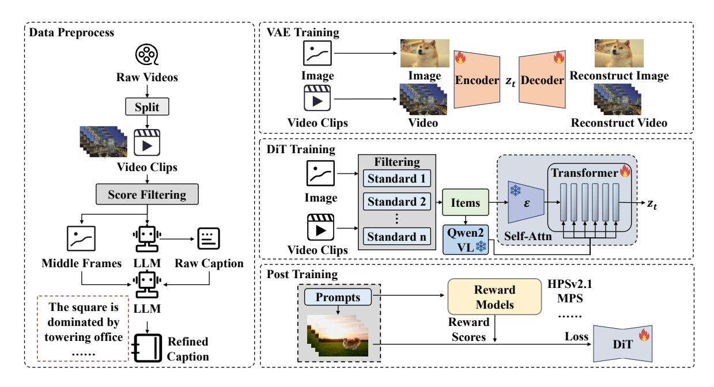
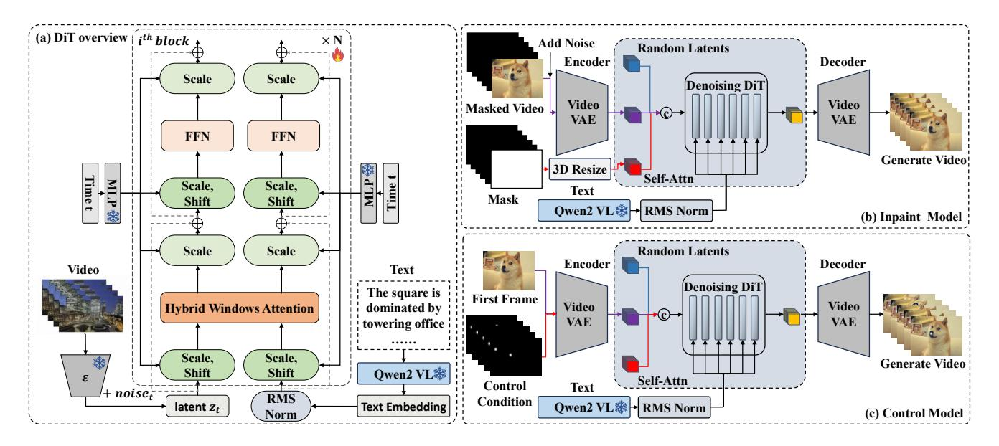

# CCS Concepts

• Computing methodologies → Computer vision.

## Keywords

Video Generation, Diffusion Transformers, Foundation Models

∗Both authors contributed equally to this research.

Figure 2: The EasyAnimate pipeline comprises four stages: data preprocessing, VAE Training, DiT Training and Post Training.

## 1 Introduction

Artificial intelligence has broadened creative content generation across modalities. Open-source projects like Stable Diffusion [\[43\]](#page-9-0) have greatly advanced text-to-image generation. Compared to images, video generation demands more computational resources and presents greater challenges due to temporal information.

Earlier video diffusion models are predominantly based on U-Net architectures [\[8,](#page-8-0) [9,](#page-8-1) [19,](#page-8-2) [31,](#page-8-3) [52\]](#page-9-1). The recent introduction of Sora revolutionized the field with its diffusion transformer architecture [\[20,](#page-8-4) [27,](#page-8-5) [28,](#page-8-6) [32,](#page-8-7) [33,](#page-8-8) [37,](#page-8-9) [58,](#page-9-2) [62\]](#page-9-3), marking a significant leap in video quality compared to previous models [\[33\]](#page-8-8). Despite these advancements, generating high resolution, high quality videos still faces substantial challenges.

The first challenge is the low training efficiency and slow inference speed. These are due to two factors: the high complexity of the transformer model and the uneven GPU utilization during training. Diffusion transformer-based models come with high computational costs, which grow quadratically with the sequence length [\[50\]](#page-9-4). As videos naturally capture temporal information, they tend to produce longer sequences than images, thus exacerbating the problem. Some earlier works attempt to reduce complexity by employing spatial-temporal decoupled attention [\[32,](#page-8-7) [62\]](#page-9-3). However, this method demonstrably compromises video generation quality, as it has a restricted receptive field and cannot capture large dynamic changes between frames. Some existing methods use 3D full attention to capture global video information [\[27,](#page-8-5) [28,](#page-8-6) [37,](#page-8-9) [58\]](#page-9-2). However, this approach demands substantial computational resources. Inspired by recent progress in Large Language Models (LLMs) [\[3,](#page-8-10) [24\]](#page-8-11), we propose a novel multidirectional sliding window attention module to enlarge the receptive field across 3D dimensions. Building on this module, we further propose Hybrid Windows Attention to strike a balance between computational efficiency and complexity. To address uneven GPU utilization, we design a token-based video training strategy that combines videos of varying resolutions and frame counts for joint training. By ensuring each sample has the same max token count, we balance GPU processing speed across samples, reducing idle time during training.

The second challenge is the suboptimal quality of video generation, which manifests in two areas: aesthetic divergence from human preferences and inaccurate adherence to text prompts. To improve the human preference alignment of the model, we explore the reward backpropagation in EasyAnimate post-training, leveraging human preference models to steer the optimization process. In this section, we experiment with different reward models and optimize their combinations. We find that combining different reward models can achieve superior performance. This strategy improves system performance and enhances the model's capabilities, adaptability, and alignment with user preferences across diverse scenarios. To better align text prompts with generated videos, we incorporate Multimodal Large Language Models (MLLMs) into video diffusion models to strengthen representation of detailed descriptions and complex object relationships. Existing models typically use CLIP [\[41\]](#page-8-12) or T5 [\[42\]](#page-8-13) as text encoders, which restrict text length and hinder the understanding of detailed and complex scenes [\[20,](#page-8-4) [28,](#page-8-6) [32,](#page-8-7) [49,](#page-9-5) [58,](#page-9-2) [62\]](#page-9-3). MLLMs show strong performance on diverse text and vision-language tasks, offering enhanced text understanding for EasyAnimate.

Based on the above improvements, we develop a comprehensive framework for developing video diffusion models, named EasyAnimate. Our framework covers data preprocessing, variational autoencoder (VAE) training, diffusion transformer (DiT) model training, and post-training, which is illustrated in Figure [2.](#page-1-0) Our contributions could be summarized as follows.

Figure 3: The detailed structure of the denoising diffusion transformer, inpaint model, and control model in EasyAnimate.

- (1) We propose Hybrid Windows Attention by interleaving multidirectional sliding window attention and full attention to boost the efficiency of video generation and training significantly.
- (2) We explore post-training with the Reward Backpropagation in the video diffusion transformers, which significantly improves the generated videos for better alignment with human preferences.
- (3) We propose an efficient and high-quality video generation framework called EasyAnimate. Within this framework, we incorporate improvements such as the Training with Token Length strategy and the use of MLLMs as the text encoder, thereby significantly enhancing both training efficiency and model performance.

## 2 Related Work

