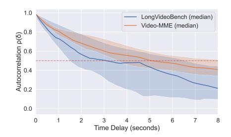
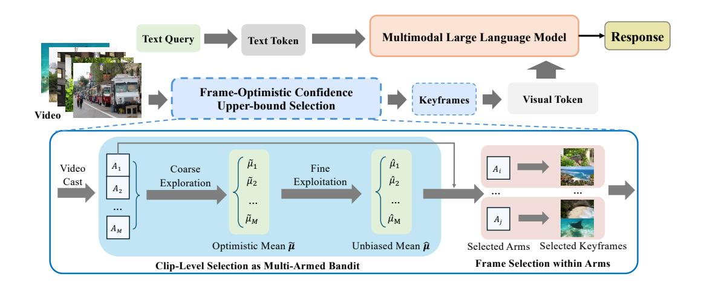
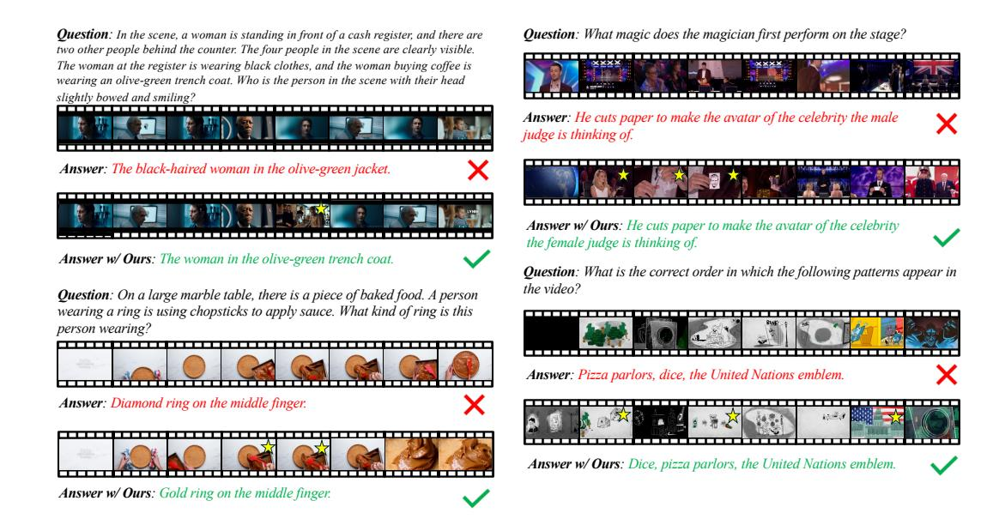
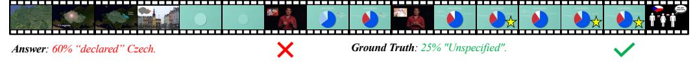
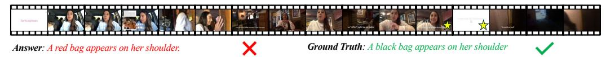

# FOCUS: EFFICIENT KEYFRAME SELECTION FOR LONG VIDEO UNDERSTANDING

Zirui Zhu1,<sup>2</sup> † Hailun Xu<sup>2</sup> Yang Luo<sup>1</sup> Yong Liu<sup>1</sup> Kanchan Sarkar<sup>2</sup> ⋄ † Zhenheng Yang<sup>2</sup> ⋄ † Yang You<sup>1</sup> † <sup>1</sup>National University of Singapore <sup>2</sup>TikTok <sup>⋄</sup> Project Lead † Corresponding Author {zirui, youy}@comp.nus.edu.sg {kanchan.sarkar, yangzhenheng}@tiktok.com

## ABSTRACT

Multimodal large language models (MLLMs) represent images and video frames as visual tokens. Scaling from single images to hour-long videos, however, inflates the token budget far beyond practical limits. Popular pipelines therefore either uniformly subsample or apply keyframe selection with retrieval-style scoring using smaller vision-language models. However, these keyframe selection methods still rely on pre-filtering before selection to reduce the inference cost and can miss the most informative moments.

We propose FOCUS, *Frame-Optimistic Confidence Upper-bound Selection*, a training-free, model-agnostic keyframe selection module that selects query-relevant frames under a strict token budget. FOCUS formulates keyframe selection as a combinatorial pure-exploration (CPE) problem in multi-armed bandits: it treats short temporal clips as arms, and uses empirical means and Bernstein confidence radius to identify informative regions while preserving exploration of uncertain areas. The resulting two-stage exploration-exploitation procedure reduces from a sequential policy with theoretical guarantees, first identifying high-value temporal regions, then selecting top-scoring frames within each region. On two long-video question-answering benchmarks, FOCUS delivers substantial accuracy improvements while processing less than 2% of video frames. For videos longer than 20 minutes, it achieves an 11.9% gain in accuracy on LongVideoBench, demonstrating its effectiveness as a keyframe selection method and providing a simple and general solution for scalable long-video understanding with MLLMs. Code is available at <https://github.com/NUS-HPC-AI-Lab/FOCUS>.

## 1 INTRODUCTION

*"The art of being wise is the art of knowing what to overlook."* — William James

Recent advances in large language models (LLMs) and multimodal large language models (MLLMs) have significantly improved visual understanding and reasoning. In current frameworks, images are encoded into visual tokens aligned with text and jointly processed by the LLM. Extending this paradigm to videos—especially long, untrimmed ones—introduces a key challenge: the sheer number of frames leads to an overwhelming number of visual tokens, making inference computationally prohibitive.

A common solution is aggressive downsampling [\(Wang et al.,](#page-13-0) [2022b;](#page-13-0) [Lin et al.,](#page-12-0) [2023;](#page-12-0) [Maaz et al.,](#page-12-1) [2024;](#page-12-1) [Zhang et al.,](#page-15-0) [2025c\)](#page-15-0), but uniformly sampling a handful of frames (e.g., 64 from a one-hour video) often misses critical content [\(Tang et al.,](#page-13-1) [2025;](#page-13-1) [Zhang et al.,](#page-15-1) [2025b\)](#page-15-1). Increasing the frame rate, on the other hand, causes token explosion [\(Wang et al.,](#page-14-0) [2024c\)](#page-14-0). This trade-off motivates the need for keyframe selection: choosing a small set of informative frames that preserve semantics while staying within token limits.

Recent methods address this by scoring frame relevance with pre-trained vision-language encoders (e.g., CLIP [\(Radford et al.,](#page-13-2) [2021\)](#page-13-2) or BLIP [\(Li et al.,](#page-11-0) [2022\)](#page-11-0)) and then pick the highest-relevance frames (Tang et al., 2025; Zhang et al., 2025b). These text-image matching approaches are typically training-free and plug in easily before the visual encoder in MLLM stacks, retrieving frames with higher relevance other than uniform sampling. Despite their success, current keyframe selection methods still face scalability and efficiency limitations. For a one-hour video at 30 fps (over 10<sup>5</sup> frames), exhaustively scoring all frames entails on the order of 10<sup>11</sup>-10<sup>12</sup> FLOPs with a vision-language encoder like BLIP (Li et al., 2022). This scaling pressure forces existing methods to uniformly sample the video to lower frame rate before the scoring process. This pre-filtering process before keyframe selection undermines the goal of identifying most informative keyframes from all frames (Zhang et al., 2025b; Tang et al., 2025).

In this work, we propose FOCUS, *Frame-Optimal Confidence Upper-Bound Selection*, a training-free, plugand-play keyframe selection method designed to process extremely long videos with minimal computational overhead. FOCUS is easy to implement in practice while offering an elegant theoretical foundation.

The key insight behind FOCUS is grounded in the observation that natural videos exhibit strong temporal locality: adjacent frames are highly correlated in appearance and motion (Wiegand et al., 2003; Wang et al., 2016; 2022b). This local smoothness naturally extends to frame-query relevance scores.

Concretely, for each video-query pair we compute a frame-level relevance sequence  $\{r_t\}$ , where  $r_t$  is the cosine similarity between the visual embedding of frame t and the text embedding of the query produced by BLIP. We then measure temporal dependence via the autocorrelation function (ACF)  $\rho(\delta) = \text{corr}(r_t, r_{t+\delta})$  at lag  $\delta$  (in seconds), and aggregate  $\rho(\delta)$  across videos. As illustrated in Figure 1, both LongVideoBench and Video-MME exhibit strong short-range correlation: the median ACF remains above 0.5 for roughly the first 5 seconds.



<span id="page-1-0"></span>Figure 1: Temporal autocorrelation (ACF) of per-frame query relevance on LongVideoBench and Video-MME. We compute frame-level relevance per video and take the ACF over time lags (seconds); solid lines show the median across videos and shaded bands the interquartile range. The dashed line marks the correlation half-life level ( $\rho(\delta) = 0.5$ ).

This observation implies that exhaustive scoring of all frames is unnecessary. Instead, we can formulate keyframe selection as a bandit problem to adaptively allocate computation: quickly filtering out irrelevant temporal regions, concentrating scoring on promising segments, and ultimately prioritizing the most informative keyframes.

FOCUS first partitions the video into short temporal clips, each treated as an arm in a multi-armed bandit. The clip selection is then framed as a Combinatorial Pure-Exploration (CPE) problem: the goal is to identify a subset of arms that maximizes expected cumulative relevance under a limited budget. Each arm maintains an empirical mean relevance and a Bernstein-style confidence radius. Computation is adaptively allocated to clips that are either promising (high mean) or uncertain (large confidence radius), following an optimism-in-the-face-of-uncertainty principle. This iterative process enjoys theoretical convergence guarantees. To leverage parallel computation, we reduce the iterative strategy to a coarse-to-fine schedule: optimistic means guide exploration, while unbiased empirical means inform final arm selection. Within each selected arm, we extract the top-relevance frames to construct the final keyframe set.

We validate the effectiveness of our approach on two video understanding benchmarks, including LongVideoBench (Wu et al., 2024) and Video-MME (Fu et al., 2025). The proposed Focus is tested as an off-the-shelf module on with four popular MLLMs. Focus improves answer accuracy over state-of-the-art keyframe selection baselines across benchmarks while maintaining lower inference cost. The gains are especially pronounced on long-form videos: for videos longer than 20 minutes on LongVideoBench, Focus delivers a 11.9% accuracy improvement while still cutting inference cost.

In summary, our main contributions are three-fold: (1) We formulate query-aware keyframe selection as a budgeted *combinatorial pure-exploration* (CPE) problem in a multi-armed bandit setting; (2) We introduce FOCUS, a training-free, model-agnostic keyframe selection module that selects query-



<span id="page-2-2"></span>Figure 2: Overview of FOCUS. FOCUS partitions videos into fixed-length clips as bandit arms, applies optimistic confidence upper-bound arm selection and selects final keyframes within each promising arms.

relevant frames under a strict token budget; (3) We validate the effectiveness of FOCUS on two long-video understanding benchmarks, achieving consistent gains across four popular MLLMs.

### 2 METHOD

#### <span id="page-2-3"></span>2.1 PROBLEM FORMULATION

**Keyframe Selection Setup.** Let a video be  $V=(x_1,\ldots,x_T)$  and denote the corresponding text query as q. Let the frame index set be  $\mathbb{T}=\{1,\ldots,T\}$ . A downstream MLLM  $\Phi$  consumes a subset of frames indexed by  $\mathbb{K}\subseteq\mathbb{T}$  with  $|\mathbb{K}|=k$  and produces an answer  $\hat{a}=\Phi(q,\{x_t\}_{t\in\mathbb{K}})$ . Let  $R_{\Phi}(\mathbb{K}\mid V,q)$  denote the task-level utility of the selected frames (e.g., quality of generated answer, relevance to query, or other performance metrics).

**Oracle and Surrogate Objective.** The oracle objective chooses  $\mathbb{K}$  to maximize expected utility:

<span id="page-2-0"></span>
$$\mathbb{K}^{\text{oracle}}(V, q) = \underset{\mathbb{K} \subseteq \mathbb{T}, \, |\mathbb{K}| = k}{\operatorname{arg\,max}} \, \mathbb{E}\big[R_{\Phi}(\mathbb{K} \mid V, q)\big],\tag{1}$$

Direct optimization to equation 1 is infeasible due to the combinatorial search space and the high cost of black-box evaluations of  $\Phi$ . We further expand the task-level utility  $R_{\Phi}(\mathbb{K} \mid V, q)$  to a summation of frame-level utility  $y_t \in [0, 1]$ :

<span id="page-2-1"></span>
$$\mathbb{K}^{\star} = \underset{\mathbb{K} \subseteq \mathbb{T}, \, |\mathbb{K}| = k}{\operatorname{arg\,max}} \, \mathbb{E} \Big[ \sum_{t \in \mathbb{K}} y_t \Big]. \tag{2}$$

However, estimating the contribution of each frame t to the task-level utility is also intractable. We therefore posit that  $y_t$  is indirectly observable via a vision-language encoder  $\psi$  that outputs a relevance score  $r_t = \psi(\boldsymbol{x}_t, q; \boldsymbol{\theta}) = y_t + \epsilon_{\psi}$ , where  $\epsilon_{\psi}$  denotes encoder-induced noise. We assume  $\epsilon_{\psi}$  follows some distribution that are supported on [0,1] and with zero mean and  $\sigma_{\psi}^2$  variance. Under this assumption, the relevance score  $r_t$  is a unbiased estimator of  $y_t$  which is also commonly used in many works (Tang et al., 2025; Yu et al., 2024) implicitly.

Exhaustively scoring all T frames to get  $\{r_t\}$  is computationally prohibitive, especially for hourly long videos which contains over  $10^5$  frames. This computational constraint motivates us to model keyframe selection under budget constraints, where we strategically allocate a limited sampling budget to identify the most promising temporal segments before producing the final set of k keyframes. Instead of directly optimizing equation 2 at the frame level, we will approximate it through a combinatorial pure-exploration multi-armed bandit formulation at the clip level, which significantly reduces exploration cost.

#### Algorithm 1 Iterative Optimistic Confidence Upper-bound Arm Selection

```
Require: Maximization oracle TopM(\{\mu_a\}, m) \to \mathbb{A} \subseteq \mathcal{A}
 1: Initialize: Empirical means \hat{\mu}_0(a) \leftarrow 0 and N_0(a) \leftarrow 0 for all a.
 2: Pull each arm a \in \mathcal{A} for q times and observe the rewards.
 3: n \leftarrow mq and N_a(n) \leftarrow q for all a.
 4: Update empirical means \hat{\mu}_a(n) for all a.
 5: for n \leftarrow mq, mq+1, \dots do
            \mathbb{A}_n \leftarrow \text{TopM}(\hat{\boldsymbol{\mu}}, m)
 7:
            Compute confidence radius \beta_a(n) for all a \in \mathcal{A}
                                                                                                              \triangleright \beta_a(n) defined in equation 5
 8:
            for a \leftarrow 1 to M do
 9:
                  if a \in \mathbb{A}_n then
                  \tilde{\mu}_a(n) \leftarrow \hat{\mu}_a(n) - \beta_a(n) else
10:
11:
                       \tilde{\mu}_a(n) \leftarrow \hat{\mu}_a(n) + \beta_a(n)
12:
13:
            end for
            \mathbb{A}_n \leftarrow \text{TopM}(\tilde{\boldsymbol{\mu}}, m)
15:
            if \mathbb{A}_n = \mathbb{A}_n then
16:
                  return \mathbb{A}_n
17:
18:
            end if
           p_n \leftarrow \operatorname*{arg\,max}_{a \in (\tilde{\mathbb{A}}_n \setminus \mathbb{A}_n) \cup (\mathbb{A}_n \setminus \tilde{\mathbb{A}}_n)}
and observe th
19:

    break ties arbitrarily

20:
            Pull arm p_n and observe the reward
21:
            Update empirical means \hat{\mu}(p_n) with the observed reward
            N_{p_n}(n+1) \leftarrow N_{p_n}(n) + 1
22:
23: end for
```

#### 2.2 CLIP-LEVEL SELECTION AS MULTI-ARMED BANDIT

For a video  $V=(x_1,\ldots,x_T)$ , we partition the timeline into M non-overlapping fixed-length clips  $\mathcal{A}=\{A_a\}_{a=1}^M$ , where each clip  $A_a\subseteq\mathbb{T}$  spans frames  $[s_a,e_a]$  and is treated as a bandit arm. We define pulling arm a as uniformly sampling a frame  $t\in A_a$  and observing its query relevance score  $r_t$  as the reward. The unseen frame-level utility of the sampled frame is modeled as  $y_t\sim \nu_a$ , where  $\nu_a$  has mean  $\mu_a$  and variance  $\sigma_a^2$ .

Intuitively, our goal is to focus on the most promising clips which means we have to identify the optimal subset  $S^* \subseteq \mathcal{A}$ . Formally, we define the *decision class*  $\mathbb{S} \in 2^{\mathcal{A}}$  as a subset of the power set of  $\mathcal{A}$ . The optimal member  $S^*$  of decision class  $\mathbb{S}$  is defined as

$$S^* = \underset{S \in \mathbb{S}}{\operatorname{arg\,max}} \sum_{a \in S} \mu_a. \tag{3}$$

Under the classic CPE framework, the learner's objective is to identify  $S^\star$  after interacting with the arms over a sequence of rounds. In the keyframe selection setting, our final goal is to further select k keyframes from the selected arms. Denote  $\{k_a\}_{a=1}^{|S^\star|}$  as the number of keyframes allocated to the a-th selected arm. We further define the frame-level optimal keyframe subset  $\mathbb{K}_a^\star$  as

$$\mathbb{K}_a^{\star} = \underset{\mathbb{K}_a \subseteq A_a, |\mathbb{K}_a| = k_a}{\operatorname{arg\,max}} \sum_{t \in \mathbb{K}_a} y_t. \tag{4}$$

The final keyframe subset  $\mathbb{K}^{\star}$  is then defined as  $\mathbb{K}^{\star} = \bigcup_{a \in S^{\star}} \mathbb{K}_{a}^{\star}$ . Empirically, we assume the decision class  $\mathbb{S}$  is all size-m subsets of  $\mathcal{A}$  and keyframes are equally distributed across the promising arms. This setting gives us an elegant theoretical guarantee of regret bound as shown in section C and is also proved to be effective in our experiments.

#### 2.3 OPTIMISTIC CONFIDENCE UPPER-BOUND ARM SELECTION

#### 2.3.1 OPTIMAL ARM SELECTION.

Generally, we play a exploration game by pulling an arm a and observing the reward  $r_t$  at each round n. We maintain two core empirical statistics for each arm a during this process: an empirical mean

#### Algorithm 2 Optimistic Confidence Upper-bound Arm Selection

<span id="page-4-1"></span>**Require:** Maximization oracle  $TopM(\{\mu_a\}, m) \to \mathbb{A} \subseteq \mathcal{A}$ 

- 1: **Initialize:** Empirical means  $\hat{\mu}_0(a) \leftarrow 0$  and  $N_0(a) \leftarrow 0$  for all a. // Stage I: Coarse exploration
- 2: Pull each arm  $a \in \mathcal{A}$  for q times and observe the rewards.
- 3:  $n \leftarrow mq$  and  $N_a(n) \leftarrow q$  for all a.
- 4: Update empirical means  $\hat{\mu}$  for all a.
- 5: Compute confidence radius  $\beta_a(n)$  for all  $a \in \mathcal{A}$
- 6:  $\tilde{\mu}_a(n) \leftarrow \hat{\mu}_a(n) + \beta_a(n)$  for all  $a \in \mathcal{A}$
- 7:  $\mathbb{A}_{\text{coarse}} \leftarrow \text{TopM}(\tilde{\boldsymbol{\mu}}, m)$ // Stage II: Fine-grained exploitation

- ▷ Optimistic Means UCB
- 8: Pull each arm  $a \in \mathbb{A}_{\text{coarse}}$  for z times and observe the rewards.
- 9: Update empirical means  $\hat{\mu}_a(n)$  for  $a \in \mathbb{A}_{\text{coarse}}$
- 10:  $\mathbb{A}_{\text{fine}} \leftarrow \text{TopM}(\hat{\boldsymbol{\mu}}, m)$

11: return A<sub>fine</sub>

 $\hat{\mu}_a(n)$  and an empirical Bernstein confidence radius (variance-adaptive)  $\beta_a(n)$ , following the UCV-V style bound (Audibert et al., 2009):

<span id="page-4-0"></span>
$$\beta_a(n) = \sqrt{\frac{2\,\hat{\sigma}_a^2\,\ln n}{\max(1, N_a(n))}} + \frac{3\,\ln n}{\max(1, N_a(n))}.$$
 (5)

Here  $\hat{\sigma}_a^2$  is the empirical variance of arm a,  $N_a(n)$  is the number of pulls for arm a at round n and  $n = \sum_{a \in \mathcal{A}} N_a(n)$  is the total number of pulls. The confidence radius ensures that the empirical mean is within the confidence radius of the true mean with high probability, *i.e.*,

$$\mathcal{P}[|\hat{\mu}_a(n) - \mu_a| \le \beta_a(n)] \ge 1 - \frac{6}{n}.$$
 (6)

Please refer to Appendix B for the detailed proof.

As shown in Algorithm 1, the optimistic confidence upper-bound arm selection starts with an initialization phase where we pull each arm for q times and observe the relevance scores as rewards. We then update the empirical means  $\hat{\mu}_a$  and compute the confidence radius  $\beta_a(n)$  for each arm a. Note the relevance score  $r_t$  is an unbiased estimator of  $y_t$  so we have  $\mathbb{E}[\hat{\mu}_a] = \mu_a$ . Then we choose the best m arms using the empirical means  $\hat{\mu}_a(n)$ , i.e.,  $\mathbb{A}_n = \operatorname{TopM}(\hat{\mu}, m)$ , where  $\hat{\mu}$  is the vector of all arms' empirical means and  $\operatorname{TopM}(\cdot, m)$  returns a set of the m arms with the largest empirical means

We further refine the arm selection by evaluating the "potential" of each arm. To be specific, for arm  $a \in \mathbb{A}_n$ , we compute the lower confidence bound of the empirical mean, *i.e.*,  $\mathrm{LCB}_a(n) = \hat{\mu}_a(n) - \beta_a(n)$ ; for arm  $a \notin \mathbb{A}_n$ , we compute the upper confidence bound of the empirical mean, *i.e.*,  $\mathrm{UCB}_a(n) = \hat{\mu}_a(n) + \beta_a(n)$ . If

$$\max_{a \notin \mathbb{A}_n} UCB_a(n) \ge \min_{a \in \mathbb{A}_n} LCB_a(n), \tag{7}$$

this indicates that some arms outside the current top-m set are still potential to be included in the top-m set. Thus, we choose the arm a that we are most uncertain about, *i.e.*,

$$a = \underset{a \in (\tilde{\mathbb{A}}_n \setminus \mathbb{A}_n) \cup (\mathbb{A}_n \setminus \tilde{\mathbb{A}}_n)}{\arg \max} \beta_a(n). \tag{8}$$

We then pull this arm a for q times and repeat the process until the top-m set is unchanged, *i.e.*,  $\mathbb{A}_{n+1} = \mathbb{A}_n$ . We then return the top-m set  $\mathbb{A}_n$ .

It is easy to see Algorithm 1 is guaranteed to return the optimal top-m set  $\mathbb{A}_n$  with high probability (see Section C for the detailed proof). However, the iterative process is empirically inefficient (or intractable) as the sequential arm-pulls and updating can not be parallelizable. We have to pull the arms one-by-one which means forward the vision-language model with batch size 1 sequentially. This costs significant waste of GPU utilization.

#### 2.3.2 Two-stage Arm Selection.

To make the procedure practical and easy to parallelize, we specialize Algorithm 1 into the two-stage, batch variant in Algorithm 2. The overall framework is shown in Figure 2.

**Stage I: Coarse initialization.** We pull each arm q times in parallel and update the empirical means  $\hat{\mu}_a$  and confidence radii  $\beta_a(n)$  for all  $a \in \mathcal{A}$ . This stage coincides with the initialization phase of Algorithm 1 and serves as a coarse exploration pass that produces reliable per-arm statistics at low coordination cost.

Stage II: Fine-grained exploration (batched). Using the optimistic scores  $\tilde{\mu}_a(n) = \hat{\mu}_a(n) + \beta_a(n)$ , we select the top  $\alpha m$  arms,  $\mathcal{A}_{\text{coarse}} = \operatorname{TopM}(\tilde{\mu}, \alpha m)$ , and allocate an additional z pulls to each  $a \in \mathcal{A}_{\text{coarse}}$  (performed in a single batch). Here,  $\alpha$  is a hyperparameter that controls the ratio of the coarse exploration budget to the fine-grained exploration budget. This stage is a batched counterpart of the iterative loop in Algorithm 1: it implements the "optimism in the face of uncertainty" principle by concentrating samples on arms with the largest UCB values, while avoiding per-step scheduling overhead.

Final Arm Selection. After the fine exploitation, we form the final set by selecting the best m arms according to the unbiased empirical means,  $\mathbb{A}_{\text{fine}} = \operatorname{TopM}(\hat{\mu}, m)$ . This choice mirrors  $\delta$ -PAC identification routines, where optimistic scores guide exploration but the recommendation itself is based on the empirical means  $\hat{\mu}_a(n)$  rather than the optimistic means  $\tilde{\mu}_a(n)$ .

#### 2.4 Frame Selection within Selected Arms

Given the selected arm set  $\mathbb{A}_{\text{fine}}$  and a total budget of K frames, we sample  $k_a$  frames per arm  $a \in \mathbb{A}_{\text{fine}}$  with equal allocation (i.e.,  $k_a = \text{round}(k/|\mathbb{A}_{\text{fine}}|)$ ), adjusted to sum to K). For each arm a with index set  $\mathbb{T}_a$  and observed rewards  $\{r_{a,s}\}_{s\in S_a}$  at sampled indices  $T_a\subseteq \mathbb{T}_a$ , we simply interpolate all rewards  $\hat{r}_{a,t}$  within the arm using the nearest-neighbor assignment. We then form a per-arm sampling distribution according to the interpolated rewards and draw  $k_a$  frames without replacement from  $p_a$ . The final keyframe set is  $\mathcal{K}=\bigcup_{a\in\mathcal{A}_{\text{fine}}}\mathcal{K}_a$ .

### 3 EXPERIMENTS

### 3.1 EXPERIMENTAL SETUP

**Benchmarks** We follow the LMMs-Eval framework Zhang et al. (2024a) and adopt the open-source evaluation protocol from AKS for benchmarks, prompts, and scoring. Our experiments focus on two long-video multiple-choice QA benchmarks: LongVideoBench Wu et al. (2024) and VideoMME Fu et al. (2025). These datasets feature videos lasting up to an hour, where effective keyframe selection becomes crucial for performance. To ensure fair comparison (Tang et al., 2025), we disable subtitles, perform zero-shot evaluation, and keep model parameters frozen—varying only the frame selection strategy (our method versus uniform sampling).

Implementation Details We test both open-source video MLLMs (Qwen2VL (Wang et al., 2024a), LLaVA-OV (Li et al., 2025), LLaVA-Video (Zhang et al., 2025c) and Qwen2-7B (Yang et al., 2024) language model) and the commercial GPT-4o (0513). For frame relevance scoring, we use BLIP ITM (Li et al., 2022) to compute  $r_t = \psi(x_t, q; \theta)$ , where  $r_t$  estimates the latent frame-level utility as described in Section 2.1, which is justified as a promising choice by Tang et al. (2025). This also ensure a fair comparison setting as the frame-level utility is estimated using the same model.

### 3.2 PERFORMANCE ANALYSIS

We evaluate FOCUS by using it to select keyframes as the visual input for the four aforementioned MLLMs, and compare it against the commonly used uniform sampling strategy. The results on LongVideoBench and Video-MME are summarized in Table 1.

<span id="page-6-0"></span>

| Model                  | #Frame | LLM | LongVideoBench | Video-MME  |
|------------------------|--------|-----|----------------|------------|
| GPT-4V                 | 256    | –   | 61.3           | 59.9       |
| Gemini-1.5-Flash       | 256    | –   | 61.6           | 70.3       |
| Gemini-1.5-Pro         | 256    | –   | 64.0           | 75.0       |
| VideoLLaVA             | 8      | 7B  | 39.1           | 39.9       |
| MiniCPM-V 2.6          | 64     | 8B  | 54.9           | 60.9       |
| InternVL2-40B          | 16     | 40B | 59.7           | 61.2       |
| LLaVA-Video-72B        | 64     | 72B | 63.9           | 70.6       |
| GPT-4o                 | 32     | –   | 51.6           | 61.8       |
| GPT-4o w/ Ours         | 32     | –   | 54.8 ↑ 3.2     | 62.5 ↑ 0.7 |
| Qwen2-VL-7B            | 32     | 7B  | 55.6           | 57.4       |
| Qwen2-VL-7B w/ Ours    | 32     | 7B  | 62.3 ↑ 6.7     | 59.7 ↑ 2.3 |
| LLaVA-OV-7B            | 32     | 7B  | 54.8           | 56.5       |
| LLaVA-OV-7B w/ Ours    | 32     | 7B  | 60.7 ↑ 5.9     | 58.3 ↑ 1.8 |
| LLaVA-Video-7B         | 64     | 7B  | 58.9           | 64.4       |
| LLaVA-Video-7B w/ Ours | 64     | 7B  | 63.5 ↑ 4.6     | 65.4 ↑ 1.0 |

Table 1: Video-question answering accuracy (%) of various MLLMs on LongVideoBench and Video-MME. FOCUS is integrated into GPT-4o, Qwen2-VL, LLaVA-OV, and LLaVA-Video. The suffix "*w/* Ours" denotes models using keyframes selected by our method; otherwise, frames are uniformly sampled. #Frame indicates the number of frames provided to the MLLM, and LLM denotes the language model size. We also include performance of additional popular MLLMs for reference.

Improved Performance via Frame Selection. As shown in Table [1,](#page-6-0) FOCUS consistently outperforms uniform sampling across both open-source and closed-source MLLMs on both LongVideoBench and Video-MME.

Specifically, on LongVideoBench, FOCUS improves accuracy by 3.2% on GPT-4o, 6.7% on Qwen2- VL-7B, 5.9% on LLaVA-OV-7B, and 4.6% on LLaVA-Video-7B. On Video-MME, the gains are 0.7%, 2.1%, 1.8%, and 1.0% on the same models, respectively.

We observe a clear trend that larger MLLMs with more frame inputs tend to achieve better performance. However, FOCUS significantly narrows this gap by identifying the most informative frames, thereby boosting the performance of smaller MLLMs. For instance, Qwen2-VL-7B with FOCUS outperforms Gemini-1.5-Flash on LongVideoBench, despite using 8× fewer input frames. This highlights the effectiveness of FOCUS as a plug-and-play keyframe selection module for a wide range of MLLMs.

Interpretability through Visualizations. We visualize the frames selected by FOCUS alongside uniformly sampled frames for two examples from LongVideoBench and Video-MME in Figure [3.](#page-7-0)

Note that LongVideoBench and Video-MME differ substantially in how their video-question pairs are constructed. In general, LongVideoBench features more detailed and specific questions, while Video-MME focuses on concise, high-level queries. Moreover, LongVideoBench tends to ask about specific scenes or events, whereas Video-MME emphasizes global understanding of the video content.

To highlight this distinction, we manually mark the most informative frames relative to the query using yellow stars. These frames are more temporally concentrated in LongVideoBench (around specific events) and more uniformly distributed across the timeline in Video-MME.

This difference helps explain why FOCUS achieves greater performance gains on LongVideoBench: our method assumes that frame-level relevance scores are i.i.d., a common setting in multi-armed bandit formulations. This assumption neglects temporal dependencies between video segments. Consequently, retrieval-based methods for keyframe selection typically require regularization [\(Tang](#page-13-1) [et al.,](#page-13-1) [2025;](#page-13-1) [Yu et al.,](#page-14-3) [2024\)](#page-14-3) to promote diversity and ensure coverage.

If temporal dependencies between segments (arms) are taken into account, the problem setting shifts toward Lipschitz or metric bandits [\(Kleinberg et al.,](#page-11-2) [2008;](#page-11-2) [Bubeck et al.,](#page-9-1) [2011\)](#page-9-1), and contextual bandits [\(Chu et al.,](#page-10-1) [2011;](#page-10-1) [Agarwal et al.,](#page-9-2) [2014\)](#page-9-2). We leave such extensions to future work.



<span id="page-7-0"></span>Figure 3: Comparison between uniformly sampled frames and those selected by FOCUS. The left column shows two examples from LongVideoBench; the right column shows two from Video-MME. Yellow stars indicate manually annotated frames that are most informative to the query, many of which are successfully captured by FOCUS.

#### 3.3 COMPARISON WITH STATE-OF-THE-ART

<span id="page-7-1"></span>

|              |       | LongVideoBench |      |         |       | Video-MME |      |         |
|--------------|-------|----------------|------|---------|-------|-----------|------|---------|
| Method       | Short | Medium         | Long | Overall | Short | Medium    | Long | Overall |
| Uniform      | 67.5  | 57.4           | 51.8 | 58.9    | 76.4  | 62.6      | 54.3 | 64.4    |
| Top-K        | 72.3  | 58.0           | 60.5 | 62.3    | 75.4  | 60.4      | 53.0 | 62.9    |
| AKS          | 72.3  | 59.2           | 56.1 | 62.1    | 76.3  | 62.8      | 54.7 | 64.6    |
| FOCUS (ours) | 72.3  | 59.0           | 63.7 | 63.5    | 76.5  | 63.5      | 56.1 | 65.4    |

Table 2: Comparison between our method and state-of-the-art keyframe selection baselines under matched keyframe count. Results are reported by video length buckets: Short, Medium, and Long. For Video-MME, we adopt its original categorization: *Short* (<2 min), *Medium* (4-15 min), and *Long* (30-60 min). For LongVideoBench, we define *Short* as videos shorter than 3 minutes, *Medium* as 3-20 minutes, and *Long* as over 20 minutes to ensure a balanced distribution.

To further validate the effectiveness of FOCUS, we compare it against state-of-the-art training-free keyframe selection methods on both LongVideoBench and Video-MME. Specifically, we consider recent approaches based on vision-language similarity:

- Top-K: Computes relevance scores between each frame and the query, then selects the top-K scoring frames. Due to computational constraints, we apply a pre-filtering step by downsampling videos to 1 frame per second.
- AKS [\(Tang et al.,](#page-13-1) [2025\)](#page-13-1): A recent method that adaptively balances frame relevance and temporal coverage. It is considered the current state-of-the-art and also incorporates pre-filtering via downsampling to 1 frame per second [\(Tang et al.,](#page-13-1) [2025\)](#page-13-1).

Fair comparison protocol. We ensure a fair comparison by: (i) evaluating all methods using LLaVA-Video-7B, the best-performing MLLM in our setup; (ii) fixing the number of selected keyframes to k = 64; (iii) using the same vision-language encoder (e.g., BLIP) for frame scoring whenever possible. Results are summarized in Table [2.](#page-7-1)

<span id="page-8-0"></span>

| Method                | Filtering-free | Frames Seen (%) | GPU hours |
|-----------------------|----------------|-----------------|-----------|
| AKS w/o pre-filtering |                | 100             | 255       |
| AKS w/ pre-filtering  |                | 3.7             | 9.3       |
| FOCUS (Ours)          |                | 1.6             | 5.5       |

Table 3: Efficiency comparison of keyframe selection methods on LongVideoBench. "Pre-filtering" refers to downsampling videos to 1 fps prior to selection. Note that the official AKS pipeline includes this pre-filtering step by default. "Frames Seen (%)" counts the proportion of frame-level BLIP forward passes relative to scoring all frames; GPU hours are measured on a single H100 (80GB).

Consistency across different lengths. FOCUS achieves consistent performance gains across all video length categories, with particularly strong improvements on long videos. On LongVideoBench, FOCUS outperforms uniform sampling by 11.9% and Top-K by 7.6% on videos longer than 20 minutes. On Video-MME, the respective improvements are 1.8% and 1.4%.

We also observe that on short videos, all keyframe selection methods perform similarly and consistently outperform uniform sampling. We attribute this to a possible saturation in the reasoning capabilities of the underlying MLLM (LLaVA-Video-7B), where input selection plays a less critical role.

Efficiency comparison. We report the efficiency of each method in Table [3,](#page-8-0) measuring both the number of frames "seen" (i.e., scored by a vision-language model) and the total GPU hours required to perform keyframe selection. All GPU hours are measured using a single NVIDIA H100 (80GB) GPU on the LongVideoBench dataset.

As shown, AKS without pre-filtering is computationally infeasible in practice, as it requires scoring all video frames—amounting to over 255 GPU hours by the optimistic estimation. With pre-filtering, the cost drops significantly to 9.3 GPU hours. In contrast, FOCUS is the most efficient: it requires only 1.6% of the BLIP forward passes and just 5.5 GPU hours, while simultaneously achieving the best overall performance.

## 3.4 EFFICIENCY-ACCURACY TRADE-OFF

FOCUS exposes a natural trade-off between accuracy and computational cost through a single hyperparameter α, which controls the fraction of arms selected for fine-grained exploration. We report accuracy and efficiency under different α settings in Table [4.](#page-8-1)

<span id="page-8-1"></span>

|          | Accuracy (%) | Frames Seen (%) | GPU hours |
|----------|--------------|-----------------|-----------|
| α = 0.1  | 62.9         | 1.1             | 3.5       |
| α = 0.25 | 63.5         | 1.6             | 5.5       |
| α = 0.5  | 63.6         | 2.5             | 9.2       |

Table 4: Effect of α on the performance and efficiency of FOCUS. "Frames Seen (%)" counts the proportion of frame-level BLIP forward passes relative to scoring all frames; GPU hours are measured on a single H100 (80GB).

We observe that choice of α has a significant impact on the efficiency while remain stable on the performance. With α = 0.1, FOCUS evaluates 1.1% of frames and finishes in 3.5 GPU hours. At α = 0.25, the fraction rises to 1.6% with a cost of 5.5 GPU hours, yielding 63.5% accuracy. Setting α = 0.5 achieves the highest accuracy (63.6%) but requires evaluating 2.5% of frames and 9.2 GPU hours—only a negligible gain over α = 0.25 for a substantially higher cost, indicating diminishing returns from exploring more arms.

## 4 CONCLUSION

We addressed the core bottleneck of long-video understanding in MLLMs—the explosion of visual tokens—by introducing FOCUS, a training-free, plug-and-play keyframe selection method that

allocates computation under a strict budget. FOCUS first partitions the video into temporal clips, treats each as an arm in a bandit problem, and then identifies query-relevant regions via a combinatorial pureexploration strategy using empirical means and Bernstein confidence bounds. To improve efficiency, we reduce the iterative bandit process to a coarse-to-fine two-stage procedure that preserves optimism while enabling parallel inference.

Experiments on two challenging long-video QA benchmarks demonstrate that FOCUS consistently improves accuracy across four MLLMs while processing fewer than 2% of video frames. Our results show that lightweight, training-free keyframe selection—when guided by statistical principles—can significantly enhance the scalability and practicality of MLLMs for long-video understanding.

## 5 REPRODUCIBILITY STATEMENT

We provide a comprehensive theoretical analysis of our method in Appendix [B](#page-17-0) and Appendix [C.](#page-18-0) The source code for this work is publicly available at [https://github.com/NUS-HPC-AI-Lab/](https://github.com/NUS-HPC-AI-Lab/FOCUS) [FOCUS](https://github.com/NUS-HPC-AI-Lab/FOCUS). All models and datasets used in our study are publicly accessible.

## REFERENCES

- <span id="page-9-2"></span>Alekh Agarwal, Daniel Hsu, Satyen Kale, John Langford, Lihong Li, and Robert Schapire. Taming the monster: A fast and simple algorithm for contextual bandits. In Eric P. Xing and Tony Jebara (eds.), *Proceedings of the 31st International Conference on Machine Learning*, volume 32 of *Proceedings of Machine Learning Research*, pp. 1638–1646, Bejing, China, 22–24 Jun 2014. PMLR. URL <https://proceedings.mlr.press/v32/agarwalb14.html>.
- <span id="page-9-6"></span>Shipra Agrawal and Navin Goyal. Analysis of thompson sampling for the multi-armed bandit problem. In *Conference on learning theory*, pp. 39–1. JMLR Workshop and Conference Proceedings, 2012.
- <span id="page-9-4"></span>Jean-Baptiste Alayrac, Jeff Donahue, Pauline Luc, Antoine Miech, Iain Barr, Yana Hasson, Karel Lenc, Arthur Mensch, Katherine Millican, Malcolm Reynolds, et al. Flamingo: a visual language model for few-shot learning. *Advances in neural information processing systems*, 35:23716–23736, 2022.
- <span id="page-9-9"></span>Jean-Yves Audibert and Sébastien Bubeck. Best arm identification in multi-armed bandits. In *COLT-23th Conference on learning theory-2010*, pp. 13–p, 2010.
- <span id="page-9-0"></span>Jean-Yves Audibert, Rémi Munos, and Csaba Szepesvári. Exploration–exploitation tradeoff using variance estimates in multi-armed bandits. *Theoretical Computer Science*, 410(19):1876–1902, 2009.
- <span id="page-9-5"></span>Peter Auer, Nicolo Cesa-Bianchi, and Paul Fischer. Finite-time analysis of the multiarmed bandit problem. *Machine learning*, 47(2):235–256, 2002.
- <span id="page-9-7"></span>Sébastien Bubeck, Rémi Munos, and Gilles Stoltz. Pure exploration in multi-armed bandits problems. In *International conference on Algorithmic learning theory*, pp. 23–37. Springer, 2009.
- <span id="page-9-1"></span>Sébastien Bubeck, Rémi Munos, Gilles Stoltz, and Csaba Szepesvári. <i>x</i>-armed bandits. *Journal of Machine Learning Research*, 12(46):1655–1695, 2011. URL [http://jmlr.org/](http://jmlr.org/papers/v12/bubeck11a.html) [papers/v12/bubeck11a.html](http://jmlr.org/papers/v12/bubeck11a.html).
- <span id="page-9-8"></span>Wei Cao, Jian Li, Yufei Tao, and Zhize Li. On top-k selection in multi-armed bandits and hidden bipartite graphs. *Advances in Neural Information Processing Systems*, 28, 2015.
- <span id="page-9-3"></span>Lin Chen, Xilin Wei, Jinsong Li, Xiaoyi Dong, Pan Zhang, Yuhang Zang, Zehui Chen, Haodong Duan, Zhenyu Tang, Li Yuan, et al. Sharegpt4video: Improving video understanding and generation with better captions. *Advances in Neural Information Processing Systems*, 37:19472–19495, 2024a.
- <span id="page-9-10"></span>Wei Chen, Yajun Wang, Yang Yuan, and Qinshi Wang. Combinatorial multi-armed bandit and its extension to probabilistically triggered arms. *Journal of Machine Learning Research*, 17(50):1–33, 2016.

- <span id="page-10-8"></span>Xi Chen, Xiao Wang, Soravit Changpinyo, AJ Piergiovanni, Piotr Padlewski, Daniel Salz, Sebastian Goodman, Adam Grycner, Basil Mustafa, Lucas Beyer, Alexander Kolesnikov, Joan Puigcerver, Nan Ding, Keran Rong, Hassan Akbari, Gaurav Mishra, Linting Xue, Ashish V Thapliyal, James Bradbury, Weicheng Kuo, Mojtaba Seyedhosseini, Chao Jia, Burcu Karagol Ayan, Carlos Riquelme Ruiz, Andreas Peter Steiner, Anelia Angelova, Xiaohua Zhai, Neil Houlsby, and Radu Soricut. PaLI: A jointly-scaled multilingual language-image model. In *The Eleventh International Conference on Learning Representations*, 2023. URL [https:](https://openreview.net/forum?id=mWVoBz4W0u) [//openreview.net/forum?id=mWVoBz4W0u](https://openreview.net/forum?id=mWVoBz4W0u).
- <span id="page-10-7"></span>Yen-Chun Chen, Linjie Li, Licheng Yu, Ahmed El Kholy, Faisal Ahmed, Zhe Gan, Yu Cheng, and Jingjing Liu. Uniter: Universal image-text representation learning. In *European conference on computer vision*, pp. 104–120. Springer, 2020.
- <span id="page-10-5"></span>Yukang Chen, Fuzhao Xue, Dacheng Li, Qinghao Hu, Ligeng Zhu, Xiuyu Li, Yunhao Fang, Haotian Tang, Shang Yang, Zhijian Liu, Yihui He, Hongxu Yin, Pavlo Molchanov, Jan Kautz, Linxi Fan, Yuke Zhu, Yao Lu, and Song Han. Longvila: Scaling long-context visual language models for long videos. 2024b.
- <span id="page-10-4"></span>Zhe Chen, Weiyun Wang, Yue Cao, Yangzhou Liu, Zhangwei Gao, Erfei Cui, Jinguo Zhu, Shenglong Ye, Hao Tian, Zhaoyang Liu, et al. Expanding performance boundaries of open-source multimodal models with model, data, and test-time scaling. *arXiv preprint arXiv:2412.05271*, 2024c.
- <span id="page-10-3"></span>Zhe Chen, Weiyun Wang, Hao Tian, Shenglong Ye, Zhangwei Gao, Erfei Cui, Wenwen Tong, Kongzhi Hu, Jiapeng Luo, Zheng Ma, et al. How far are we to gpt-4v? closing the gap to commercial multimodal models with open-source suites. *Science China Information Sciences*, 67(12):220101, 2024d.
- <span id="page-10-2"></span>Zhe Chen, Jiannan Wu, Wenhai Wang, Weijie Su, Guo Chen, Sen Xing, Muyan Zhong, Qinglong Zhang, Xizhou Zhu, Lewei Lu, et al. Internvl: Scaling up vision foundation models and aligning for generic visual-linguistic tasks. In *Proceedings of the IEEE/CVF Conference on Computer Vision and Pattern Recognition*, pp. 24185–24198, 2024e.
- <span id="page-10-6"></span>Chuanqi Cheng, Jian Guan, Wei Wu, and Rui Yan. Scaling video-language models to 10k frames via hierarchical differential distillation. *arXiv preprint arXiv:2504.02438*, 2025.
- <span id="page-10-1"></span>Wei Chu, Lihong Li, Lev Reyzin, and Robert Schapire. Contextual bandits with linear payoff functions. In *Proceedings of the fourteenth international conference on artificial intelligence and statistics*, pp. 208–214. JMLR Workshop and Conference Proceedings, 2011.
- <span id="page-10-9"></span>Danny Driess, Fei Xia, Mehdi S. M. Sajjadi, Corey Lynch, Aakanksha Chowdhery, Brian Ichter, Ayzaan Wahid, Jonathan Tompson, Quan Vuong, Tianhe Yu, Wenlong Huang, Yevgen Chebotar, Pierre Sermanet, Daniel Duckworth, Sergey Levine, Vincent Vanhoucke, Karol Hausman, Marc Toussaint, Klaus Greff, Andy Zeng, Igor Mordatch, and Pete Florence. Palm-e: An embodied multimodal language model. In *arXiv preprint arXiv:2303.03378*, 2023.
- <span id="page-10-12"></span>Eyal Even-Dar, Shie Mannor, and Yishay Mansour. Pac bounds for multi-armed bandit and markov decision processes. In *International Conference on Computational Learning Theory*, pp. 255–270. Springer, 2002.
- <span id="page-10-11"></span>Eyal Even-Dar, Shie Mannor, Yishay Mansour, and Sridhar Mahadevan. Action elimination and stopping conditions for the multi-armed bandit and reinforcement learning problems. *Journal of machine learning research*, 7(6), 2006.
- <span id="page-10-0"></span>Chaoyou Fu, Yuhan Dai, Yongdong Luo, Lei Li, Shuhuai Ren, Renrui Zhang, Zihan Wang, Chenyu Zhou, Yunhang Shen, Mengdan Zhang, et al. Video-mme: The first-ever comprehensive evaluation benchmark of multi-modal llms in video analysis. In *Proceedings of the Computer Vision and Pattern Recognition Conference*, pp. 24108–24118, 2025.
- <span id="page-10-13"></span>Zijun Gao, Yanjun Han, Zhimei Ren, and Zhengqing Zhou. Batched multi-armed bandits problem. *Advances in Neural Information Processing Systems*, 32, 2019.
- <span id="page-10-10"></span>Weiyu Guo, Ziyang Chen, Shaoguang Wang, Jianxiang He, Yijie Xu, Jinhui Ye, Ying Sun, and Hui Xiong. Logic-in-frames: Dynamic keyframe search via visual semantic-logical verification for long video understanding. *arXiv preprint arXiv:2503.13139*, 2025.

- <span id="page-11-8"></span>Kai Hu, Feng Gao, Xiaohan Nie, Peng Zhou, Son Tran, Tal Neiman, Lingyun Wang, Mubarak Shah, Raffay Hamid, Bing Yin, et al. M-llm based video frame selection for efficient video understanding. In *Proceedings of the Computer Vision and Pattern Recognition Conference*, pp. 13702–13712, 2025.
- <span id="page-11-13"></span>Kevin Jamieson, Matthew Malloy, Robert Nowak, and Sébastien Bubeck. lil'ucb: An optimal exploration algorithm for multi-armed bandits. In *Conference on Learning Theory*, pp. 423–439. PMLR, 2014.
- <span id="page-11-4"></span>Chao Jia, Yinfei Yang, Ye Xia, Yi-Ting Chen, Zarana Parekh, Hieu Pham, Quoc Le, Yun-Hsuan Sung, Zhen Li, and Tom Duerig. Scaling up visual and vision-language representation learning with noisy text supervision. In *International conference on machine learning*, pp. 4904–4916. PMLR, 2021.
- <span id="page-11-17"></span>Tianyuan Jin, Yu Yang, Jing Tang, Xiaokui Xiao, and Pan Xu. Optimal batched best arm identification. *Advances in Neural Information Processing Systems*, 37:134947–134980, 2024.
- <span id="page-11-16"></span>Kwang-Sung Jun, Kevin Jamieson, Robert Nowak, and Xiaojin Zhu. Top arm identification in multi-armed bandits with batch arm pulls. In *Artificial Intelligence and Statistics*, pp. 139–148. PMLR, 2016.
- <span id="page-11-10"></span>Shivaram Kalyanakrishnan and Peter Stone. Efficient selection of multiple bandit arms: Theory and practice. In *ICML*, volume 10, pp. 511–518, 2010.
- <span id="page-11-11"></span>Shivaram Kalyanakrishnan, Ambuj Tewari, Peter Auer, and Peter Stone. Pac subset selection in stochastic multi-armed bandits. In *ICML*, volume 12, pp. 655–662, 2012.
- <span id="page-11-12"></span>Zohar Karnin, Tomer Koren, and Oren Somekh. Almost optimal exploration in multi-armed bandits. In *International conference on machine learning*, pp. 1238–1246. PMLR, 2013.
- <span id="page-11-14"></span>Emilie Kaufmann, Olivier Cappé, and Aurélien Garivier. On the complexity of best-arm identification in multi-armed bandit models. *The Journal of Machine Learning Research*, 17(1):1–42, 2016.
- <span id="page-11-2"></span>Robert Kleinberg, Aleksandrs Slivkins, and Eli Upfal. Multi-armed bandits in metric spaces. In *Proceedings of the fortieth annual ACM symposium on Theory of computing*, pp. 681–690, 2008.
- <span id="page-11-9"></span>Tze Leung Lai and Herbert Robbins. Asymptotically efficient adaptive allocation rules. *Advances in applied mathematics*, 6(1):4–22, 1985.
- <span id="page-11-15"></span>Tor Lattimore and Csaba Szepesvári. *Bandit algorithms*. Cambridge University Press, 2020.
- <span id="page-11-7"></span>Jie Lei, Linjie Li, Luowei Zhou, Zhe Gan, Tamara L Berg, Mohit Bansal, and Jingjing Liu. Less is more: Clipbert for video-and-language learning via sparse sampling. In *Proceedings of the IEEE/CVF conference on computer vision and pattern recognition*, pp. 7331–7341, 2021.
- <span id="page-11-1"></span>Bo Li, Yuanhan Zhang, Dong Guo, Renrui Zhang, Feng Li, Hao Zhang, Kaichen Zhang, Peiyuan Zhang, Yanwei Li, Ziwei Liu, and Chunyuan Li. LLaVA-onevision: Easy visual task transfer. *Transactions on Machine Learning Research*, 2025. ISSN 2835-8856. URL [https:](https://openreview.net/forum?id=zKv8qULV6n) [//openreview.net/forum?id=zKv8qULV6n](https://openreview.net/forum?id=zKv8qULV6n).
- <span id="page-11-3"></span>Dongxu Li, Yudong Liu, Haoning Wu, Yue Wang, Zhiqi Shen, Bowen Qu, Xinyao Niu, Fan Zhou, Chengen Huang, Yanpeng Li, et al. Aria: An open multimodal native mixture-of-experts model. *arXiv preprint arXiv:2410.05993*, 2024a.
- <span id="page-11-5"></span>Junnan Li, Ramprasaath Selvaraju, Akhilesh Gotmare, Shafiq Joty, Caiming Xiong, and Steven Chu Hong Hoi. Align before fuse: Vision and language representation learning with momentum distillation. *Advances in neural information processing systems*, 34:9694–9705, 2021.
- <span id="page-11-0"></span>Junnan Li, Dongxu Li, Caiming Xiong, and Steven Hoi. Blip: Bootstrapping language-image pretraining for unified vision-language understanding and generation. In *International conference on machine learning*, pp. 12888–12900. PMLR, 2022.
- <span id="page-11-6"></span>Junnan Li, Dongxu Li, Silvio Savarese, and Steven Hoi. Blip-2: Bootstrapping language-image pre-training with frozen image encoders and large language models. In *International conference on machine learning*, pp. 19730–19742. PMLR, 2023.

- <span id="page-12-4"></span>KunChang Li, Yinan He, Yi Wang, Yizhuo Li, Wenhai Wang, Ping Luo, Yali Wang, Limin Wang, and Yu Qiao. Videochat: Chat-centric video understanding, 2024b. URL [https://arxiv.org/](https://arxiv.org/abs/2305.06355) [abs/2305.06355](https://arxiv.org/abs/2305.06355).
- <span id="page-12-10"></span>Linjie Li, Yen-Chun Chen, Yu Cheng, Zhe Gan, Licheng Yu, and Jingjing Liu. HERO: Hierarchical encoder for Video+Language omni-representation pre-training. In Bonnie Webber, Trevor Cohn, Yulan He, and Yang Liu (eds.), *Proceedings of the 2020 Conference on Empirical Methods in Natural Language Processing (EMNLP)*, pp. 2046–2065, Online, November 2020. Association for Computational Linguistics. doi: 10.18653/v1/2020.emnlp-main.161. URL <https://aclanthology.org/2020.emnlp-main.161/>.
- <span id="page-12-9"></span>Liunian Harold Li, Mark Yatskar, Da Yin, Cho-Jui Hsieh, and Kai-Wei Chang. Visualbert: A simple and performant baseline for vision and language. *arXiv preprint arXiv:1908.03557*, 2019.
- <span id="page-12-3"></span>Yanwei Li, Chengyao Wang, and Jiaya Jia. Llama-vid: An image is worth 2 tokens in large language models. In *European Conference on Computer Vision*, pp. 323–340. Springer, 2024c.
- <span id="page-12-12"></span>Hao Liang, Jiapeng Li, Tianyi Bai, Xijie Huang, Linzhuang Sun, Zhengren Wang, Conghui He, Bin Cui, Chong Chen, and Wentao Zhang. Keyvideollm: Towards large-scale video keyframe selection. *CoRR*, 2024.
- <span id="page-12-0"></span>Bin Lin, Yang Ye, Bin Zhu, Jiaxi Cui, Munan Ning, Peng Jin, and Li Yuan. Video-llava: Learning united visual representation by alignment before projection. *arXiv preprint arXiv:2311.10122*, 2023.
- <span id="page-12-2"></span>Haotian Liu, Chunyuan Li, Qingyang Wu, and Yong Jae Lee. Visual instruction tuning, 2023. URL <https://arxiv.org/abs/2304.08485>.
- <span id="page-12-5"></span>Haotian Liu, Chunyuan Li, Yuheng Li, Bo Li, Yuanhan Zhang, Sheng Shen, and Yong Jae Lee. Llava-next: Improved reasoning, ocr, and world knowledge, January 2024a. URL [https:](https://llava-vl.github.io/blog/2024-01-30-llava-next/) [//llava-vl.github.io/blog/2024-01-30-llava-next/](https://llava-vl.github.io/blog/2024-01-30-llava-next/).
- <span id="page-12-6"></span>Jiajun Liu, Yibing Wang, Hanghang Ma, Xiaoping Wu, Xiaoqi Ma, Xiaoming Wei, Jianbin Jiao, Enhua Wu, and Jie Hu. Kangaroo: A powerful video-language model supporting long-context video input, 2024b. URL <https://arxiv.org/abs/2408.15542>.
- <span id="page-12-13"></span>Shuming Liu, Chen Zhao, Tianqi Xu, and Bernard Ghanem. Bolt: Boost large vision-language model without training for long-form video understanding. In *Proceedings of the Computer Vision and Pattern Recognition Conference*, pp. 3318–3327, 2025.
- <span id="page-12-8"></span>Jiasen Lu, Dhruv Batra, Devi Parikh, and Stefan Lee. Vilbert: Pretraining task-agnostic visiolinguistic representations for vision-and-language tasks. *Advances in neural information processing systems*, 32, 2019.
- <span id="page-12-11"></span>Huaishao Luo, Lei Ji, Ming Zhong, Yang Chen, Wen Lei, Nan Duan, and Tianrui Li. Clip4clip: An empirical study of clip for end to end video clip retrieval and captioning. *Neurocomputing*, 508: 293–304, 2022.
- <span id="page-12-1"></span>Muhammad Maaz, Hanoona Rasheed, Salman Khan, and Fahad Shahbaz Khan. Video-chatgpt: Towards detailed video understanding via large vision and language models. In *Proceedings of the 62nd Annual Meeting of the Association for Computational Linguistics (ACL 2024)*, 2024.
- <span id="page-12-14"></span>Behrooz Mahasseni, Michael Lam, and Sinisa Todorovic. Unsupervised video summarization with adversarial lstm networks. In *Proceedings of the IEEE conference on Computer Vision and Pattern Recognition*, pp. 202–211, 2017.
- <span id="page-12-15"></span>Vianney Perchet, Philippe Rigollet, Sylvain Chassang, and Erik Snowberg. Batched bandit problems. 2016.
- <span id="page-12-7"></span>Rui Qian, Xiaoyi Dong, Pan Zhang, Yuhang Zang, Shuangrui Ding, Dahua Lin, and Jiaqi Wang. Streaming long video understanding with large language models. *Advances in Neural Information Processing Systems*, 37:119336–119360, 2024.

- <span id="page-13-7"></span>Minghao Qin, Xiangrui Liu, Zhengyang Liang, Yan Shu, Huaying Yuan, Juenjie Zhou, Shitao Xiao, Bo Zhao, and Zheng Liu. Video-xl-2: Towards very long-video understanding through task-aware kv sparsification. *arXiv preprint arXiv:2506.19225*, 2025.
- <span id="page-13-2"></span>Alec Radford, Jong Wook Kim, Chris Hallacy, Aditya Ramesh, Gabriel Goh, Sandhini Agarwal, Girish Sastry, Amanda Askell, Pamela Mishkin, Jack Clark, et al. Learning transferable visual models from natural language supervision. In *International conference on machine learning*, pp. 8748–8763. PmLR, 2021.
- <span id="page-13-5"></span>Xiaoqian Shen, Yunyang Xiong, Changsheng Zhao, Lemeng Wu, Jun Chen, Chenchen Zhu, Zechun Liu, Fanyi Xiao, Balakrishnan Varadarajan, Florian Bordes, et al. Longvu: Spatiotemporal adaptive compression for long video-language understanding. *arXiv preprint arXiv:2410.17434*, 2024.
- <span id="page-13-9"></span>Yunhang Shen, Chaoyou Fu, Shaoqi Dong, Xiong Wang, Yi-Fan Zhang, Peixian Chen, Mengdan Zhang, Haoyu Cao, Ke Li, Xiawu Zheng, et al. Long-vita: Scaling large multi-modal models to 1 million tokens with leading short-context accuracy. *arXiv preprint arXiv:2502.05177*, 2025.
- <span id="page-13-6"></span>Enxin Song, Wenhao Chai, Guanhong Wang, Yucheng Zhang, Haoyang Zhou, Feiyang Wu, Haozhe Chi, Xun Guo, Tian Ye, Yanting Zhang, et al. Moviechat: From dense token to sparse memory for long video understanding. In *Proceedings of the IEEE/CVF Conference on Computer Vision and Pattern Recognition*, pp. 18221–18232, 2024.
- <span id="page-13-11"></span>Weijie Su, Xizhou Zhu, Yue Cao, Bin Li, Lewei Lu, Furu Wei, and Jifeng Dai. Vl-bert: Pre-training of generic visual-linguistic representations. In *International Conference on Learning Representations*, 2020. URL <https://openreview.net/forum?id=SygXPaEYvH>.
- <span id="page-13-13"></span>Chen Sun, Austin Myers, Carl Vondrick, Kevin Murphy, and Cordelia Schmid. Videobert: A joint model for video and language representation learning. In *Proceedings of the IEEE/CVF international conference on computer vision*, pp. 7464–7473, 2019.
- <span id="page-13-10"></span>Hao Tan and Mohit Bansal. Lxmert: Learning cross-modality encoder representations from transformers. In *Proceedings of the 2019 Conference on Empirical Methods in Natural Language Processing*, 2019.
- <span id="page-13-1"></span>Xi Tang, Jihao Qiu, Lingxi Xie, Yunjie Tian, Jianbin Jiao, and Qixiang Ye. Adaptive keyframe sampling for long video understanding. In *Proceedings of the Computer Vision and Pattern Recognition Conference*, pp. 29118–29128, 2025.
- <span id="page-13-14"></span>Adrienne Tuynman and Rémy Degenne. The batch complexity of bandit pure exploration. *arXiv preprint arXiv:2502.01425*, 2025.
- <span id="page-13-3"></span>Limin Wang, Yuanjun Xiong, Zhe Wang, Yu Qiao, Dahua Lin, Xiaoou Tang, and Luc Van Gool. Temporal segment networks: Towards good practices for deep action recognition. In *European conference on computer vision*, pp. 20–36. Springer, 2016.
- <span id="page-13-12"></span>Peng Wang, An Yang, Rui Men, Junyang Lin, Shuai Bai, Zhikang Li, Jianxin Ma, Chang Zhou, Jingren Zhou, and Hongxia Yang. Ofa: Unifying architectures, tasks, and modalities through a simple sequence-to-sequence learning framework. In *International conference on machine learning*, pp. 23318–23340. PMLR, 2022a.
- <span id="page-13-4"></span>Peng Wang, Shuai Bai, Sinan Tan, Shijie Wang, Zhihao Fan, Jinze Bai, Keqin Chen, Xuejing Liu, Jialin Wang, Wenbin Ge, et al. Qwen2-vl: Enhancing vision-language model's perception of the world at any resolution. *arXiv preprint arXiv:2409.12191*, 2024a.
- <span id="page-13-8"></span>Xiaohan Wang, Yuhui Zhang, Orr Zohar, and Serena Yeung-Levy. Videoagent: Long-form video understanding with large language model as agent. In *European Conference on Computer Vision*, pp. 58–76. Springer, 2024b.
- <span id="page-13-0"></span>Yi Wang, Kunchang Li, Yizhuo Li, Yinan He, Bingkun Huang, Zhiyu Zhao, Hongjie Zhang, Jilan Xu, Yi Liu, Zun Wang, et al. Internvideo: General video foundation models via generative and discriminative learning. *arXiv preprint arXiv:2212.03191*, 2022b.

- <span id="page-14-0"></span>Yi Wang, Kunchang Li, Xinhao Li, Jiashuo Yu, Yinan He, Guo Chen, Baoqi Pei, Rongkun Zheng, Zun Wang, Yansong Shi, et al. Internvideo2: Scaling foundation models for multimodal video understanding. In *European Conference on Computer Vision*, pp. 396–416. Springer, 2024c.
- <span id="page-14-8"></span>Ziyang Wang, Shoubin Yu, Elias Stengel-Eskin, Jaehong Yoon, Feng Cheng, Gedas Bertasius, and Mohit Bansal. Videotree: Adaptive tree-based video representation for llm reasoning on long videos. In *Proceedings of the Computer Vision and Pattern Recognition Conference*, pp. 3272–3283, 2025.
- <span id="page-14-7"></span>Yuetian Weng, Mingfei Han, Haoyu He, Xiaojun Chang, and Bohan Zhuang. Longvlm: Efficient long video understanding via large language models. In *European Conference on Computer Vision*, pp. 453–470. Springer, 2024.
- <span id="page-14-1"></span>Thomas Wiegand, Gary J Sullivan, Gisle Bjontegaard, and Ajay Luthra. Overview of the h. 264/avc video coding standard. *IEEE Transactions on circuits and systems for video technology*, 13(7): 560–576, 2003.
- <span id="page-14-2"></span>Haoning Wu, Dongxu Li, Bei Chen, and Junnan Li. Longvideobench: A benchmark for long-context interleaved video-language understanding. *Advances in Neural Information Processing Systems*, 37:28828–28857, 2024.
- <span id="page-14-6"></span>Lin Xu, Yilin Zhao, Daquan Zhou, Zhijie Lin, See Kiong Ng, and Jiashi Feng. Pllava : Parameter-free llava extension from images to videos for video dense captioning, 2024.
- <span id="page-14-4"></span>An Yang, Baosong Yang, Binyuan Hui, Bo Zheng, Bowen Yu, Chang Zhou, Chengpeng Li, Chengyuan Li, Dayiheng Liu, Fei Huang, et al. Qwen2 technical report, 2024. *URL https://arxiv. org/abs/2407.10671*, 7:8, 2024.
- <span id="page-14-12"></span>Antoine Yang, Antoine Miech, Josef Sivic, Ivan Laptev, and Cordelia Schmid. Zero-shot video question answering via frozen bidirectional language models. *Advances in Neural Information Processing Systems*, 35:124–141, 2022.
- <span id="page-14-13"></span>Jihan Yang, Shusheng Yang, Anjali W Gupta, Rilyn Han, Li Fei-Fei, and Saining Xie. Thinking in space: How multimodal large language models see, remember, and recall spaces. In *Proceedings of the Computer Vision and Pattern Recognition Conference*, pp. 10632–10643, 2025.
- <span id="page-14-10"></span>Lewei Yao, Runhui Huang, Lu Hou, Guansong Lu, Minzhe Niu, Hang Xu, Xiaodan Liang, Zhenguo Li, Xin Jiang, and Chunjing Xu. FILIP: Fine-grained interactive language-image pre-training. In *International Conference on Learning Representations*, 2022. URL [https://openreview.](https://openreview.net/forum?id=cpDhcsEDC2) [net/forum?id=cpDhcsEDC2](https://openreview.net/forum?id=cpDhcsEDC2).
- <span id="page-14-5"></span>Yuan Yao, Tianyu Yu, Ao Zhang, Chongyi Wang, Junbo Cui, Hongji Zhu, Tianchi Cai, Haoyu Li, Weilin Zhao, Zhihui He, et al. Minicpm-v: A gpt-4v level mllm on your phone. *arXiv preprint arXiv:2408.01800*, 2024.
- <span id="page-14-11"></span>Jiahui Yu, Zirui Wang, Vijay Vasudevan, Legg Yeung, Mojtaba Seyedhosseini, and Yonghui Wu. Coca: Contrastive captioners are image-text foundation models. *Transactions on Machine Learning Research*, 2022. ISSN 2835-8856. URL [https://openreview.net/forum?id=](https://openreview.net/forum?id=Ee277P3AYC) [Ee277P3AYC](https://openreview.net/forum?id=Ee277P3AYC).
- <span id="page-14-3"></span>Sicheng Yu, Chengkai Jin, Huanyu Wang, Zhenghao Chen, Sheng Jin, Zhongrong Zuo, Xiaolei Xu, Zhenbang Sun, Bingni Zhang, Jiawei Wu, et al. Frame-voyager: Learning to query frames for video large language models. *arXiv preprint arXiv:2410.03226*, 2024.
- <span id="page-14-14"></span>Xiaohua Zhai, Basil Mustafa, Alexander Kolesnikov, and Lucas Beyer. Sigmoid loss for language image pre-training. In *Proceedings of the IEEE/CVF International Conference on Computer Vision*, pp. 11975–11986, 2023.
- <span id="page-14-9"></span>Boqiang Zhang, Kehan Li, Zesen Cheng, Zhiqiang Hu, Yuqian Yuan, Guanzheng Chen, Sicong Leng, Yuming Jiang, Hang Zhang, Xin Li, et al. Videollama 3: Frontier multimodal foundation models for image and video understanding. *arXiv preprint arXiv:2501.13106*, 2025a.

- <span id="page-15-8"></span>Chaoying Zhang, Yaping Dai, Yanyan Cheng, Zhiyang Jia, and Kaoru Hirota. Recurrent attention lstm model for image chinese caption generation. In *2018 Joint 10th International Conference on Soft Computing and Intelligent Systems (SCIS) and 19th International Symposium on Advanced Intelligent Systems (ISIS)*, pp. 808–813. IEEE, 2018.
- <span id="page-15-3"></span>Hang Zhang, Xin Li, and Lidong Bing. Video-llama: An instruction-tuned audio-visual language model for video understanding. *arXiv preprint arXiv:2306.02858*, 2023.
- <span id="page-15-2"></span>Kaichen Zhang, Bo Li, Peiyuan Zhang, Fanyi Pu, Joshua Adrian Cahyono, Kairui Hu, Shuai Liu, Yuanhan Zhang, Jingkang Yang, Chunyuan Li, et al. Lmms-eval: Reality check on the evaluation of large multimodal models. *arXiv preprint arXiv:2407.12772*, 2024a.
- <span id="page-15-7"></span>Ke Zhang, Wei-Lun Chao, Fei Sha, and Kristen Grauman. Video summarization with long short-term memory. In *European conference on computer vision*, pp. 766–782. Springer, 2016.
- <span id="page-15-6"></span>Peiyuan Zhang, Kaichen Zhang, Bo Li, Guangtao Zeng, Jingkang Yang, Yuanhan Zhang, Ziyue Wang, Haoran Tan, Chunyuan Li, and Ziwei Liu. Long context transfer from language to vision. *arXiv preprint arXiv:2406.16852*, 2024b. URL <https://arxiv.org/abs/2406.16852>.
- <span id="page-15-1"></span>Shaojie Zhang, Jiahui Yang, Jianqin Yin, Zhenbo Luo, and Jian Luan. Q-frame: Query-aware frame selection and multi-resolution adaptation for video-llms. *arXiv preprint arXiv:2506.22139*, 2025b.
- <span id="page-15-5"></span>Yuanhan Zhang, Bo Li, haotian Liu, Yong jae Lee, Liangke Gui, Di Fu, Jiashi Feng, Ziwei Liu, and Chunyuan Li. Llava-next: A strong zero-shot video understanding model, April 2024c. URL <https://llava-vl.github.io/blog/2024-04-30-llava-next-video/>.
- <span id="page-15-0"></span>Yuanhan Zhang, Jinming Wu, Wei Li, Bo Li, Zejun Ma, Ziwei Liu, and Chunyuan Li. Video instruction tuning with synthetic data. *Transactions on Machine Learning Research*, 2025c.
- <span id="page-15-9"></span>Bin Zhao, Xuelong Li, and Xiaoqiang Lu. Hierarchical recurrent neural network for video summarization. In *Proceedings of the 25th ACM international conference on Multimedia*, pp. 863–871, 2017.
- <span id="page-15-11"></span>Junjie Zhou, Yan Shu, Bo Zhao, Boya Wu, Zhengyang Liang, Shitao Xiao, Minghao Qin, Xi Yang, Yongping Xiong, Bo Zhang, et al. Mlvu: Benchmarking multi-task long video understanding. In *Proceedings of the Computer Vision and Pattern Recognition Conference*, pp. 13691–13701, 2025.
- <span id="page-15-10"></span>Kaiyang Zhou, Yu Qiao, and Tao Xiang. Deep reinforcement learning for unsupervised video summarization with diversity-representativeness reward. In *Proceedings of the AAAI conference on artificial intelligence*, volume 32, 2018.
- <span id="page-15-4"></span>Bin Zhu, Bin Lin, Munan Ning, Yang Yan, Jiaxi Cui, WANG HongFa, Yatian Pang, Wenhao Jiang, Junwu Zhang, Zongwei Li, Cai Wan Zhang, Zhifeng Li, Wei Liu, and Li Yuan. Languagebind: Extending video-language pretraining to n-modality by language-based semantic alignment. In *The Twelfth International Conference on Learning Representations*, 2024. URL [https://](https://openreview.net/forum?id=QmZKc7UZCy) [openreview.net/forum?id=QmZKc7UZCy](https://openreview.net/forum?id=QmZKc7UZCy).

## A APPENDIX

### A.1 RELATED WORK

#### A.1.1 MULTIMODAL LARGE LANGUAGE MODELS (MLLMS) FOR VIDEO UNDERSTANDING

Recent MLLMs extend large language models with visual encoders, encoding images or frames into visual tokens that are fused with text to support open-ended video understanding. Most follow an encode-project-fuse pipeline with instruction tuning, as exemplified by the LLaVA family, Video-LLaVA/Video-LLaMA/Video-ChatGPT, and LLaMA-Vid/VideoChat [\(Liu et al.,](#page-12-2) [2023;](#page-12-2) [Lin et al.,](#page-12-0) [2023;](#page-12-0) [Zhang et al.,](#page-15-3) [2023;](#page-15-3) [Maaz et al.,](#page-12-1) [2024;](#page-12-1) [Li et al.,](#page-12-3) [2024c;](#page-12-3)[b\)](#page-12-4). Progress has largely come from scaling data/backbones and strengthening cross-modal alignment (MiniCPM-V, InternVL/InternVL2, Qwen2- VL; data-centric and modality-binding advances via ShareGPT4Video and LanguageBind) [\(Yao et al.,](#page-14-5) [2024;](#page-14-5) [Chen et al.,](#page-10-2) [2024e;](#page-10-2)[d](#page-10-3)[;c;](#page-10-4) [Wang et al.,](#page-13-4) [2024a;](#page-13-4) [Chen et al.,](#page-9-3) [2024a;](#page-9-3) [Zhu et al.,](#page-15-4) [2024\)](#page-15-4), together with

architectural refinements that unify multi-granularity visual inputs and tighten temporal adapters, and that improve projector efficiency or curricula (LLaVA-OneVision, LLaVA-NeXT/LLaVA-NeXT-Video, Aria, PLLaVA, Kangaroo) [\(Li et al.,](#page-11-1) [2025;](#page-11-1) [Liu et al.,](#page-12-5) [2024a;](#page-12-5) [Zhang et al.,](#page-15-5) [2024c;](#page-15-5) [Li et al.,](#page-11-3) [2024a;](#page-11-3) [Xu et al.,](#page-14-6) [2024;](#page-14-6) [Liu et al.,](#page-12-6) [2024b\)](#page-12-6). Finally, several models explicitly target extended context and hierarchical summarization for long-form understanding (LongVILA, LongVA, LongVLM, LongVU) [\(Chen et al.,](#page-10-5) [2024b;](#page-10-5) [Zhang et al.,](#page-15-6) [2024b;](#page-15-6) [Weng et al.,](#page-14-7) [2024;](#page-14-7) [Shen et al.,](#page-13-5) [2024\)](#page-13-5).

However, this tokenization-first paradigm encounters *token explosion* on long videos, where dense sampling yields prohibitive sequences. Recent efforts reduce the budget by compressing or restructuring tokens: MovieChat [\(Song et al.,](#page-13-6) [2024\)](#page-13-6) compacts frames into sparse memory, Video-XL-2 [\(Qin](#page-13-7) [et al.,](#page-13-7) [2025\)](#page-13-7) synthesizes condensed tokens, and VideoStreaming [\(Qian et al.,](#page-12-7) [2024\)](#page-12-7) processes streams incrementally to cap tokens. Planning/tool-augmented agents (e.g., VideoAgent [\(Wang et al.,](#page-13-8) [2024b\)](#page-13-8)) curb perception via selective analysis, while hierarchical controllers (VideoTree [\(Wang et al.,](#page-14-8) [2025\)](#page-14-8)) and scaling recipes (VideoLLaMA 3 [\(Zhang et al.,](#page-14-9) [2025a\)](#page-14-9)) aid long-horizon reasoning. Beyond compression, ViLAMP [\(Cheng et al.,](#page-10-6) [2025\)](#page-10-6) uses mixed-precision tokenization to emphasize differential frames/patches and allocate capacity adaptively; long-context instruction-tuning such as Long-VITA [\(Shen et al.,](#page-13-9) [2025\)](#page-13-9) complements these strategies for long videos.

### A.1.2 VISION-LANGUAGE PRETRAINED MODELS

Cross-modal vision-language pretraining spans two-stream fusion, single-stream fusion, dual-encoder contrastive learning, and encoder-decoder hybrids. Two-stream models such as ViLBERT [\(Lu et al.,](#page-12-8) [2019\)](#page-12-8) and LXMERT [\(Tan & Bansal,](#page-13-10) [2019\)](#page-13-10) encode vision and text separately and fuse via crossattention, while single-stream counterparts—VisualBERT [\(Li et al.,](#page-12-9) [2019\)](#page-12-9), VL-BERT [\(Su et al.,](#page-13-11) [2020\)](#page-13-11), UNITER [\(Chen et al.,](#page-10-7) [2020\)](#page-10-7)—concatenate region features with text in a unified Transformer using MLM and alignment losses. Large-scale dual encoders like CLIP [\(Radford et al.,](#page-13-2) [2021\)](#page-13-2) and ALIGN [\(Jia et al.,](#page-11-4) [2021\)](#page-11-4) learn contrastive embeddings for zero-shot transfer, with FILIP [\(Yao et al.,](#page-14-10) [2022\)](#page-14-10) improving fine-grained patch-token alignment. Hybrid objectives combine contrastive and generative training [\(Li et al.,](#page-11-5) [2021;](#page-11-5) [Yu et al.,](#page-14-11) [2022;](#page-14-11) [Wang et al.,](#page-13-12) [2022a;](#page-13-12) [Chen et al.,](#page-10-8) [2023\)](#page-10-8) unify captioning and VQA. The BLIP family integrates vision encoders with language modeling—BLIP [\(Li](#page-11-0) [et al.,](#page-11-0) [2022\)](#page-11-0) and BLIP-2 [\(Li et al.,](#page-11-6) [2023\)](#page-11-6) (via a lightweight Q-Former)—while Flamingo [\(Alayrac](#page-9-4) [et al.,](#page-9-4) [2022\)](#page-9-4) and PaLM-E [\(Driess et al.,](#page-10-9) [2023\)](#page-10-9) inject visual inputs into large LMs for few-shot multimodal reasoning.

Extending to video, early pretraining models learned joint spatio-temporal-language representations with lightweight fusion and sparse sampling. VideoBERT [\(Sun et al.,](#page-13-13) [2019\)](#page-13-13) pairs frame sequences with transcripts in a BERT-style objective for retrieval and script generation, while HERO [\(Li](#page-12-10) [et al.,](#page-12-10) [2020\)](#page-12-10) and ClipBERT [\(Lei et al.,](#page-11-7) [2021\)](#page-11-7) improve efficiency via hierarchical encoding and key-frame sampling for video-text retrieval and QA. Building directly on large image-text models, Clip4Clip [\(Luo et al.,](#page-12-11) [2022\)](#page-12-11) reuses CLIP encoders and matches videos to text via contrastive similarity, and FrozenBiLM [\(Yang et al.,](#page-14-12) [2022\)](#page-14-12) freezes a bi-directional LM while aligning a video encoder for zero-shot VQA.

#### A.1.3 KEYFRAME SELECTION

In video representation learning, keyframe selection spans two major paradigms.

Training-free keyframe selection. Recent *training-free* methods leverage pretrained visionlanguage models and lightweight heuristics to pick informative, query-relevant frames. Adaptive Keyframe Sampling (AKS) maximizes prompt-frame similarity while enforcing temporal coverage via a split-and-judge policy [\(Tang et al.,](#page-13-1) [2025\)](#page-13-1); Q-Frame ranks frames by query-conditioned importance and preserves a few at higher resolution for detail [\(Zhang et al.,](#page-15-1) [2025b\)](#page-15-1). Text-frame alignment with frozen models further enables plug-and-play selectors (KeyVideoLLM, BOLT) that boost Video-LLM performance without fine-tuning [\(Liang et al.,](#page-12-12) [2024;](#page-12-12) [Liu et al.,](#page-12-13) [2025\)](#page-12-13). To avoid redundancy and preserve structure under a token budget, Logic-in-Frames performs dynamic, logic-verified search [\(Guo et al.,](#page-10-10) [2025\)](#page-10-10), while VideoTree builds a hierarchical, query-adaptive frame pyramid that expands salient scenes [\(Wang et al.,](#page-14-8) [2025\)](#page-14-8).

Instruction-aligned and learned selectors. Instruction-guided approaches train selectors with LLM/MLLM feedback: Frame-Voyager learns to query frame combinations by ranking sets with a pretrained Video-LLM (Yu et al., 2024), and Hu et al. (2025) supervise a lightweight selector using MLLM-derived single-frame relevance and multi-frame complementarity. Classical summarization remains relevant: supervised LSTM-based models (vsLSTM, dppLSTM; hierarchical RNNs) learn importance/diversity from human summaries (Zhang et al., 2016; 2018; Zhao et al., 2017), while unsupervised RL/adversarial methods (DR-DSN, SUM-GAN) optimize diversity-representativeness or realism without labels (Zhou et al., 2018; Mahasseni et al., 2017); however, these are typically task-agnostic and may miss frames critical for query-driven VQA.

#### A.1.4 MULTI-ARMED BANDITS AND BATCHED EXPLORATION

Multi-armed bandits (MAB) encompass both regret minimization and pure exploration. Regretoriented methods such as UCB variants and Thompson Sampling establish logarithmic-regret foundations for sequential decision-making (Auer et al., 2002; Lai & Robbins, 1985; Agrawal & Goyal, 2012).
Pure exploration instead targets high-confidence identification with minimal samples, formalized as
best-arm (and top-k) identification (Even-Dar et al., 2006; Bubeck et al., 2009; Kalyanakrishnan &
Stone, 2010; Cao et al., 2015). Early elimination schemes (Successive/Median Elimination) provide
PAC guarantees (Even-Dar et al., 2006; 2002), while confidence-bound and racing families—LUCB,
UCB-E, and near-optimal lil'UCB—sharpen sample complexity and approach known lower bounds
(Kalyanakrishnan et al., 2012; Audibert & Bubeck, 2010; Karnin et al., 2013; Jamieson et al., 2014;
Kaufmann et al., 2016). Beyond single arms, combinatorial pure exploration (CPE) seeks an optimal
subset under structural constraints, combining bandit confidence bounds with combinatorial oracles
to search exponentially large spaces efficiently (Chen et al., 2016; Lattimore & Szepesvári, 2020).

Fully sequential adaptivity can be impractical when decisions must be made in few rounds or in parallel. Batched (parallel) bandits address this by operating over a small number of adaptivity rounds, yet retain near-sequential sample efficiency for pure exploration in theory and practice (Perchet et al., 2016; Jun et al., 2016; Gao et al., 2019). Batch-elimination/LUCB-style procedures match sequential complexity up to constants with only a handful of updates (Jun et al., 2016), and lower-bound trade-offs between batches and samples are well understood with matching algorithms (Perchet et al., 2016; Kaufmann et al., 2016; Tuynman & Degenne, 2025). Recent designs such as Tri-BBAI attain asymptotically optimal fixed-confidence BAI with just three batches, underscoring the feasibility of resource-constrained exploration (Jin et al., 2024).

## <span id="page-17-0"></span>B BERNSTEIN CONFIDENCE RADIUS

<span id="page-17-1"></span>**Theorem B.1.** Let  $N_a(n)$  be the number of pulls for arm a at round n and  $n = \sum_{a \in \mathcal{A}} N_a(n)$  is the total number of pulls. Let  $\hat{\mu}_a(n)$  be the empirical mean of arm a at round n and  $\hat{\sigma}_a^2(n)$  be the empirical variance of arm a at round n. We define the empirical Bernstein Confidence Radius  $\beta_a(n)$  as

$$\beta_a(n) = \sqrt{\frac{2 \hat{\sigma}_a^2 \ln n}{\max(1, N_a(n))}} + \frac{3 \ln n}{\max(1, N_a(n))}.$$

Then we have the following bound holds with probability at least  $1 - \frac{6}{n}$ :

$$|\hat{\mu}_a(n) - \mu_a| \le \beta_a(n)$$

*Proof.* Under the setting of frame-query relevance setting, the reward  $r_t$  and latent frame reward  $y_t$  is naturally bounded in [0, 1]. Therefore, according to Bernstein inequality, for any  $\delta \in (0, 1)$ , we have

$$\mathcal{P}\left[\mu_a \le \hat{\mu}_a(n) + \sqrt{\frac{2\hat{\sigma}_a^2 \ln \frac{3}{\delta}}{N_a(n)}} + \frac{3\ln \frac{3}{\delta}}{N_a(n)}\right] \ge 1 - \delta.$$

And symmetrically, we have

$$\mathcal{P}\left[\mu_a \ge \hat{\mu}_a(n) - \sqrt{\frac{2\hat{\sigma}_a^2 \ln \frac{3}{\delta}}{N_a(n)}} - \frac{3\ln \frac{3}{\delta}}{N_a(n)}\right] \ge 1 - \delta.$$

Therefore, we have

$$\mathcal{P}\left[|\hat{\mu}_a(n) - \mu_a| \le \sqrt{\frac{2\hat{\sigma}_a^2 \ln \frac{3}{\delta}}{N_a(n)}} + \frac{3\ln \frac{3}{\delta}}{N_a(n)}\right] \ge 1 - 2\delta.$$

Choose δ = n , then we have

$$|\mu_a - \hat{\mu}_a(n)| \leq \sqrt{\frac{2\hat{\sigma}_a^2\ln\frac{3}{\delta}}{N_a(n)}} + \frac{3\ln\frac{3}{\delta}}{N_a(n)}.$$

holds with probability at least 1 − 6 n .

When Na(n) = 0, the statement is trivially true. Thus, we have the following bound holds with probability at least 1 − 6 n :

$$|\mu_a - \hat{\mu}_a(n)| \le \beta_a(n).$$

## <span id="page-18-0"></span>C REGRET BOUND

### Arm-level Regret Bound

Theorem C.1. *Algorithm [2](#page-4-1) returns the oracle top-*s *set* S <sup>⋆</sup> *with probability at least* 1 − 6M n *when terminated.*

*Proof.* When Algorithm [2](#page-4-1) terminates, the following condition holds:

$$\max_{a \notin \hat{S}} \hat{\mu}_n(a) + \beta_a(n) \le \min_{a \in \hat{S}} \hat{\mu}_n(a) - \beta_a(n).$$

According to Theorem [B.1,](#page-17-1) with probability at least 1 − 6 n , we have |µ<sup>a</sup> − µˆa(n)| ≤ βa(n) for all arms a. Therefore, for any a /∈ Sˆ,

$$\mathcal{P}\left[a \in S^{\star}\right] \le 1 - \frac{6}{n}.$$

Thus, the probability that there does not exist such an arm a is at least 1 − 6(M−m) n , where m is size of the Sˆ set. And this completes the proof.

Frame-level Regret Bound We define the frame-level regret as the difference between the optimal frame-level reward and the reward of the selected frames.

$$r_N^{\text{frame}} = \sum_{t \in \mathbb{K}^*} y_t - \sum_{t \in \widehat{\mathbb{K}}_n} y_t.$$

As long as we obtain the oracle top-s set S ⋆ , the frame-level regret is also guaranteed to be small. As Frame-level sampling is actually finite so we can always find the top-k frames with the highest rewards.

$$\mathbb{E}r_N^{\text{frame}} = \mathbb{E}\sum_{t \in \mathbb{K}^*} y_t - \sum_{t \in \widehat{\mathbb{K}}_n} y_t = \mathbb{E}\sum_{a \in S^*} \sum_{t \in \mathbb{K}_a^*} 2\epsilon_{\psi} = 0.$$

For tighter bound, we leave this to future work.

## D VISUALIZATIONS OF FAILURE CASES

To provide a more comprehensive understanding of the proposed FOCUS, we analyze two typical failure patterns of LLaVA-Video-7B when using FOCUS to select keyframes in Figure [4,](#page-19-0) which most failure cases fall into.

In the first case, the query asks: "When a pie chart representing the Czech ethnicity appears in the video, with blue occupying the largest portion, red the second, and light green the least, which of *Question: When a pie chart representing the Czech Ethnicity appears in the video, with blue occupying the largest portion, red being the second, and light green the least, which of the following sentences is displayed on the screen?*



*Question: In a room with green wall tiles, there is a woman with long hair wearing a white dress. In the lower part of the screen near her head, white text appears that says 'someone started playing drums in the back.' What change happens to her when she appears in the restroom?*



<span id="page-19-0"></span>Figure 4: Two representative failure modes of LLaVA-Video-7B when using FOCUS to select keyframes. Yellow stars mark manually annotated frames that are most informative for the query. In the first case, FOCUS correctly selects these frames, but the MLLM still fails to answer due to its limited ability to reason over the relatively complex chart. In the second case, FOCUS fails to capture the critical frames during a compact, rapid scene transition: the relevant segment lasts only 1-2 seconds within a 10-minute video, making the keyframes difficult to identify even for human experts.

the following sentences is displayed on the screen?" Across the entire video, this pie chart appears multiple times and is interleaved with other background content. Consequently, even though FOCUS correctly selects the most informative frames, the MLLM is confused by the subtle differences between multiple similar pie charts. This failure pattern is mainly attributable to the limited reasoning and perception capabilities of the MLLM itself, rather than to the keyframe selection method.

In the second case, the video is a 10-minute vlog with frequent scene transitions. The query asks: "In a room with green wall tiles, there is a woman with long hair wearing a white dress. In the lower part of the screen near her head, white text appears that says 'someone started playing drums in the back.' What change happens to her when she appears in the restroom?" The relevant segment lasts only 1–2 seconds within the 10-minute video, making the keyframes difficult to identify even for human experts. As shown in Figure [4,](#page-19-0) FOCUS successfully selects frames where the correct text appears, but still fails to capture the most critical frames. This pattern reveals that, in some intrinsically challenging cases, the adaptive sampling strategy of FOCUS may risk missing crucial information.

## E COMPARISON WITH STATE-OF-THE-ART

<span id="page-19-1"></span>

| Model                     | #Frame | LLM | LongVideoBench | Video-MME  |
|---------------------------|--------|-----|----------------|------------|
| Qwen2-VL-7B               | 32     | 7B  | 55.6           | 57.4       |
| Qwen2-VL-7B w/ AKS        | 32     | 7B  | 57.8           | 59.7       |
| Qwen2-VL-7B w/ Q-Frame    | 32     | 7B  | 57.4           | 56.5       |
| Qwen2-VL-7B w/ Ours       | 32     | 7B  | 62.3 ↑ 6.7     | 59.7 ↑ 2.3 |
| LLaVA-OV-7B               | 32     | 7B  | 54.8           | 56.5       |
| LLaVA-OV-7B w/ AKS        | 32     | 7B  | 57.4           | 57.7       |
| LLaVA-OV-7B w/ Q-Frame    | 32     | 7B  | 54.8           | 56.8       |
| LLaVA-OV-7B w/ Ours       | 32     | 7B  | 60.7 ↑ 5.9     | 58.3 ↑ 1.8 |
| LLaVA-Video-7B            | 64     | 7B  | 58.9           | 64.4       |
| LLaVA-Video-7B w/ AKS     | 64     | 7B  | 62.1           | 64.6       |
| LLaVA-Video-7B w/ Q-Frame | 64     | 7B  | 59.9           | 64.5       |
| LLaVA-Video-7B w/ Ours    | 64     | 7B  | 63.5 ↑ 4.6     | 65.4 ↑ 1.0 |

Table 5: Video question-answering accuracy (%) of different MLLMs on LongVideoBench and Video-MME. We compare FOCUS with AKS and Q-Frame on Qwen2-VL, LLaVA-OV, and LLaVA-Video. The suffix "*w/* Ours" denotes models using keyframes selected by FOCUS; likewise, "*w/* AKS" and "*w/* Q-Frame" indicate using keyframes from the corresponding baselines. #Frame is the number of frames fed into the MLLM, and LLM denotes the language model size.

Here we compare our proposed FOCUS against state-of-the-art training-free keyframe selection methods on both LongVideoBench and Video-MME. Specifically, we consider two recent approaches based on vision-language similarity:

- AKS [\(Tang et al.,](#page-13-1) [2025\)](#page-13-1): A plug-and-play adaptive keyframe sampling module that recursively balances query–frame relevance and temporal coverage under a fixed frame budget. By first downsampling the video to 1 frame per second, scoring each frame with a prompt–frame matching model, and then applying a judge-and-split procedure to allocate keyframe slots across segments, AKS maximizes informative coverage and serves as a strong state-of-the-art baseline for longvideo QA.
- Q-Frame [\(Zhang et al.,](#page-15-1) [2025b\)](#page-15-1): A training-free, query-aware frame selection and multi-resolution adaptation framework that can be plugged in front of diverse Video-LLMs. It uses a text–image matching network (e.g., CLIP) to compute query–frame similarity scores, samples a compact set of highly relevant frames via stochastic selection, and assigns them heterogeneous resolutions so that crucial frames are preserved at high fidelity under a fixed token budget.

We report the results in Table [5.](#page-19-1) Across all three backbones and both benchmarks, FOCUS consistently outperforms both AKS and Q-Frame under the same frame budget. In particular, FOCUS improves the plain Qwen2-VL-7B, LLaVA-OV-7B, and LLaVA-Video-7B models by 4.6–6.7% on LongVideoBench and up to 2.3% on Video-MME, indicating that our keyframe selection strategy transfers robustly across different MLLMs.

For the two compared baselines, AKS consistently outperforms Q-Frame on both LongVideoBench and Video-MME whenever Q-Frame is evaluated. We attribute this to the more sophisticated and adaptive sampling scheme of AKS, which explicitly balances query–frame relevance and temporal coverage instead of relying solely on similarity scores.

By contrast, Q-Frame behaves more like a token-compression mechanism: it maps a fixed frame budget to a fixed number of visual tokens so that the MLLM can "see" more frames than it is originally designed for. However, the lack of an explicit temporal sampling or search design means that Q-Frame does not actively reason about where informative moments occur in long videos, which limits its performance in the long-form setting.

## F EXPERIMENTS ON MORE BENCHMARKS

<span id="page-20-0"></span>

| Model                  | #Frame | LLM | MLVU       | VSI-Bench  |
|------------------------|--------|-----|------------|------------|
| Qwen2-VL-7B            | 32     | 7B  | 59.7       | 36.5       |
| Qwen2-VL-7B w/ AKS     | 32     | 7B  | 64.3       | 36.9       |
| Qwen2-VL-7B w/ Ours    | 32     | 7B  | 67.0 ↑ 6.7 | 39.0 ↑ 2.5 |
| LLaVA-Video-7B         | 64     | 7B  | 68.2       | 41.7       |
| LLaVA-Video-7B w/ AKS  | 64     | 7B  | 71.2       | 42.2       |
| LLaVA-Video-7B w/ Ours | 64     | 7B  | 72.7 ↑ 4.5 | 42.4 ↑ 0.7 |

Table 6: Video question-answering accuracy (%) of different MLLMs on MLVU and VSI-Bench. We compare FOCUS with AKS on Qwen2-VL and LLaVA-Video. The suffix "*w/* Ours" denotes models using keyframes selected by FOCUS; likewise, "*w/* AKS" indicates using keyframes from the corresponding baselines. #Frame is the number of frames fed into the MLLM, and LLM denotes the language model size.

To further investigate the generalization ability of FOCUS beyond long-form QA benchmarks, we conduct experiments on two additional datasets:

• MLVU [\(Zhou et al.,](#page-15-11) [2025\)](#page-15-11): A comprehensive multi-task long-video understanding benchmark constructed from 1,730 long videos (3 minutes to 2 hours) spanning movies, surveillance, egocentric recordings, cartoons, and game videos. It defines nine evaluation tasks that jointly probe both global and local reasoning abilities of MLLMs, and reveals substantial performance degradation as video length grows.

• VSI-Bench [\(Yang et al.,](#page-14-13) [2025\)](#page-14-13): A video-based visual–spatial intelligence benchmark built from 288 egocentric indoor videos (ScanNet, ScanNet++, ARKitScenes) with over 5,000 question–answer pairs. It focuses on 3D spatial understanding and memory from first-person streams, evaluating MLLMs on tasks such as spatial layout reasoning, navigation, and distance estimation.

We summarize the results in Table [6.](#page-20-0) On MLVU, our method improves Qwen2-VL-7B from 59.7% to 67.0% (+7.3%) and LLaVA-Video-7B from 68.2% to 72.7% (+4.5%), while also outperforming AKS by +2.7% and +1.5% points, respectively. On VSI-Bench, which emphasizes fine-grained spatial reasoning over relatively short egocentric clips, our method still yields consistent gains: for Qwen2-VL-7B, accuracy increases from 36.5% to 39.0% (+2.5%), and for LLaVA-Video-7B from 41.7% to 42.4% (+0.7%), respectively. These results indicate that our temporal search mechanism generalizes well across different backbones and tasks, with particularly pronounced benefits on long and heterogeneous videos.

At the same time, the improvements on VSI-Bench are understandably smaller than on long-video benchmarks. When videos are short and informative content is more uniformly distributed, uniform sampling already captures many salient frames, leaving less headroom for sophisticated temporal search. We explicitly regard this as a limitation and a promising direction for future work on spatially-aware frame selection in low-redundancy settings.

## G ABLATION STUDIES

#### G.1 TWO-STAGE EXPLORATION-EXPLOITATION

One of the core designs of FOCUS is the two-stage exploration-exploitation procedure. To better understand the contribution of each stage, we introduce two variants of FOCUS:

- FOCUS-C: This variant only performs the coarse exploration stage to identify promising temporal arms. In the final keyframe selection step, it randomly samples frames from all frames within the selected arms without any further refinement.
- FOCUS-F: This variant only performs the fine-grained exploration stage by uniformly sampling frames over the whole video and interpolating the rewards via nearest-neighbor assignment. The final keyframes are then drawn directly from the resulting video-level sampling distribution, without the arm-level pre-selection.

<span id="page-21-0"></span>

|             | Uniform | FOCUS-C | FOCUS-F | FOCUS |
|-------------|---------|---------|---------|-------|
| Qwen2-VL    | 55.6    | 61.7    | 61.5    | 62.3  |
| LLaVA-OV    | 54.8    | 58.4    | 57.7    | 60.7  |
| LLaVA-Video | 58.9    | 62.3    | 62.5    | 63.5  |

Table 7: Ablation of the two-stage exploration-exploitation procedure on LongVideoBench. Uniform denotes naive uniform frame sampling. FOCUS-C uses only the coarse exploration stage to select promising temporal arms, and then randomly samples frames within them. FOCUS-F uses only the fine-grained exploration stage over the entire video. The full FOCUS combines both stages and consistently achieves the best performance across all MLLMs, indicating that coarse arm selection and fine-grained refinement are complementary.

We conduct experiments on LongVideoBench with Qwen2-VL-7B, LLaVA-OV-7B, and LLaVA-Video-7B, and summarize the ablation results in Table [7.](#page-21-0) Both FOCUS-C and FOCUS-F provide substantial improvements over uniform sampling across all three backbones, demonstrating that coarse arm selection and fine-grained exploration are each effective on their own. The full two-stage variant further yields the best performance in all cases, achieving an additional gain of up to 2.3% over the single-stage variants, which confirms that coarse localization of promising regions and subsequent fine-grained exploitation are complementary rather than interchangeable.

## G.2 BERNSTEIN CONFIDENCE RADIUS

Compared with the classical UCB algorithm, the Bernstein confidence radius is more robust to high-variance rewards. To better understand its contribution, we introduce a variant of FOCUS that relies on the empirical mean without a variance-aware exploration bonus when selecting top-relevance frames:

• FOCUS-M: This variant uses the empirical mean reward to rank arms and select top-relevance frames, instead of the Bernstein confidence radius.

<span id="page-22-0"></span>

|             | Uniform | FOCUS-M | FOCUS |
|-------------|---------|---------|-------|
| Qwen2-VL    | 55.6    | 61.7    | 62.3  |
| LLaVA-OV    | 54.8    | 58.1    | 60.7  |
| LLaVA-Video | 58.9    | 63.0    | 63.5  |

Table 8: Ablation of the Bernstein confidence radius on LongVideoBench. Uniform denotes naive uniform frame sampling. FOCUS-M uses the empirical mean to rank arms and select top-relevance frames. The full FOCUS leverages the Bernstein confidence radius to form variance-aware upper confidence bounds.

We summarize the results in Table [8.](#page-22-0) The empirical-mean variant (FOCUS-M) already yields large gains over uniform sampling across all three backbones, showing that even a simple bandit-style selection is beneficial. However, the full method with the Bernstein confidence radius consistently achieves the best performance, providing up to 2.6% improvement over uniform and up to 2.6% improvement over the base models. This confirms that a variance-aware confidence radius is more effective than the empirical mean alone for selecting top-relevance frames, as it encourages additional exploration of high-uncertainty clips, especially when a clip contains diverse or rapidly changing scenes.

## G.3 EFFECT OF CLIP LENGTH

In the formulation of FOCUS, each video is partitioned into fixed-length clips that serve as bandit arms. The clip length l is a crucial hyper-parameter that controls the granularity of exploration and exploitation. To better understand its effect, we conduct experiments on LongVideoBench with LLaVA-Video-7B and summarize the results in Table [9.](#page-22-1)

<span id="page-22-1"></span>

|           | Uniform | 8s   | 16s  | 32s  |
|-----------|---------|------|------|------|
| ACC       | 58.9    | 63.7 | 63.5 | 62.3 |
| GPU hours | –       | 8.1  | 5.5  | 4.1  |

Table 9: Ablation of the clip length l on LongVideoBench with LLaVA-Video-7B. Uniform denotes naive uniform frame sampling (thus no additional GPU hours for keyframe selection are reported). For FOCUS, we vary the clip length from 8s to 32s and report both QA accuracy and the GPU hours required for keyframe selection. Note that the GPU hours are measured on a single NVIDIA H100 (80GB) GPU.

As shown in Table [9,](#page-22-1) all clip-length settings of FOCUS significantly outperform uniform sampling (58.9% vs. 62.3–63.7%), indicating that our bandit-based selection is robust to the choice of l over a reasonably wide range. Shorter clips (e.g., 8s) provide slightly better accuracy by enabling more fine-grained exploration, but they also incur higher computational cost, while longer clips (e.g., 32s) reduce GPU hours at the price of a modest performance drop. In practice, we find l = 16 seconds to offer a good trade-off between accuracy and efficiency.

## G.4 EFFECT OF VISION-LANGUAGE ENCODER

Our method can be seamlessly integrated with different vision-language encoders to estimate framequery relevance scores. In the main experiments, we adopt BLIP to align with our primary baseline

AKS for a fair comparison, and also because prior work has shown BLIP to be a robust and effective choice for frame-level relevance estimation. To provide a more comprehensive evaluation, we further conduct experiments with three encoders: CLIP [\(Radford et al.,](#page-13-2) [2021\)](#page-13-2), SigLIP [\(Zhai et al.,](#page-14-14) [2023\)](#page-14-14), and BLIP [\(Li et al.,](#page-11-0) [2022\)](#page-11-0).

<span id="page-23-0"></span>

|     | Uniform | CLIP | SigLIP | BLIP |
|-----|---------|------|--------|------|
| ACC | 58.9    | 60.2 | 60.9   | 63.5 |

Table 10: Ablation of the vision-language encoder on LongVideoBench with LLaVA-Video-7B. Uniform denotes naive uniform frame sampling. For our method, we instantiate the frame-query scoring module with CLIP, SigLIP, and BLIP.

As summarized in Table [10,](#page-23-0) all three encoders yield clear improvements over uniform sampling, confirming that our bandit-based selection is compatible with different vision-language backbones. Among them, BLIP achieves the strongest performance, while CLIP and SigLIP still provide 1.3% and 2.0% gains, respectively. These results suggest that our framework is robust to the choice of encoder, but can further benefit from stronger frame-query relevance models, and that future advances in vision-language pretraining are likely to directly translate into better keyframe selection performance.

## H LIMITATIONS

In this work, we assume the frame-query relevance scores are i.i.d. and the temporal dependencies between frames are not considered. However, in practice, the frame-query relevance scores are dependent on the temporal dependencies between frames. As different parts may have strong correlations, this assumption may not hold. In this setting, we can use the Lipschitz/metric bandit problem [\(Kleinberg et al.,](#page-11-2) [2008;](#page-11-2) [Bubeck et al.,](#page-9-1) [2011\)](#page-9-1) or contextual bandit problem [\(Chu et al.,](#page-10-1) [2011;](#page-10-1) [Agarwal et al.,](#page-9-2) [2014\)](#page-9-2) to model the problem. We leave this as future work.

## I THE USE OF LARGE LANGUAGE MODELS (LLMS)

We used GPT-5 and Claude 4 solely for proofreading and light copy-editing (typos, grammar, and minor phrasing). All technical content, scientific claims, mathematical proofs, algorithms, experiment design and execution, dataset handling, figures, and evaluations were authored and verified by the human authors. LLMs were not used to generate ideas, code, data, results, or reviews; they did not contribute content at the level of a co-author. All suggested edits were manually inspected and accepted or rejected by the authors.