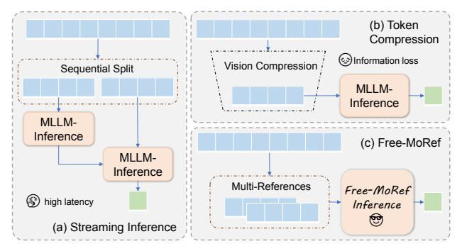

# 1. Introduction

Large Language Models (LLMs) [\[2,](#page-8-0) [31,](#page-9-0) [40\]](#page-9-1)have emerged as a revolutionary force towards general intelligence, marked by their universal capabilities in various language tasks. Through instruction tuning [\[20\]](#page-8-1), Multimodal Large Language Models (MLLMs) further extend their exceptional reasoning ability to other modalities such as vision [\[14,](#page-8-2) [30,](#page-9-2) [32\]](#page-9-3) and audio [\[24\]](#page-9-4). In recent studies, MLLMs have been extensively applied to the comprehension of video content [\[5,](#page-8-3) [16,](#page-8-4) [23,](#page-9-5) [34\]](#page-9-6). Notwithstanding the remarkable advances in video understanding, the context length restriction inherent in LLMs has emerged as a critical bottleneck, especially for long video understanding, where the abundant visual tokens readily surpass the threshold that ensures stability and consequently resulting in a decline in the effectiveness of these models.

To prevent over-length sequences that violate the context constraints of the reasoning LLM, existing MLLMs [\[30,](#page-9-2) [32,](#page-9-3) [43\]](#page-9-7) typically impose a maximum limit on the length of vision tokens to maintain stable performance. (e.g. 64 frames

\*Equally-contributed authors.

†Project Leader.

‡Corresponding author.

(a) Different designs to expand the context perception capability. Free-MoRef achieves both efficient and comprehensive understanding of the multiplexed vision inputs.

(b) Comparison of FLOPs, first token latency and overall QA accuracy in reasoning original and doubled input frames by LLaVA-Video [\[44\]](#page-9-8).

Figure 1. Different inference designs and the advantages of Free-MoRef. In summary, Free-MoRef brings superior performance under much lower computing costs on longer vision contexts.

with 2 × 2 spatial pooling for LLaVA-Video [\[44\]](#page-9-8) and 784 small rescaled frames for Qwen2-VL [\[32\]](#page-9-3).) The tradeoff between resolution and number of input frames have to be made in video understanding models, which greatly restricts their effectiveness in fully exploiting the rich information contained within extended video sequences.

To expand the context perception capability under the context restriction of the foundation LLM in Video-MLLMs, common solutions primarily encompass token compression [\[18,](#page-8-5) [26,](#page-9-9) [28\]](#page-9-10) and streaming inference technique [\[25,](#page-9-11) [33,](#page-9-12) [38\]](#page-9-13). However, both of these methods suffer from notable deficiencies. The Streaming Inference technique [\[38\]](#page-9-13) achieves ultra-long context dependency by retaining and reusing the historical KV-CACHE, but the extra time cost is proportional to the context length benefit. For example, reasoning doubled contexts results in doubled latency. As an alternative, the token compression strategy can represent more information within a limited token length, thereby increasing the context within a single inference without exceeding the preset token length limit. However, longer context benefits lead to more severe information loss. In light of these drawbacks, a crucial question emerges: *Is it possible to achieve longer context perception within a single inference while ensuring comprehensive understanding of the context?*

Motivated by this question, we have designed and implemented Free-MoRef, a training-free approach that instantly multiplexes the context throughput within one single inference pass, achieving full long-context understanding with flash efficiency. Inspired by the MoE paradigm [\[9\]](#page-8-6), we abstract long visual tokens into multiple short sequences as multiple references, each of which encapsulates the overall information of the original long contexts. Subsequently, we further design the Mixture of Reference attention, which allows for the parallel querying of multiple references and the integration of the results into a unified activation within each decoding layer. This process could be considered as an expert solving problems according to different references and figuring out a final solution. As observed in FastV [\[4\]](#page-8-7), after the shadow layers in LLM, the attention pattern would be more concentrated on query tokens. Leveraging this insight, we further extract key vision tokens in each chunk and mix them into a global reference for the remaining decoding layers, which compensates the neglected cross-reference vision interactions in the parallel reasoning. As illustrated in Figure [1b,](#page-1-0) by splitting and fusing the vision-tokens, Free-MoRef achieves instant comprehensive understanding of longer contexts with improved performance, demonstrating strong efficiency and effectiveness.

We apply Free-MoRef to LLaVA-Video-7B [\[44\]](#page-9-8) and conduct experiments on several long video benchmarks, including VideoMME [\[12\]](#page-8-8), MLVU [\[45\]](#page-9-14), and LongVideoBench [\[37\]](#page-9-15). On a single A100 GPU, Free-MoRef can directly extend the context throughput from 2× to 8× with less than 27.6% of the FLOPs and negligible latency, while bringing superior performance on all the three above long video benchmarks. On the VideoMME benchmark, our method leads 3% to 5% performance gains on long and medium videos, reaching SOTA results, even surpassing dedicatedly trained long-video-MLLMs [\[28,](#page-9-10) [39,](#page-9-16) [42\]](#page-9-17). Notably, Free-MoRef supports Flash-Attention [\[10\]](#page-8-9) and can also be integrated with streaming inference or token compression strategies. Despite training-free application, the MoRef-attention mechanism may also inspire the training design for long context scenarios.

